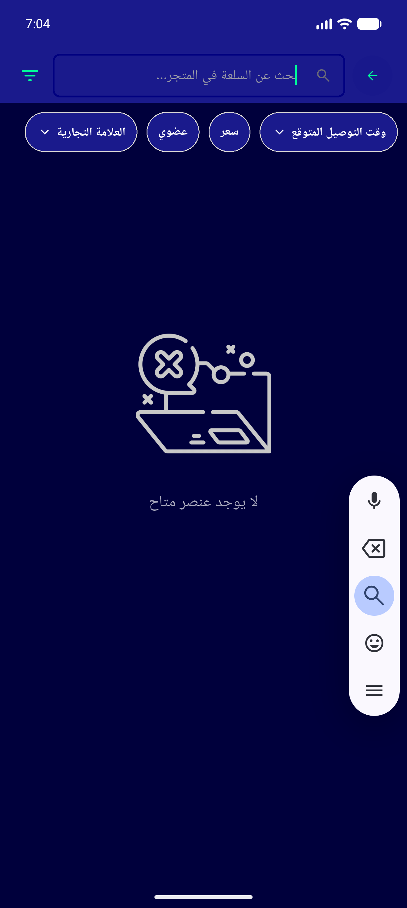
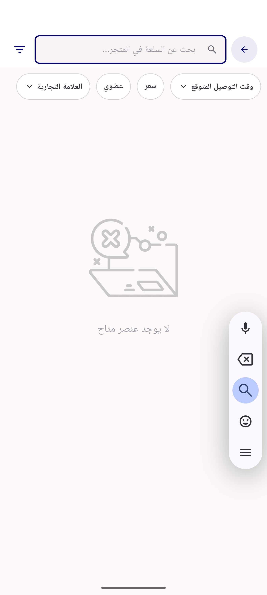
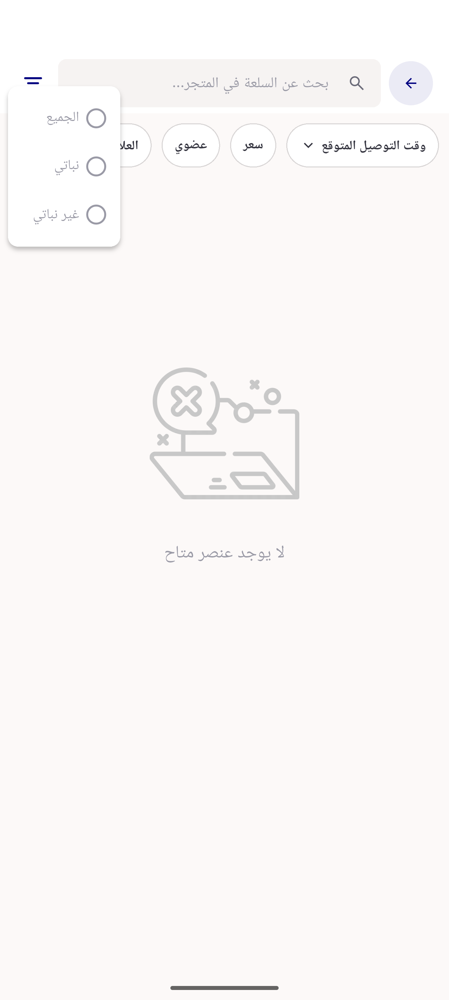
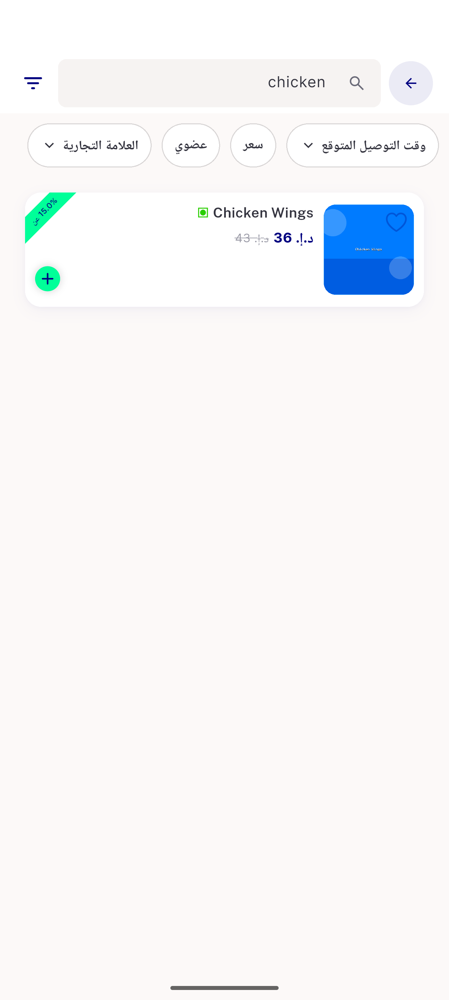
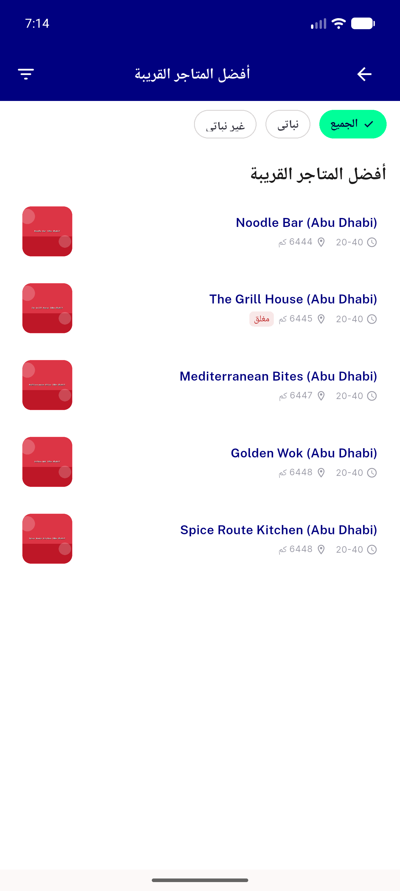
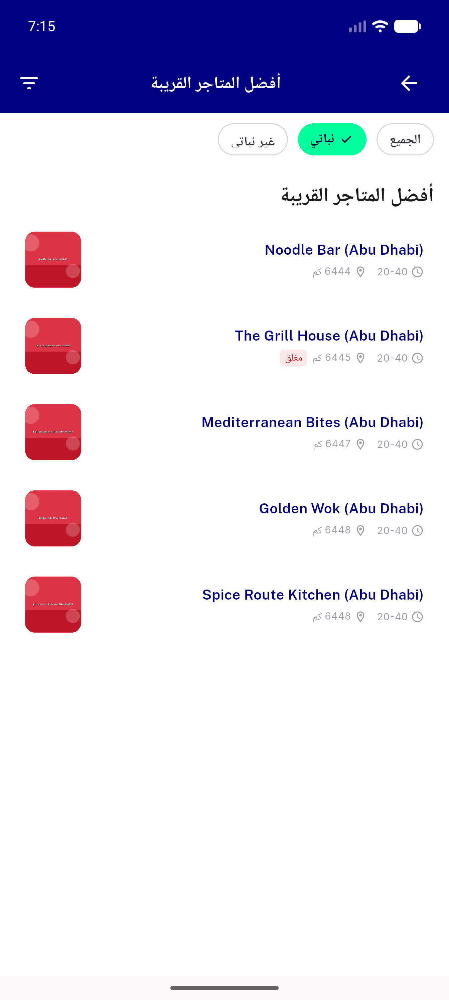
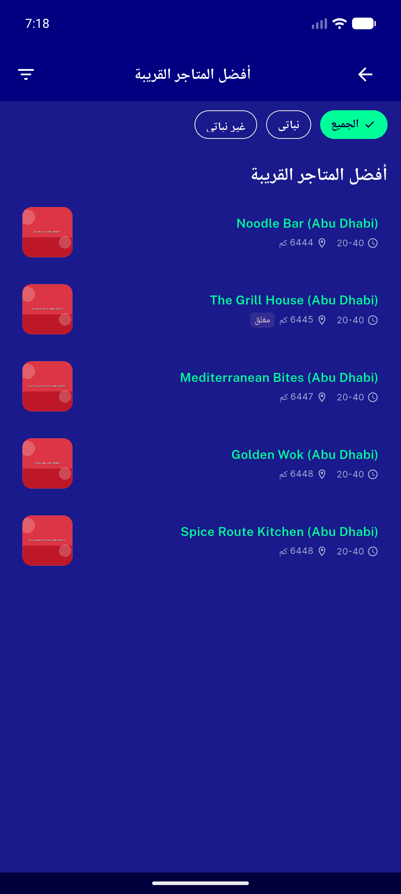
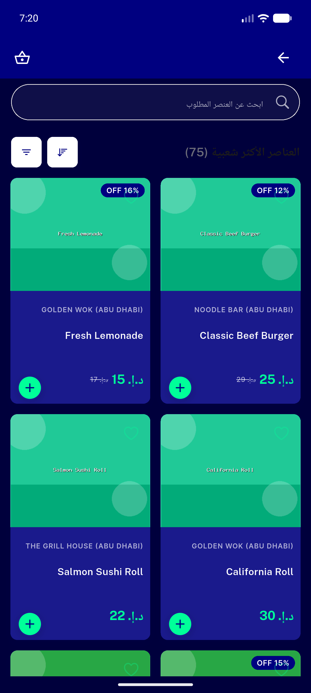
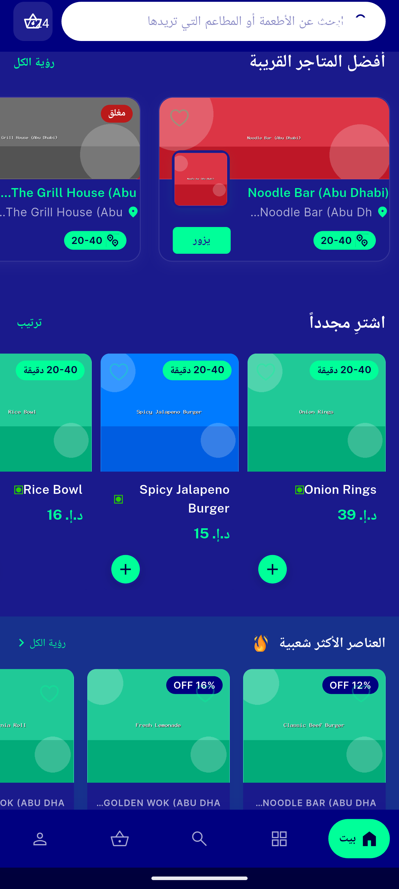

# QA Evidence — NEARS-409

**RE-QA cycle-2 PASS: veg-filter glyph visible+functional all call sites (light+dark); failed AC store_item_search white-bar FIXED (navy-on-white/mint-on-dark); +108 tests green**

**26 screenshot(s).** Click any thumbnail for full resolution.

<table>
<tr>
<td align="center" width="33%"> item view all light</td>
<td align="center" width="33%"> item view all paginated</td>
<td align="center" width="33%"> item view all empty</td>
</tr>
<tr>
<td align="center" width="33%"> all store veg filter light</td>
<td align="center" width="33%"> all store veg popup</td>
<td align="center" width="33%"> all store recommended noveg</td>
</tr>
<tr>
<td align="center" width="33%"> category item veg light</td>
<td align="center" width="33%"> store item search veg light</td>
<td align="center" width="33%"> 08b store item search header</td>
</tr>
<tr>
<td align="center" width="33%"> 08c veg glyph region crop</td>
<td align="center" width="33%"> all store RTL arabic</td>
<td align="center" width="33%"> all store dark RTL</td>
</tr>
<tr>
<td align="center" width="33%"> item view all dark search NEARS429</td>
<td align="center" width="33%"> store item search dark</td>
<td align="center" width="33%"> req01 store item search DARK rtl</td>
</tr>
<tr>
<td align="center" width="33%"> req01b glyph crop DARK</td>
<td align="center" width="33%"> req02 store item search LIGHT rtl</td>
<td align="center" width="33%"> req02b glyph crop LIGHT</td>
</tr>
<tr>
<td align="center" width="33%"> req03 store item search veg popup LIGHT</td>
<td align="center" width="33%"> req04 store item search results LIGHT</td>
<td align="center" width="33%"> req05 all store veg LIGHT</td>
</tr>
<tr>
<td align="center" width="33%"> req05b glyph crop LIGHT</td>
<td align="center" width="33%"> req06 all store veg applied LIGHT</td>
<td align="center" width="33%"> req07 all store veg DARK</td>
</tr>
<tr>
<td align="center" width="33%"> req08 item view all DARK</td>
<td align="center" width="33%"> req09 item view all clean DARK</td>
</tr>
</table>

### Other artifacts
- [`progress.md`](progress.md)

---
*From `nears/docs/qa-evidence/NEARS-409/` · public-repo scrub policy (no live secrets; verified clean).*
