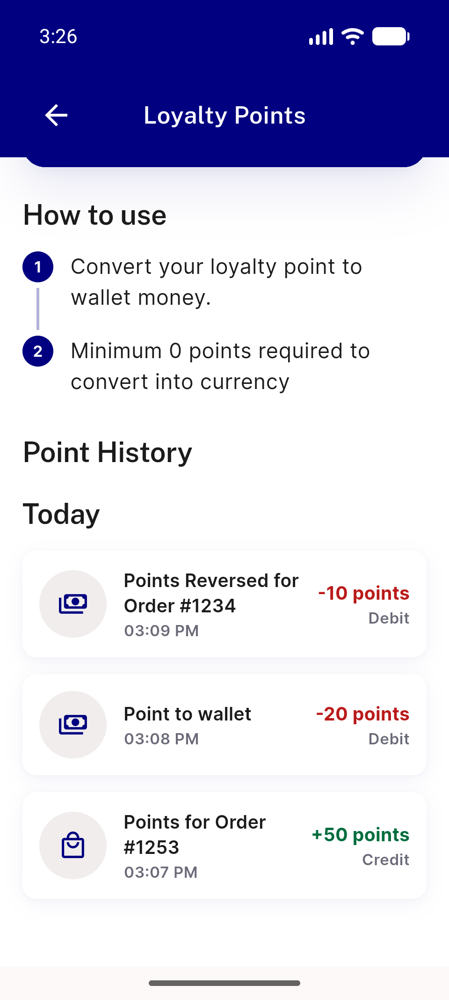
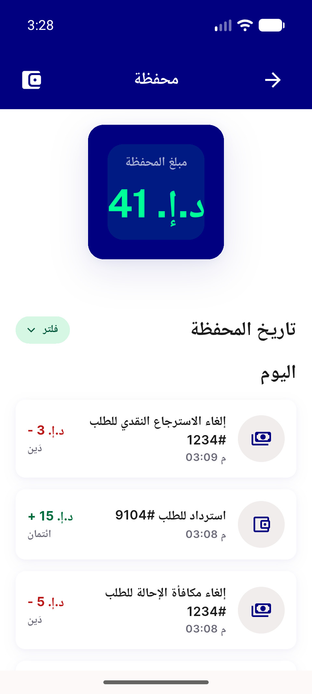
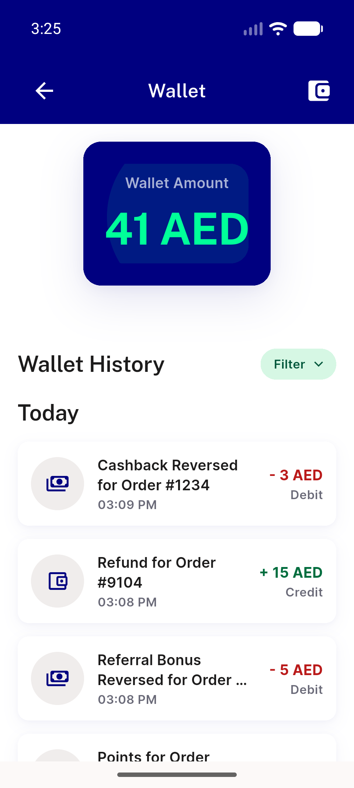
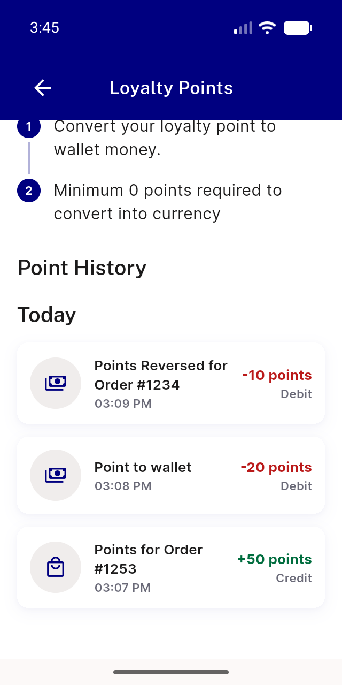
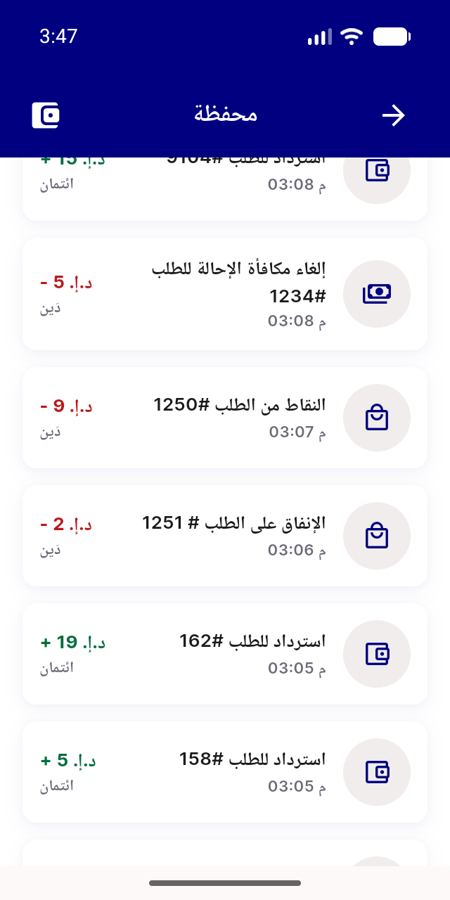
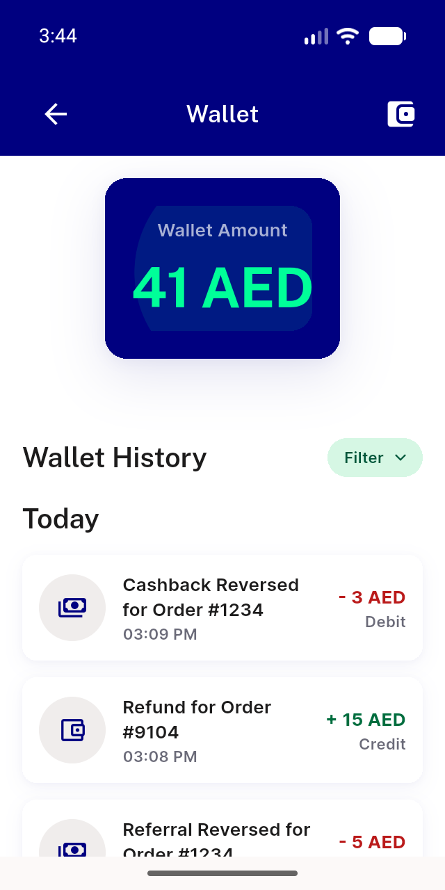
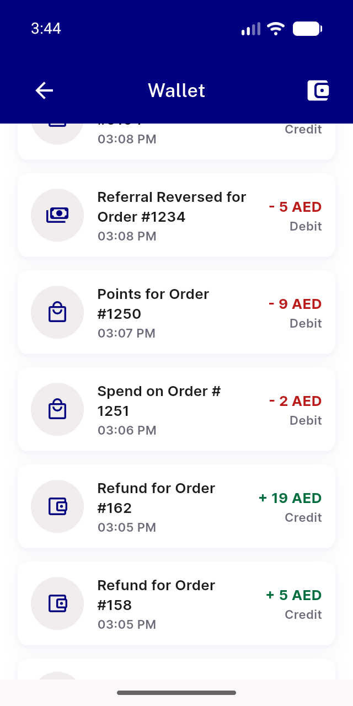

# QA Evidence — NEARS-4091

**Cycle 1b device-free: AC1b live for vendor/DM/store-panel/admin/6 parcel callers PASS**

**8 screenshot(s).** Click any thumbnail for full resolution.

<table>
<tr>
<td align="center" width="33%"> ac ui loyalty en 320dp scrolled</td>
<td align="center" width="33%"> ac ui wallet ar 320dp</td>
<td align="center" width="33%"> ac ui wallet en 320dp light</td>
</tr>
<tr>
<td align="center" width="33%"> bug referral title ellipsized en 320dp</td>
<td align="center" width="33%"> c1 ac ui loyalty en 320dp</td>
<td align="center" width="33%"> c1 ac ui wallet ar 320dp</td>
</tr>
<tr>
<td align="center" width="33%"> c1 ac ui wallet en 320dp light</td>
<td align="center" width="33%"> c1 ac ui wallet en 320dp scrolled</td>
</tr>
</table>

### Other artifacts
- [`ac-ui-loyalty-ar-320dp.xml`](ac-ui-loyalty-ar-320dp.xml)
- [`ac-ui-loyalty-en-320dp-scrolled.xml`](ac-ui-loyalty-en-320dp-scrolled.xml)
- [`ac-ui-loyalty-en-320dp.xml`](ac-ui-loyalty-en-320dp.xml)
- [`ac-ui-wallet-ar-320dp.xml`](ac-ui-wallet-ar-320dp.xml)
- [`ac-ui-wallet-en-320dp-light.xml`](ac-ui-wallet-en-320dp-light.xml)
- [`ac-ui-wallet-en-320dp-scrolled.xml`](ac-ui-wallet-en-320dp-scrolled.xml)
- [`backend-log-excerpt.log`](backend-log-excerpt.log)
- [`bug-referral-title-ellipsized-en-320dp.xml`](bug-referral-title-ellipsized-en-320dp.xml)
- [`c1-ac-ui-loyalty-en-320dp.xml`](c1-ac-ui-loyalty-en-320dp.xml)
- [`c1-ac-ui-wallet-ar-320dp.xml`](c1-ac-ui-wallet-ar-320dp.xml)
- [`c1-ac-ui-wallet-en-320dp-light.xml`](c1-ac-ui-wallet-en-320dp-light.xml)
- [`c1-ac-ui-wallet-en-320dp-scrolled.xml`](c1-ac-ui-wallet-en-320dp-scrolled.xml)
- [`c1-app-log-wallet-excerpt.log`](c1-app-log-wallet-excerpt.log)
- [`c2-api-fail-1.log`](c2-api-fail-1.log)
- [`c2-api-fail-2.log`](c2-api-fail-2.log)
- [`c2-api-retry-1.log`](c2-api-retry-1.log)
- [`c2-api-retry-2.log`](c2-api-retry-2.log)
- [`c2-dm-fail.log`](c2-dm-fail.log)
- [`c2-fixture-b.sql`](c2-fixture-b.sql)
- [`c2-fixture-c.sql`](c2-fixture-c.sql)
- [`c2-fixture-d.sql`](c2-fixture-d.sql)
- [`c2-fixture.sql`](c2-fixture.sql)
- [`c2-parcel-cancel-fail.log`](c2-parcel-cancel-fail.log)
- [`c2-parcel-return-fail.log`](c2-parcel-return-fail.log)
- [`c2-summary-credit-rows-and-fail-lines.log`](c2-summary-credit-rows-and-fail-lines.log)
- [`c2-trigger-create.sql`](c2-trigger-create.sql)
- [`c2-trigger-state.log`](c2-trigger-state.log)
- [`c2-vendor-fail.log`](c2-vendor-fail.log)
- [`c2-walletoff.log`](c2-walletoff.log)
- [`c2-web-admin-fail.log`](c2-web-admin-fail.log)
- [`c2-web-admin-parcel-fail.log`](c2-web-admin-parcel-fail.log)
- [`c2-web-admin-parcelreturn-fail.log`](c2-web-admin-parcelreturn-fail.log)
- [`c2-web-fail-storepanel-rerun.log`](c2-web-fail-storepanel-rerun.log)
- [`c2-web-fail.log`](c2-web-fail.log)
- [`c2-web-retry-admin-parcel.log`](c2-web-retry-admin-parcel.log)
- [`c2-web-retry.log`](c2-web-retry.log)
- [`clone-fixture-ac2.sql`](clone-fixture-ac2.sql)
- [`clone-fixture-cancel.sql`](clone-fixture-cancel.sql)
- [`clone-fixture-ui.sql`](clone-fixture-ui.sql)
- [`flutter-test-tail-cycle1.txt`](flutter-test-tail-cycle1.txt)
- [`flutter-test-tail.txt`](flutter-test-tail.txt)
- [`phpunit-266-green.txt`](phpunit-266-green.txt)
- [`progress.md`](progress.md)

---
*From `nears/docs/qa-evidence/NEARS-4091/` · public-repo scrub policy (no live secrets; verified clean).*
