# QA Evidence — NEARS-4095

**PASS-candidate: 6-digit field, Verify gate, wrong/expired/lockout/reset-fail toasts + paired [FAIL], AR/RTL, 320/360dp**

**21 screenshot(s).** Click any thumbnail for full resolution.

<table>
<tr>
<td align="center" width="33%"><a href="ac-lockout-6th-call-toast-320dp.png">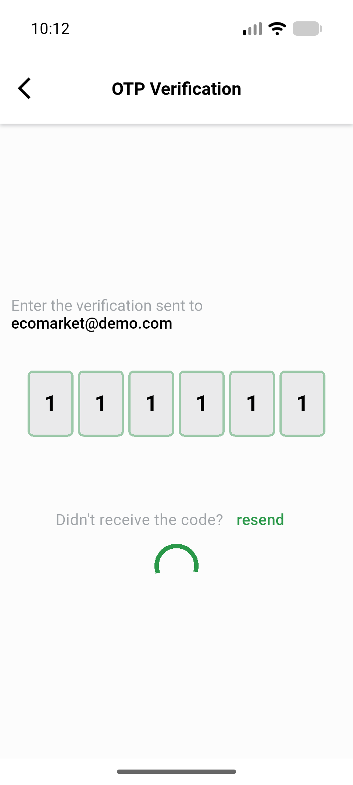</a> ac lockout 6th call toast 320dp</td>
<td align="center" width="33%"><a href="ac-resend-success-toast-320dp.png">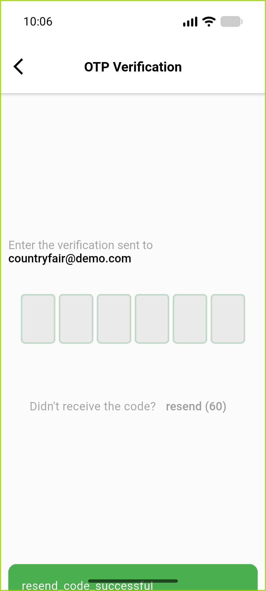</a> ac resend success toast 320dp</td>
<td align="center" width="33%"><a href="ac1-4digits-keyboard-360dp.png">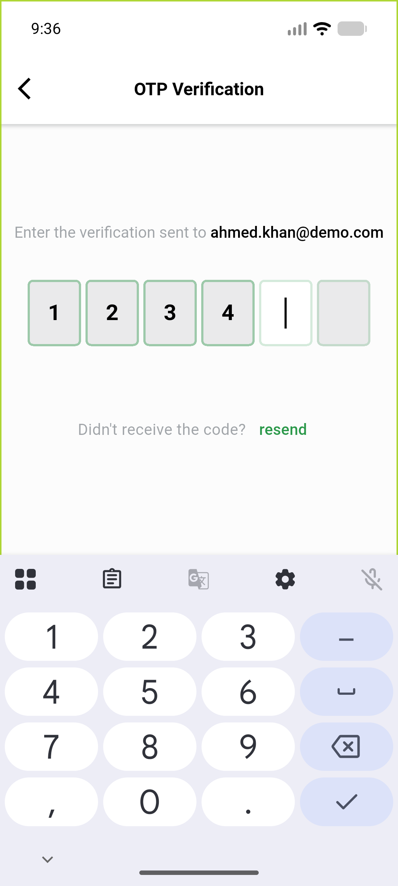</a> ac1 4digits keyboard 360dp</td>
</tr>
<tr>
<td align="center" width="33%"> ac1 6digits verify visible 360dp</td>
<td align="center" width="33%"><a href="ac2-after-reset-dialog.png">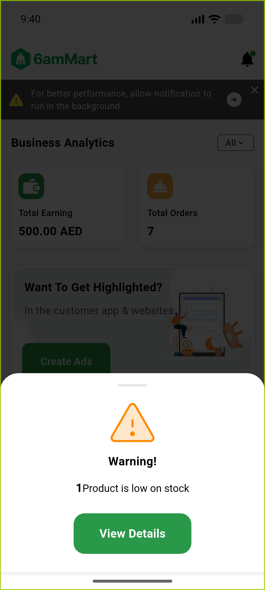</a> ac2 after reset dialog</td>
<td align="center" width="33%"><a href="ac2-expired-code-toast-320dp.png">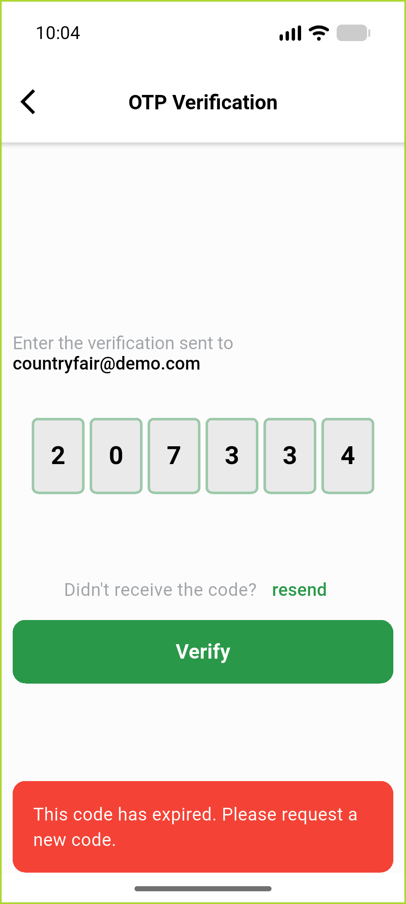</a> ac2 expired code toast 320dp</td>
</tr>
<tr>
<td align="center" width="33%"><a href="ac2-reset-submit-failure-toast-ar-320dp.png">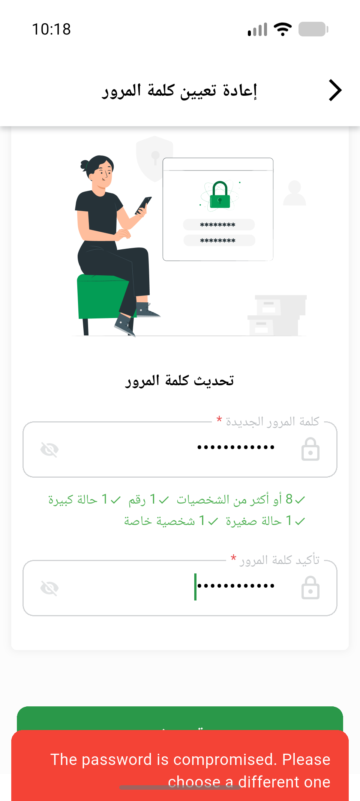</a> ac2 reset submit failure toast ar 320dp</td>
<td align="center" width="33%"><a href="ac2-wrong-code-toast-360dp.png">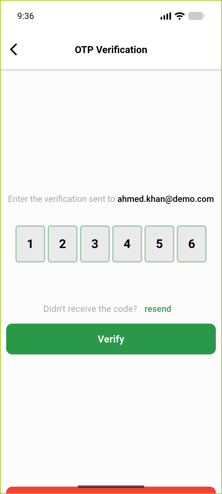</a> ac2 wrong code toast 360dp</td>
<td align="center" width="33%"><a href="ac7-320dp-6digits-EN.png">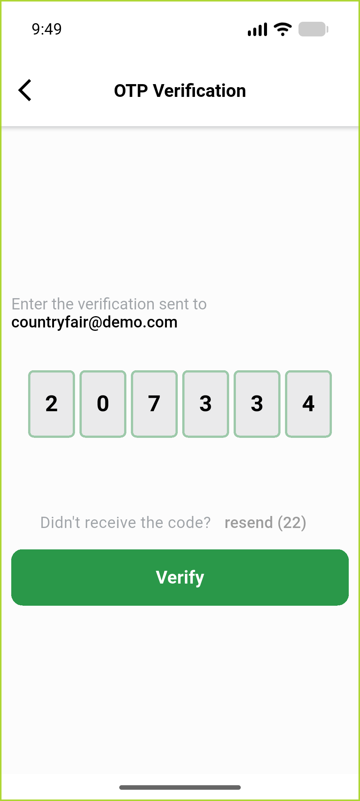</a> ac7 320dp 6digits EN</td>
</tr>
<tr>
<td align="center" width="33%"><a href="ac7-320dp-empty-EN.png">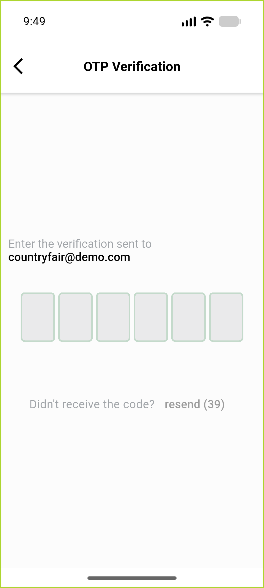</a> ac7 320dp empty EN</td>
<td align="center" width="33%"><a href="ac7-320dp-fontscale2-EN.png">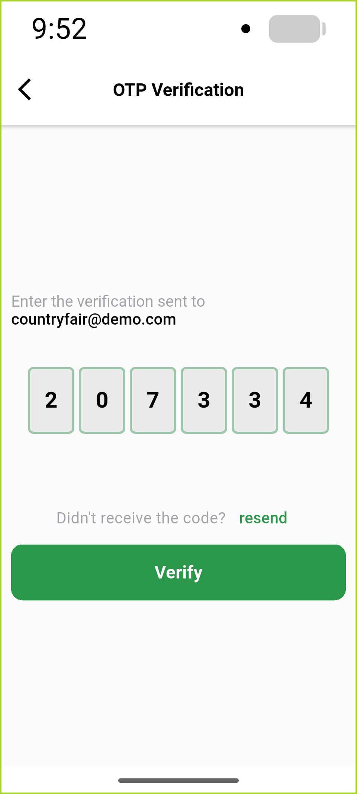</a> ac7 320dp fontscale2 EN</td>
<td align="center" width="33%"><a href="ac7-360dp-empty-EN-initial.png">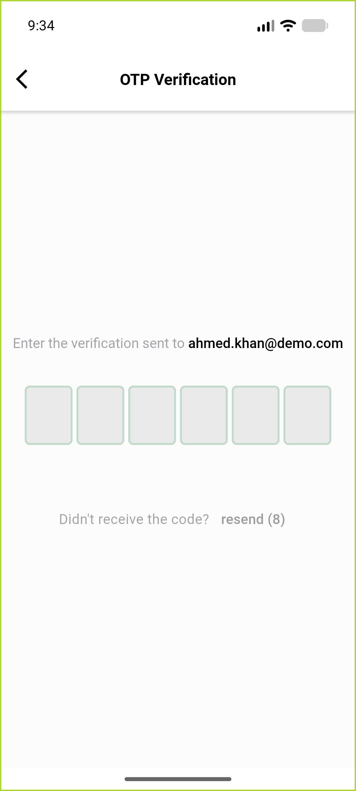</a> ac7 360dp empty EN initial</td>
</tr>
<tr>
<td align="center" width="33%"><a href="ac7-reentry-empty-boxes-320dp.png">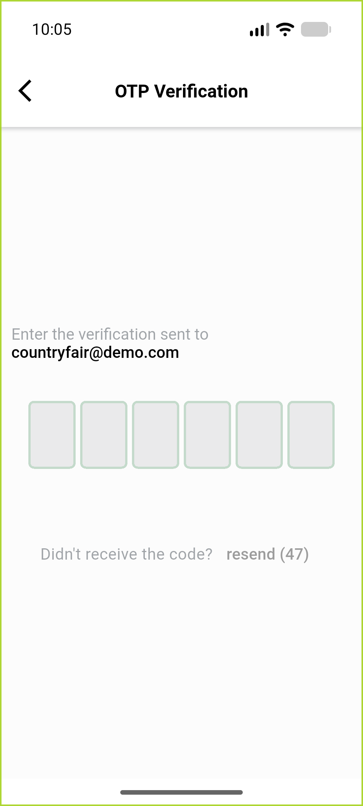</a> ac7 reentry empty boxes 320dp</td>
<td align="center" width="33%"><a href="ar-3digits-320dp.png">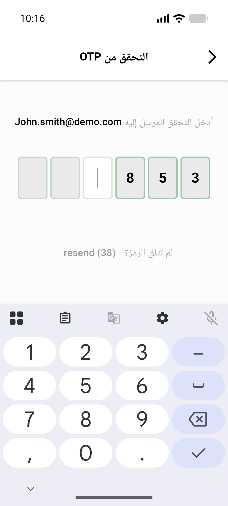</a> ar 3digits 320dp</td>
<td align="center" width="33%"><a href="ar-6digits-verify-320dp.png">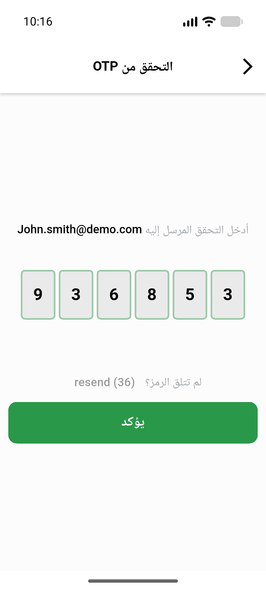</a> ar 6digits verify 320dp</td>
</tr>
<tr>
<td align="center" width="33%"><a href="ar-6digits-verify-360dp.png">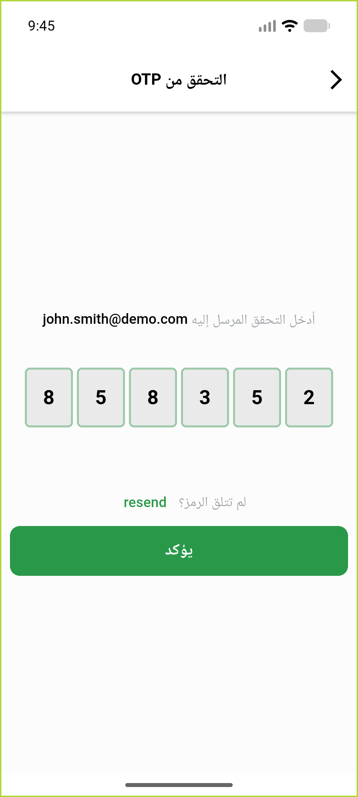</a> ar 6digits verify 360dp</td>
<td align="center" width="33%"><a href="ar-empty-boxes-360dp.png">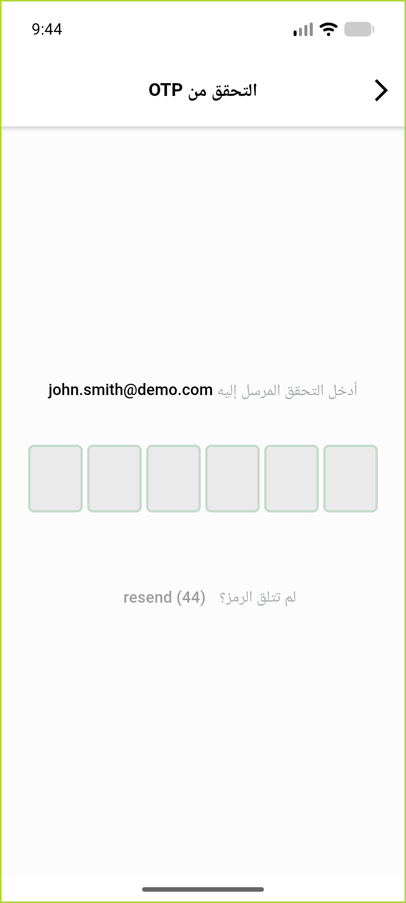</a> ar empty boxes 360dp</td>
<td align="center" width="33%"><a href="ar-first-digit-360dp.png">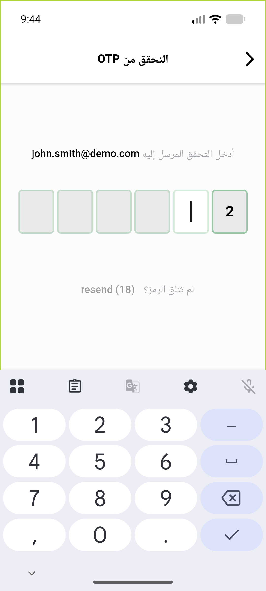</a> ar first digit 360dp</td>
</tr>
<tr>
<td align="center" width="33%"><a href="ar-reset-password-360dp.png">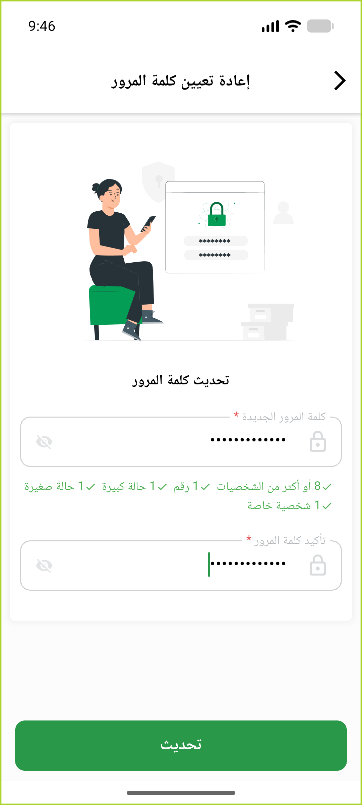</a> ar reset password 360dp</td>
<td align="center" width="33%"><a href="bug-new-pass-initstate-setstate-during-build.png">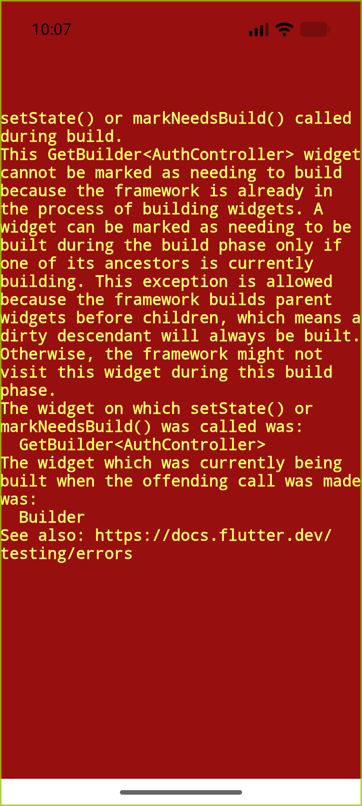</a> bug new pass initstate setstate during build</td>
<td align="center" width="33%"><a href="reg-profile-password-change-screen-360dp.png">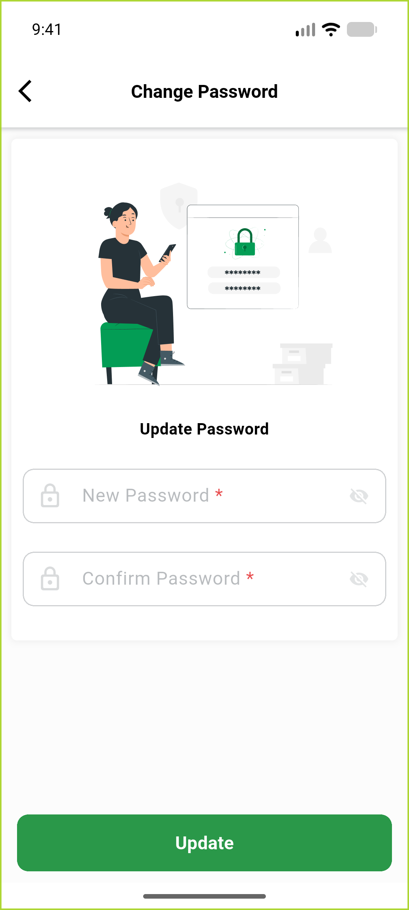</a> reg profile password change screen 360dp</td>
</tr>
</table>

### Other artifacts
- [`ac3-fail-lines-excerpt.log`](ac3-fail-lines-excerpt.log)
- [`bug-menu-button-overflow-ar-360dp.log`](bug-menu-button-overflow-ar-360dp.log)
- [`bug-new-pass-initstate-setstate-during-build.log`](bug-new-pass-initstate-setstate-during-build.log)
- [`bug-resend-success-toast-raw-key.log`](bug-resend-success-toast-raw-key.log)

---
*From `nears/docs/qa-evidence/NEARS-4095/` · public-repo scrub policy (no live secrets; verified clean).*
