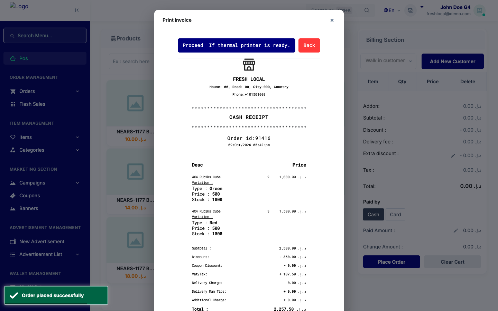
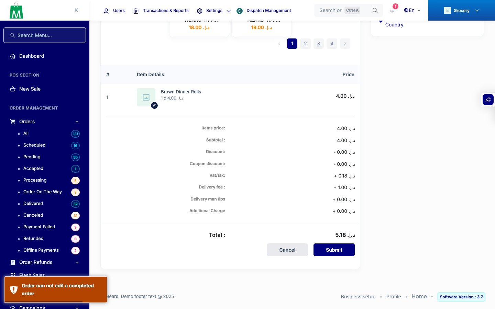
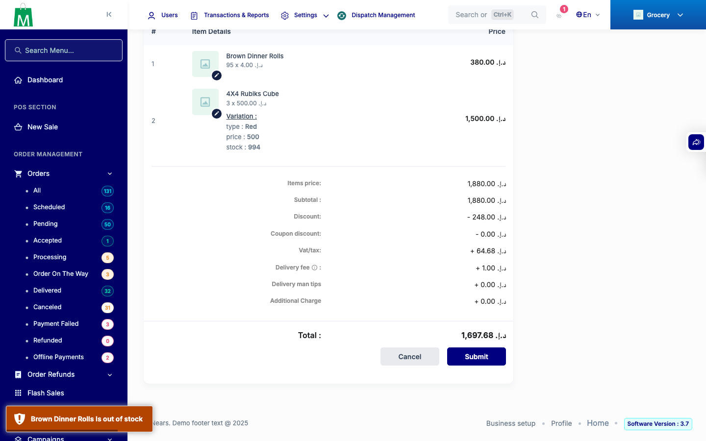
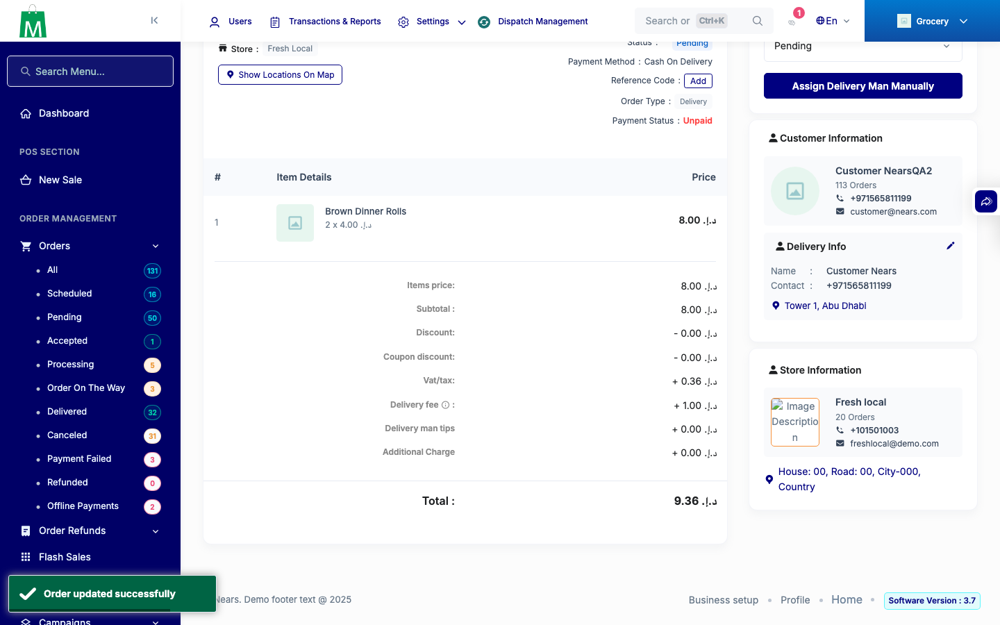
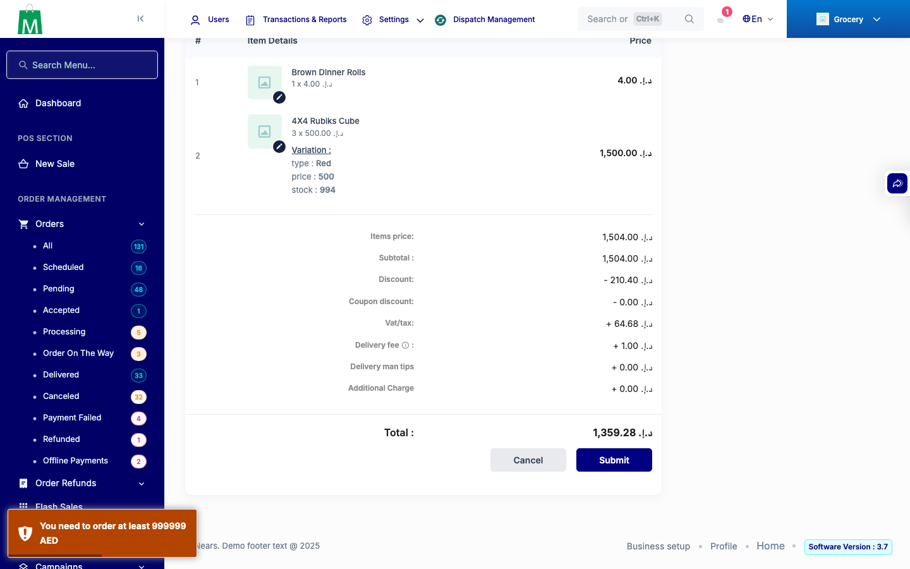
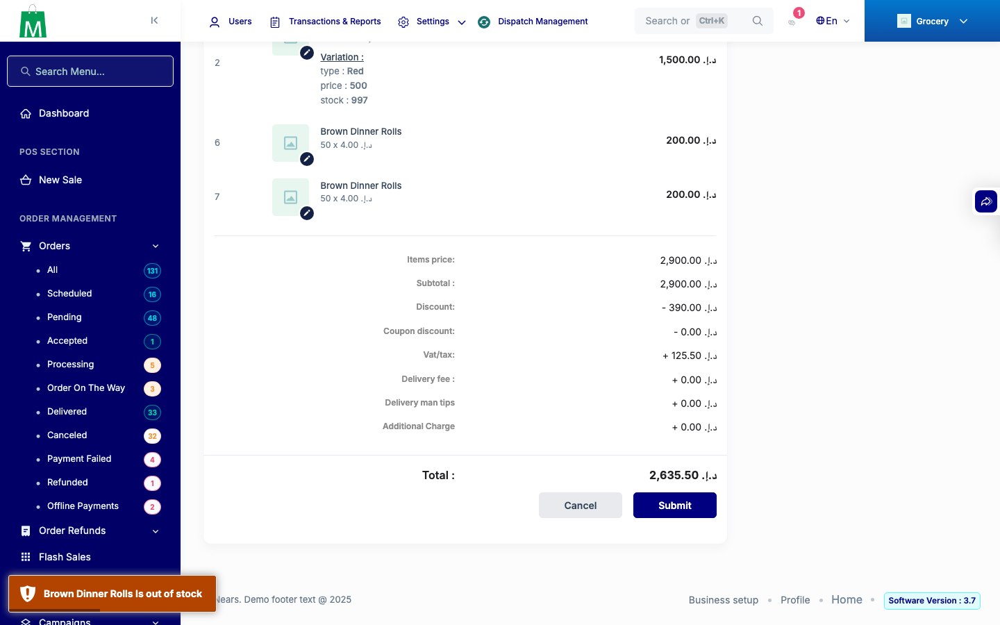
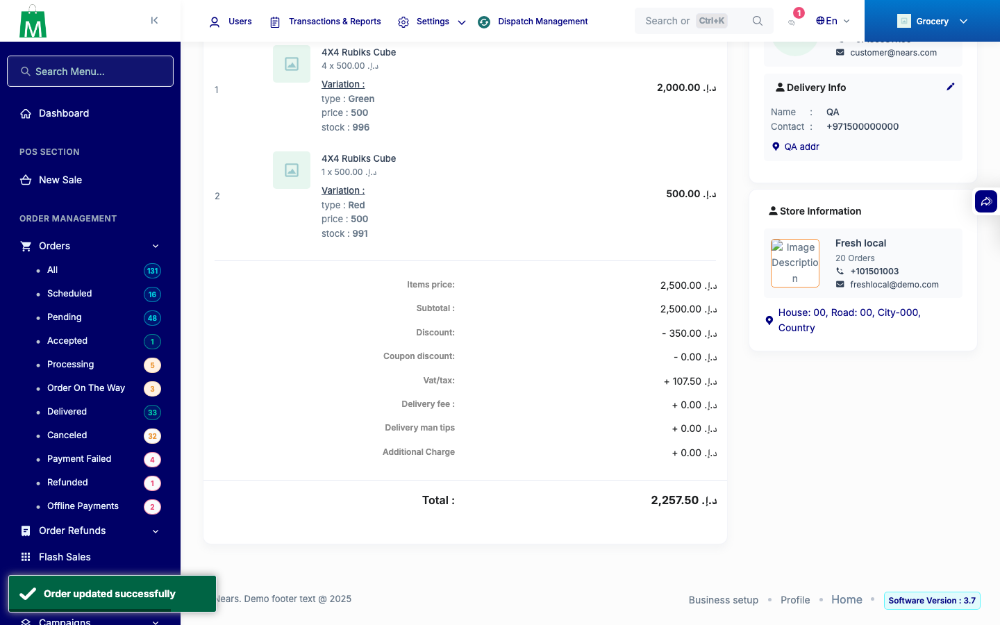
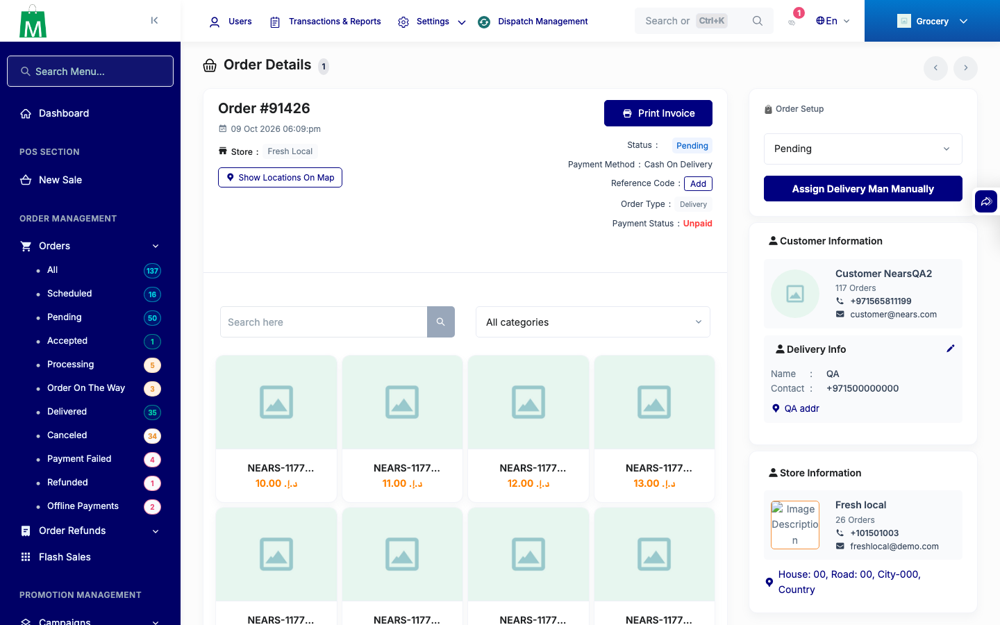
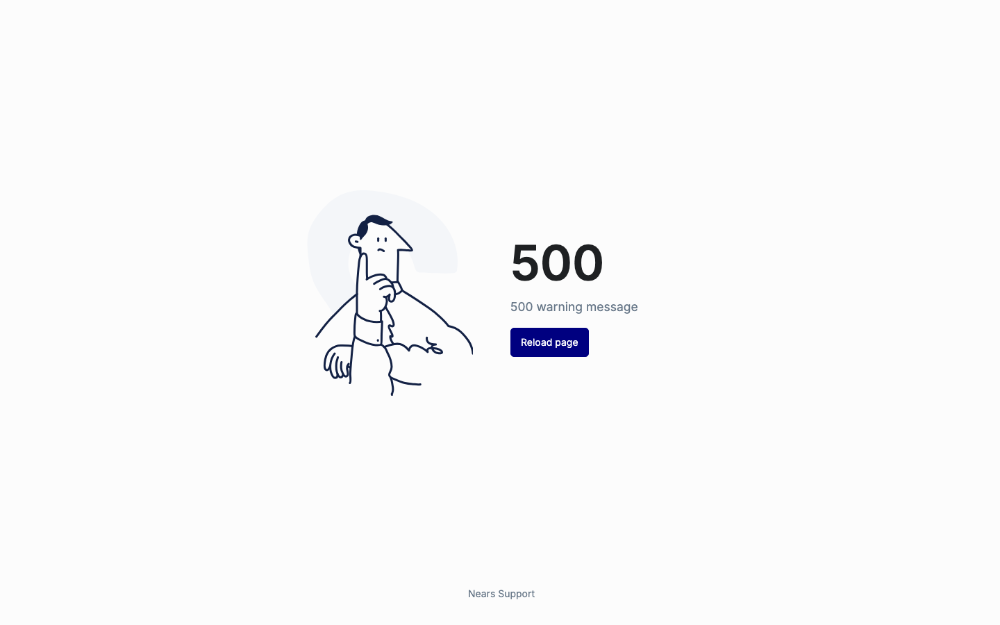

# QA Evidence — NEARS-4098

**PASS: AC1-AC6 + FIR-resubmit demonstrated live (Admin/Store POS, Admin order edit, own backend :8498 @ 09c2218d0, clone multi_food_db_qa4098); 155 backstop tests OK**

**11 screenshot(s).** Click any thumbnail for full resolution.

<table>
<tr>
<td align="center" width="33%"> ac1 vendor pos 86 green2 red3 placed</td>
<td align="center" width="33%"> ac3 edit added two variant lines before save 91216</td>
<td align="center" width="33%"> ac3 edit qty 5 to 3 91215</td>
</tr>
<tr>
<td align="center" width="33%"> ac3 edit refused order closed 91193</td>
<td align="center" width="33%"> ac3 edit stock refusal toast 91216</td>
<td align="center" width="33%"> ac3 edit unchanged resave 91215</td>
</tr>
<tr>
<td align="center" width="33%"> fir resubmit after minimum order refusal 91216</td>
<td align="center" width="33%"> fir resubmit after stock refusal 91419</td>
<td align="center" width="33%"> lead5 pos placed variant order edit saved 91419</td>
</tr>
<tr>
<td align="center" width="33%"> lead5 postfix edit open 91426</td>
<td align="center" width="33%"> prefix p3 edit open 91426</td>
</tr>
</table>

### Other artifacts
- [`ac5-grep-pins.log`](ac5-grep-pins.log)
- [`automated-backstop.log`](automated-backstop.log)
- [`bug-log-excerpts.log`](bug-log-excerpts.log)
- [`progress.md`](progress.md)

---
*From `nears/docs/qa-evidence/NEARS-4098/` · public-repo scrub policy (no live secrets; verified clean).*
