# QA Evidence — NEARS-410

**RE-QA fix cycle 2 PASS — flash-sale product cards: NO RenderFlex overflow, Sold X/Y fully visible, countdown ticks live (RTL/Arabic)**

**22 screenshot(s).** Click any thumbnail for full resolution.

<table>
<tr>
<td align="center" width="33%"><a href="00-boot.png">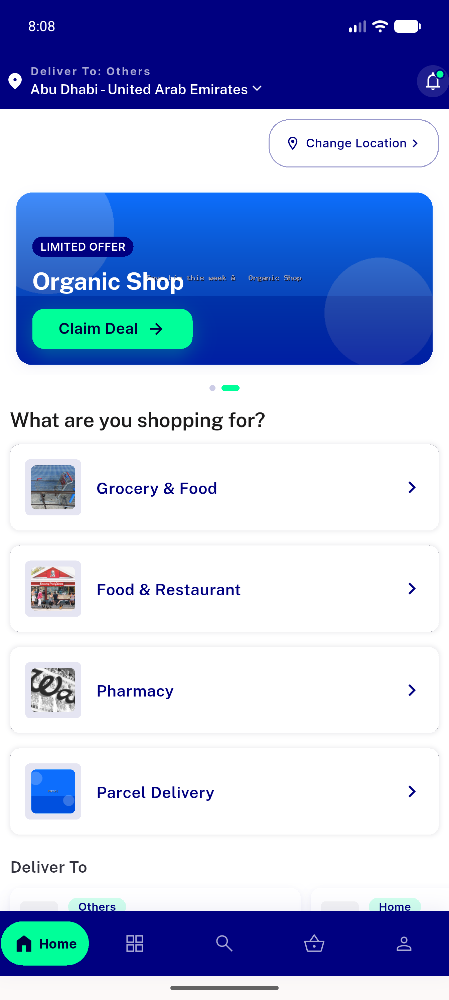</a> boot</td>
<td align="center" width="33%"><a href="01-search-mobile-history.png">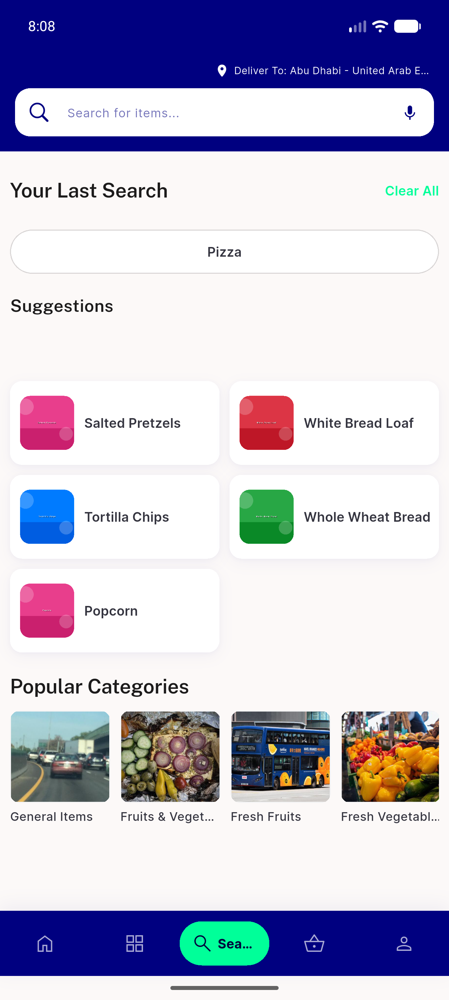</a> search mobile history</td>
<td align="center" width="33%"><a href="02-search-results-from-chip.png">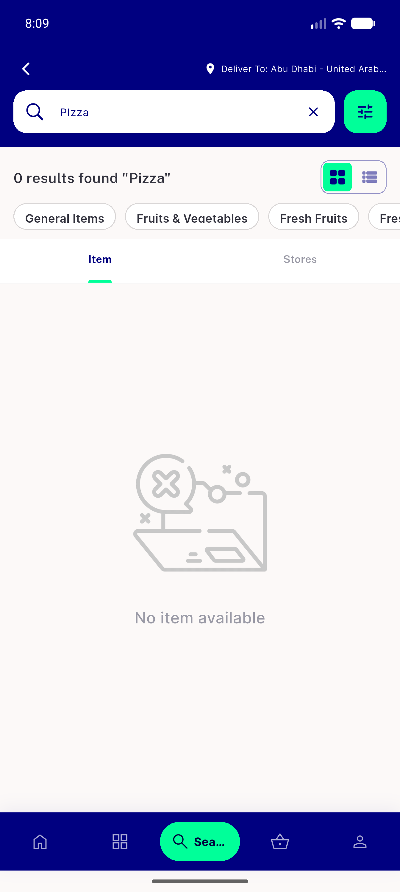</a> search results from chip</td>
</tr>
<tr>
<td align="center" width="33%"><a href="03-categories.png">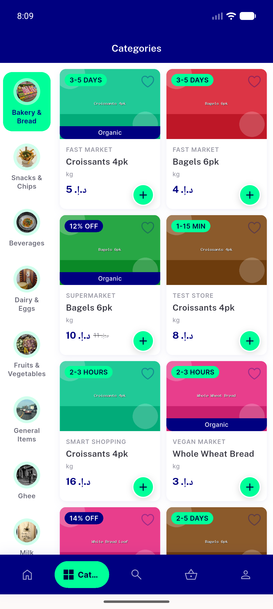</a> categories</td>
<td align="center" width="33%"><a href="04-categories-beverages.png">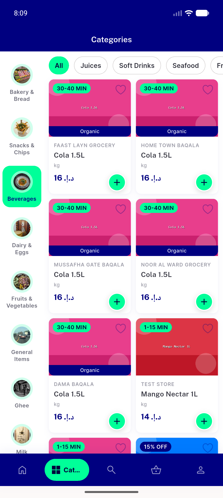</a> categories beverages</td>
<td align="center" width="33%"><a href="05-categories-subcat-juices.png">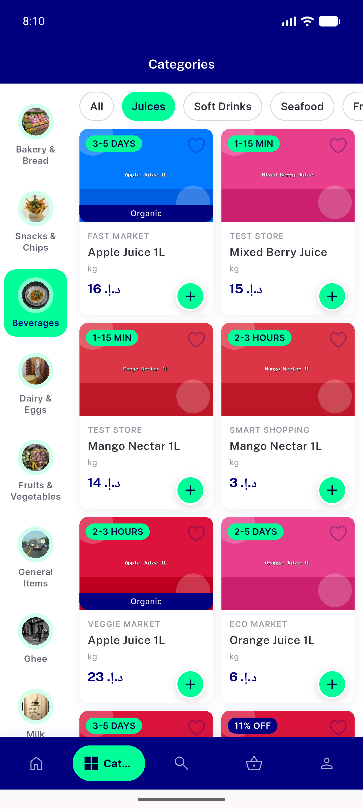</a> categories subcat juices</td>
</tr>
<tr>
<td align="center" width="33%"><a href="06-item-drilldown.png">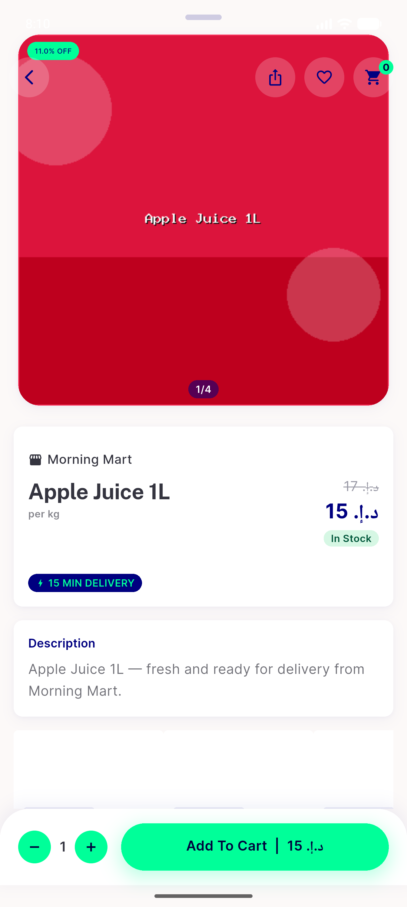</a> item drilldown</td>
<td align="center" width="33%"><a href="07-grocery-flash-section.png">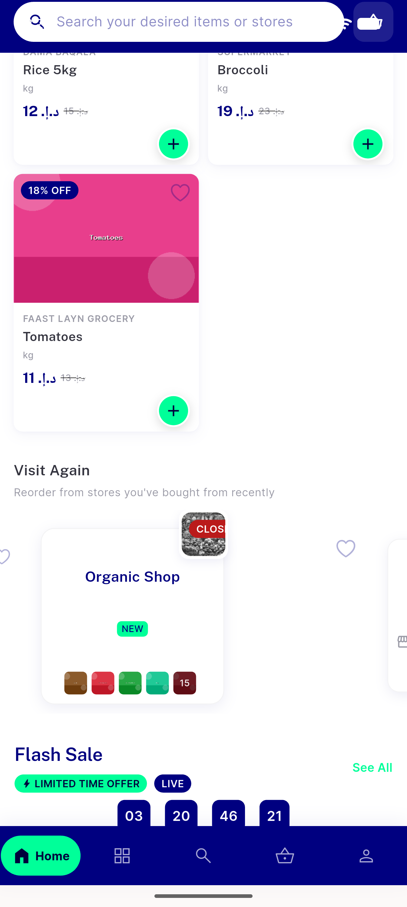</a> grocery flash section</td>
<td align="center" width="33%"><a href="08-flash-details-A.png">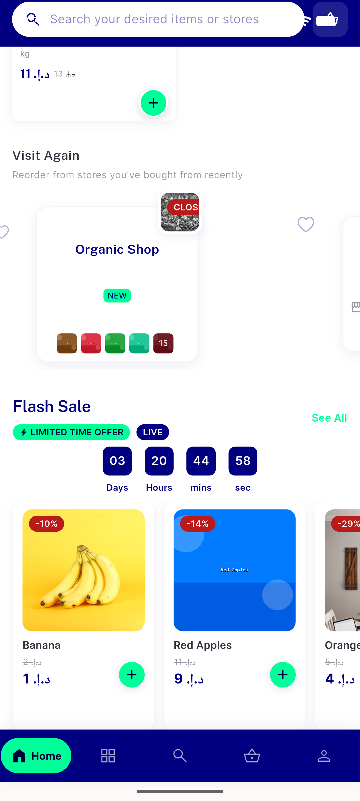</a> flash details A</td>
</tr>
<tr>
<td align="center" width="33%"><a href="09-flash-details-screen.png">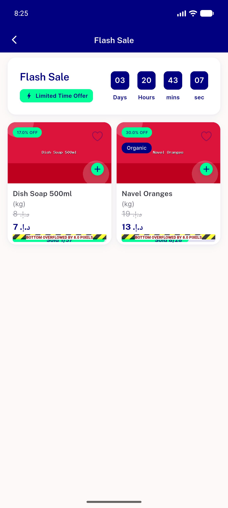</a> flash details screen</td>
<td align="center" width="33%"><a href="10-dark-settings.png">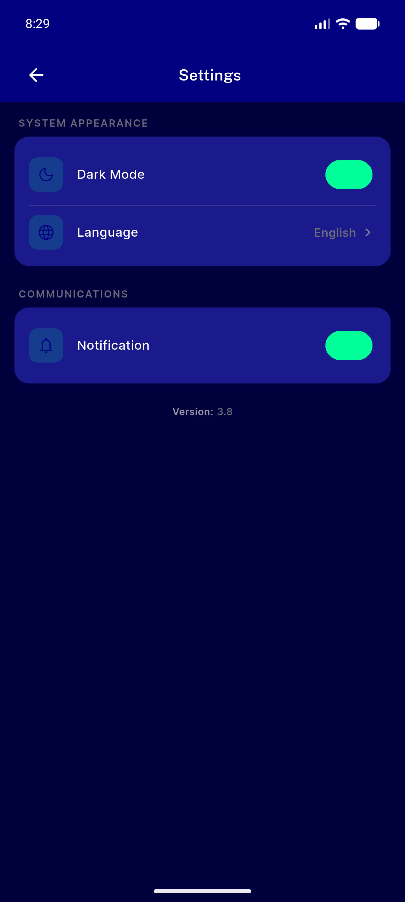</a> dark settings</td>
<td align="center" width="33%"><a href="11-dark-settings-toggle.png">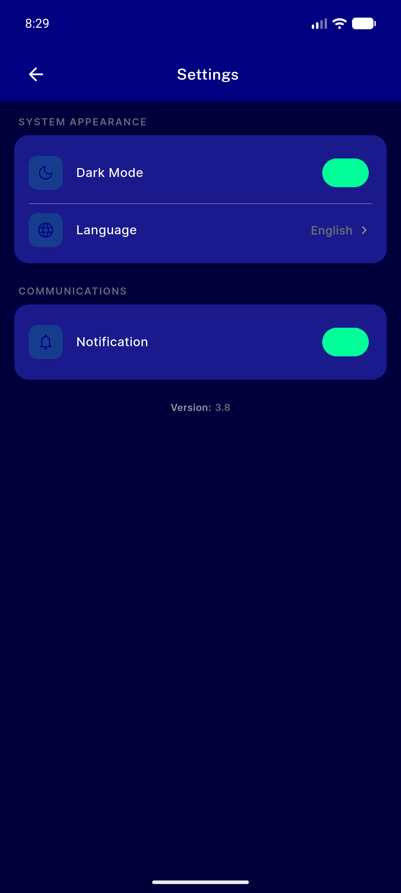</a> dark settings toggle</td>
</tr>
<tr>
<td align="center" width="33%"><a href="12-dark-search.png">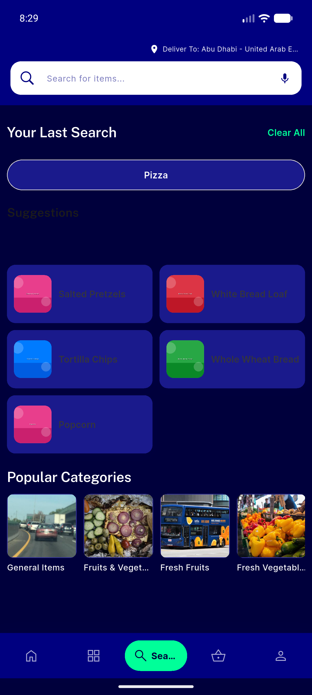</a> dark search</td>
<td align="center" width="33%"><a href="13-dark-grocery-grid.png">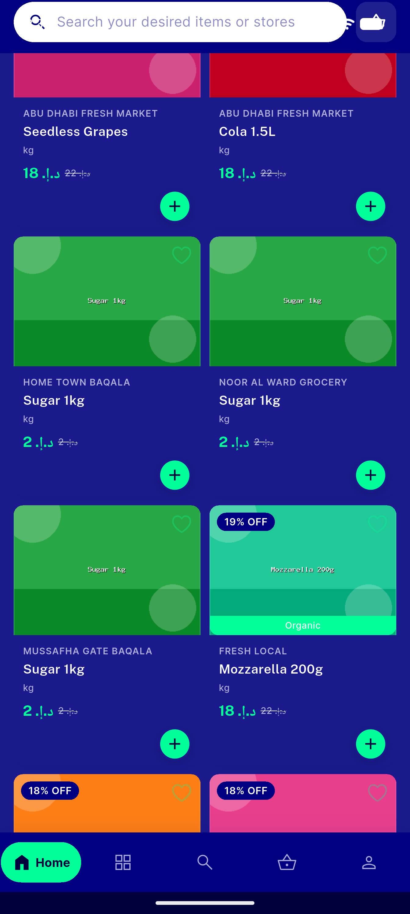</a> dark grocery grid</td>
<td align="center" width="33%"><a href="14-rtl-search.png">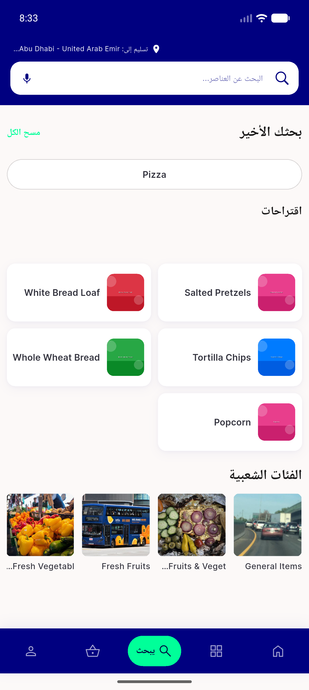</a> rtl search</td>
</tr>
<tr>
<td align="center" width="33%"><a href="15-rtl-search-cards.png">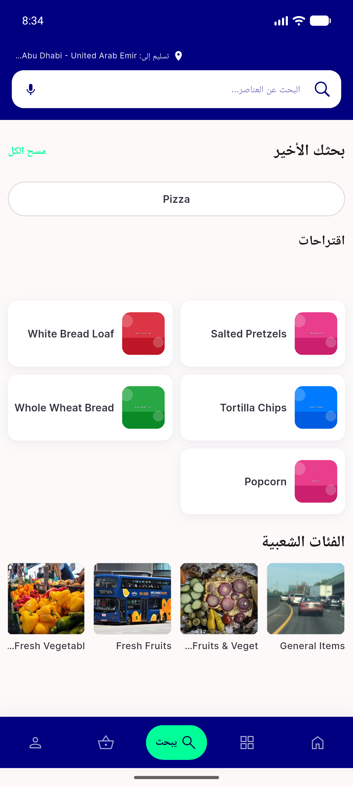</a> rtl search cards</td>
<td align="center" width="33%"><a href="recheck-00-home-arabic.png">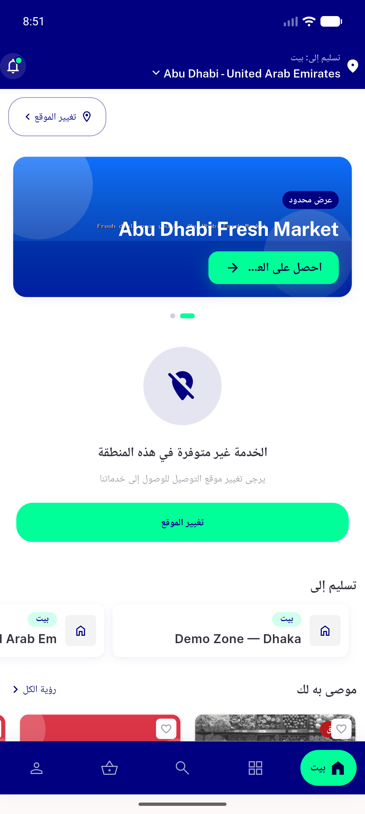</a> recheck 00 home arabic</td>
<td align="center" width="33%"><a href="recheck-01-flash-rail-home.png">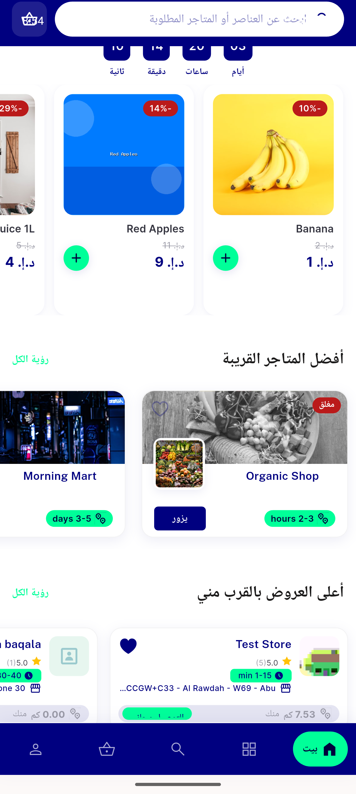</a> recheck 01 flash rail home</td>
</tr>
<tr>
<td align="center" width="33%"><a href="recheck-02-flash-header.png">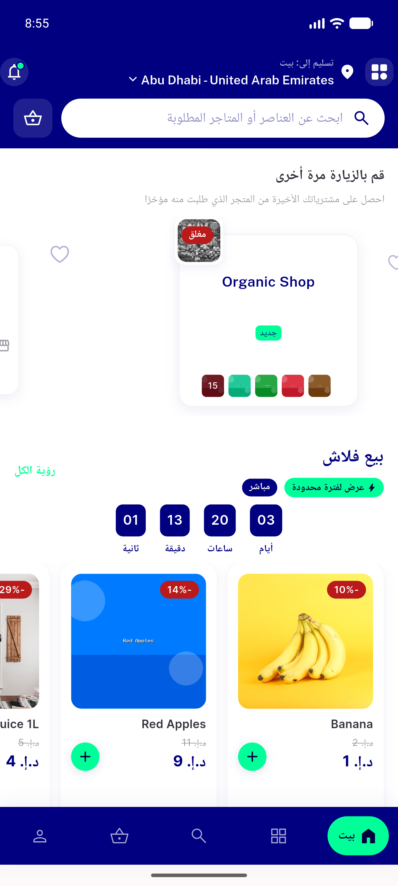</a> recheck 02 flash header</td>
<td align="center" width="33%"><a href="recheck-03-flash-details-top.png">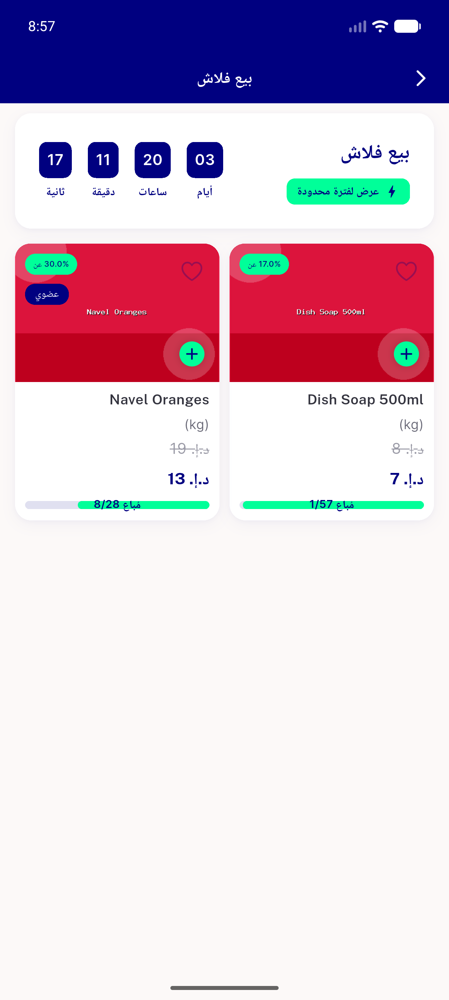</a> recheck 03 flash details top</td>
<td align="center" width="33%"><a href="recheck-04-flash-details-scroll.png">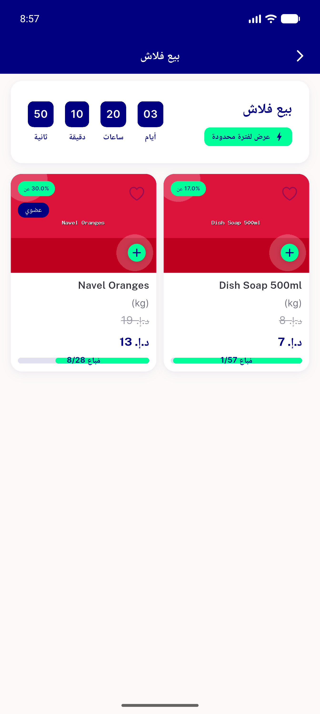</a> recheck 04 flash details scroll</td>
</tr>
<tr>
<td align="center" width="33%"><a href="recheck-05-home-rail-cards.png">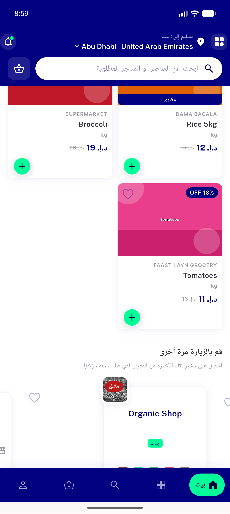</a> recheck 05 home rail cards</td>
</tr>
</table>

### Other artifacts
- [`progress.md`](progress.md)

---
*From `nears/docs/qa-evidence/NEARS-410/` · public-repo scrub policy (no live secrets; verified clean).*
