# QA Evidence — NEARS-4106

**PASS: offline Edit gate (pending|failed x unpaid x unverified); hidden for confirmed/processing/paid/verified**

**11 screenshot(s).** Click any thumbnail for full resolution.

<table>
<tr>
<td align="center" width="33%"><a href="ac2-ac4-processing-91418-edit-hidden.png">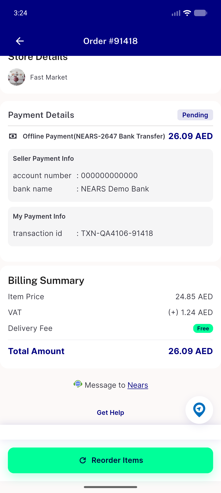</a> ac2 ac4 processing 91418 edit hidden</td>
<td align="center" width="33%"><a href="ac4-card-crop-baseline-visible.png">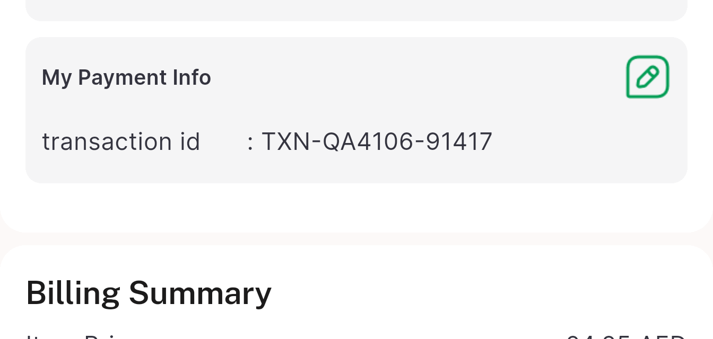</a> ac4 card crop baseline visible</td>
<td align="center" width="33%"><a href="ac4-card-crop-failed-visible.png">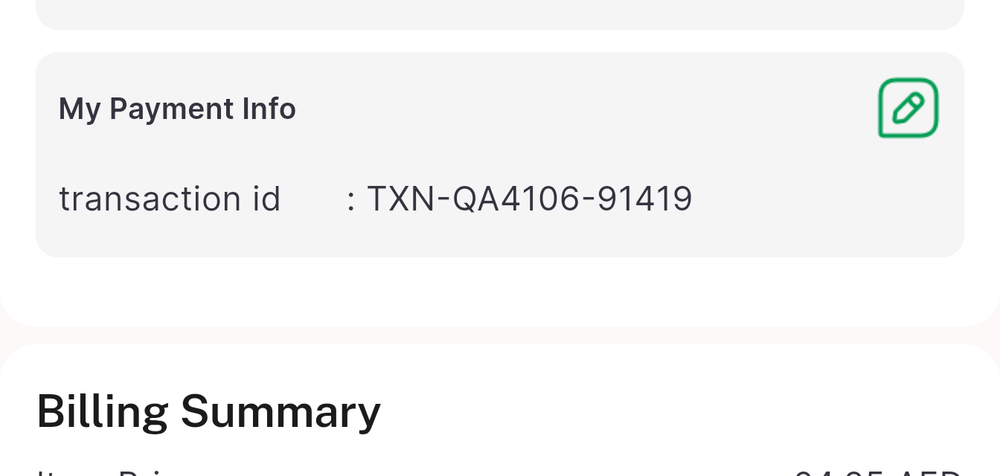</a> ac4 card crop failed visible</td>
</tr>
<tr>
<td align="center" width="33%"><a href="ac4-card-crop-hidden.png">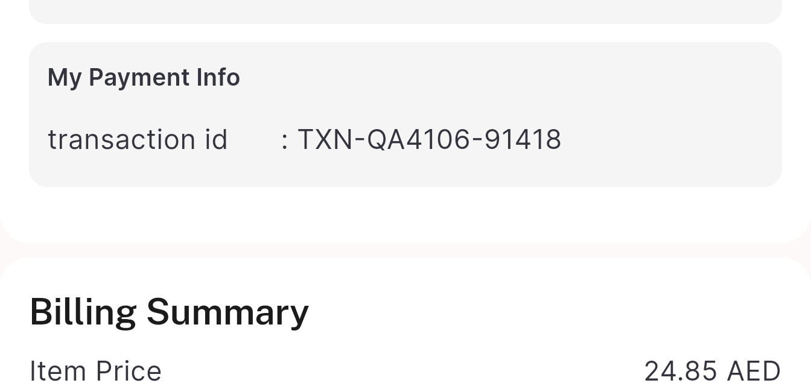</a> ac4 card crop hidden</td>
<td align="center" width="33%"><a href="b7-failed-edit-dialog.png">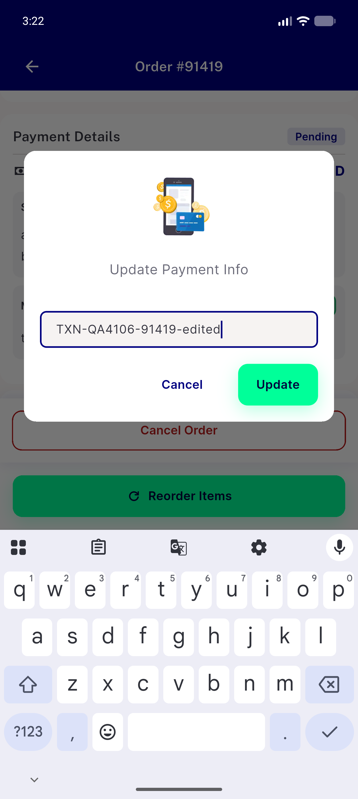</a> b7 failed edit dialog</td>
<td align="center" width="33%"><a href="b7-failed-order-91419-edit-visible.png">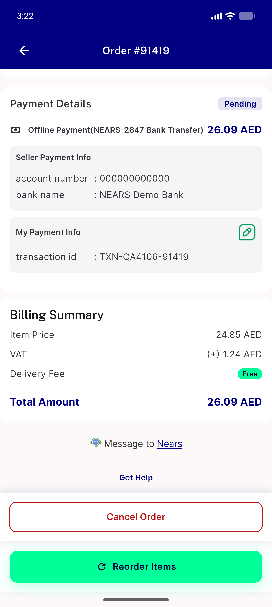</a> b7 failed order 91419 edit visible</td>
</tr>
<tr>
<td align="center" width="33%"><a href="baseline-pending-91417-edit-visible.png">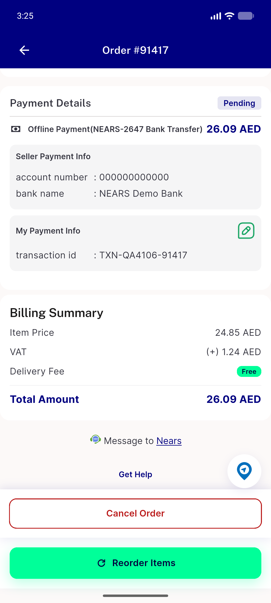</a> baseline pending 91417 edit visible</td>
<td align="center" width="33%"><a href="denied-pending-91417-edit-visible.png">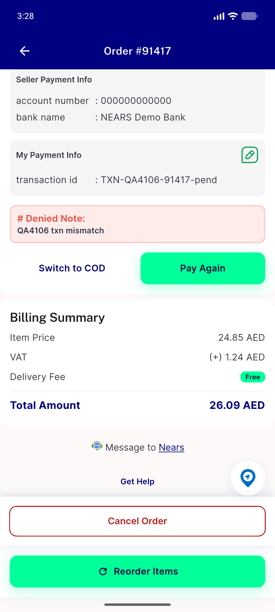</a> denied pending 91417 edit visible</td>
<td align="center" width="33%"><a href="denied-processing-91418-edit-hidden.png">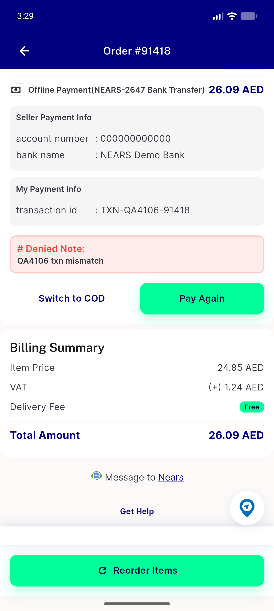</a> denied processing 91418 edit hidden</td>
</tr>
<tr>
<td align="center" width="33%"><a href="regression-cod-91416.png">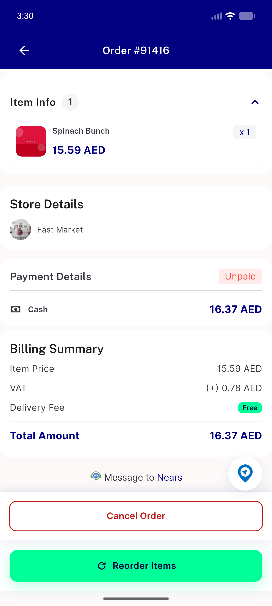</a> regression cod 91416</td>
<td align="center" width="33%"><a href="verified-row-pending-91417-edit-hidden.png">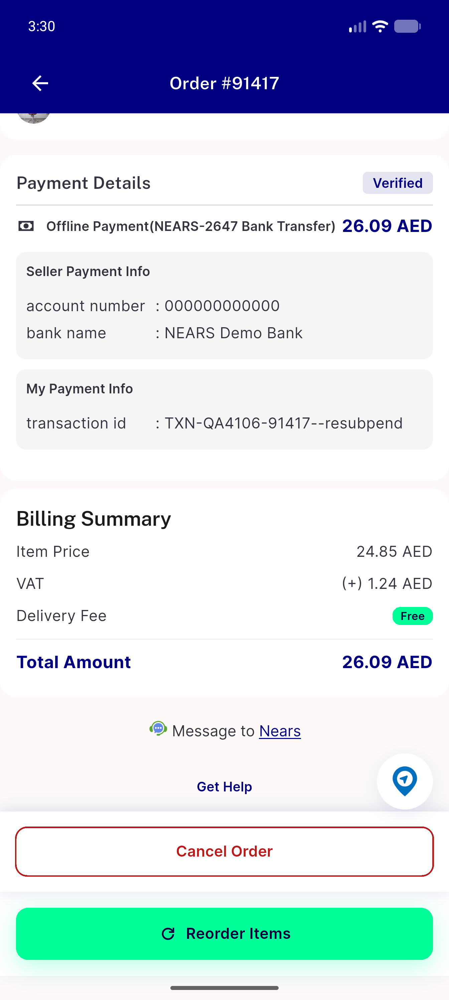</a> verified row pending 91417 edit hidden</td>
</tr>
</table>

### Other artifacts
- [`ac2-processing-91418-a11y-dump.xml`](ac2-processing-91418-a11y-dump.xml)
- [`bug-stale-card-after-update.log`](bug-stale-card-after-update.log)
- [`denied-processing-91418-a11y-dump.xml`](denied-processing-91418-a11y-dump.xml)
- [`failed-state-dml.log`](failed-state-dml.log)
- [`flutter-test.log`](flutter-test.log)

---
*From `nears/docs/qa-evidence/NEARS-4106/` · public-repo scrub policy (no live secrets; verified clean).*
