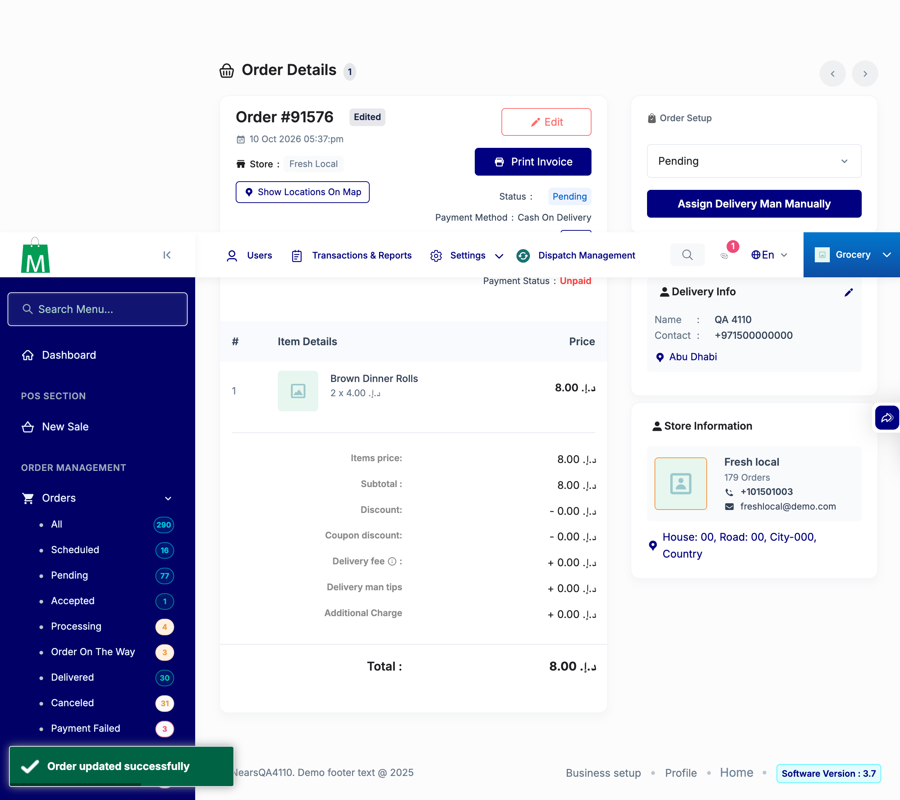
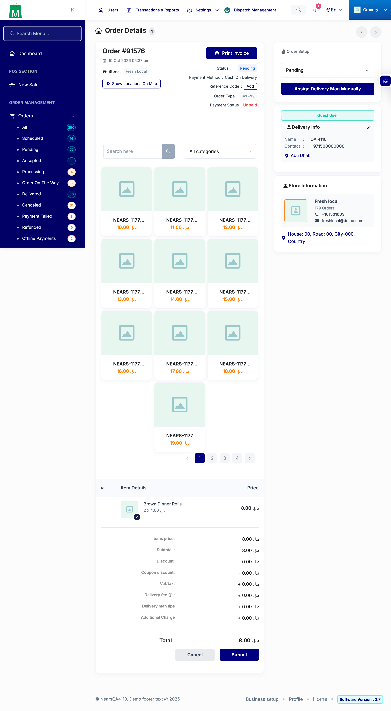
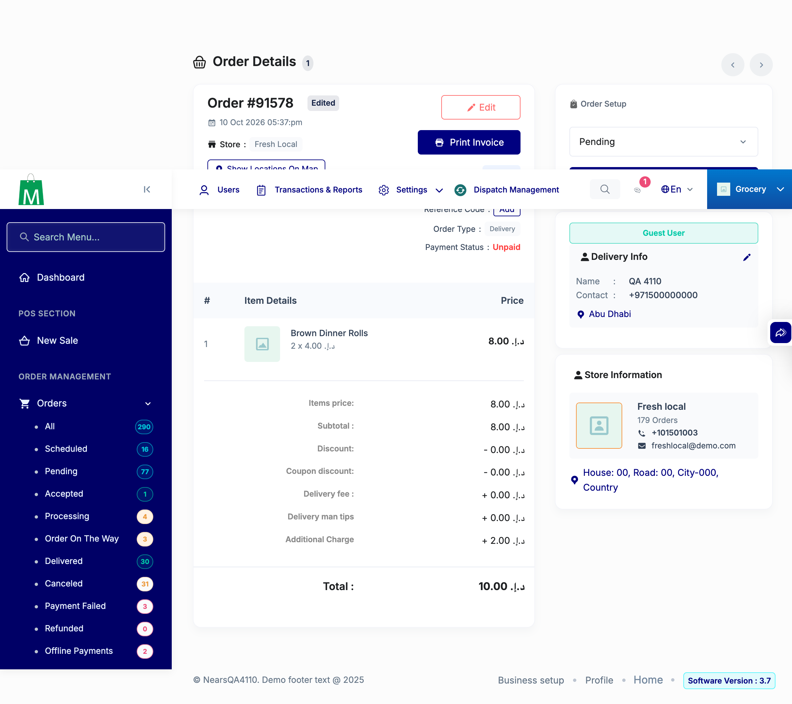
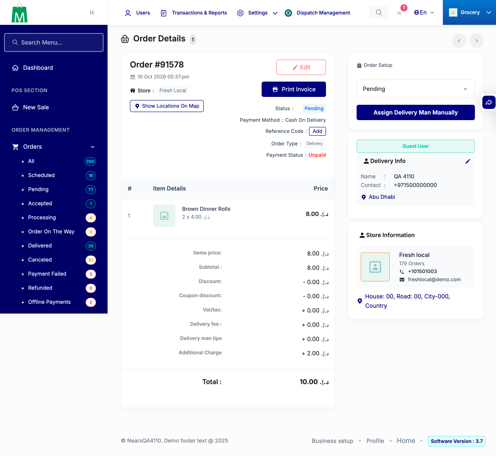

# QA Evidence — NEARS-4110

**PASS - NEARS-4110 admin order edit keeps placed additional charge + carries over placed admin delivery waiver; AC1-5 live on admin.order.edit/update, BASE-vs-FIX, UI pass, phpunit 539/4165 OK**

**5 screenshot(s).** Click any thumbnail for full resolution.

<table>
<tr>
<td align="center" width="33%"> ui 91576 h1a after submit</td>
<td align="center" width="33%"> ui 91576 h1a edit mode</td>
<td align="center" width="33%"> ui 91578 addl2 after submit</td>
</tr>
<tr>
<td align="center" width="33%"> ui 91578 addl2 edit mode</td>
<td align="center" width="33%"> ui 91578 addl2 view mode</td>
</tr>
</table>

### Other artifacts
- [`00-setup-and-ac-matrix.md`](00-setup-and-ac-matrix.md)
- [`ac1-ac2-ac5-all-store-controls-coupon-discount-n2.log`](ac1-ac2-ac5-all-store-controls-coupon-discount-n2.log)
- [`ac2-by-amount-n1-over0-status0-reverse.log`](ac2-by-amount-n1-over0-status0-reverse.log)
- [`ac2-by-amount-over-null.log`](ac2-by-amount-over-null.log)
- [`ac3-ac4-ac5-additional-charge-tips-packaging.log`](ac3-ac4-ac5-additional-charge-tips-packaging.log)
- [`backstop-phpunit-nears4110-sweep.log`](backstop-phpunit-nears4110-sweep.log)
- [`placement-real-api-base-vs-fix.log`](placement-real-api-base-vs-fix.log)
- [`preview-missing-business-setting-key.log`](preview-missing-business-setting-key.log)
- [`real-placed-orders-then-setting-drift-edit.log`](real-placed-orders-then-setting-drift-edit.log)
- [`real-placed-store-discount-order-edit.log`](real-placed-store-discount-order-edit.log)
- [`real-placed-vat-5pct-edit.log`](real-placed-vat-5pct-edit.log)
- [`regression-pages-status.log`](regression-pages-status.log)

---
*From `nears/docs/qa-evidence/NEARS-4110/` · public-repo scrub policy (no live secrets; verified clean).*
