# QA Evidence — NEARS-413

**PASS — DLS chrome-only reskin (legal/parcel/campaign/force-update) verified live on emulator-5554 @6726ba0f; AC-1..6 met (campaign+force-update backstopped via green tests, empty-data/read-only)**

**29 screenshot(s).** Click any thumbnail for full resolution.

<table>
<tr>
<td align="center" width="33%"> ac1 terms loaded</td>
<td align="center" width="33%"><a href="ac1-terms-loading.png">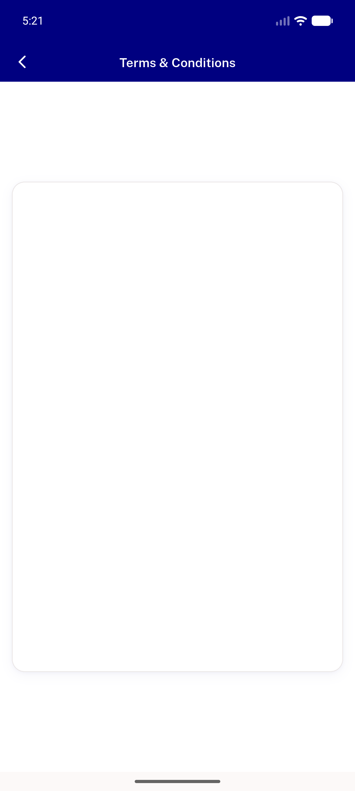</a> ac1 terms loading</td>
<td align="center" width="33%"> ac2 parcel back1</td>
</tr>
<tr>
<td align="center" width="33%"><a href="ac2-parcel-category-final.png">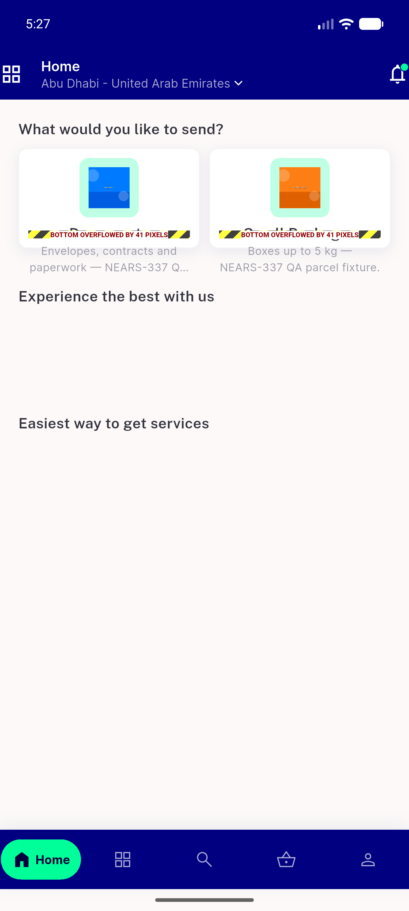</a> ac2 parcel category final</td>
<td align="center" width="33%"> ac2 parcel category</td>
<td align="center" width="33%"><a href="ac2-parcel-location-final.png">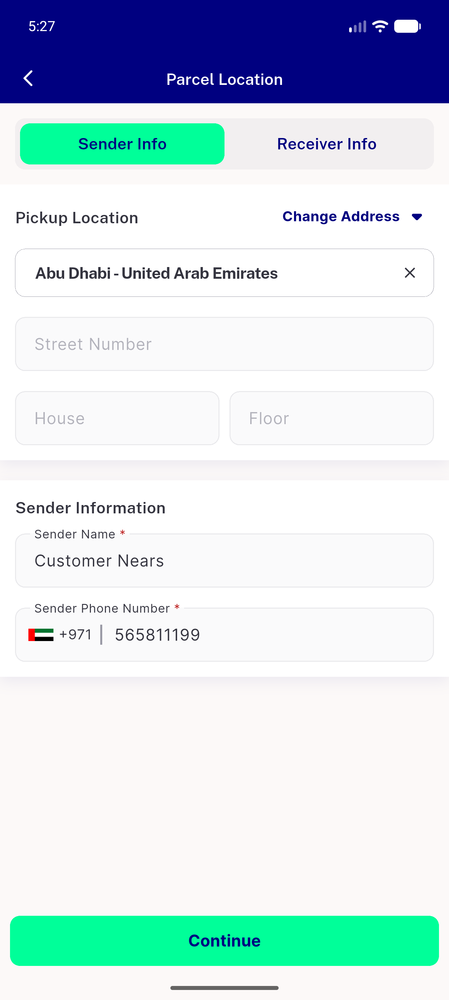</a> ac2 parcel location final</td>
</tr>
<tr>
<td align="center" width="33%"> ac2 parcel location</td>
<td align="center" width="33%"><a href="ac2-parcel-map-resolve.png">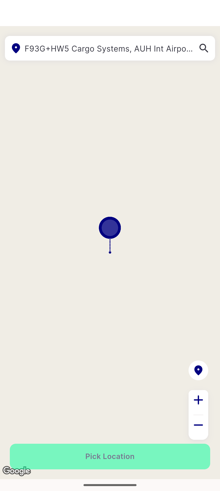</a> ac2 parcel map resolve</td>
<td align="center" width="33%"><a href="ac2-parcel-mappicker.png">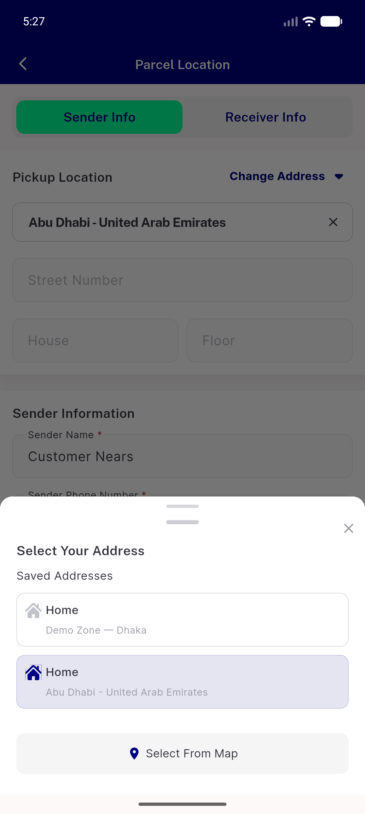</a> ac2 parcel mappicker</td>
</tr>
<tr>
<td align="center" width="33%"><a href="ac2-parcel-request-form.png">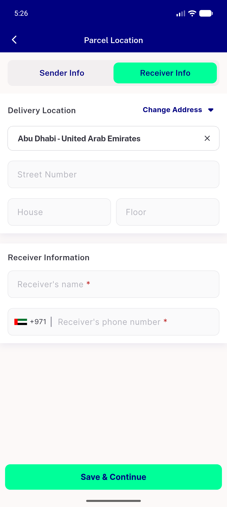</a> ac2 parcel request form</td>
<td align="center" width="33%"><a href="ac3-after-banner-tap.png">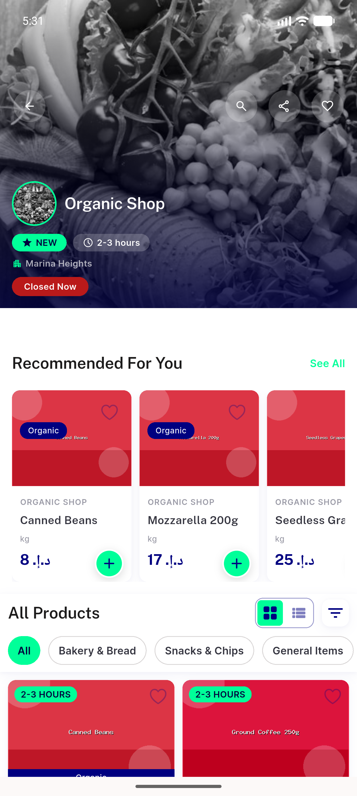</a> ac3 after banner tap</td>
<td align="center" width="33%"> ac3 basic campaign</td>
</tr>
<tr>
<td align="center" width="33%"><a href="ac5-dark-parcel.png">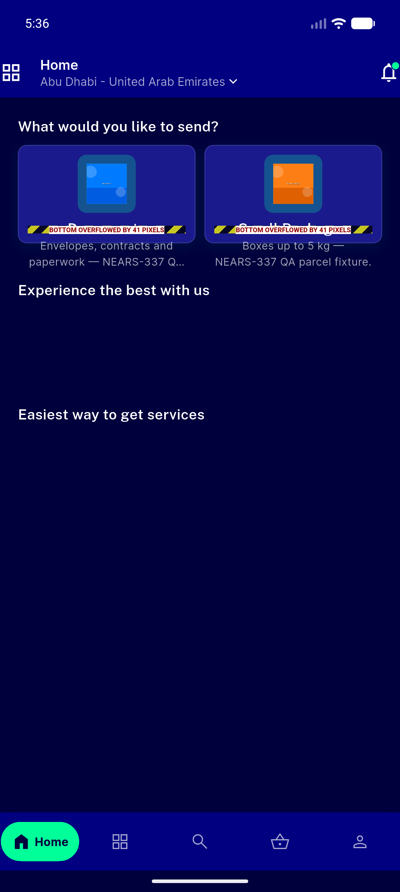</a> ac5 dark parcel</td>
<td align="center" width="33%"><a href="ac5-dark-settings.png">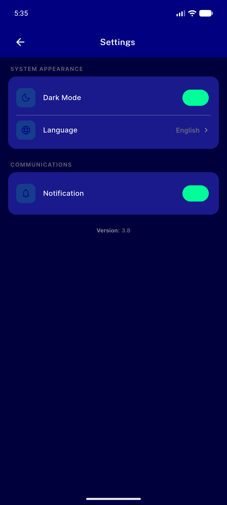</a> ac5 dark settings</td>
<td align="center" width="33%"><a href="ac5-dark-terms.png">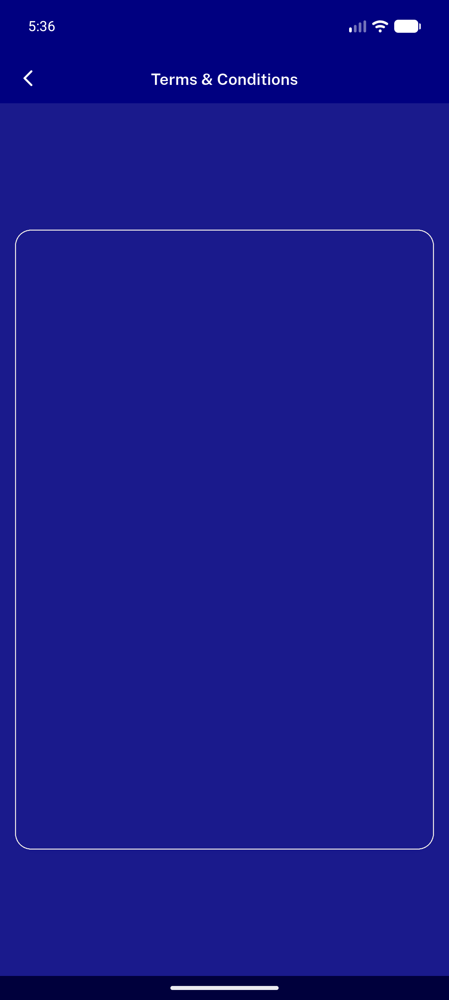</a> ac5 dark terms</td>
</tr>
<tr>
<td align="center" width="33%"> ac5 rtl after apply</td>
<td align="center" width="33%"><a href="ac5-rtl-modulegrid.png">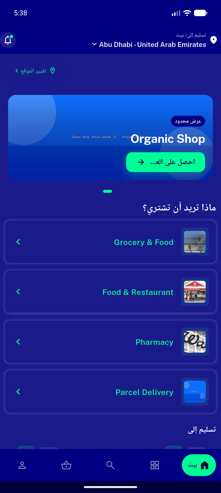</a> ac5 rtl modulegrid</td>
<td align="center" width="33%"><a href="ac5-rtl-parcel.png">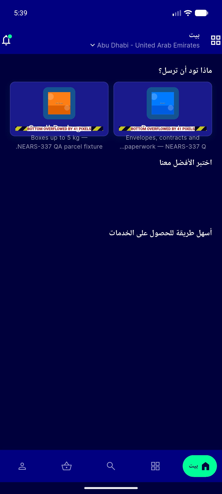</a> ac5 rtl parcel</td>
</tr>
<tr>
<td align="center" width="33%"><a href="ac5-rtl-profile.png">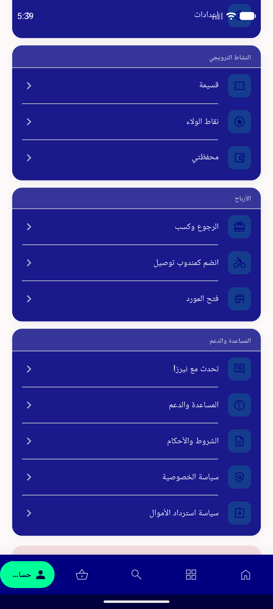</a> ac5 rtl profile</td>
<td align="center" width="33%"> ac5 rtl settings</td>
<td align="center" width="33%"><a href="ac5-rtl-terms.png">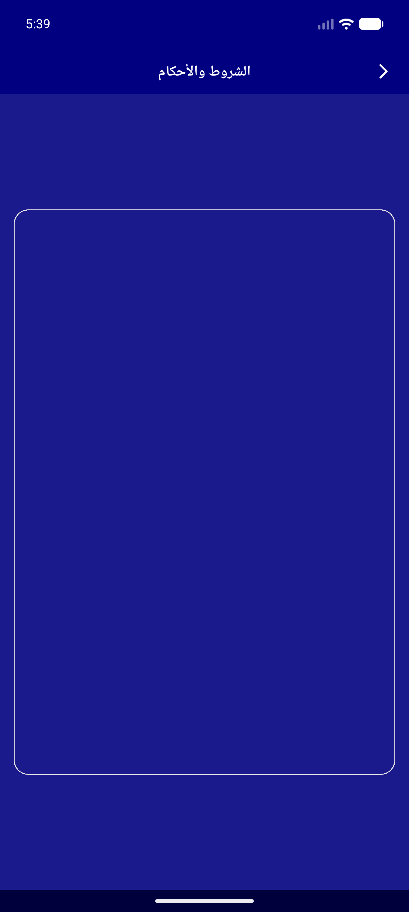</a> ac5 rtl terms</td>
</tr>
<tr>
<td align="center" width="33%"><a href="nav-after-address-tap.png">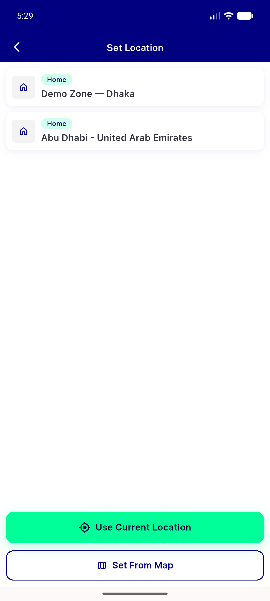</a> nav after address tap</td>
<td align="center" width="33%"><a href="nav-banner-inview.png">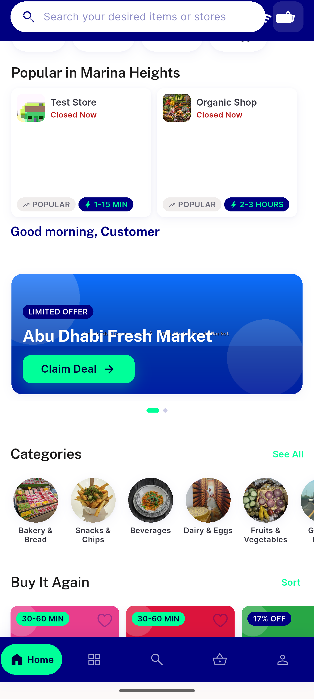</a> nav banner inview</td>
<td align="center" width="33%"> nav grocery home</td>
</tr>
<tr>
<td align="center" width="33%"><a href="nav-grocery-top.png">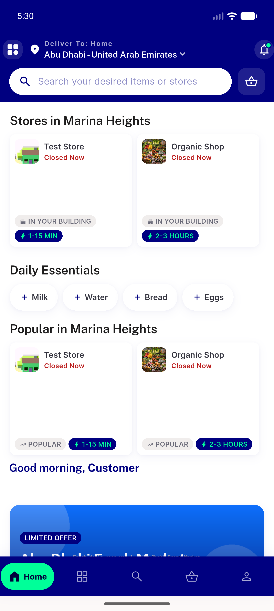</a> nav grocery top</td>
<td align="center" width="33%"><a href="nav-language.png">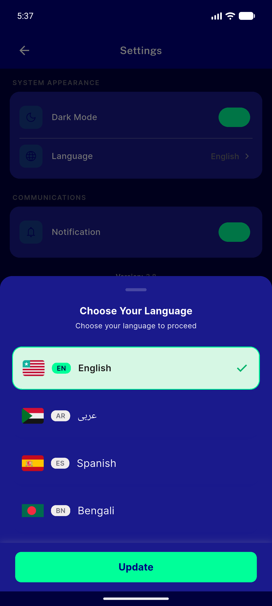</a> nav language</td>
<td align="center" width="33%"><a href="nav-module-grid.png">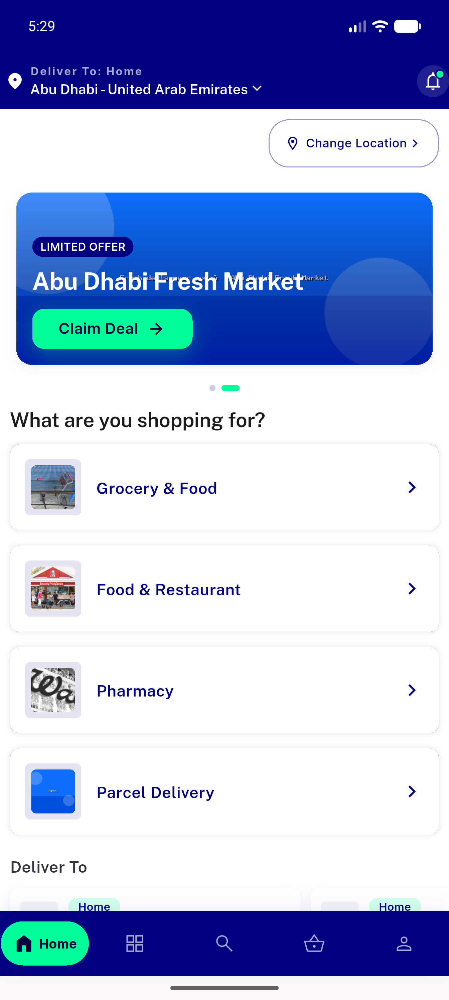</a> nav module grid</td>
</tr>
<tr>
<td align="center" width="33%"><a href="nav-settings.png">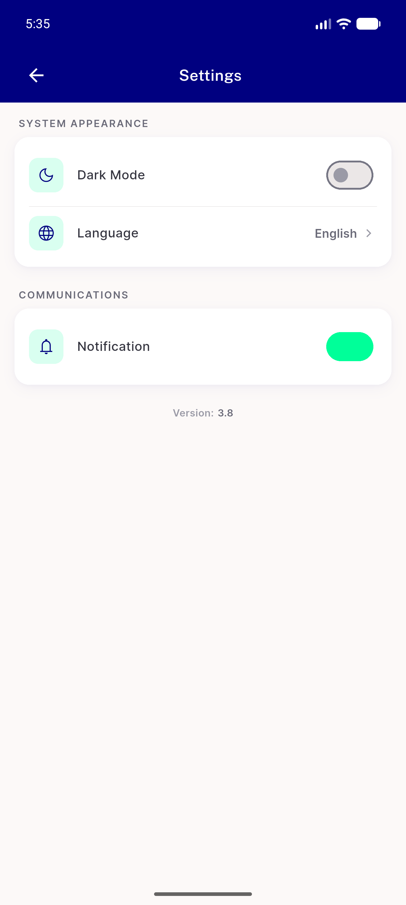</a> nav settings</td>
<td align="center" width="33%"><a href="nav-switch-module.png">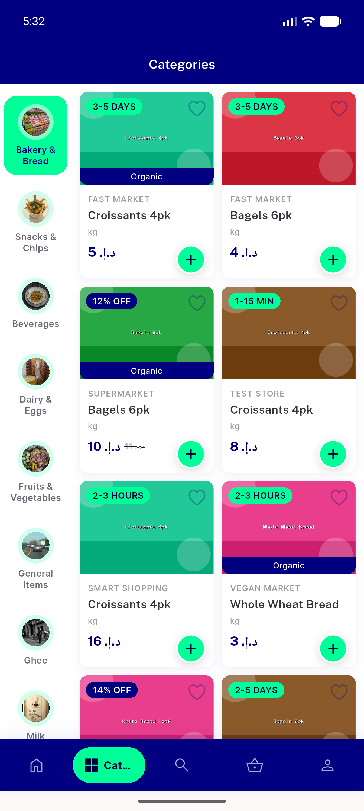</a> nav switch module</td>
</tr>
</table>

### Other artifacts
- [`progress.md`](progress.md)

---
*From `nears/docs/qa-evidence/NEARS-413/` · public-repo scrub policy (no live secrets; verified clean).*
