# QA Evidence — NEARS-414

**PASS — theme persists across locale switch + cold restart (dark & light); rapid-toggle in sync; map async-load intact**

**26 screenshot(s).** Click any thumbnail for full resolution.

<table>
<tr>
<td align="center" width="33%"><a href="00-home-light-baseline.png">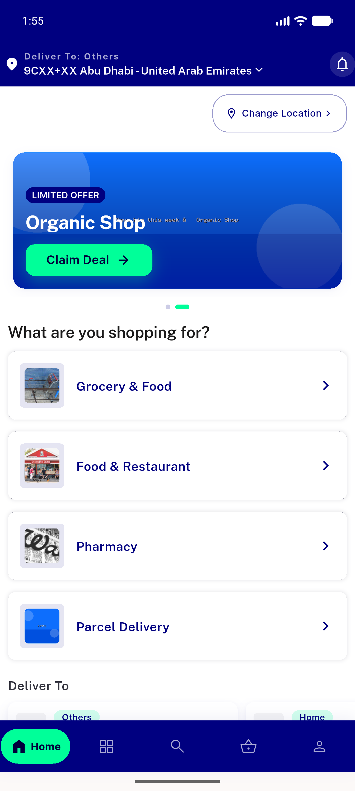</a> home light baseline</td>
<td align="center" width="33%"><a href="01-settings-light.png">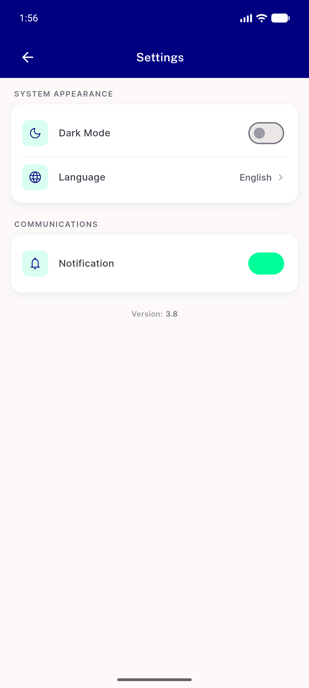</a> settings light</td>
<td align="center" width="33%"><a href="02-settings-dark-on.png">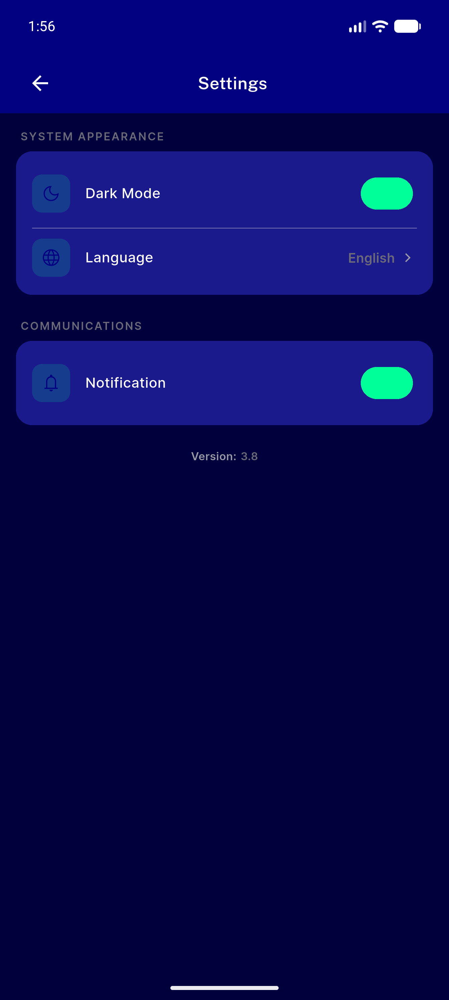</a> settings dark on</td>
</tr>
<tr>
<td align="center" width="33%"><a href="03-dark-after-EN-to-AR.png">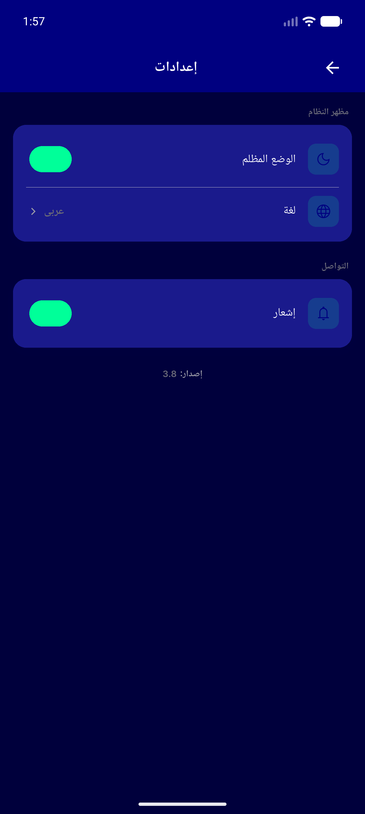</a> dark after EN to AR</td>
<td align="center" width="33%"><a href="04-dark-after-AR-to-EN.png">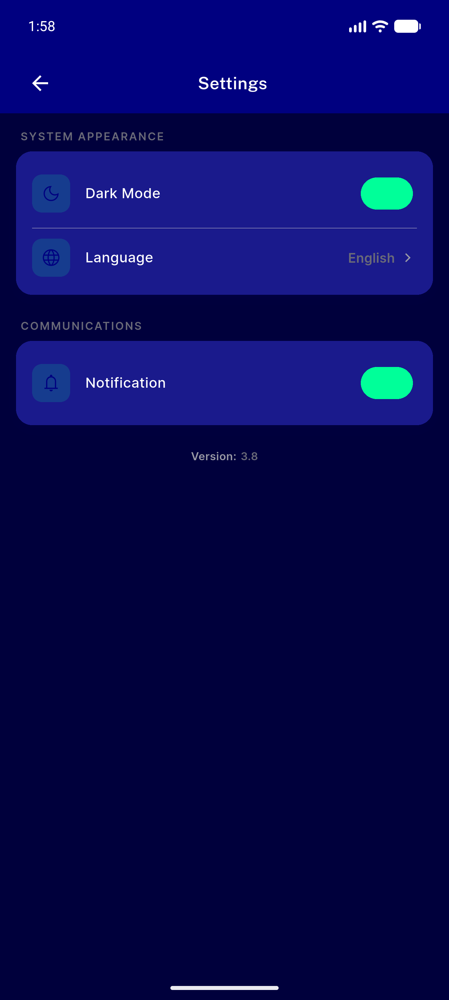</a> dark after AR to EN</td>
<td align="center" width="33%"><a href="05-light-mode-on.png">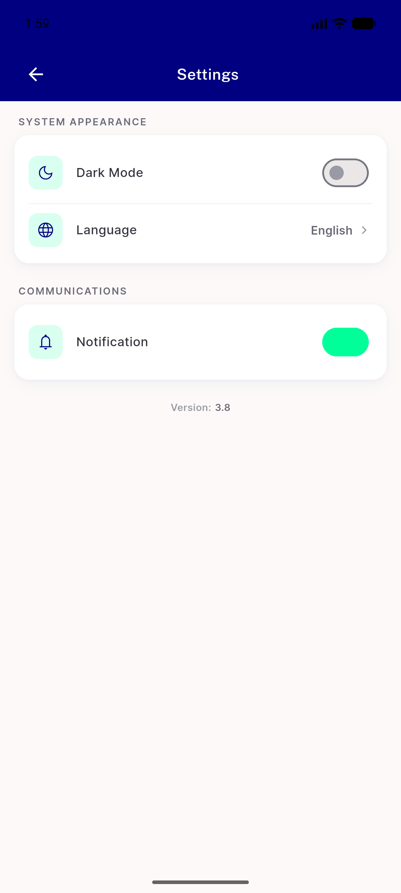</a> light mode on</td>
</tr>
<tr>
<td align="center" width="33%"><a href="06-light-after-EN-to-AR.png">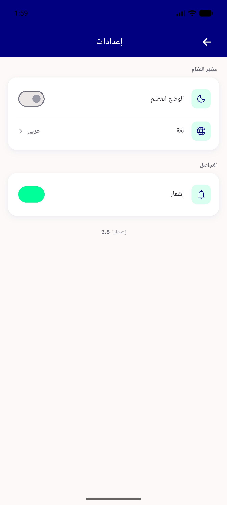</a> light after EN to AR</td>
<td align="center" width="33%"><a href="07-light-after-AR-to-EN.png">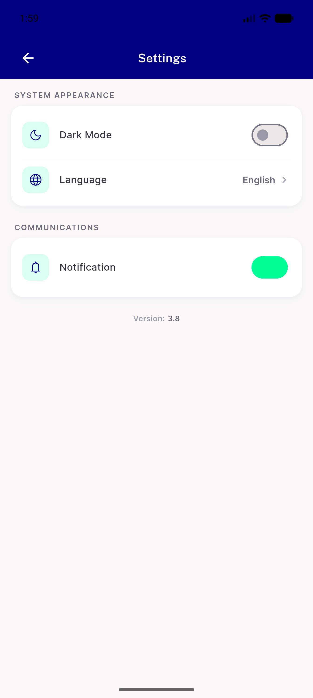</a> light after AR to EN</td>
<td align="center" width="33%"><a href="08-dark-before-coldrestart.png">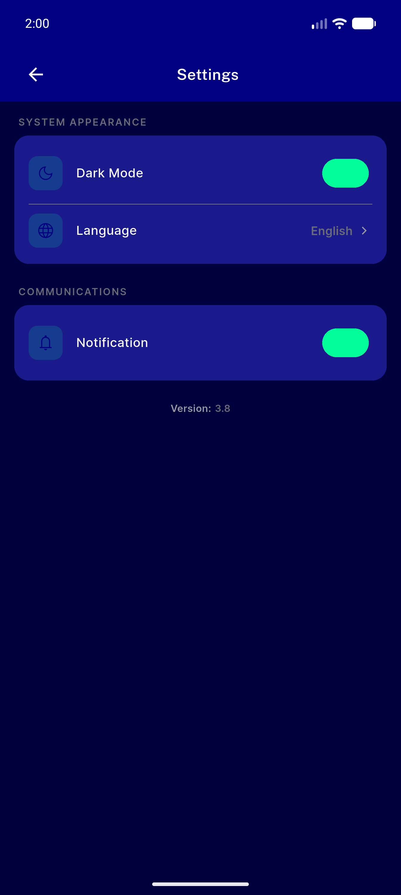</a> dark before coldrestart</td>
</tr>
<tr>
<td align="center" width="33%"><a href="09-coldstart-dark-firstframe.png">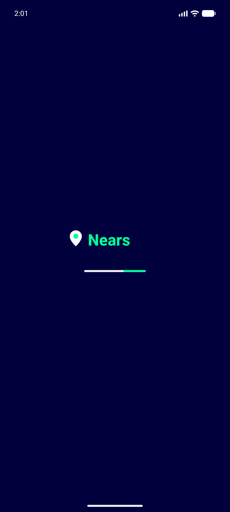</a> coldstart dark firstframe</td>
<td align="center" width="33%"><a href="09-coldstart-frame1.png">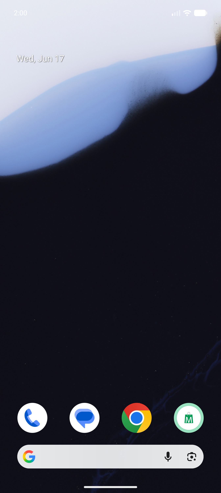</a> coldstart frame1</td>
<td align="center" width="33%"> coldstart frame2</td>
</tr>
<tr>
<td align="center" width="33%"><a href="09-coldstart-frame3.png">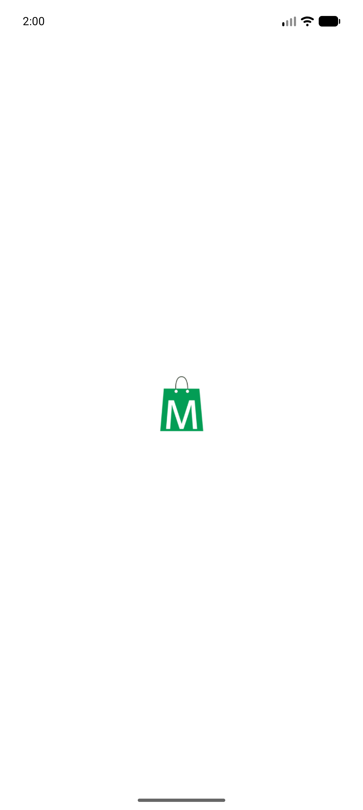</a> coldstart frame3</td>
<td align="center" width="33%"> coldstart frame4</td>
<td align="center" width="33%"> coldstart frame5</td>
</tr>
<tr>
<td align="center" width="33%"> coldstart frame6</td>
<td align="center" width="33%"><a href="10-coldstart-dark-settled.png">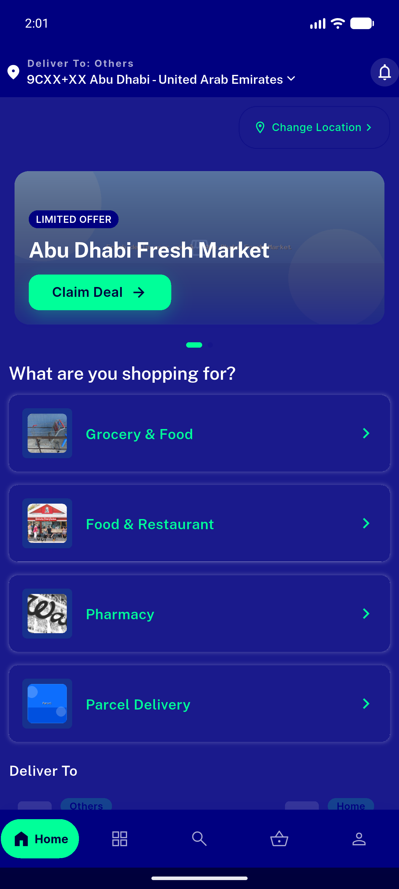</a> coldstart dark settled</td>
<td align="center" width="33%"><a href="11-light-before-coldrestart.png">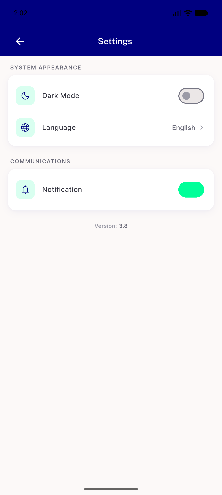</a> light before coldrestart</td>
</tr>
<tr>
<td align="center" width="33%"><a href="12-coldstart-light-firstframe.png">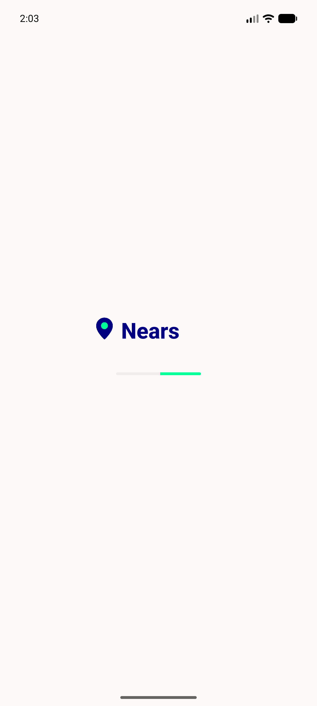</a> coldstart light firstframe</td>
<td align="center" width="33%"> coldstart light settled</td>
<td align="center" width="33%"> rapid toggle end dark</td>
</tr>
<tr>
<td align="center" width="33%"><a href="15-rapid-toggle-then-locale-dark.png">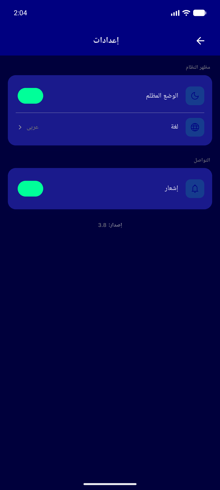</a> rapid toggle then locale dark</td>
<td align="center" width="33%"> map dark</td>
<td align="center" width="33%"><a href="16b-map-dark-loaded.png">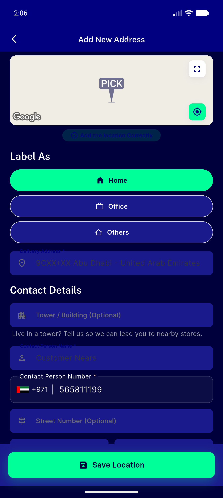</a> 16b map dark loaded</td>
</tr>
<tr>
<td align="center" width="33%"><a href="17-map-light.png">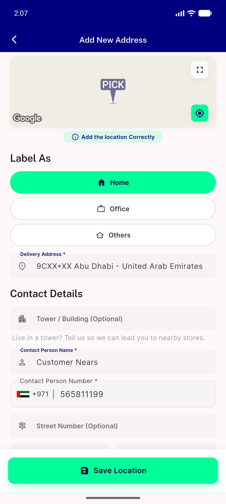</a> map light</td>
<td align="center" width="33%"><a href="18-home-light-regression.png">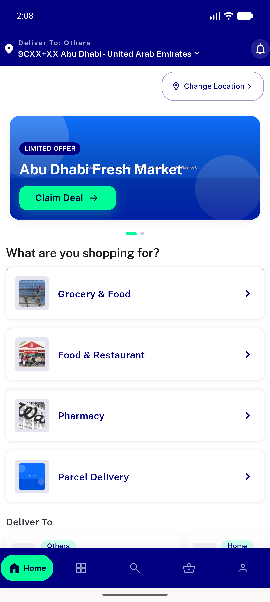</a> home light regression</td>
</tr>
</table>

### Other artifacts
- [`progress.md`](progress.md)

---
*From `nears/docs/qa-evidence/NEARS-414/` · public-repo scrub policy (no live secrets; verified clean).*
