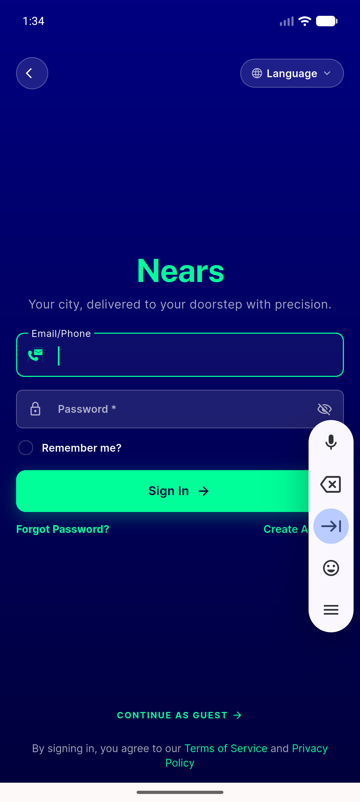
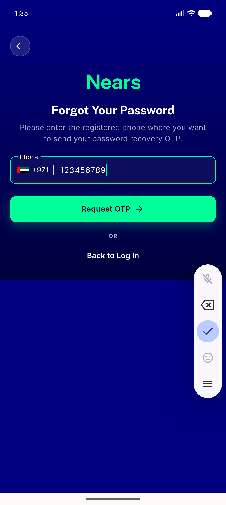
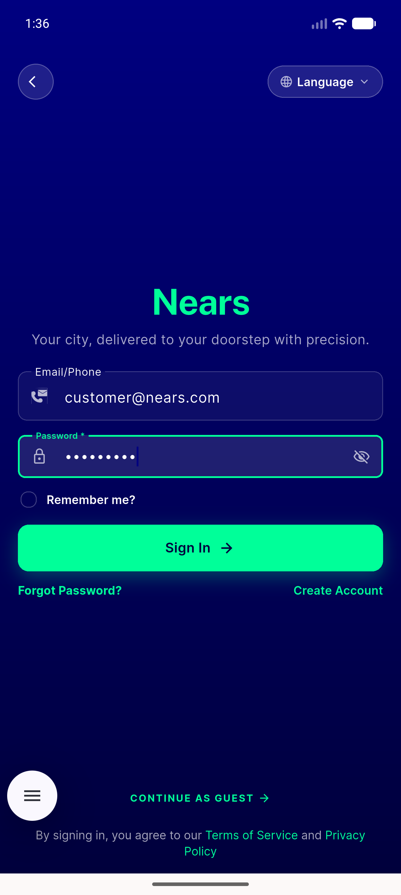
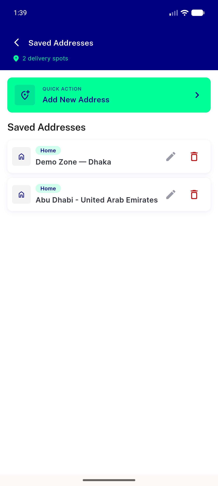

# QA Evidence — NEARS-415

**PASS verify**

**4 screenshot(s).** Click any thumbnail for full resolution.

<table>
<tr>
<td align="center" width="33%"> signin screen</td>
<td align="center" width="33%"> signin filled</td>
<td align="center" width="33%"> signin ready</td>
</tr>
<tr>
<td align="center" width="33%"> saved addresses loggedin</td>
</tr>
</table>

### Other artifacts
- [`automated_backstop.txt`](automated_backstop.txt)
- [`logcat_excerpts.txt`](logcat_excerpts.txt)
- [`progress.md`](progress.md)
- [`raw-logcat`](raw-logcat)

---
*From `nears/docs/qa-evidence/NEARS-415/` · public-repo scrub policy (no live secrets; verified clean).*
