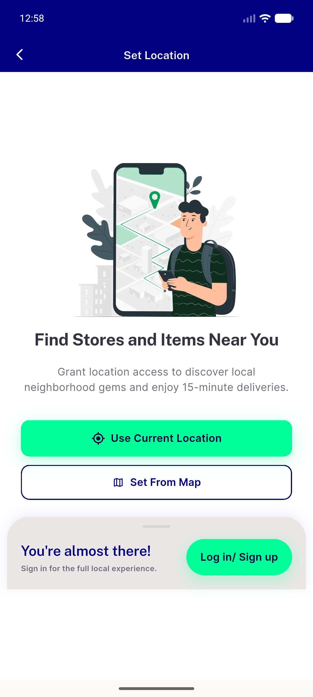
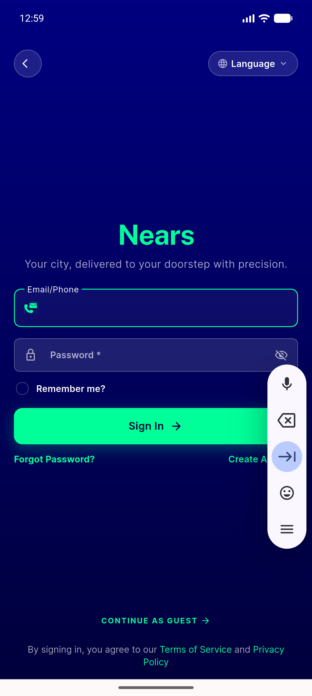
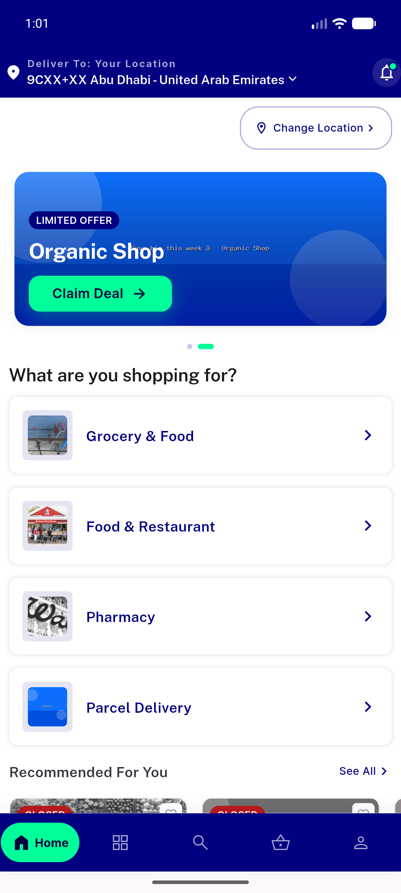
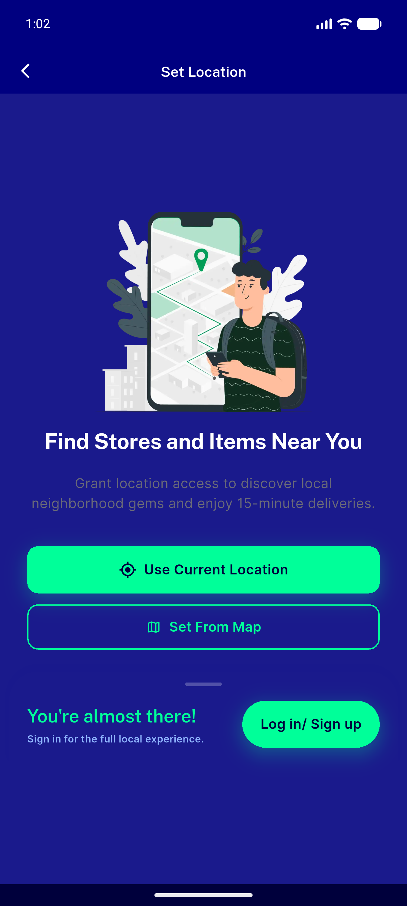
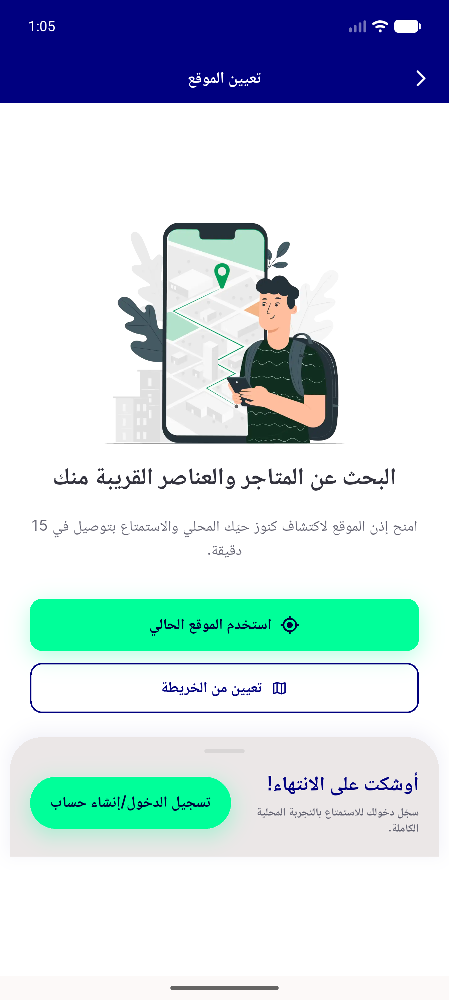
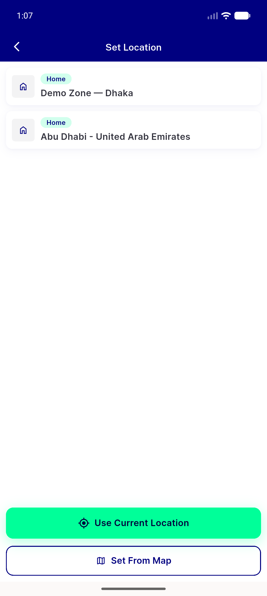

# QA Evidence — NEARS-416

**PASS — Access Location guest auth-funnel panel: all 6 ACs live, widget test 4/4, zero runtime errors**

**6 screenshot(s).** Click any thumbnail for full resolution.

<table>
<tr>
<td align="center" width="33%"> guest funnel light</td>
<td align="center" width="33%"> cta navigates signin</td>
<td align="center" width="33%"> popscope back snackbar</td>
</tr>
<tr>
<td align="center" width="33%"> guest funnel dark</td>
<td align="center" width="33%"> guest funnel arabic rtl</td>
<td align="center" width="33%"> loggedin access location no funnel</td>
</tr>
</table>

### Other artifacts
- [`progress.md`](progress.md)

---
*From `nears/docs/qa-evidence/NEARS-416/` · public-repo scrub policy (no live secrets; verified clean).*
