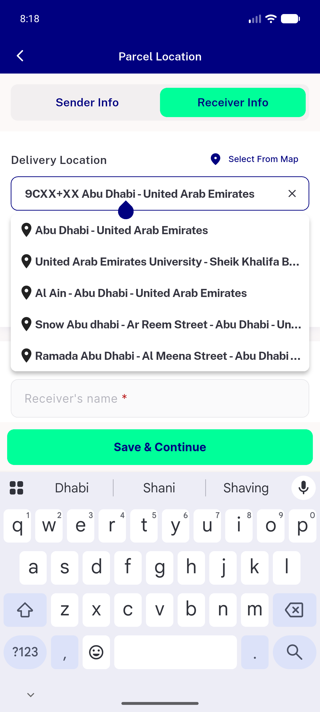
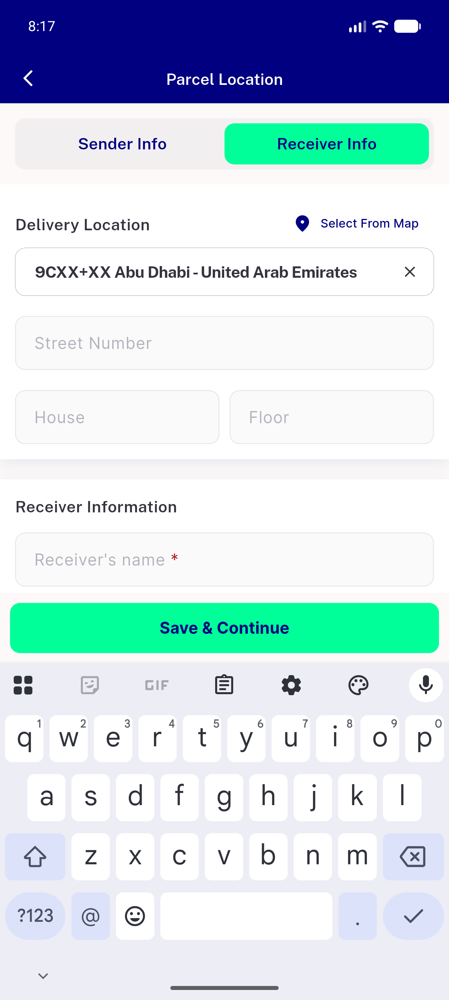
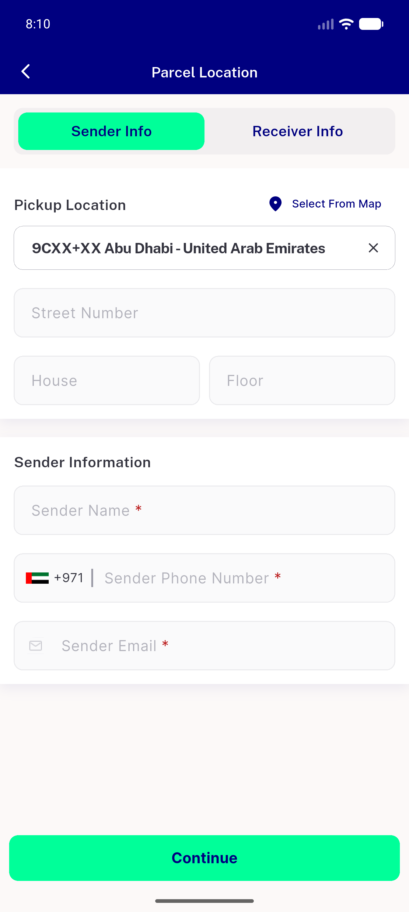
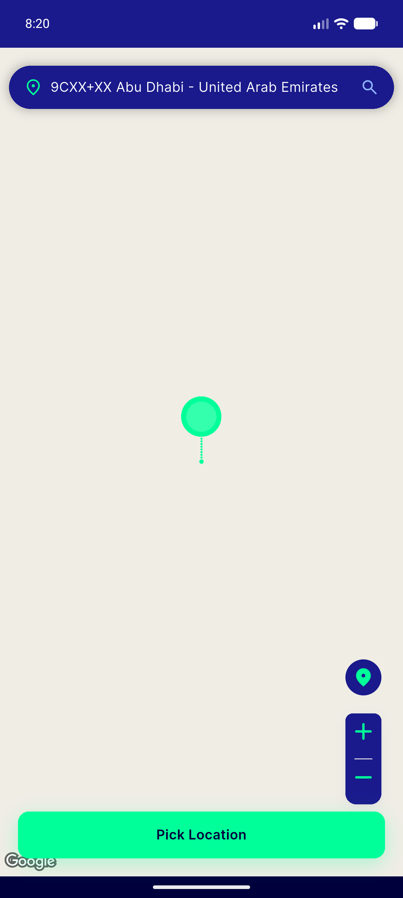
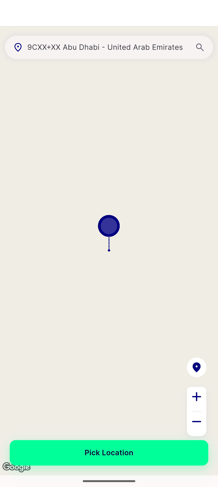
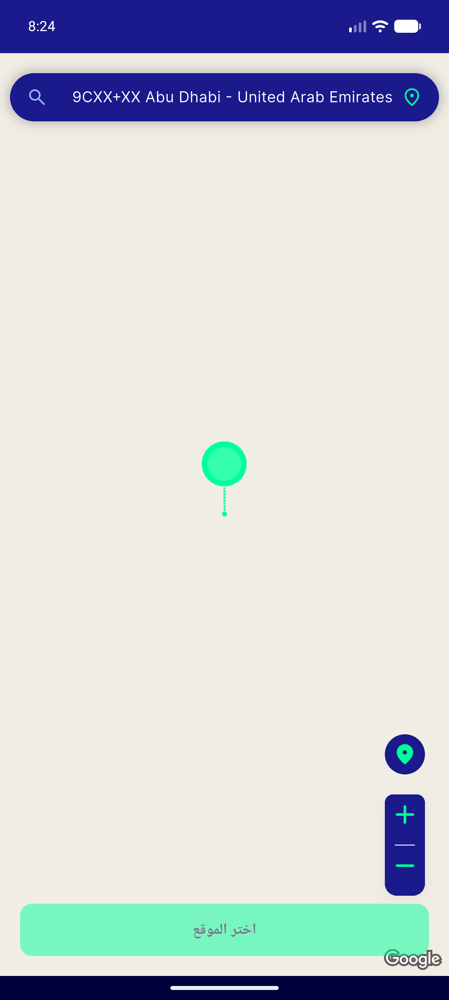
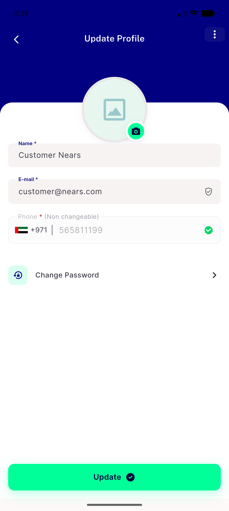
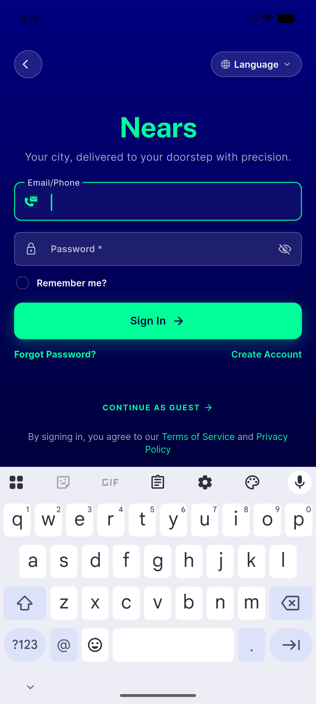
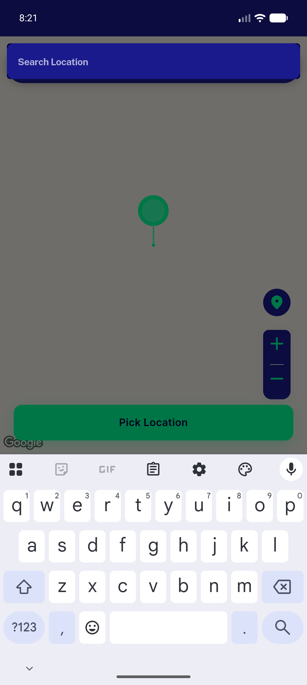
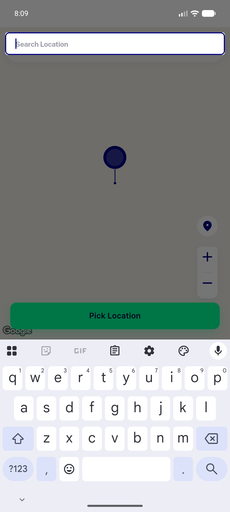

# QA Evidence — NEARS-417

**PASS (with notes) — pill light/dark/RTL + parcel toggle live; validator via backstop**

**10 screenshot(s).** Click any thumbnail for full resolution.

<table>
<tr>
<td align="center" width="33%"> parcel destination dialog light</td>
<td align="center" width="33%"> parcel destination pill light</td>
<td align="center" width="33%"> parcel pickup pill light</td>
</tr>
<tr>
<td align="center" width="33%"> pill filled dark</td>
<td align="center" width="33%"> pill filled light</td>
<td align="center" width="33%"> pill rtl dark</td>
</tr>
<tr>
<td align="center" width="33%"> regression editprofile nearsinput</td>
<td align="center" width="33%"> regression signin nearsinput</td>
<td align="center" width="33%"> search dialog dark</td>
</tr>
<tr>
<td align="center" width="33%"> search dialog light</td>
</tr>
</table>

### Other artifacts
- [`progress.md`](progress.md)

---
*From `nears/docs/qa-evidence/NEARS-417/` · public-repo scrub policy (no live secrets; verified clean).*
