# QA Evidence — NEARS-418

**PASS — 4-segment password-strength meter + min(8) client gate on Reset/Change password; all 8 ACs demonstrated live; no defects**

**17 screenshot(s).** Click any thumbnail for full resolution.

<table>
<tr>
<td align="center" width="33%"><a href="ac1-forgot-password-entry.png">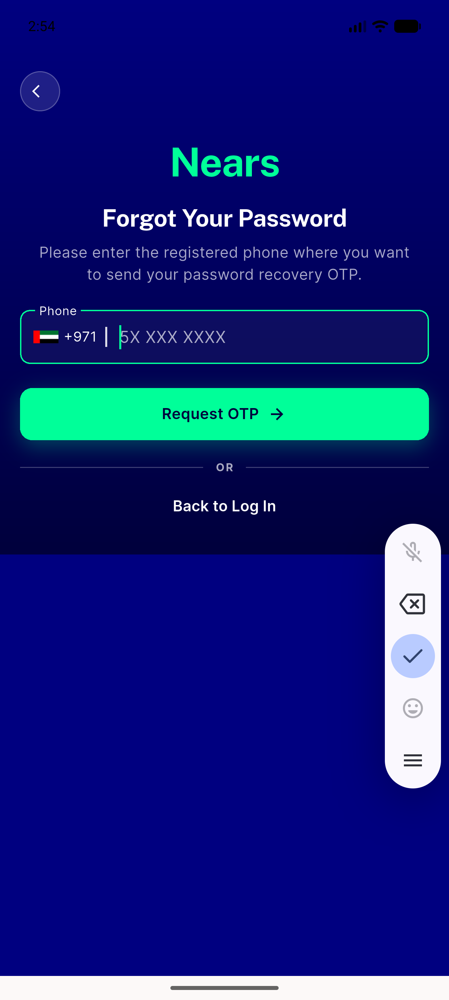</a> ac1 forgot password entry</td>
<td align="center" width="33%"><a href="ac2-ac7-change-arabic-empty.png">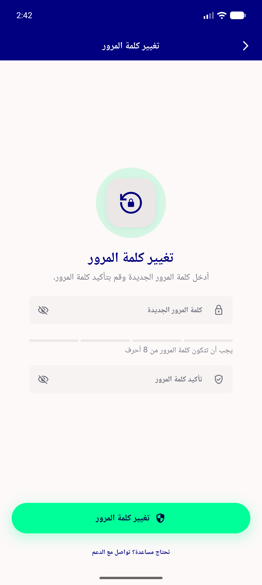</a> ac2 ac7 change arabic empty</td>
<td align="center" width="33%"><a href="ac2-change-en-empty.png">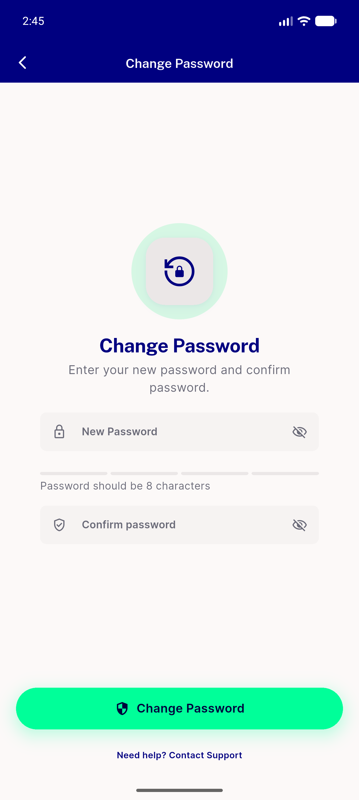</a> ac2 change en empty</td>
</tr>
<tr>
<td align="center" width="33%"><a href="ac3-6char-gate-snackbar.png">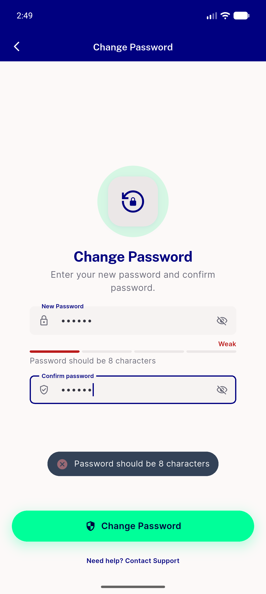</a> ac3 6char gate snackbar</td>
<td align="center" width="33%"><a href="ac4-8char-weak-not-blocked.png">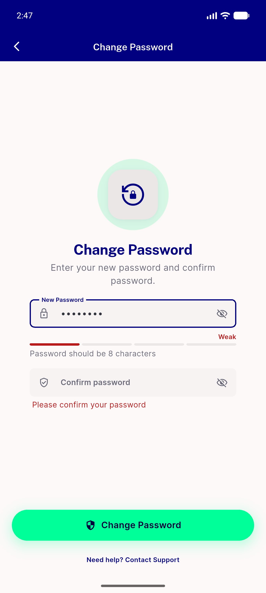</a> ac4 8char weak not blocked</td>
<td align="center" width="33%"><a href="ac5-tier-fair.png">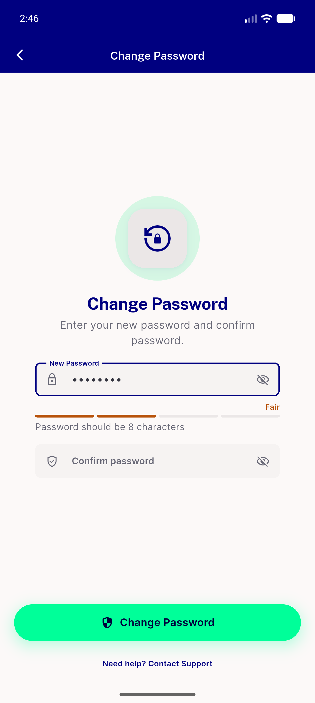</a> ac5 tier fair</td>
</tr>
<tr>
<td align="center" width="33%"><a href="ac5-tier-good.png">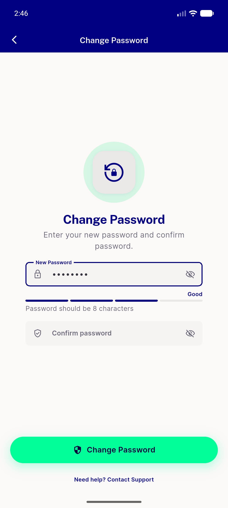</a> ac5 tier good</td>
<td align="center" width="33%"><a href="ac5-tier-strong.png">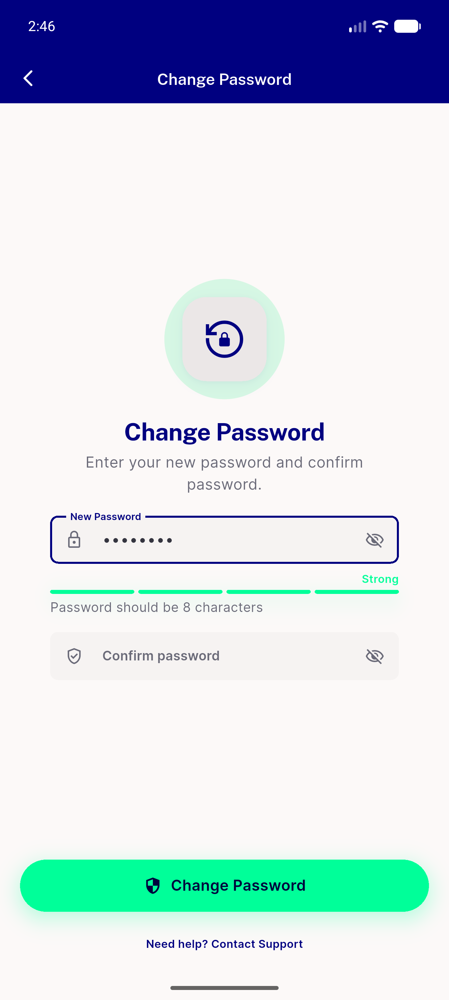</a> ac5 tier strong</td>
<td align="center" width="33%"><a href="ac5-tier-weak.png">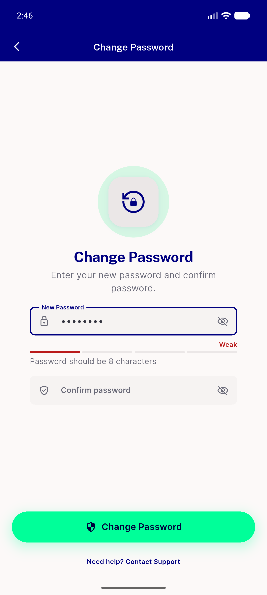</a> ac5 tier weak</td>
</tr>
<tr>
<td align="center" width="33%"><a href="ac6-dark-empty-unlit.png">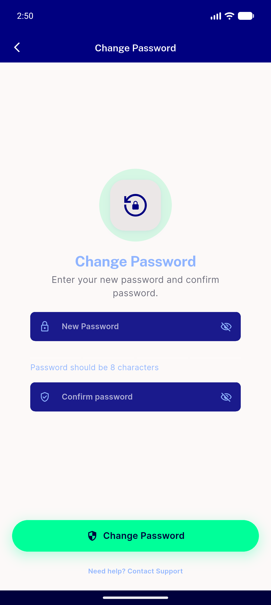</a> ac6 dark empty unlit</td>
<td align="center" width="33%"><a href="ac6-dark-fair-unlit-navyglass.png">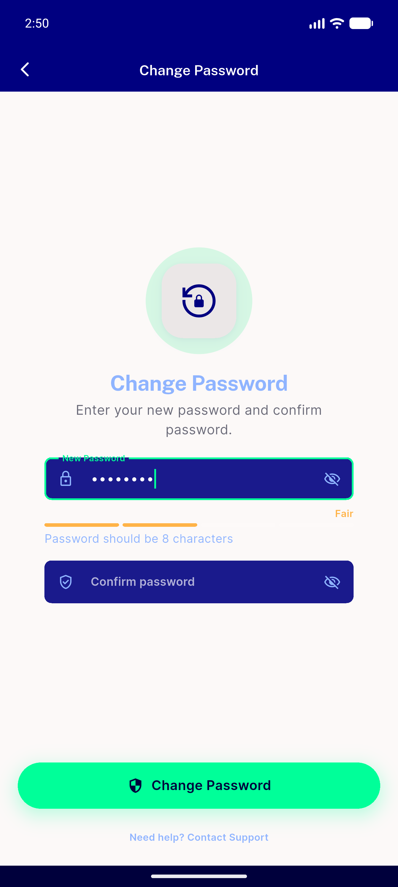</a> ac6 dark fair unlit navyglass</td>
<td align="center" width="33%"><a href="ac6-settings-dark.png">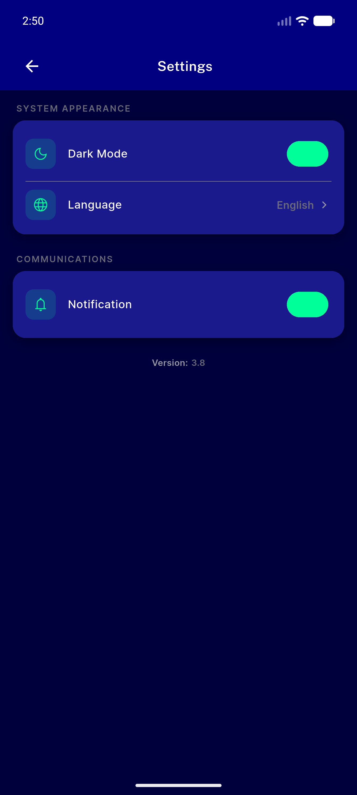</a> ac6 settings dark</td>
</tr>
<tr>
<td align="center" width="33%"><a href="ac7-arabic-rtl-strong-qawiya.png">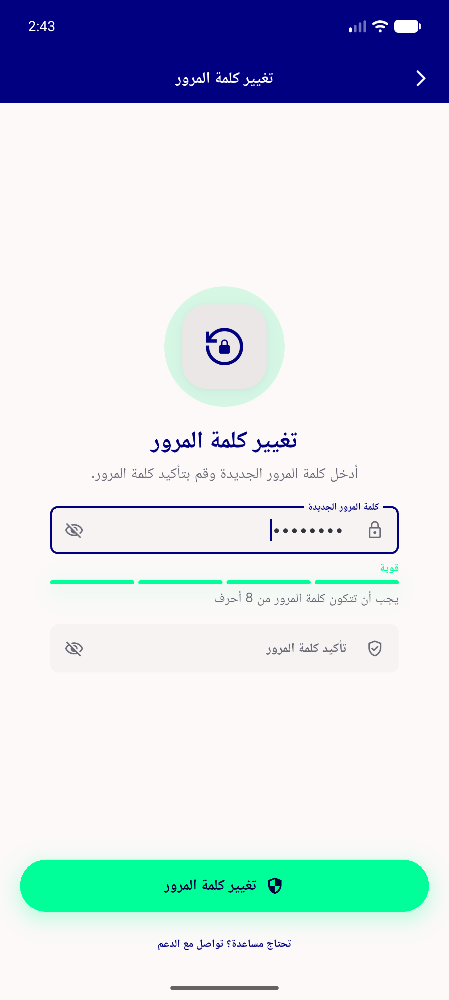</a> ac7 arabic rtl strong qawiya</td>
<td align="center" width="33%"><a href="ac7-arabic-rtl-weak-daeefa.png">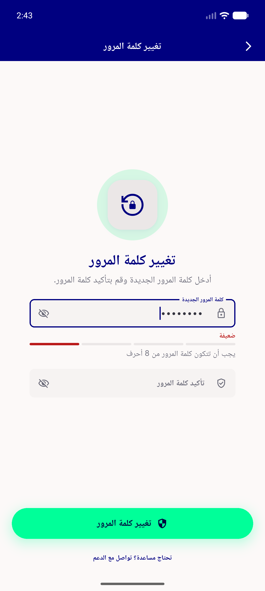</a> ac7 arabic rtl weak daeefa</td>
<td align="center" width="33%"><a href="ac8-delivery-reg-no-meter.png">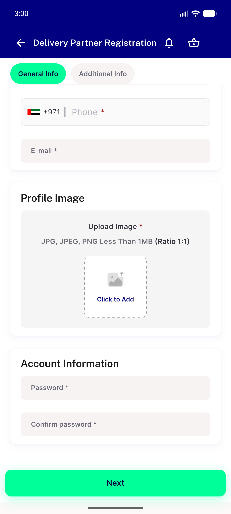</a> ac8 delivery reg no meter</td>
</tr>
<tr>
<td align="center" width="33%"><a href="ac8-mismatch-snackbar.png">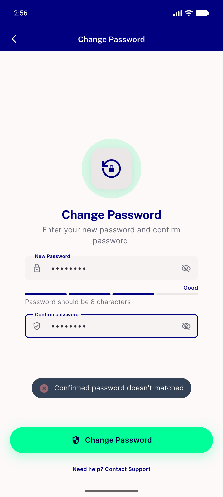</a> ac8 mismatch snackbar</td>
<td align="center" width="33%"><a href="ac8-vendor-reg-no-meter.png">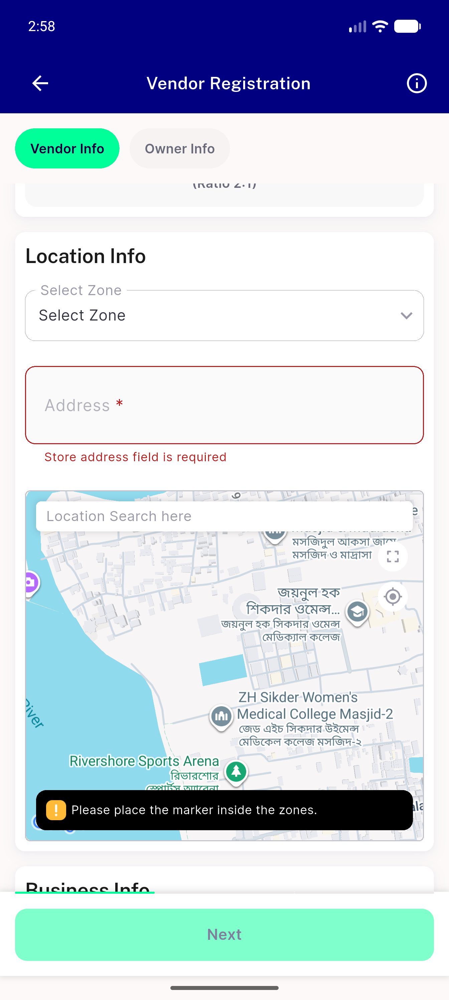</a> ac8 vendor reg no meter</td>
</tr>
</table>

### Other artifacts
- [`progress.md`](progress.md)

---
*From `nears/docs/qa-evidence/NEARS-418/` · public-repo scrub policy (no live secrets; verified clean).*
