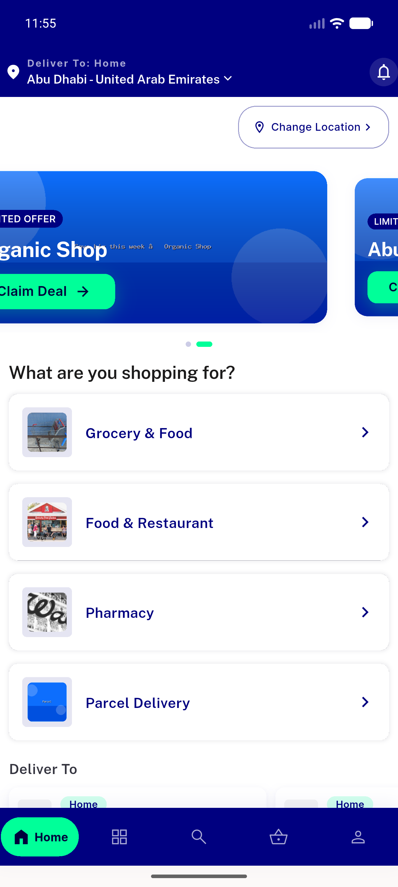
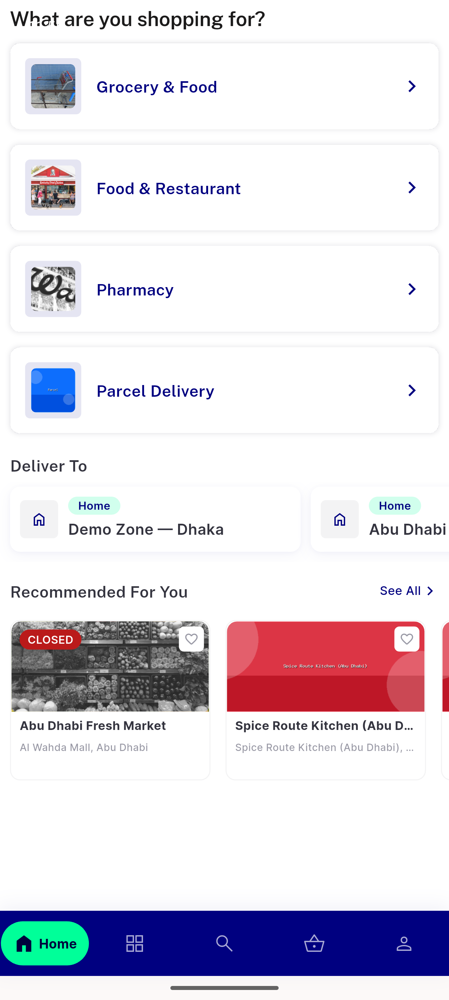
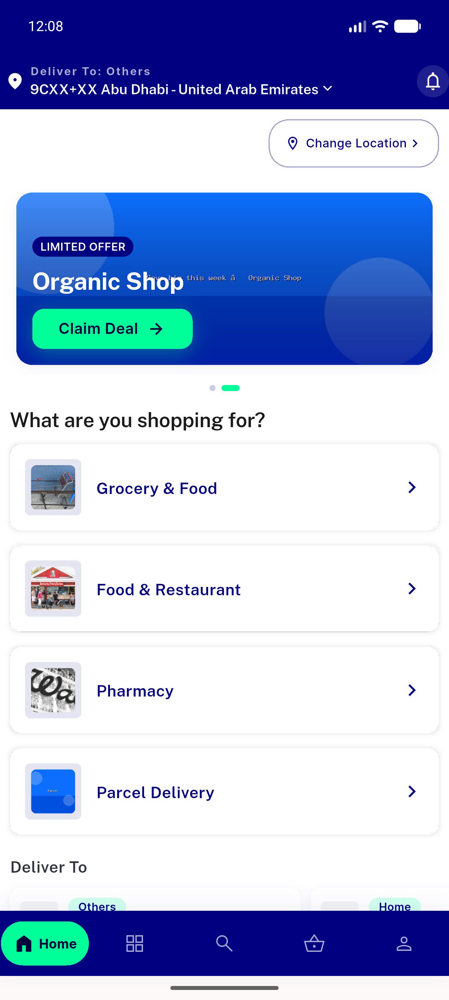
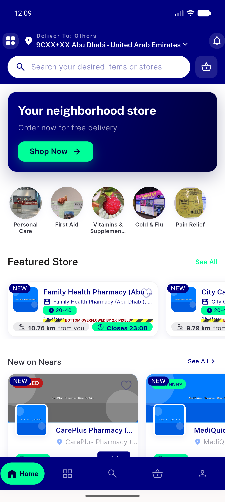
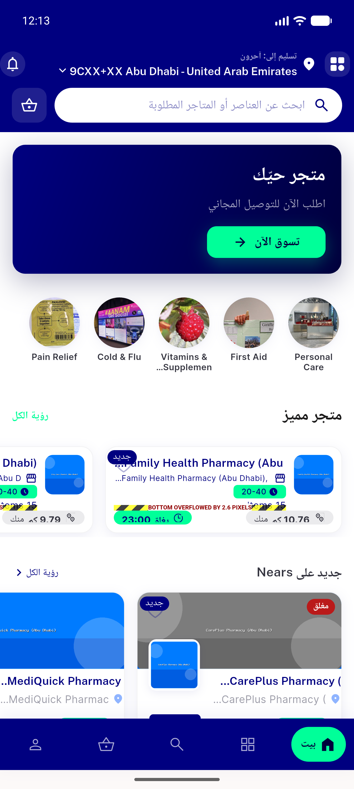
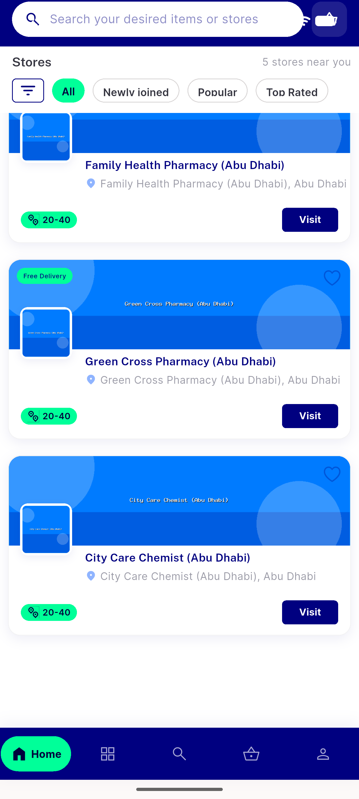

# QA Evidence — NEARS-419

**PASS — NEARS-419 horizontal store-card overflow resolved (name truncates single-line, light/dark/RTL); pre-existing 2.6px vertical overflow on pharmacy Featured rail filed as regression**

**9 screenshot(s).** Click any thumbnail for full resolution.

<table>
<tr>
<td align="center" width="33%"> home grocery top</td>
<td align="center" width="33%"> home grocery rails</td>
<td align="center" width="33%"> pharmacy rails en light</td>
</tr>
<tr>
<td align="center" width="33%"> pharmacy featured newonnears</td>
<td align="center" width="33%"> dark mode home</td>
<td align="center" width="33%"> dark pharmacy rails</td>
</tr>
<tr>
<td align="center" width="33%"> rtl arabic pharmacy rails</td>
<td align="center" width="33%"> regression newonnears storecard distance</td>
<td align="center" width="33%"> regression recommended storecard distance</td>
</tr>
</table>

### Other artifacts
- [`progress.md`](progress.md)

---
*From `nears/docs/qa-evidence/NEARS-419/` · public-repo scrub policy (no live secrets; verified clean).*
