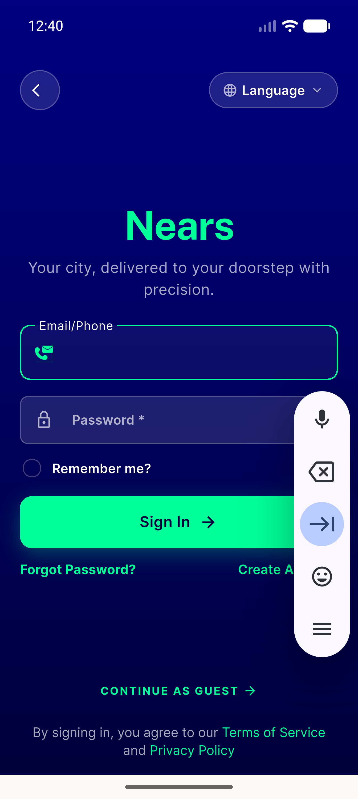
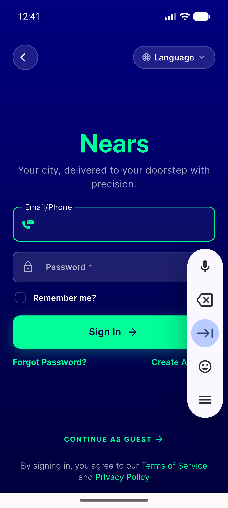
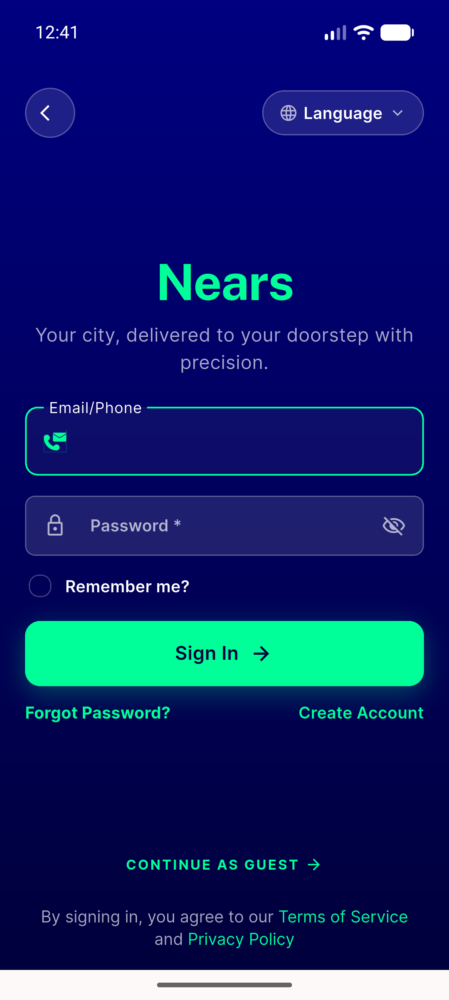
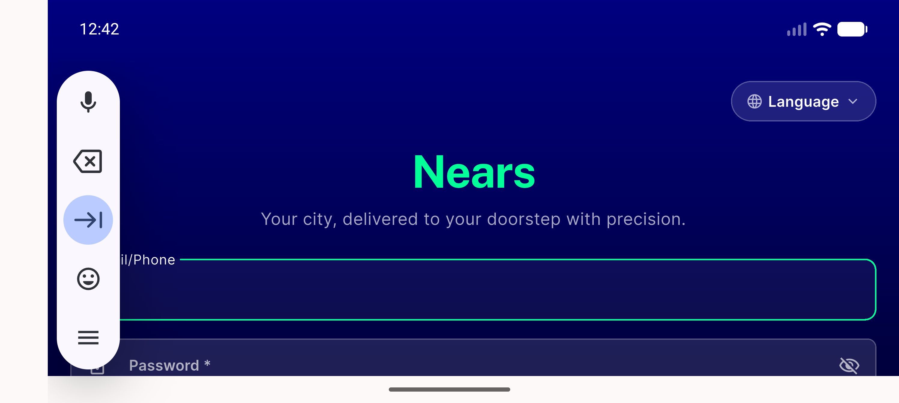
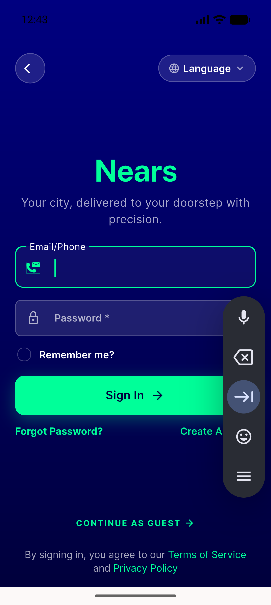
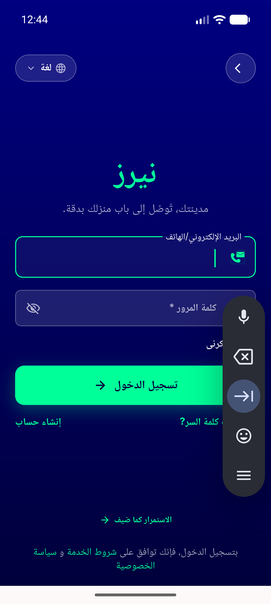
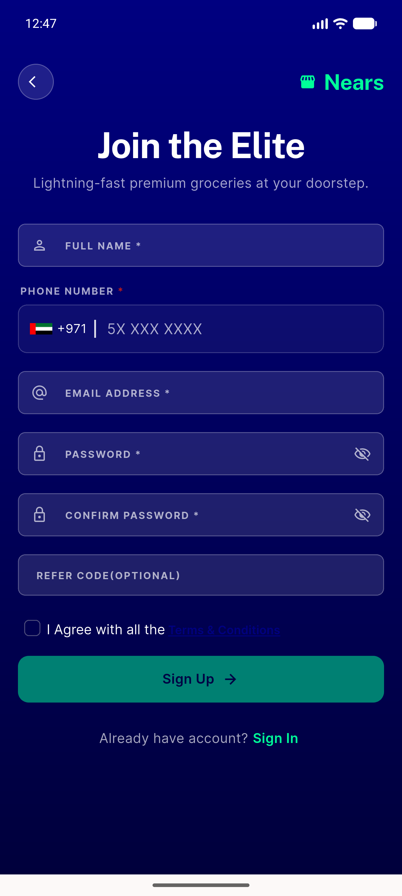
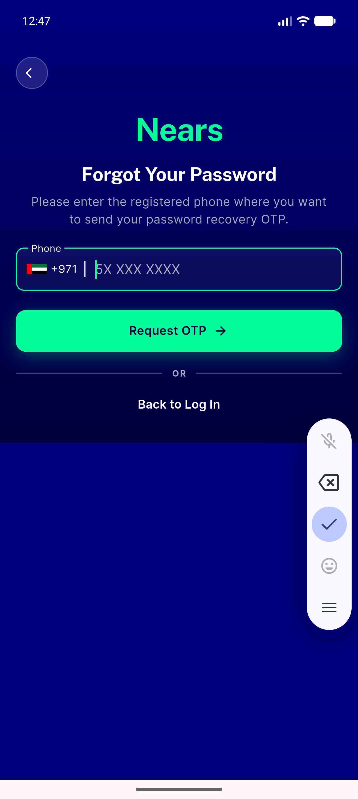

# QA Evidence — NEARS-420

**PASS — sign-in hero no keyboard overflow (Flexible/loose); 6 ACs live + 11/11 tests; pre-existing banner_view overflow flagged**

**11 screenshot(s).** Click any thumbnail for full resolution.

<table>
<tr>
<td align="center" width="33%"> signin closed en light</td>
<td align="center" width="33%"> signin keyboard open en light</td>
<td align="center" width="33%"> signin keyboard open scrolled</td>
</tr>
<tr>
<td align="center" width="33%"> signin keyboard dismissed recenter</td>
<td align="center" width="33%"> signin landscape keyboard open</td>
<td align="center" width="33%"> signin dark closed</td>
</tr>
<tr>
<td align="center" width="33%"> signin dark keyboard open</td>
<td align="center" width="33%"> signin rtl arabic dark closed</td>
<td align="center" width="33%"> signin rtl arabic keyboard open</td>
</tr>
<tr>
<td align="center" width="33%"> regression signup</td>
<td align="center" width="33%"> regression forgetpass</td>
</tr>
</table>

### Other artifacts
- [`progress.md`](progress.md)

---
*From `nears/docs/qa-evidence/NEARS-420/` · public-repo scrub policy (no live secrets; verified clean).*
