# QA Evidence — NEARS-421

**PASS — closed-store schedule (Branch A) + block (Branch B), HH:MM, dark, RTL LTR-clock, checkout time-slot required, open-store regression clean**

**11 screenshot(s).** Click any thumbnail for full resolution.

<table>
<tr>
<td align="center" width="33%"><a href="01-branchA-detail-schedule-banner.png">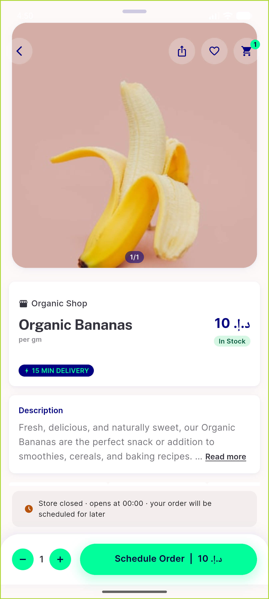</a> branchA detail schedule banner</td>
<td align="center" width="33%"><a href="02-branchA-bottomsheet-schedule-banner.png">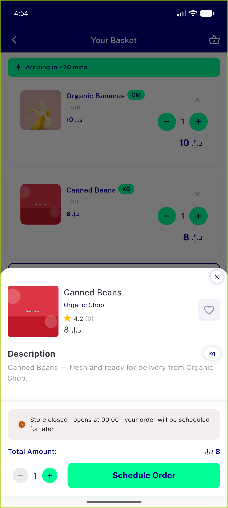</a> branchA bottomsheet schedule banner</td>
<td align="center" width="33%"><a href="03-branchA-checkout-preference-time.png">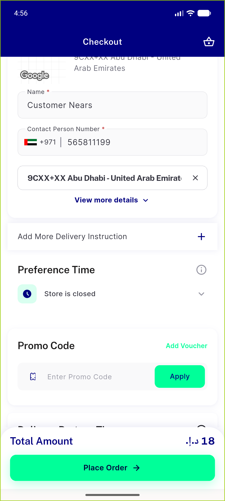</a> branchA checkout preference time</td>
</tr>
<tr>
<td align="center" width="33%"><a href="04-branchA-timeslot-picker.png">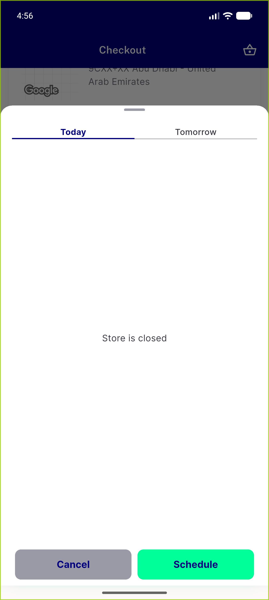</a> branchA timeslot picker</td>
<td align="center" width="33%"><a href="05-branchA-checkout-placeorder-blocked.png">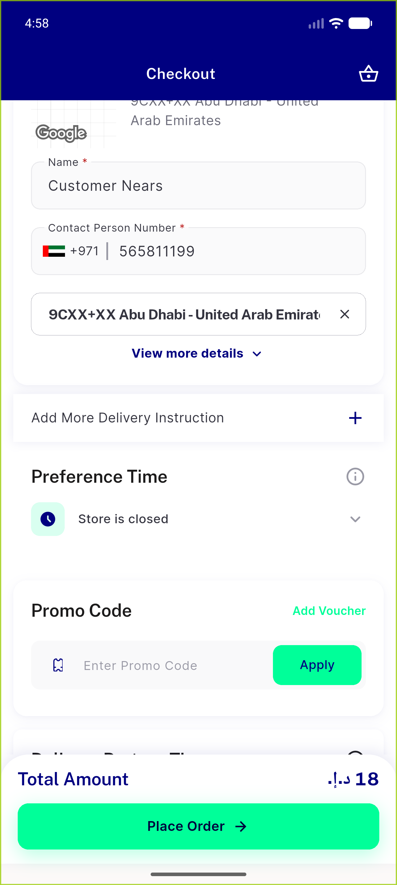</a> branchA checkout placeorder blocked</td>
<td align="center" width="33%"><a href="06-branchB-detail-blocked-banner.png">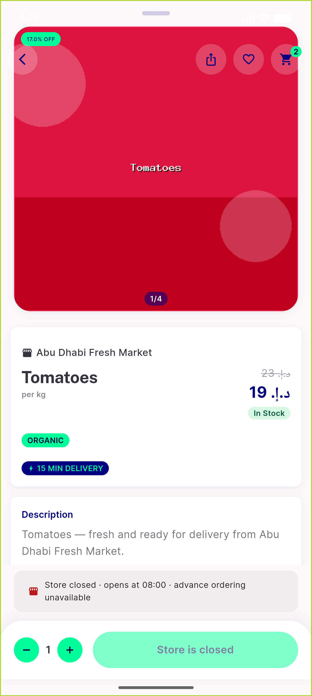</a> branchB detail blocked banner</td>
</tr>
<tr>
<td align="center" width="33%"><a href="07-dark-settings.png">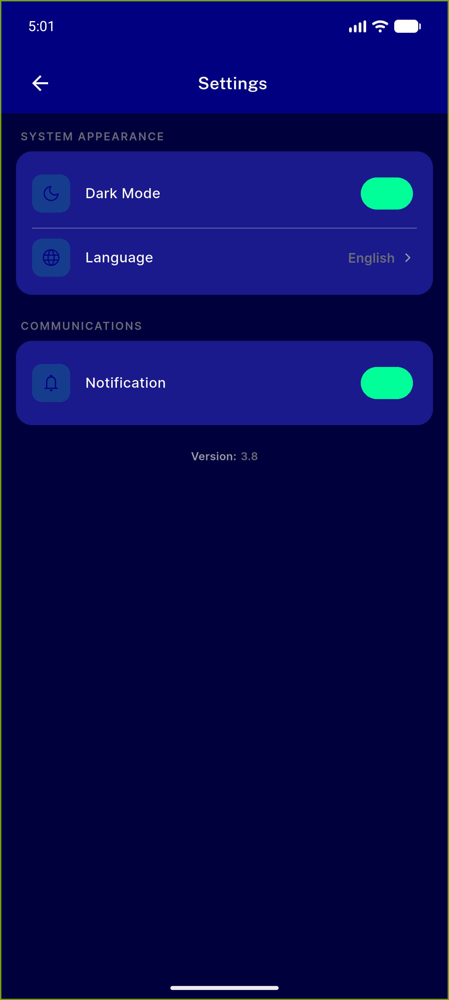</a> dark settings</td>
<td align="center" width="33%"><a href="08-branchB-detail-DARK.png">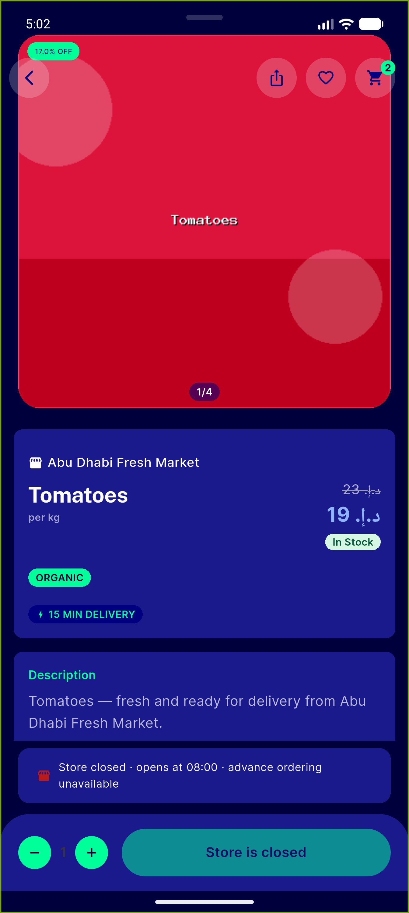</a> branchB detail DARK</td>
<td align="center" width="33%"><a href="09-branchB-detail-ARABIC-rtl-clock.png">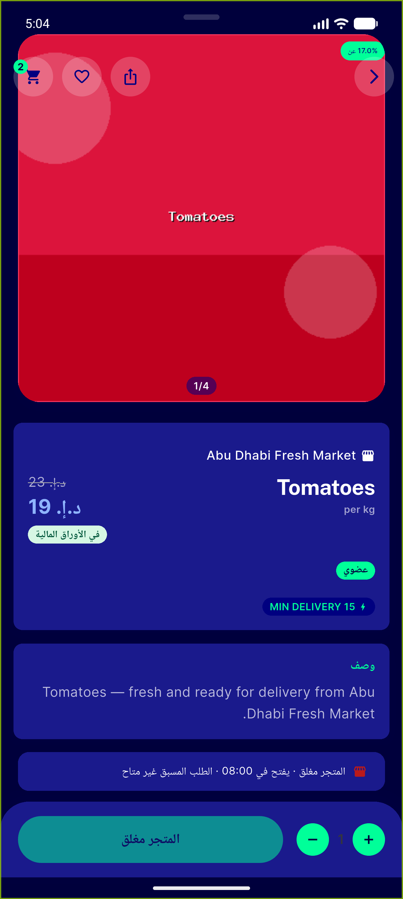</a> branchB detail ARABIC rtl clock</td>
</tr>
<tr>
<td align="center" width="33%"><a href="10-restored-en-light-settings.png">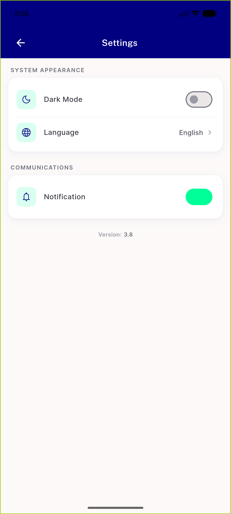</a> restored en light settings</td>
<td align="center" width="33%"><a href="11-openstore-no-banner.png">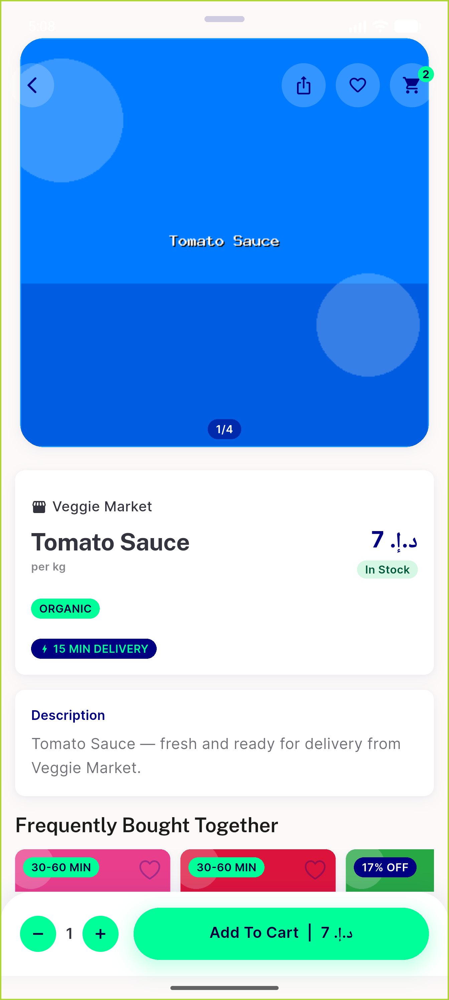</a> openstore no banner</td>
</tr>
</table>

### Other artifacts
- [`progress.md`](progress.md)

---
*From `nears/docs/qa-evidence/NEARS-421/` · public-repo scrub policy (no live secrets; verified clean).*
