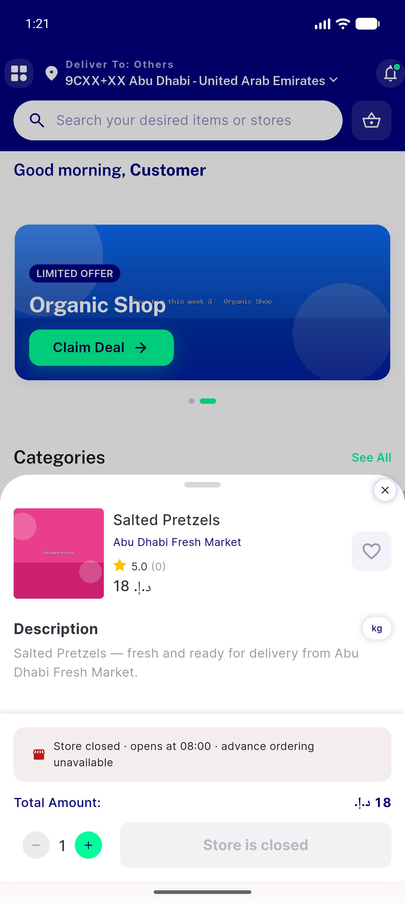
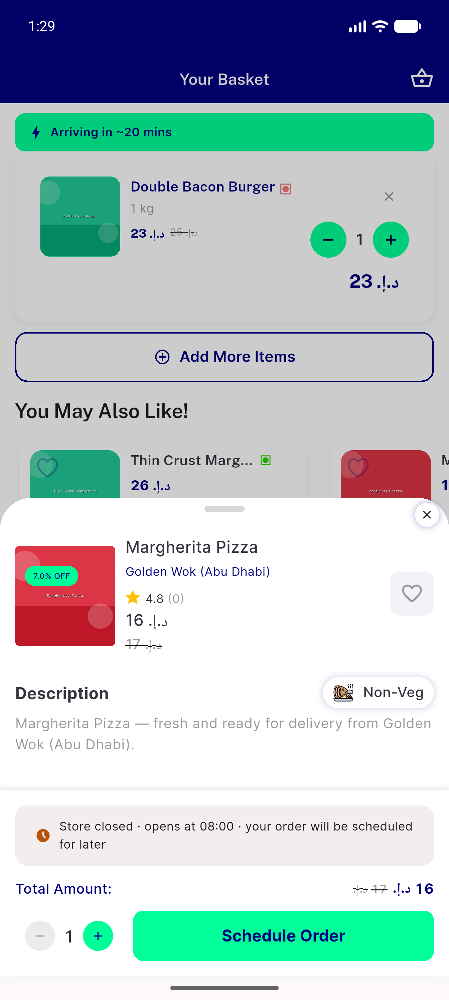
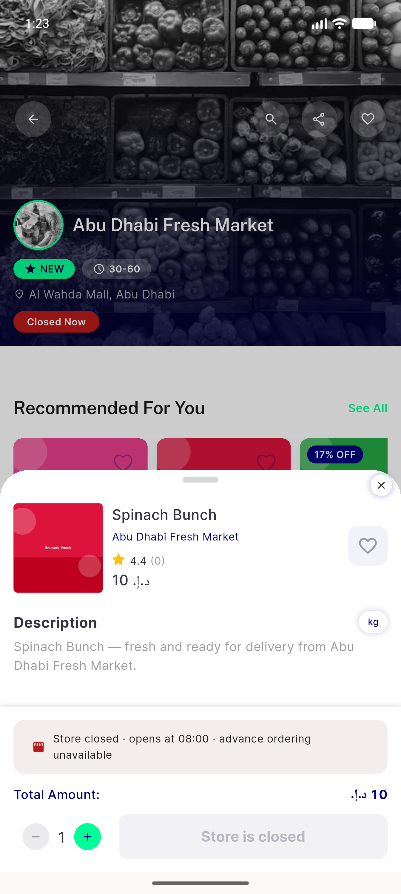
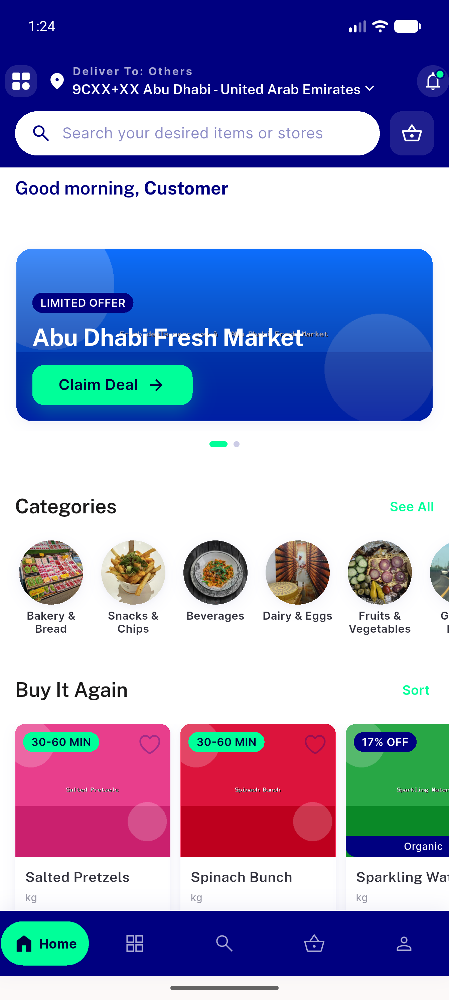
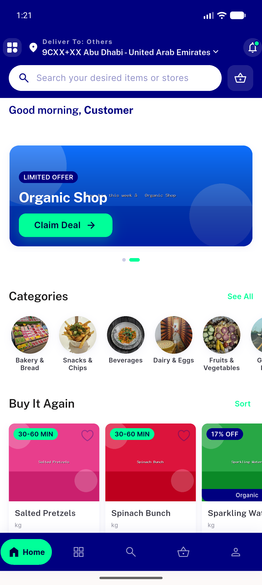
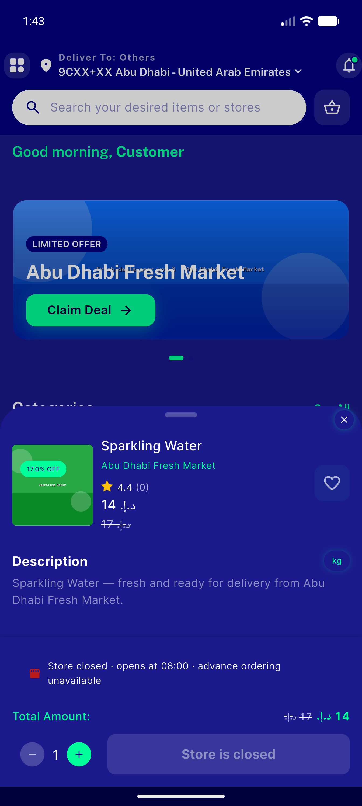
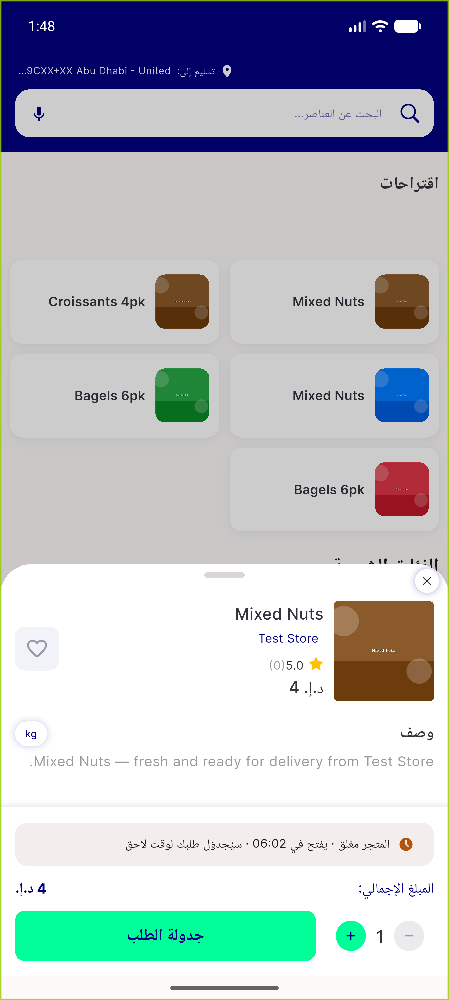

# QA Evidence — NEARS-422

**FAIL — item-detail modal sheet: AC1/2/3/6/7/8/9 PASS; AC4 (store-name->store-profile) + AC5 (deep-link sheet) FAIL**

**16 screenshot(s).** Click any thumbnail for full resolution.

<table>
<tr>
<td align="center" width="33%"> ac1 ac2 nonfood sheet light</td>
<td align="center" width="33%"> ac3 cart edit modal</td>
<td align="center" width="33%"> ac3 food sheet</td>
</tr>
<tr>
<td align="center" width="33%"> ac4 instore sheet</td>
<td align="center" width="33%"> ac4 notonstore landed</td>
<td align="center" width="33%"> ac4 store name tap landed</td>
</tr>
<tr>
<td align="center" width="33%"> ac5 deeplink final</td>
<td align="center" width="33%"> ac5 deeplink store behind sheet</td>
<td align="center" width="33%"> ac6 item not found snackbar</td>
</tr>
<tr>
<td align="center" width="33%"> ac7 sheet dark</td>
<td align="center" width="33%"> ac8 sheet arabic rtl</td>
<td align="center" width="33%"> ac9 initstate shimmer safe</td>
</tr>
<tr>
<td align="center" width="33%"> bug deeplink no sheet</td>
<td align="center" width="33%"> bug store name tap no store profile</td>
<td align="center" width="33%"> reg direct addtocart</td>
</tr>
<tr>
<td align="center" width="33%"> reg search item sheet</td>
</tr>
</table>

### Other artifacts
- [`bug-deeplink-no-sheet.log`](bug-deeplink-no-sheet.log)
- [`bug-store-name-tap-no-store-profile.log`](bug-store-name-tap-no-store-profile.log)
- [`progress.md`](progress.md)

---
*From `nears/docs/qa-evidence/NEARS-422/` · public-repo scrub policy (no live secrets; verified clean).*
