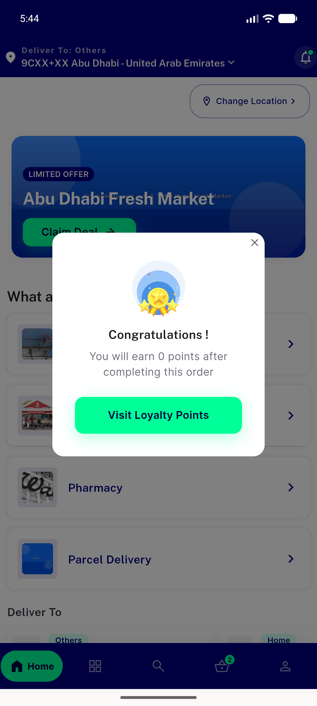
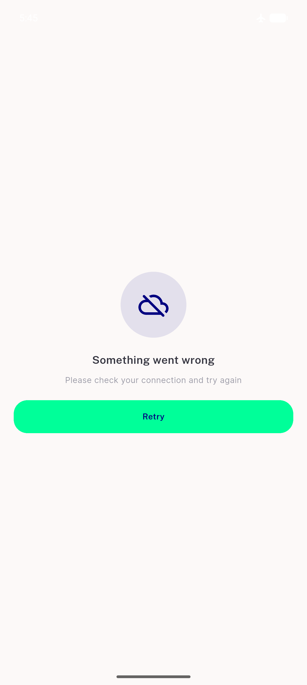
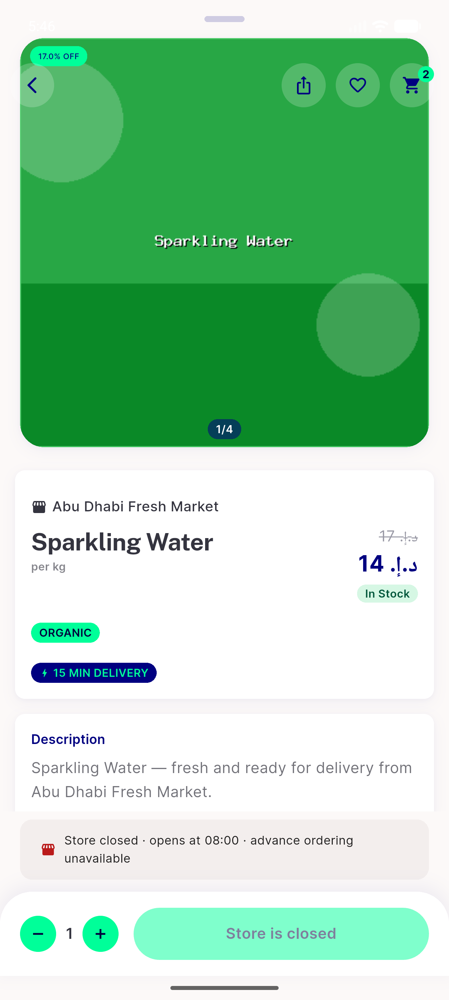
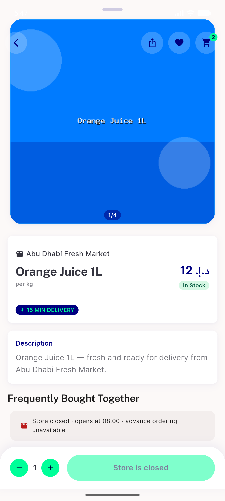
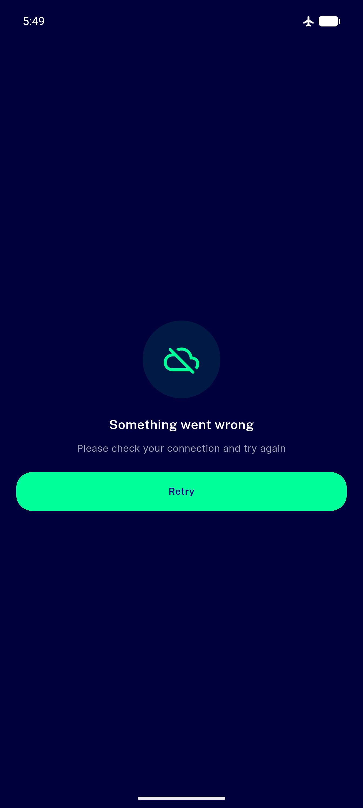
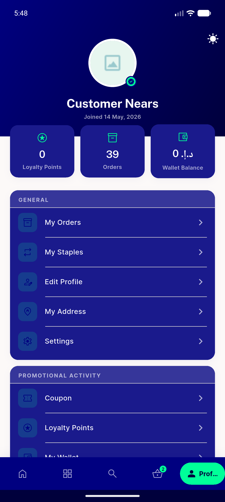
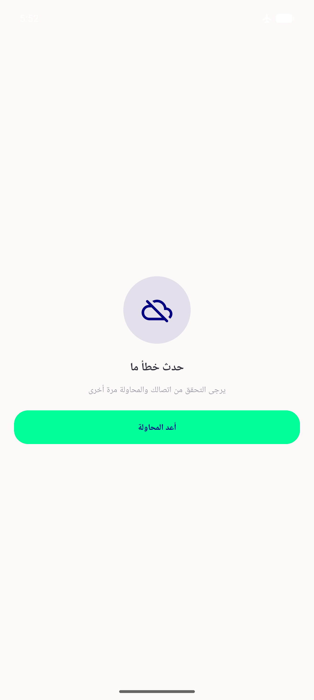
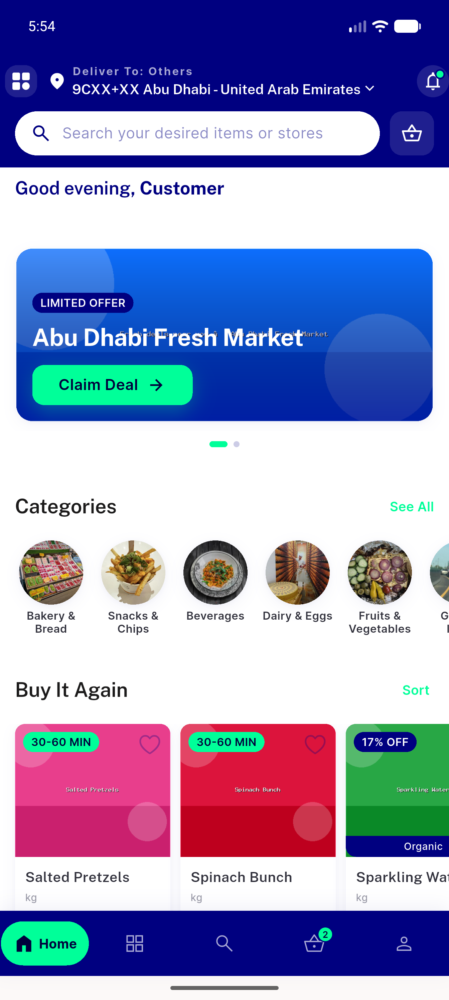

# QA Evidence — NEARS-423

**PASS — item-detail offline error+retry state verified live (AC1-7), dark+RTL legible, recovery works, 12/12 tests, 0 runtime errors**

**10 screenshot(s).** Click any thumbnail for full resolution.

<table>
<tr>
<td align="center" width="33%"> bootstate</td>
<td align="center" width="33%"> error state mobile</td>
<td align="center" width="33%"> 02a retry transition</td>
</tr>
<tr>
<td align="center" width="33%"> 02b retry offline reerror</td>
<td align="center" width="33%"> recovered content</td>
<td align="center" width="33%"> happy path</td>
</tr>
<tr>
<td align="center" width="33%"> error dark</td>
<td align="center" width="33%"> 05a dark profile</td>
<td align="center" width="33%"> error rtl arabic</td>
</tr>
<tr>
<td align="center" width="33%"> restored en light</td>
</tr>
</table>

### Other artifacts
- [`progress.md`](progress.md)

---
*From `nears/docs/qa-evidence/NEARS-423/` · public-repo scrub policy (no live secrets; verified clean).*
