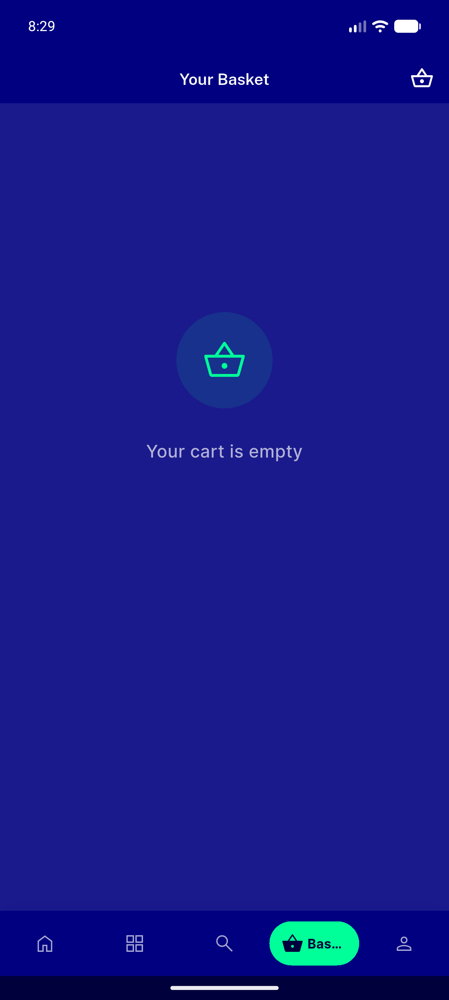
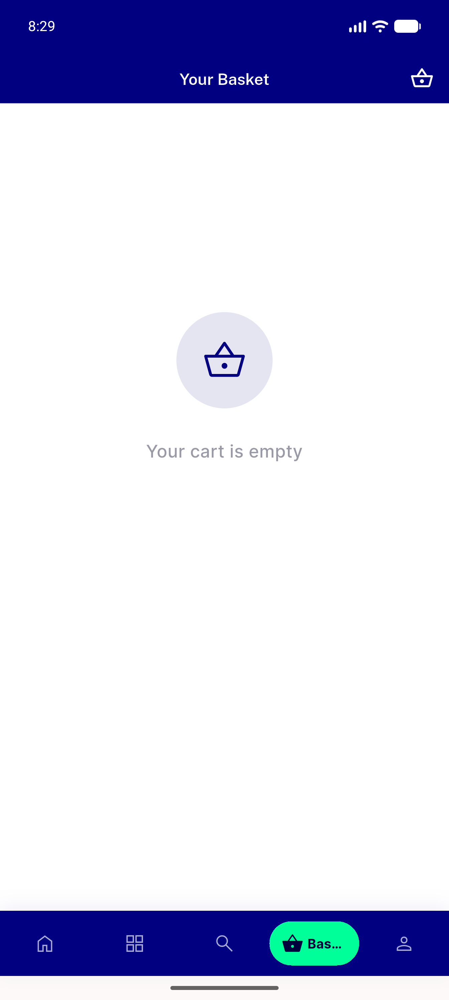
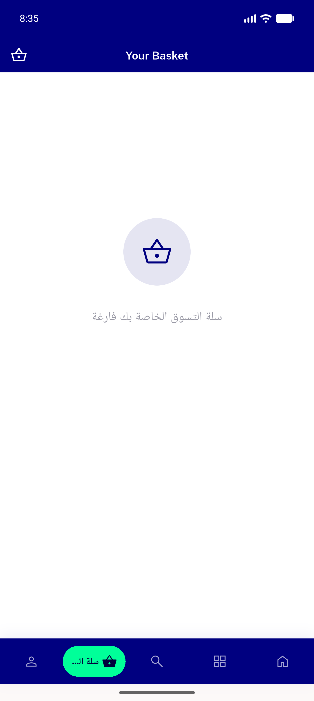
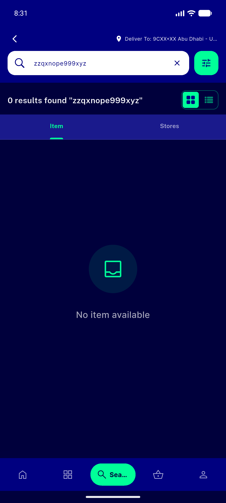
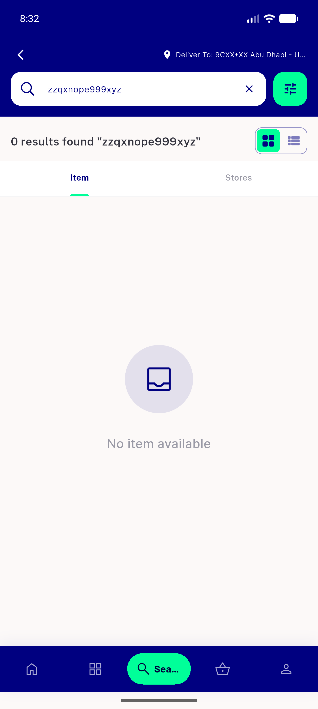
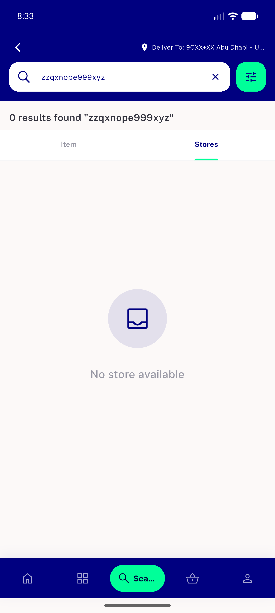

# QA Evidence — NEARS-425

**PASS — branded NoDataScreen disc on basket/search/stores, light+dark+RTL, no clip-art, no question-mark glyph**

**6 screenshot(s).** Click any thumbnail for full resolution.

<table>
<tr>
<td align="center" width="33%"> empty basket dark</td>
<td align="center" width="33%"> empty basket light</td>
<td align="center" width="33%"> empty basket rtl</td>
</tr>
<tr>
<td align="center" width="33%"> empty search dark</td>
<td align="center" width="33%"> empty search light</td>
<td align="center" width="33%"> empty stores light</td>
</tr>
</table>

### Other artifacts
- [`progress.md`](progress.md)

---
*From `nears/docs/qa-evidence/NEARS-425/` · public-repo scrub policy (no live secrets; verified clean).*
