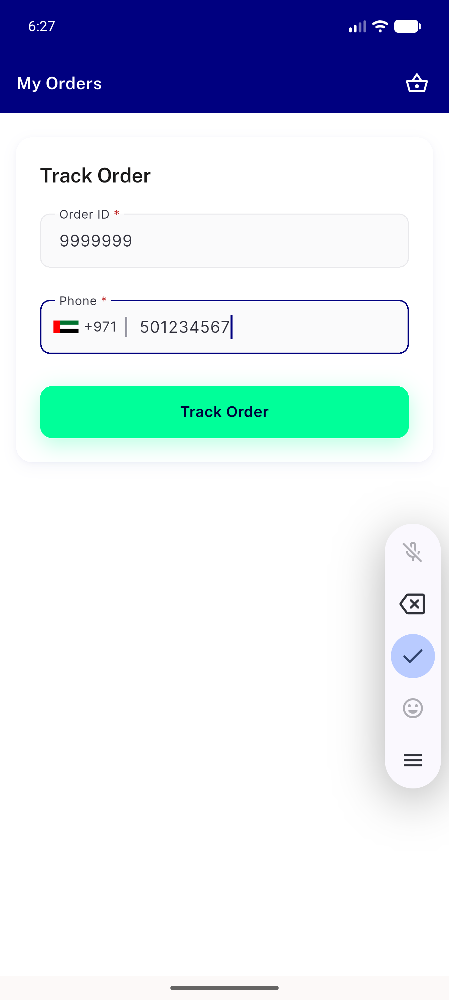
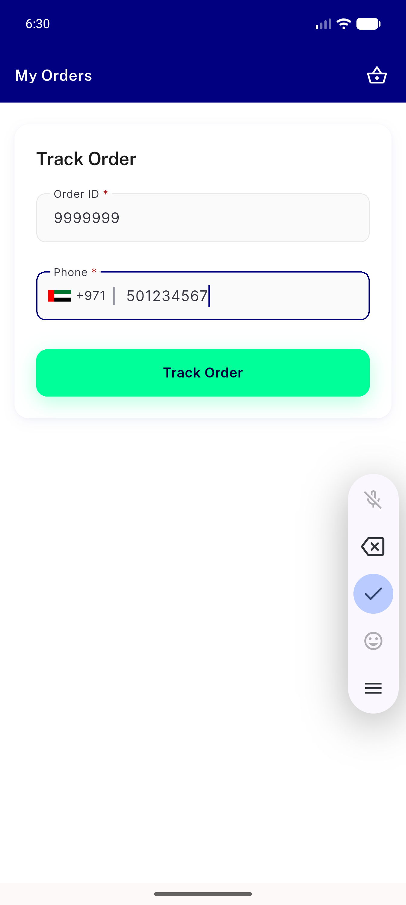
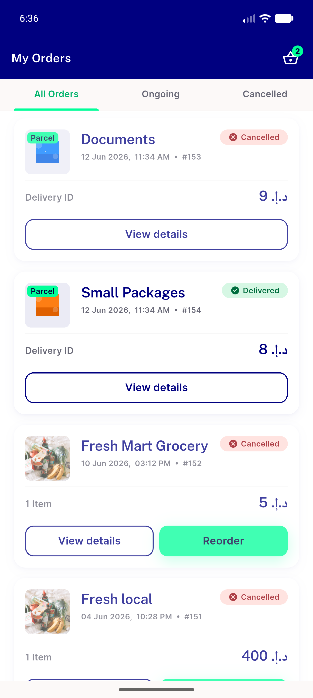
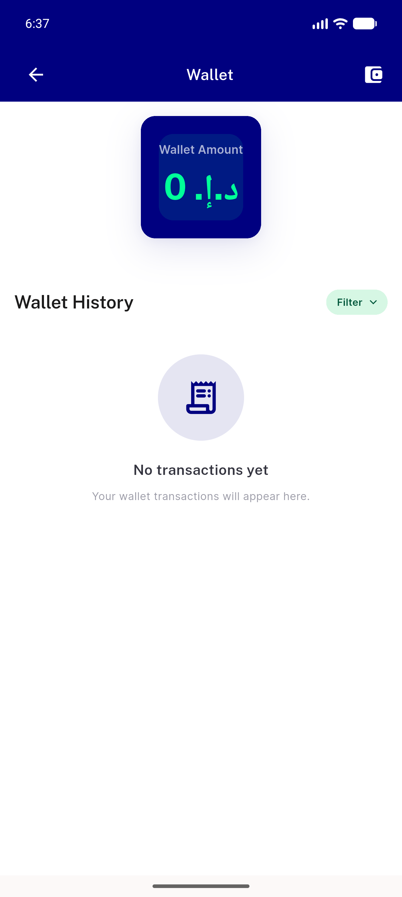
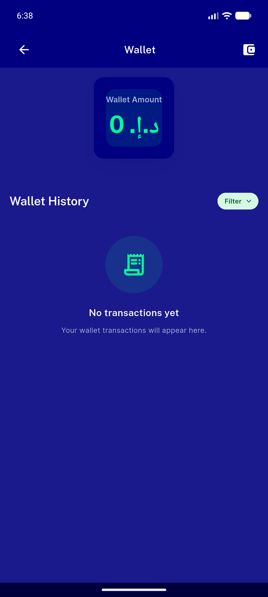
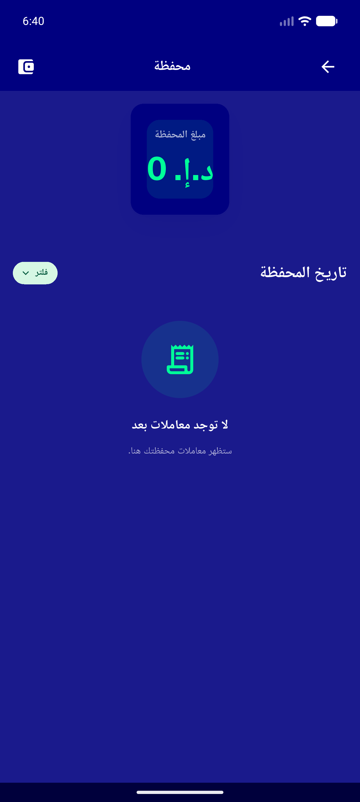

# QA Evidence — NEARS-427

**PASS — guest track empty-state fix: additive isGuestTrackLoaded flag, screen 3-way render verified (widget tests render the production empty/found/in-flight branches GREEN), NearsEmptyState dark+RTL demonstrated live, authed tracking flag-leak ruled out by code isolation, analyze clean**

**6 screenshot(s).** Click any thumbnail for full resolution.

<table>
<tr>
<td align="center" width="33%"> guest track input filled</td>
<td align="center" width="33%"> guest input notfound live</td>
<td align="center" width="33%"> authed my orders regression</td>
</tr>
<tr>
<td align="center" width="33%"> 06a nearsemptystate light</td>
<td align="center" width="33%"> 06b nearsemptystate dark</td>
<td align="center" width="33%"> nearsemptystate rtl arabic</td>
</tr>
</table>

### Other artifacts
- [`progress.md`](progress.md)

---
*From `nears/docs/qa-evidence/NEARS-427/` · public-repo scrub policy (no live secrets; verified clean).*
