# QA Evidence — NEARS-429

**PASS — UserApp NearsInput dark-mode contrast fix (fix-cycle 1): typed text white, hint/label dim-white, icons sky, focused label+ring MINT on navy; light + glass unchanged. emulator-5554, branch feat/NEARS-429-input-dark-contrast @ a820764c**

**17 screenshot(s).** Click any thumbnail for full resolution.

<table>
<tr>
<td align="center" width="33%"><a href="01-settings-light.png">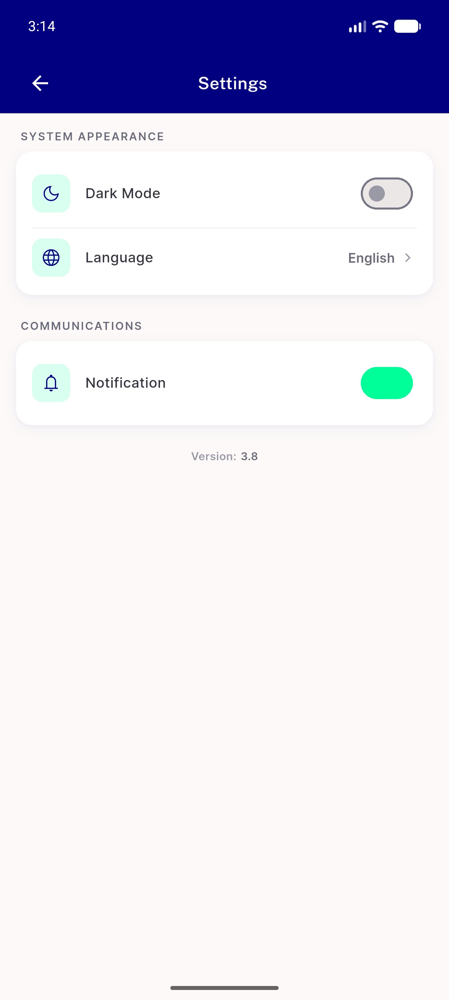</a> settings light</td>
<td align="center" width="33%"><a href="02-settings-dark.png">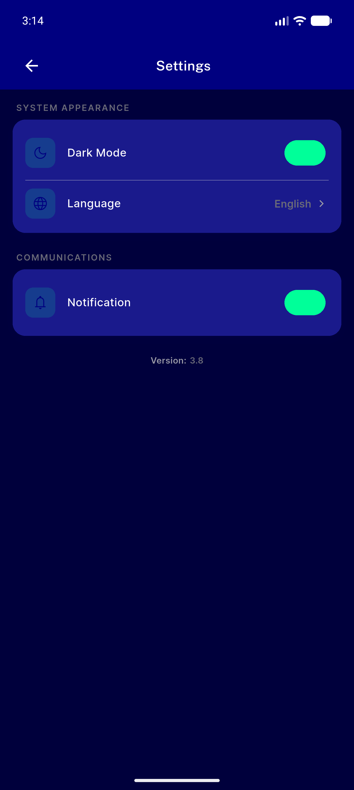</a> settings dark</td>
<td align="center" width="33%"><a href="04-home-dark.png">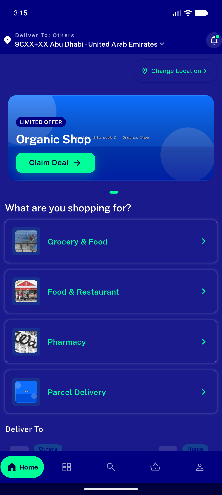</a> home dark</td>
</tr>
<tr>
<td align="center" width="33%"><a href="05-editprofile-dark-resting.png">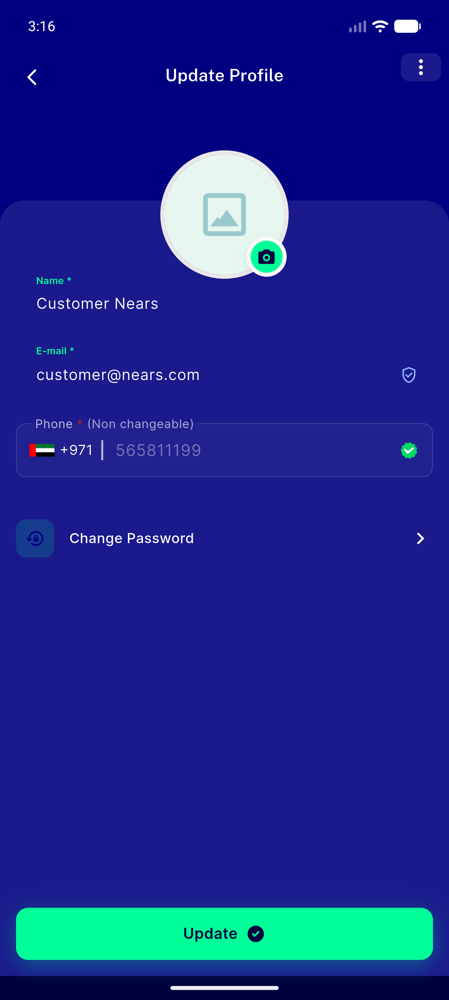</a> editprofile dark resting</td>
<td align="center" width="33%"><a href="06-editprofile-dark-name-focused.png">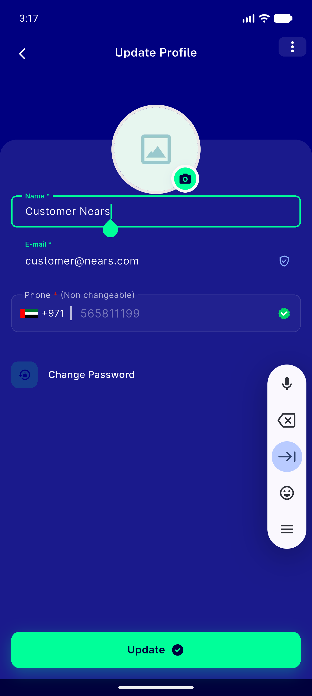</a> editprofile dark name focused</td>
<td align="center" width="33%"><a href="07-editprofile-dark-typed.png">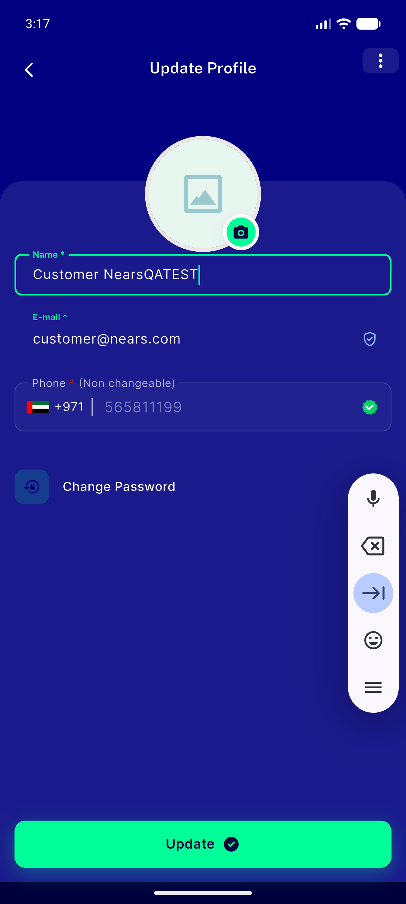</a> editprofile dark typed</td>
</tr>
<tr>
<td align="center" width="33%"><a href="08-login-glass-dark-empty.png">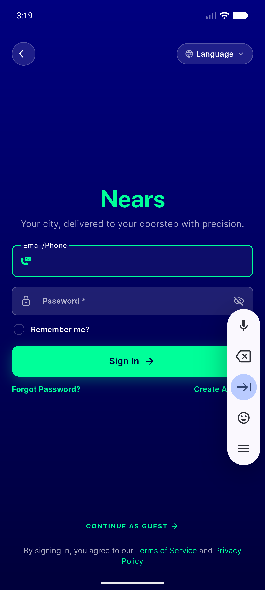</a> login glass dark empty</td>
<td align="center" width="33%"> login glass dark typed</td>
<td align="center" width="33%"><a href="10-login-glass-dark-error.png">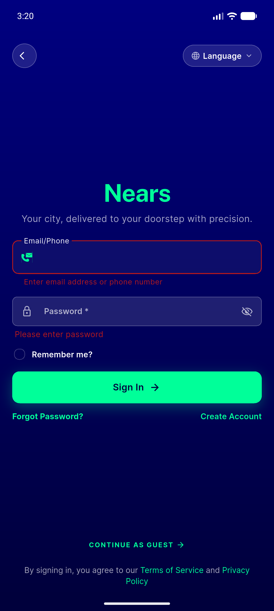</a> login glass dark error</td>
</tr>
<tr>
<td align="center" width="33%"><a href="11-login-glass-dark-pwd-obscured.png">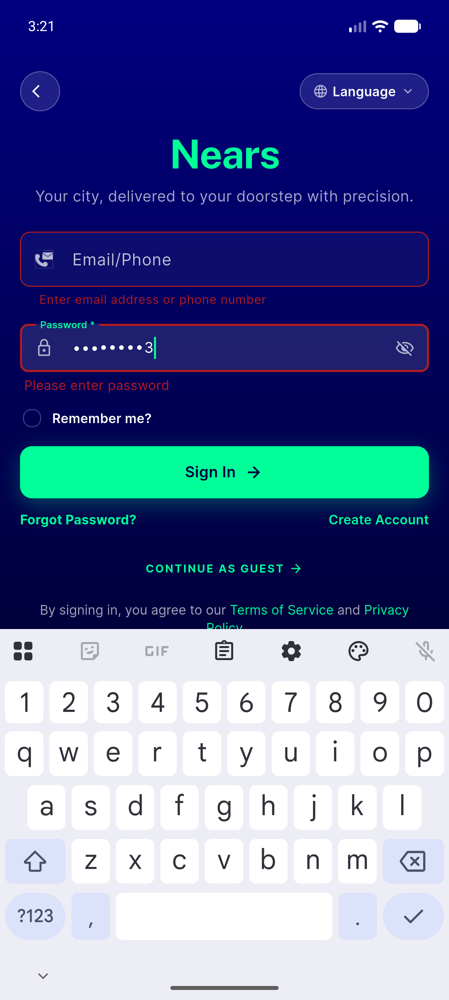</a> login glass dark pwd obscured</td>
<td align="center" width="33%"><a href="12-login-glass-dark-pwd-shown.png">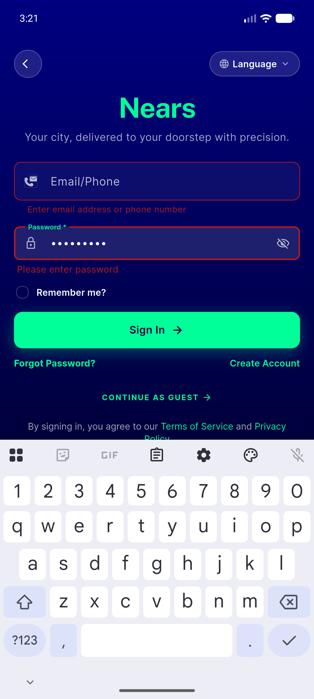</a> login glass dark pwd shown</td>
<td align="center" width="33%"><a href="13-settings-light-after.png">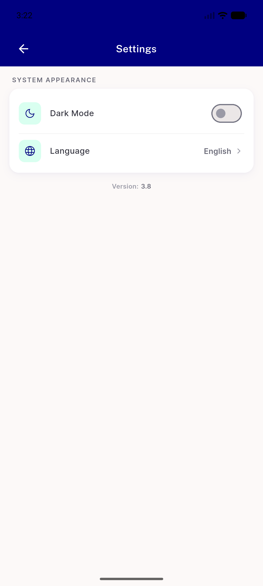</a> settings light after</td>
</tr>
<tr>
<td align="center" width="33%"><a href="14-login-glass-light-empty.png">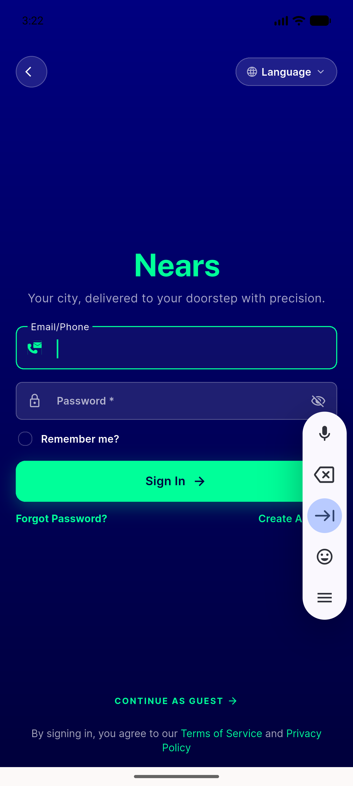</a> login glass light empty</td>
<td align="center" width="33%"><a href="15-editprofile-light-resting.png">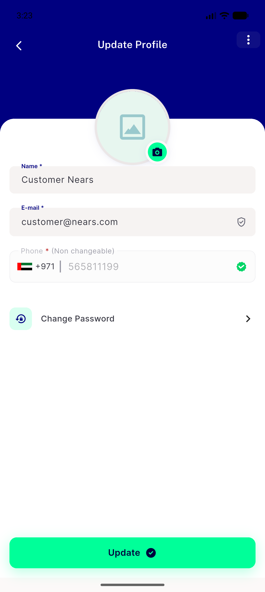</a> editprofile light resting</td>
<td align="center" width="33%"><a href="16-editprofile-light-name-focused.png">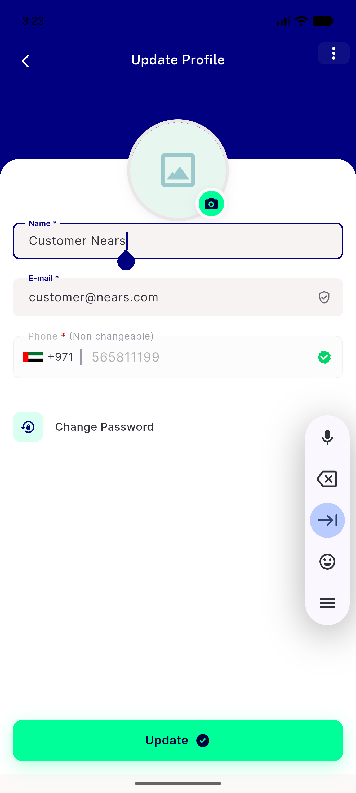</a> editprofile light name focused</td>
</tr>
<tr>
<td align="center" width="33%"><a href="17-addaddress-dark.png">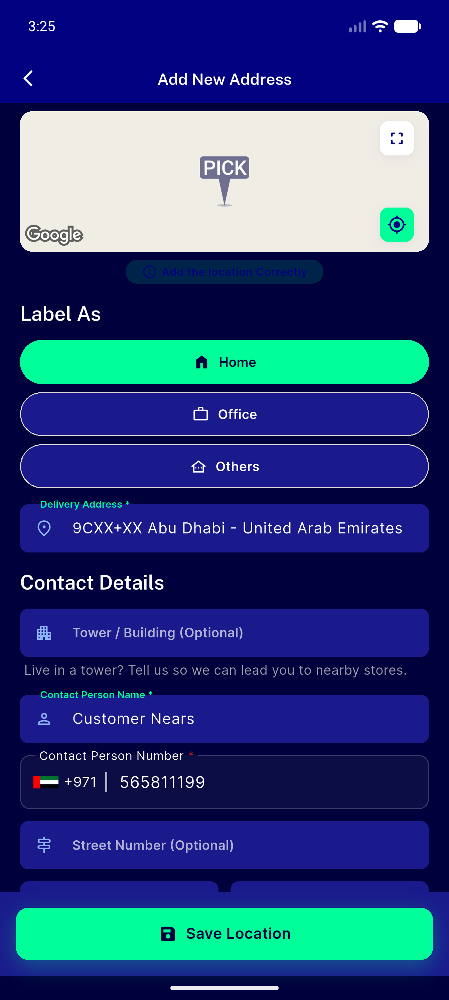</a> addaddress dark</td>
<td align="center" width="33%"><a href="18-addaddress-dark-focused.png">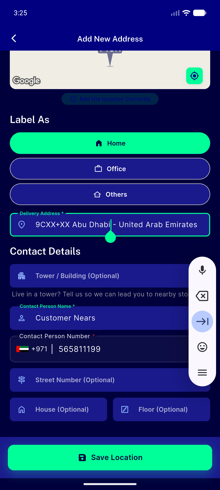</a> addaddress dark focused</td>
</tr>
</table>

### Other artifacts
- [`progress.md`](progress.md)

---
*From `nears/docs/qa-evidence/NEARS-429/` · public-repo scrub policy (no live secrets; verified clean).*
