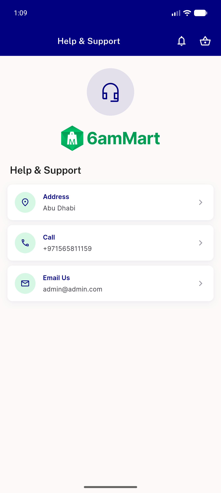
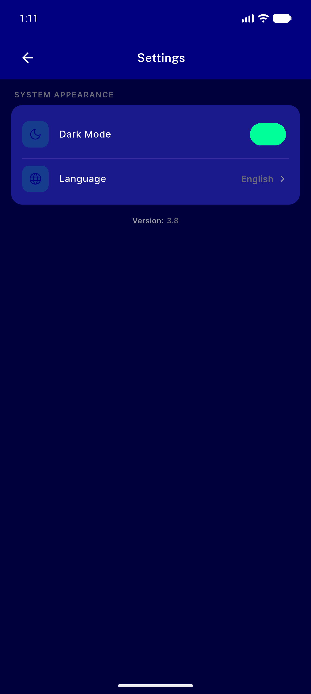
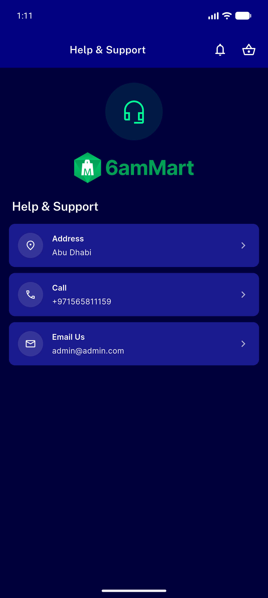
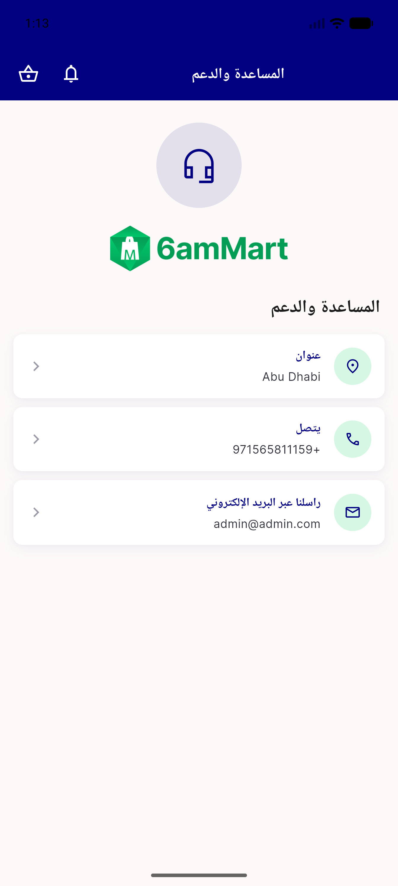
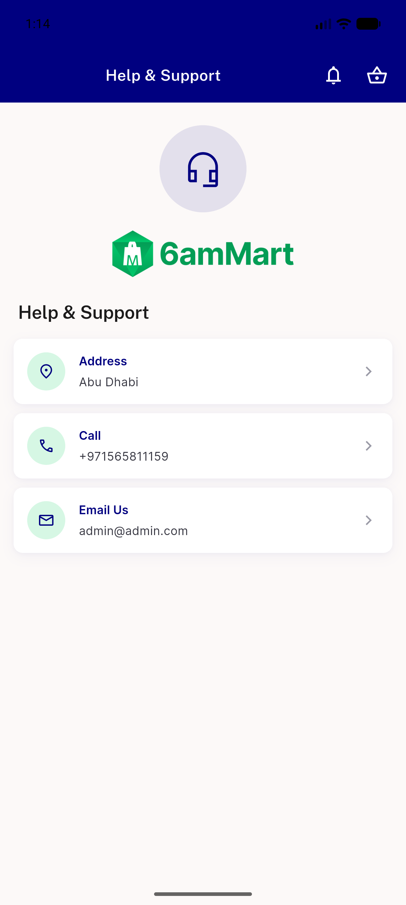
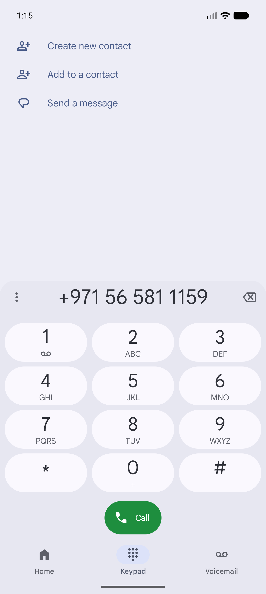
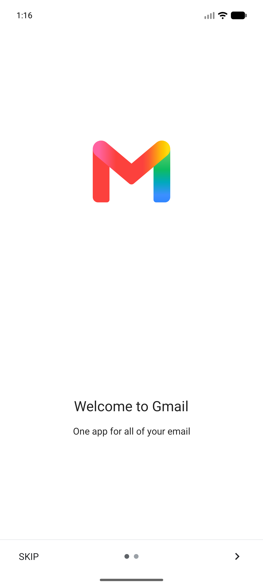

# QA Evidence — NEARS-454

**PASS — NEARS-454 Support hero re-brand: branded DLS disc + headset_mic glyph (navy light / mint dark), no 6amMart SUPPORT art, no help fallback; RTL glyph unmirrored; tel:/mailto: launchers fire; 6 render tests + analyze green**

**7 screenshot(s).** Click any thumbnail for full resolution.

<table>
<tr>
<td align="center" width="33%"> support light</td>
<td align="center" width="33%"> settings dark toggled</td>
<td align="center" width="33%"> support dark</td>
</tr>
<tr>
<td align="center" width="33%"> support rtl arabic</td>
<td align="center" width="33%"> support light restored</td>
<td align="center" width="33%"> call dialer launched</td>
</tr>
<tr>
<td align="center" width="33%"> email gmail launched</td>
</tr>
</table>

### Other artifacts
- [`progress.md`](progress.md)

---
*From `nears/docs/qa-evidence/NEARS-454/` · public-repo scrub policy (no live secrets; verified clean).*
