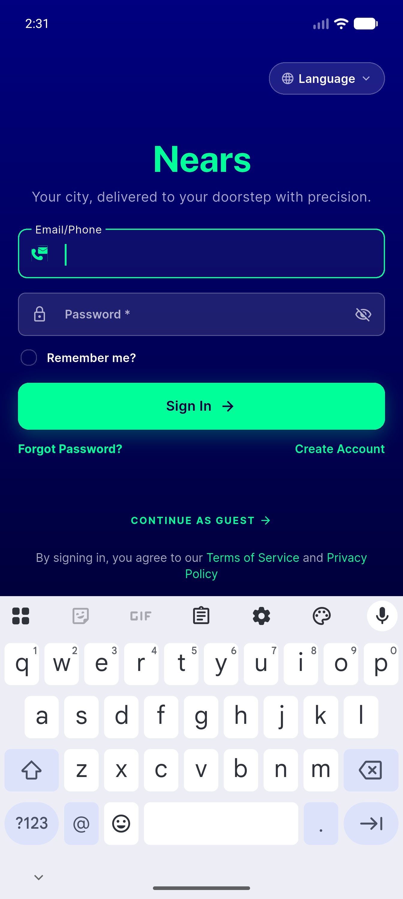
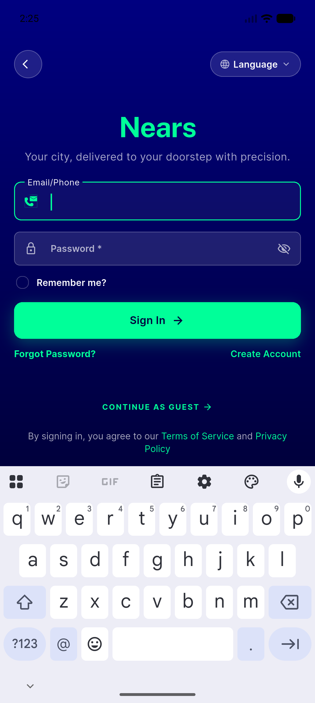
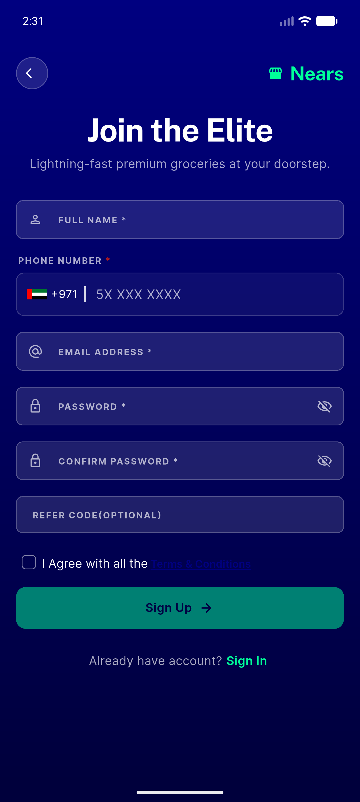
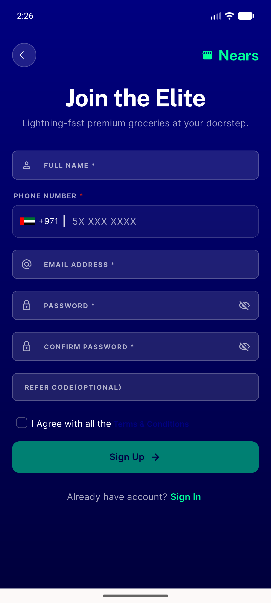
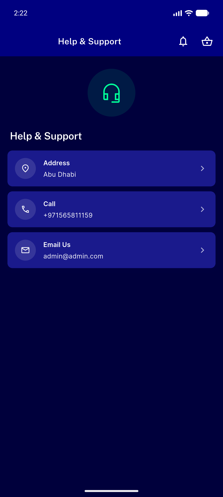
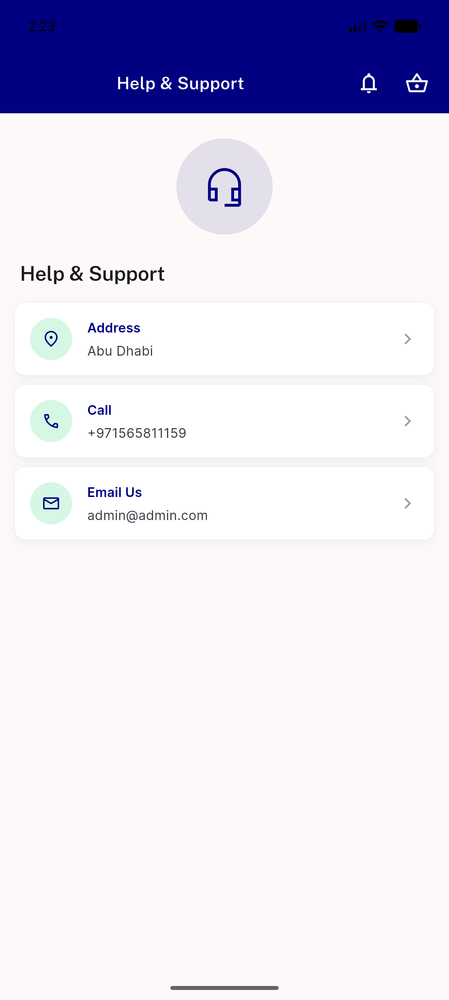

# QA Evidence — NEARS-455

**PASS — UserApp brand-asset sweep: support green wordmark removed (live light+dark), Images.logo=0, dark-aware SVG pairing verified; 4 logo-swap sites are desktop/web-only (backstop)**

**6 screenshot(s).** Click any thumbnail for full resolution.

<table>
<tr>
<td align="center" width="33%"> signin dark</td>
<td align="center" width="33%"> signin light</td>
<td align="center" width="33%"> signup dark</td>
</tr>
<tr>
<td align="center" width="33%"> signup light</td>
<td align="center" width="33%"> support dark</td>
<td align="center" width="33%"> support light</td>
</tr>
</table>

### Other artifacts
- [`progress.md`](progress.md)

---
*From `nears/docs/qa-evidence/NEARS-455/` · public-repo scrub policy (no live secrets; verified clean).*
