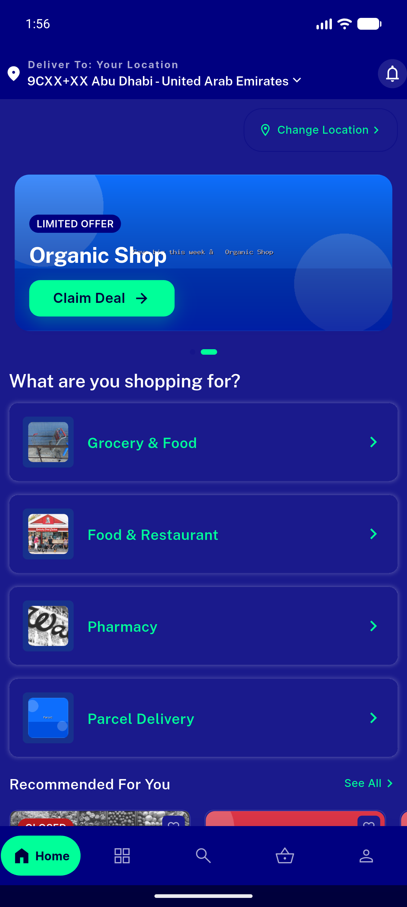
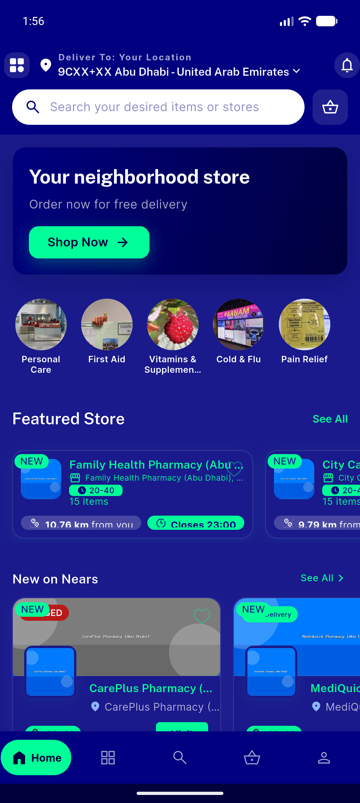
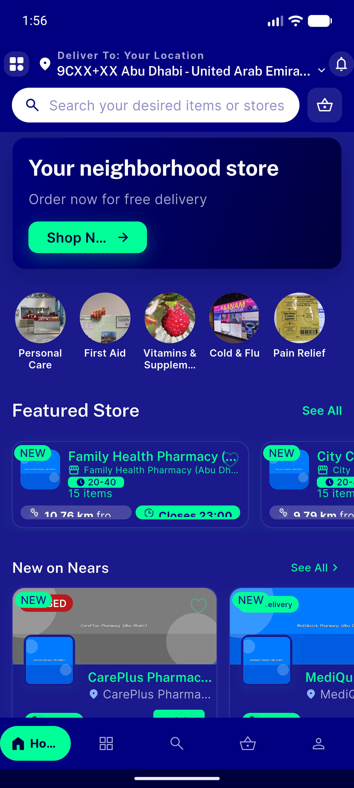
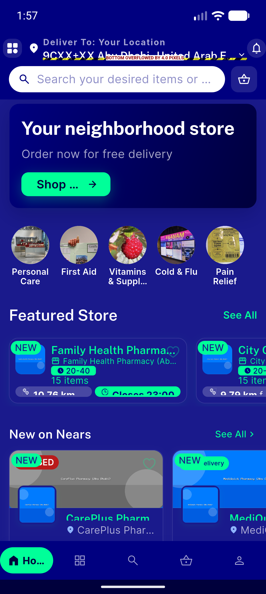
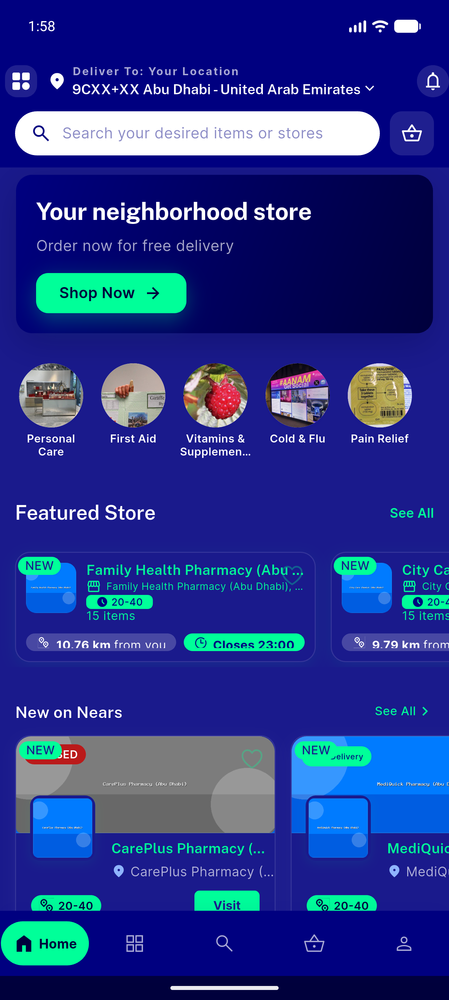
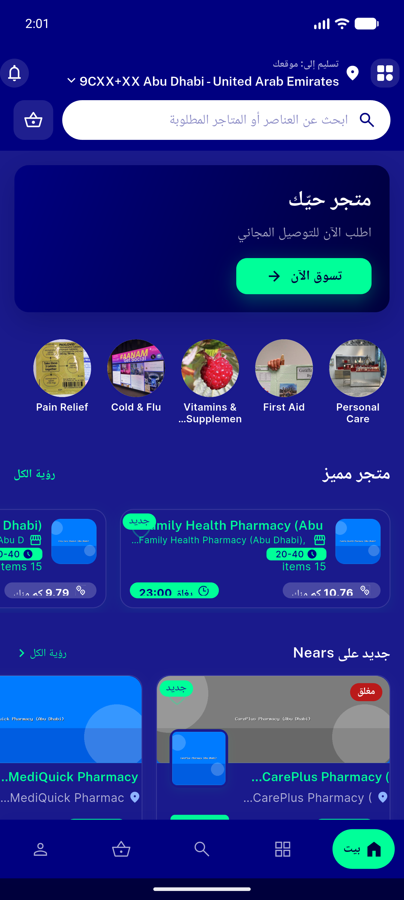
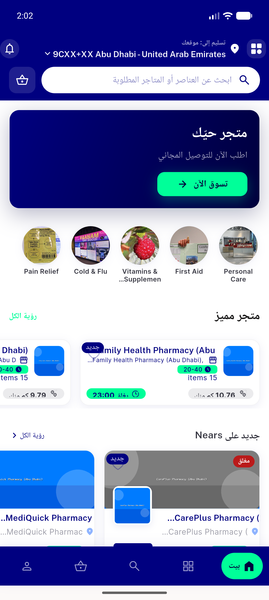
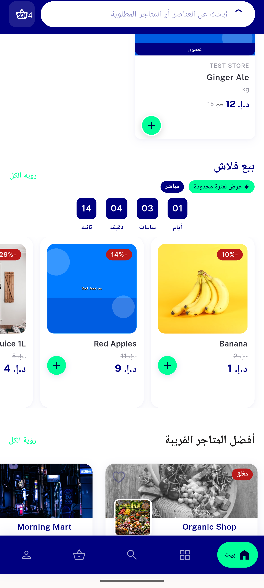

# QA Evidence — NEARS-456

**PASS — pharmacy Featured rail zero overflow @1.0/1.15/1.3; bottom-row + RTL + dark/light verified; 1 pre-existing home-header overflow regression**

**9 screenshot(s).** Click any thumbnail for full resolution.

<table>
<tr>
<td align="center" width="33%"> home zone2 standard rails</td>
<td align="center" width="33%"> pharmacy featured scale 1.0</td>
<td align="center" width="33%"> pharmacy featured scale 1.15</td>
</tr>
<tr>
<td align="center" width="33%"> pharmacy featured scale 1.3</td>
<td align="center" width="33%"> bottomrow distance left status right zone2</td>
<td align="center" width="33%"> pharmacy featured RTL arabic</td>
</tr>
<tr>
<td align="center" width="33%"> pharmacy featured lightmode</td>
<td align="center" width="33%"> standard grocery store card</td>
<td align="center" width="33%"> standard store card full</td>
</tr>
</table>

### Other artifacts
- [`bug-home-deliverto-header-overflow-textscale13.log`](bug-home-deliverto-header-overflow-textscale13.log)
- [`progress.md`](progress.md)

---
*From `nears/docs/qa-evidence/NEARS-456/` · public-repo scrub policy (no live secrets; verified clean).*
