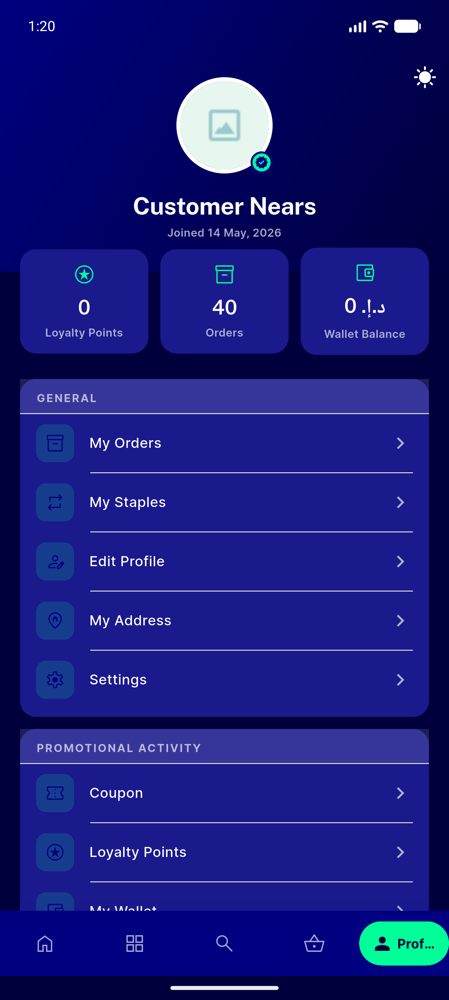
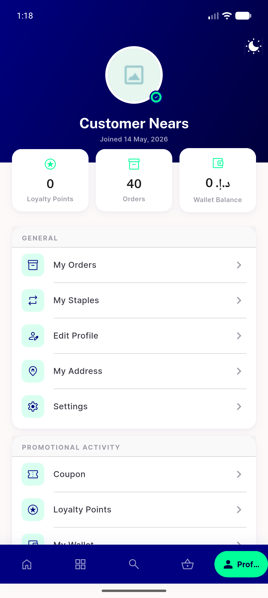
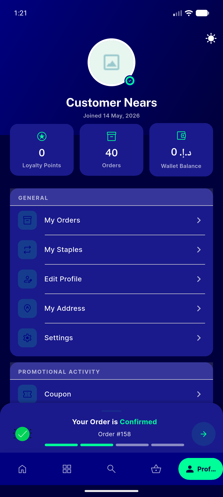
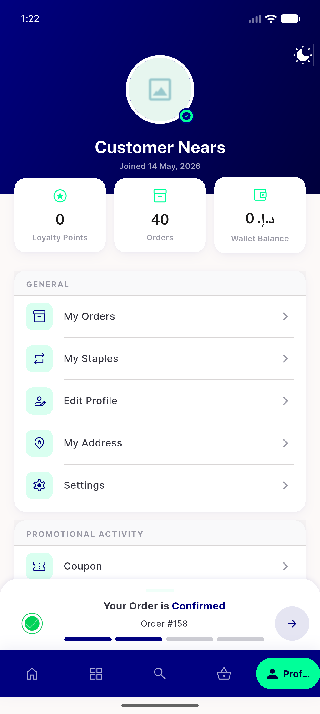
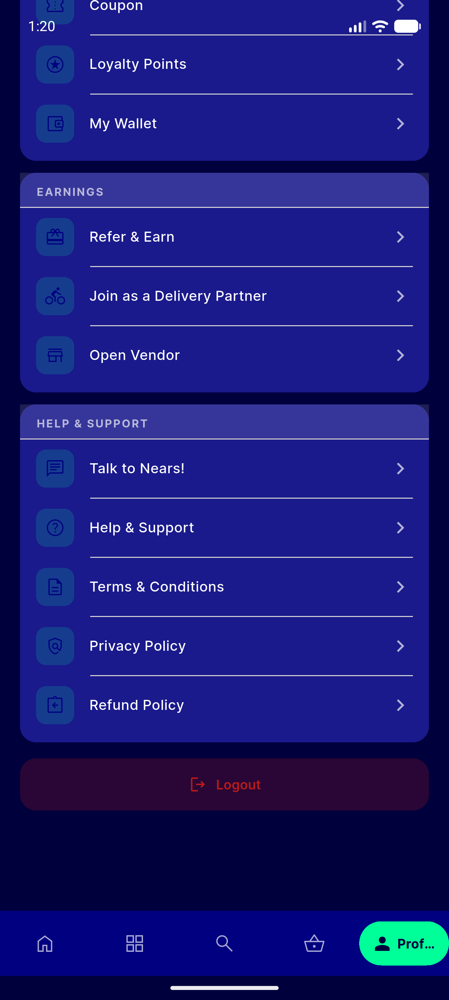
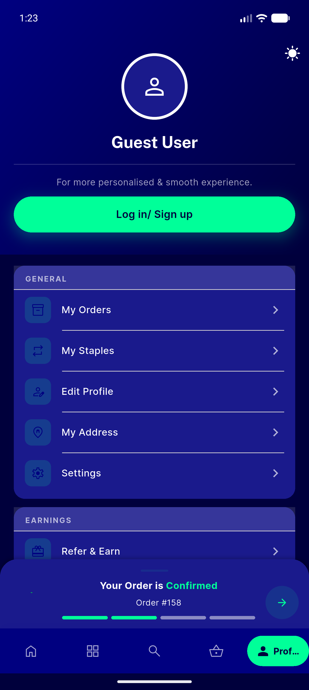
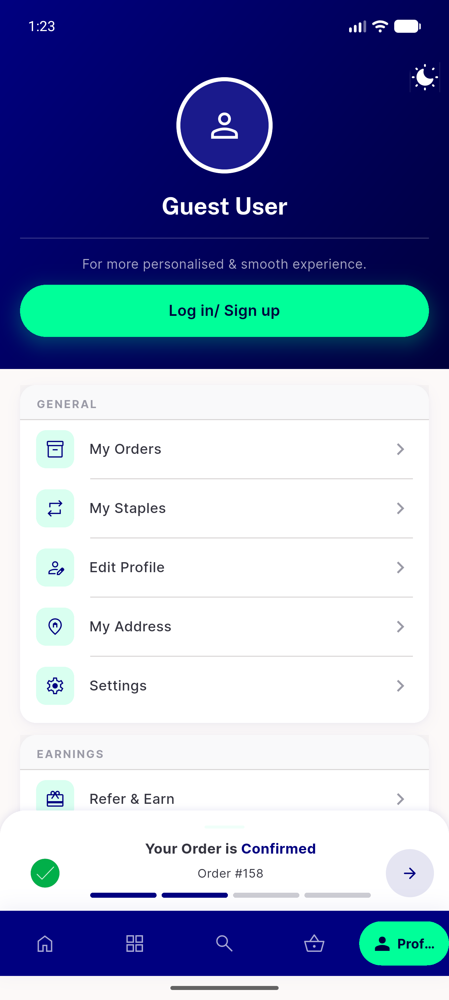

# QA Evidence — NEARS-458

**PASS — Profile tab dark bg now navyDeep (was near-white); light unchanged; no flash; logout legible. AC-1..4 + F-1 PASS, regression clean, 11/11 tests.**

**7 screenshot(s).** Click any thumbnail for full resolution.

<table>
<tr>
<td align="center" width="33%"> ac1 profile dark bg</td>
<td align="center" width="33%"> ac2 profile light bg</td>
<td align="center" width="33%"> ac3 hotrestart dark firstpaint</td>
</tr>
<tr>
<td align="center" width="33%"> ac3 hotrestart light firstpaint</td>
<td align="center" width="33%"> f1 logout dark</td>
<td align="center" width="33%"> reg guest profile dark</td>
</tr>
<tr>
<td align="center" width="33%"> reg guest profile light</td>
</tr>
</table>

### Other artifacts
- [`progress.md`](progress.md)

---
*From `nears/docs/qa-evidence/NEARS-458/` · public-repo scrub policy (no live secrets; verified clean).*
