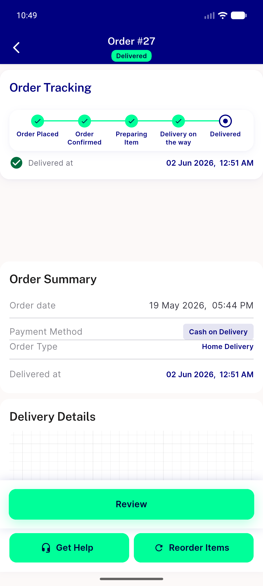

# QA Evidence — NEARS-459

**PASS — pusher late-init crash fixed (AC-1 proven via real-widget red/green), not-found empty-state guarded (AC-2 backstop), valid-order load path clean (AC-3), no regressions**

**4 screenshot(s).** Click any thumbnail for full resolution.

<table>
<tr>
<td align="center" width="33%"> ac3 valid order map details</td>
<td align="center" width="33%"> regression my orders list</td>
<td align="center" width="33%"> regression ongoing empty</td>
</tr>
<tr>
<td align="center" width="33%"> regression order details loadpath</td>
</tr>
</table>

### Other artifacts
- [`ac1-late-init-repro-proof.log`](ac1-late-init-repro-proof.log)
- [`progress.md`](progress.md)

---
*From `nears/docs/qa-evidence/NEARS-459/` · public-repo scrub policy (no live secrets; verified clean).*
