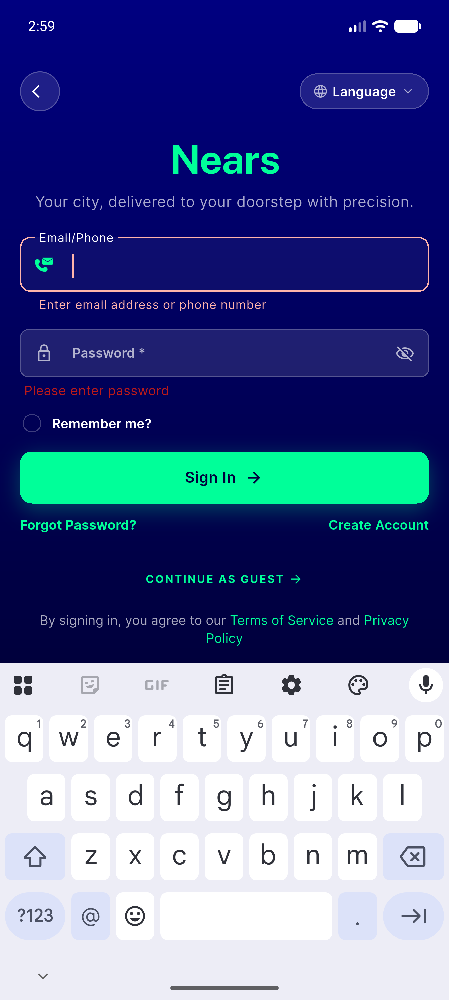
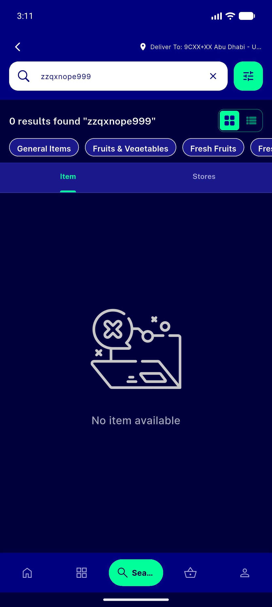
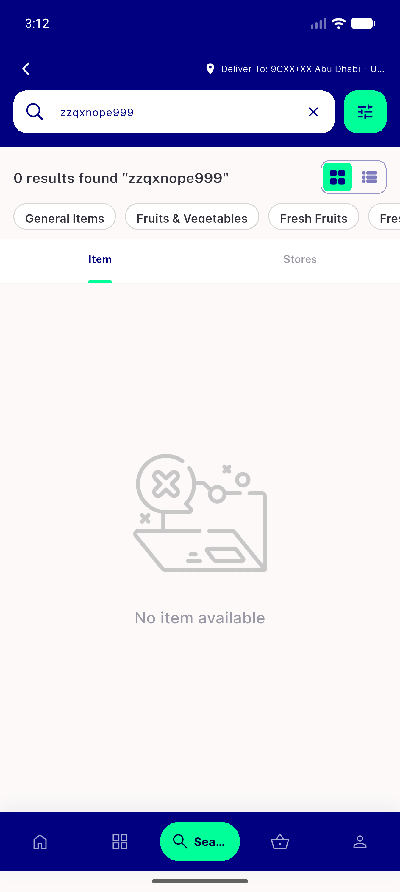
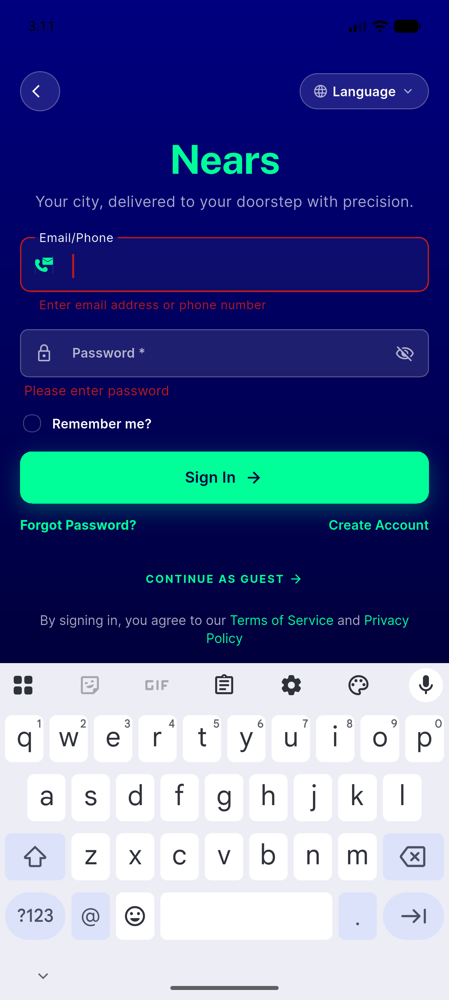
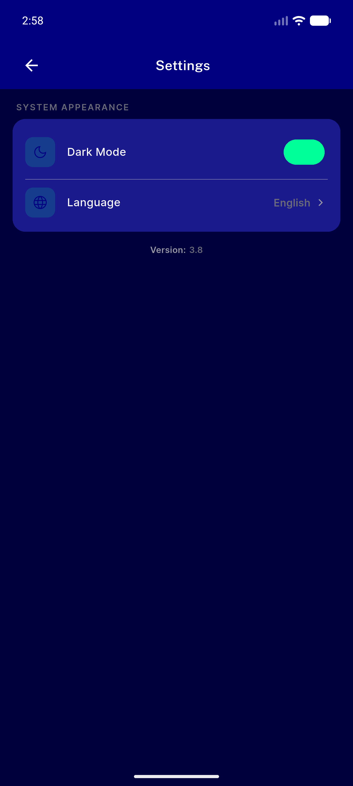
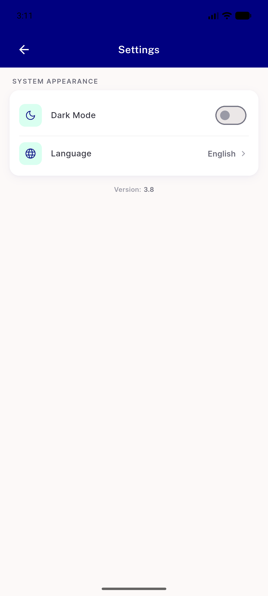

# QA Evidence — NEARS-460

**PASS (dark error quad verified live 7.77:1; empty-state both themes; light no-regression). 1 pre-existing regression_bug: NearsInput hardcodes #BA1A1A.**

**7 screenshot(s).** Click any thumbnail for full resolution.

<table>
<tr>
<td align="center" width="33%"> ac1 dark validation error</td>
<td align="center" width="33%"> ac3 dark emptystate</td>
<td align="center" width="33%"> ac3 light emptystate</td>
</tr>
<tr>
<td align="center" width="33%"> ac4 light validation error</td>
<td align="center" width="33%"> bug nearsinput error text hardcoded</td>
<td align="center" width="33%"> dark settings confirm</td>
</tr>
<tr>
<td align="center" width="33%"> light settings confirm</td>
</tr>
</table>

### Other artifacts
- [`bug-nearsinput-error-text-hardcoded.log`](bug-nearsinput-error-text-hardcoded.log)
- [`progress.md`](progress.md)

---
*From `nears/docs/qa-evidence/NEARS-460/` · public-repo scrub policy (no live secrets; verified clean).*
