# QA Evidence — NEARS-461

**PASS — dark text refactor: Home/Store/Basket/Profile/Orders legible on navy, prices brightness-aware mint, 521 salmon errorDark, 458-F2/F3 verified, light unchanged; backstop green**

**13 screenshot(s).** Click any thumbnail for full resolution.

<table>
<tr>
<td align="center" width="33%"><a href="dark-01-home.png">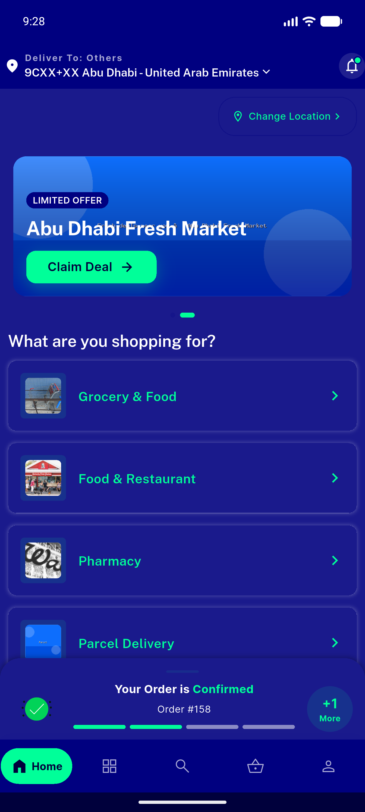</a> dark 01 home</td>
<td align="center" width="33%"><a href="dark-02-store-detail.png">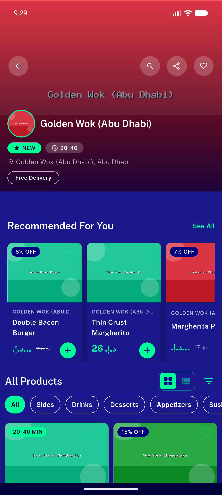</a> dark 02 store detail</td>
<td align="center" width="33%"><a href="dark-03-basket.png">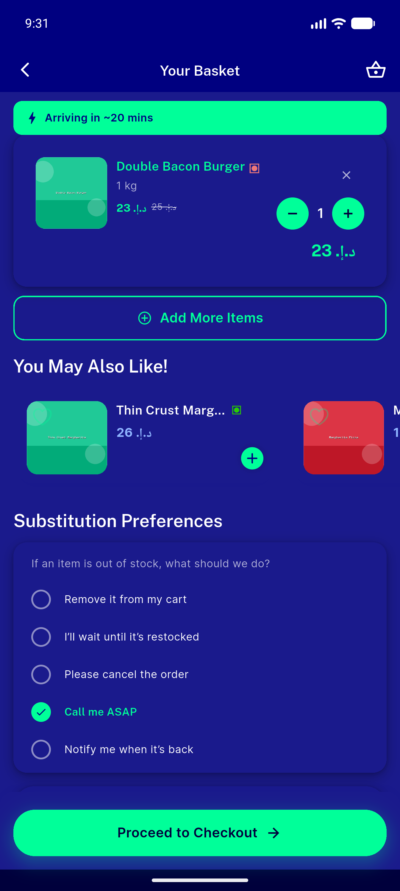</a> dark 03 basket</td>
</tr>
<tr>
<td align="center" width="33%"><a href="dark-04-profile.png">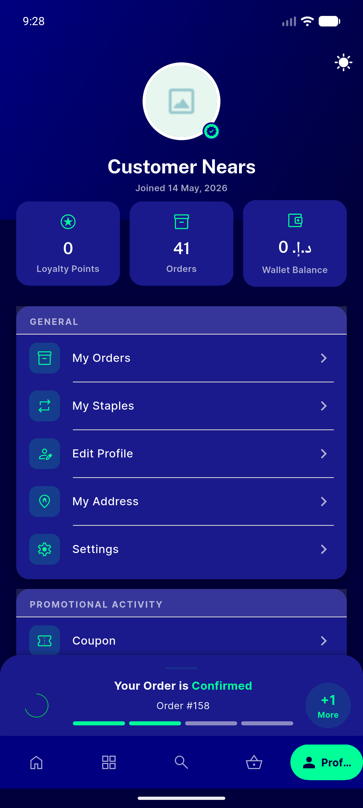</a> dark 04 profile</td>
<td align="center" width="33%"><a href="dark-05-settings.png">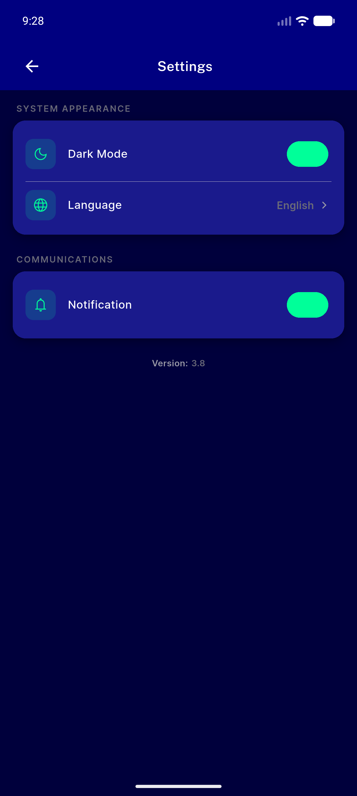</a> dark 05 settings</td>
<td align="center" width="33%"><a href="dark-06-orders.png">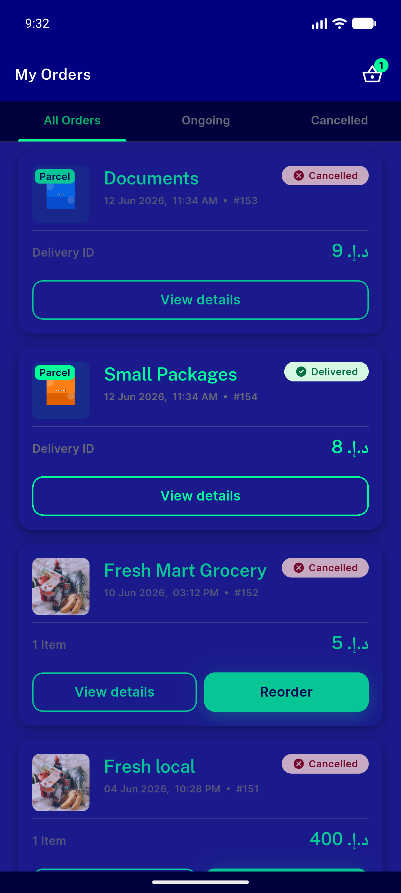</a> dark 06 orders</td>
</tr>
<tr>
<td align="center" width="33%"><a href="dark-07-order-tracking.png">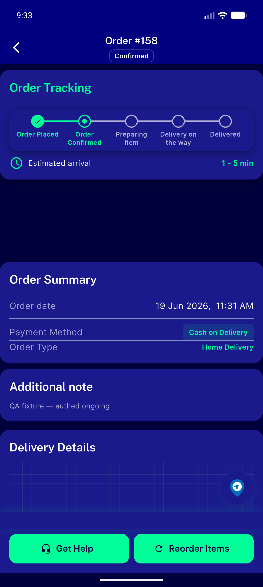</a> dark 07 order tracking</td>
<td align="center" width="33%"><a href="dark-08-login-error.png">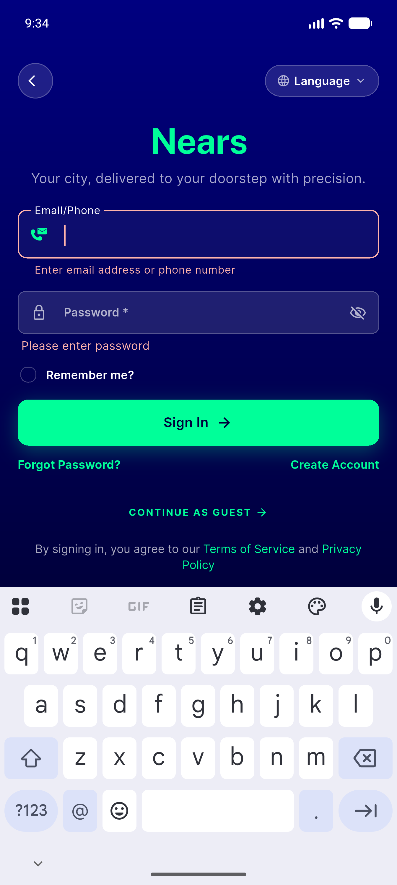</a> dark 08 login error</td>
<td align="center" width="33%"><a href="light-01-home.png">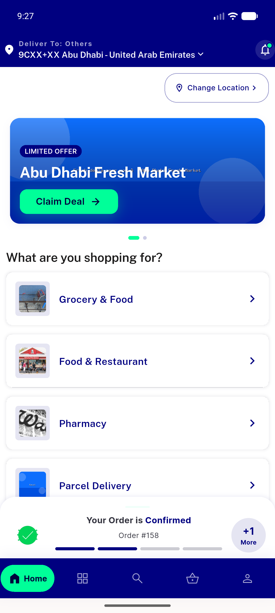</a> light 01 home</td>
</tr>
<tr>
<td align="center" width="33%"><a href="light-02-store-detail.png">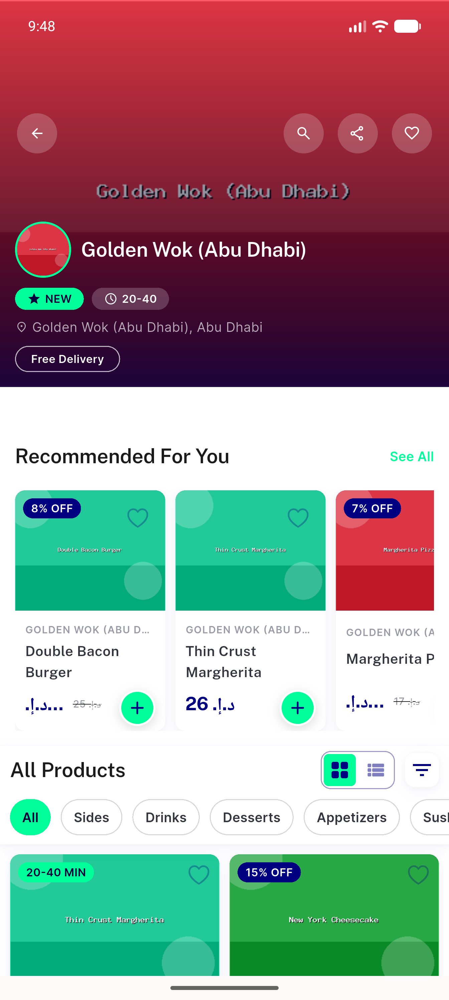</a> light 02 store detail</td>
<td align="center" width="33%"><a href="light-04-profile.png">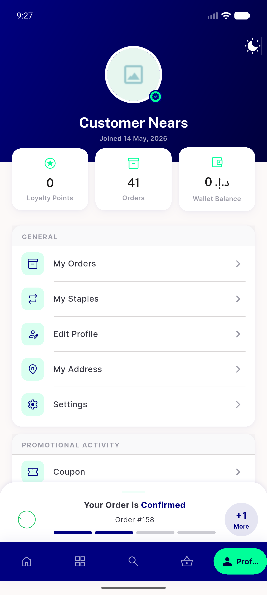</a> light 04 profile</td>
<td align="center" width="33%"><a href="light-05-settings.png">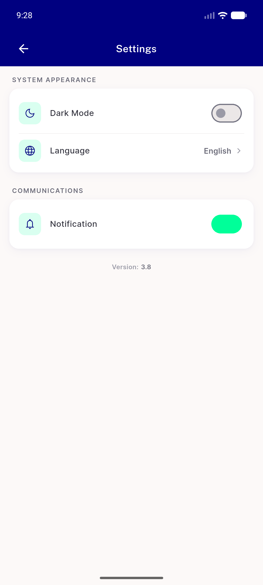</a> light 05 settings</td>
</tr>
<tr>
<td align="center" width="33%"><a href="light-09-settings-ar.png">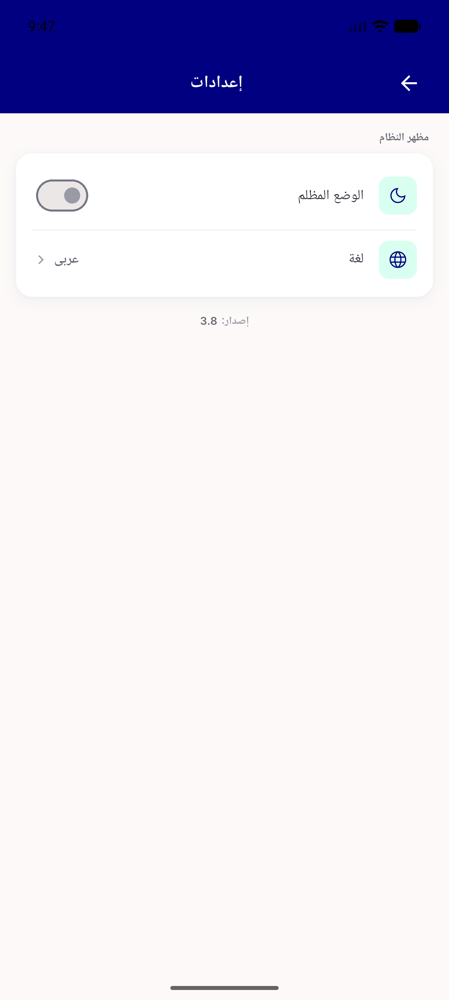</a> light 09 settings ar</td>
</tr>
</table>

### Other artifacts
- [`progress.md`](progress.md)

---
*From `nears/docs/qa-evidence/NEARS-461/` · public-repo scrub policy (no live secrets; verified clean).*
