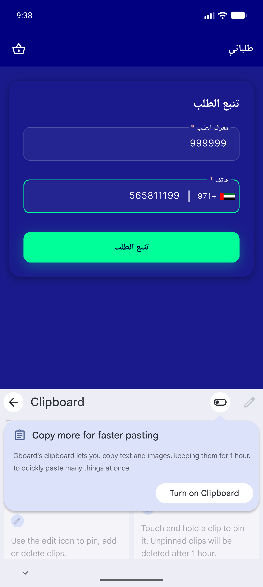
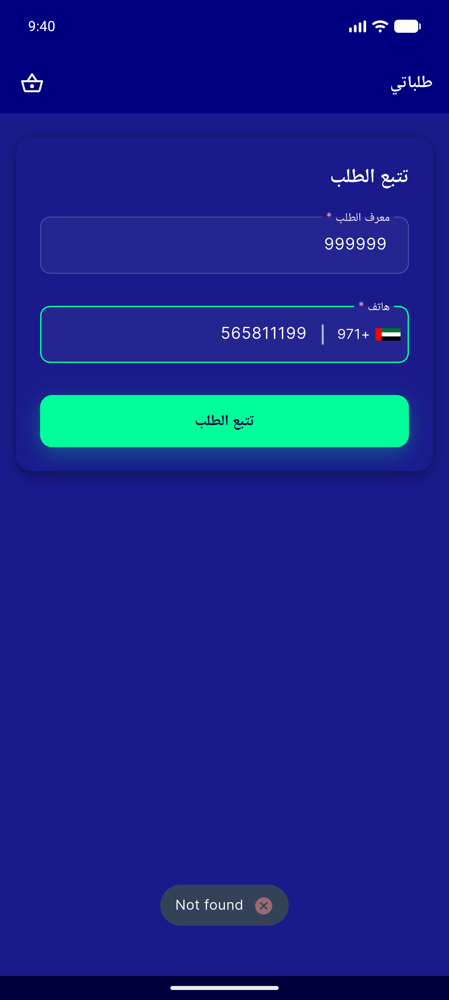
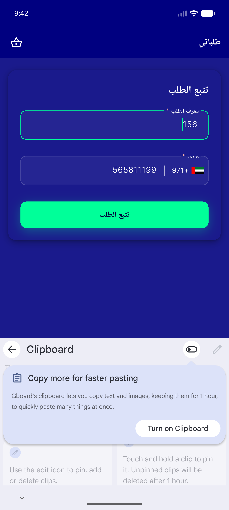
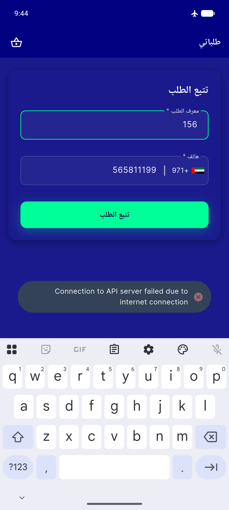

# QA Evidence — NEARS-462

**FAIL — AR/es/bn strings + count parity OK, valid-id 200 routes + airplane snackbar correct, BUT guest INVALID id 404 shows transient toast and stays on input (NearsEmptyState never renders) — breaks routing AC**

**11 screenshot(s).** Click any thumbnail for full resolution.

<table>
<tr>
<td align="center" width="33%"> ar 01 guest track input</td>
<td align="center" width="33%"> ar 02 check input</td>
<td align="center" width="33%"> ar 03 after submit</td>
</tr>
<tr>
<td align="center" width="33%"> ar 04 submit result</td>
<td align="center" width="33%"> ar 05 invalid result</td>
<td align="center" width="33%"> ar 06 t1</td>
</tr>
<tr>
<td align="center" width="33%"> ar 06 t3</td>
<td align="center" width="33%"> ar 07 valid input</td>
<td align="center" width="33%"> ar 08 valid populated</td>
</tr>
<tr>
<td align="center" width="33%"> ar 09 network error</td>
<td align="center" width="33%"> bug guest 404 no empty state</td>
</tr>
</table>

### Other artifacts
- [`bug-guest-404-no-empty-state.log`](bug-guest-404-no-empty-state.log)

---
*From `nears/docs/qa-evidence/NEARS-462/` · public-repo scrub policy (no live secrets; verified clean).*
