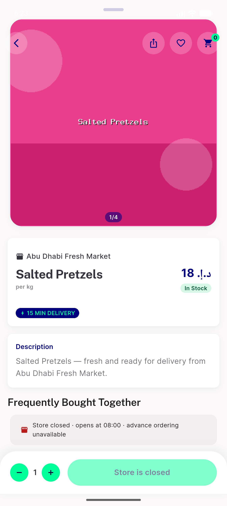
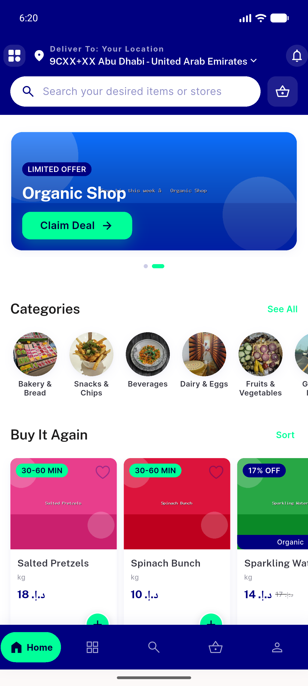
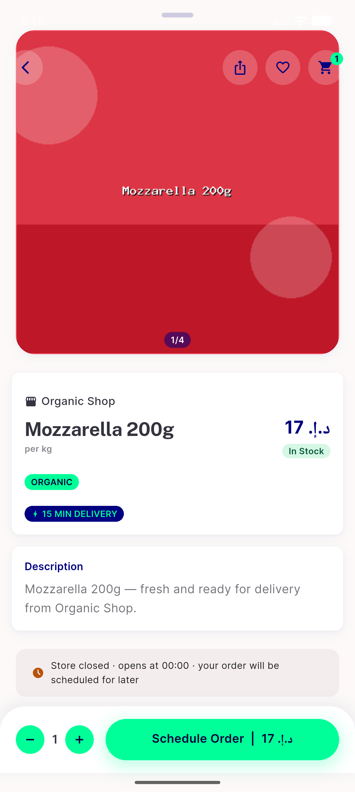
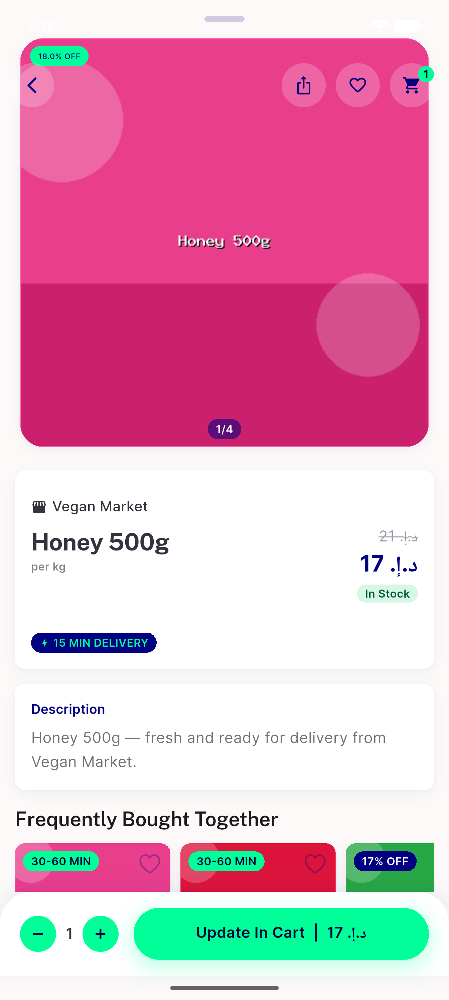
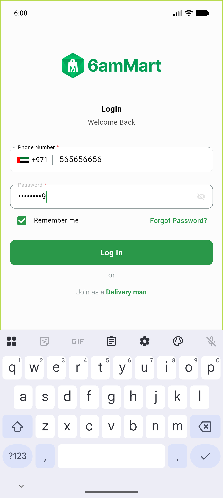
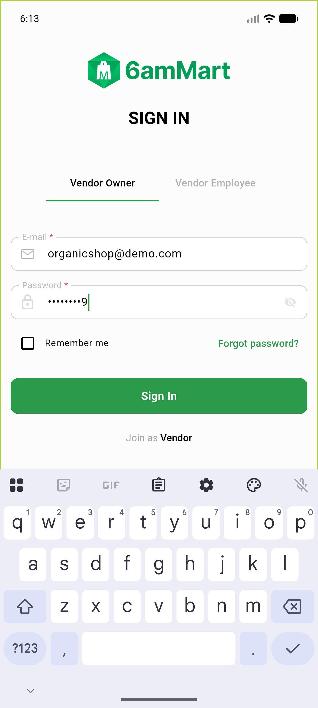
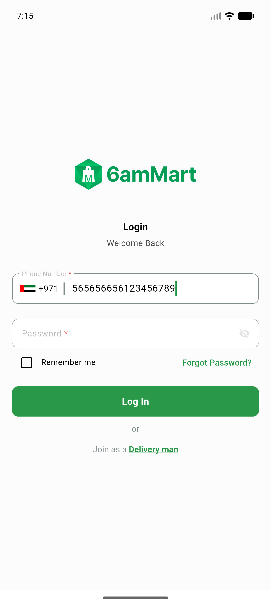
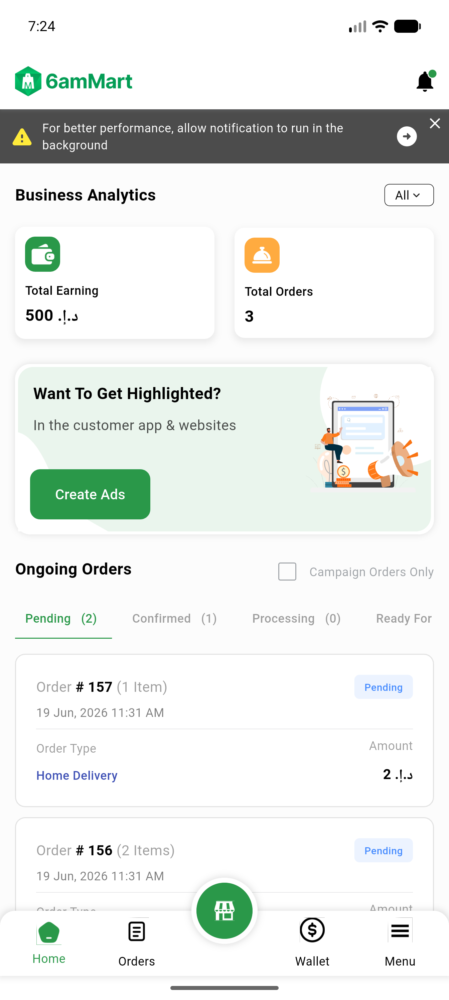

# QA Evidence — NEARS-463

**delta re-QA AC-2 — FAIL (fcm token still leaks cleartext on debug login)**

**9 screenshot(s).** Click any thumbnail for full resolution.

<table>
<tr>
<td align="center" width="33%"> ac1 closed store8 item detail</td>
<td align="center" width="33%"> ac1 closed store8 toast</td>
<td align="center" width="33%"> ac1 exempt store9 added</td>
</tr>
<tr>
<td align="center" width="33%"> ac1 open store added</td>
<td align="center" width="33%"> ac2 delivery login flow</td>
<td align="center" width="33%"> ac2 vendor login flow</td>
</tr>
<tr>
<td align="center" width="33%"> delivery after login</td>
<td align="center" width="33%"> delivery login screen</td>
<td align="center" width="33%"> vendor after login</td>
</tr>
</table>

### Other artifacts
- [`ac2-delivery-login-logcat.log`](ac2-delivery-login-logcat.log)
- [`ac2-delivery-token-in-uri.log`](ac2-delivery-token-in-uri.log)
- [`ac2-vendor-login-logcat.log`](ac2-vendor-login-logcat.log)
- [`bug-delivery-token-in-uri-query.log`](bug-delivery-token-in-uri-query.log)
- [`bug-fcm-device-token-cleartext-login.log`](bug-fcm-device-token-cleartext-login.log)
- [`delivery-login-flow.log`](delivery-login-flow.log)
- [`progress.md`](progress.md)
- [`vendor-login-flow.log`](vendor-login-flow.log)

---
*From `nears/docs/qa-evidence/NEARS-463/` · public-repo scrub policy (no live secrets; verified clean).*
