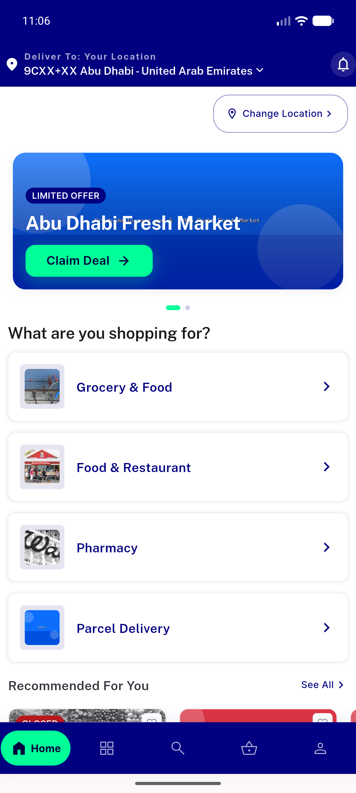
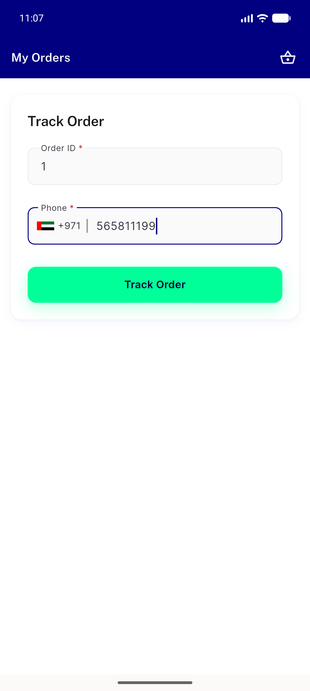
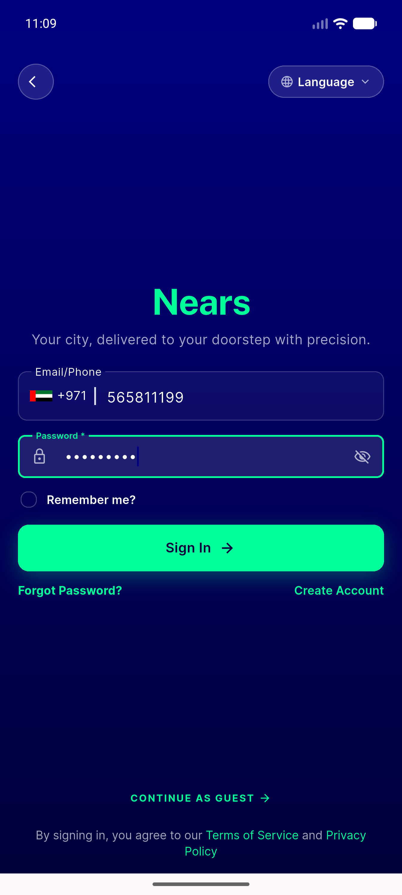
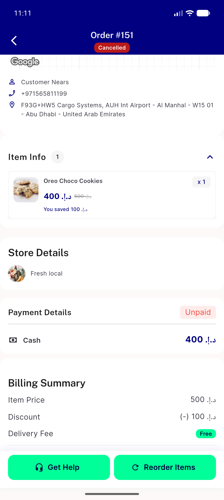
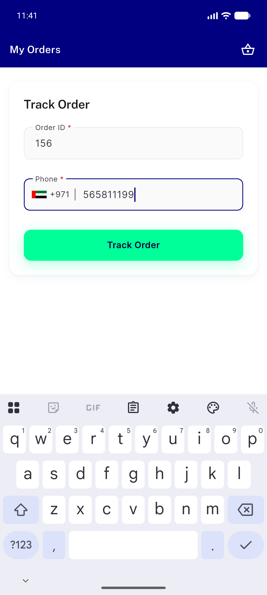
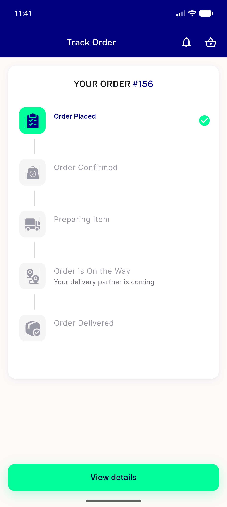
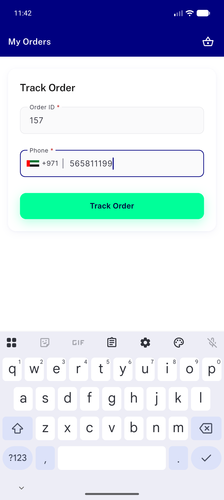
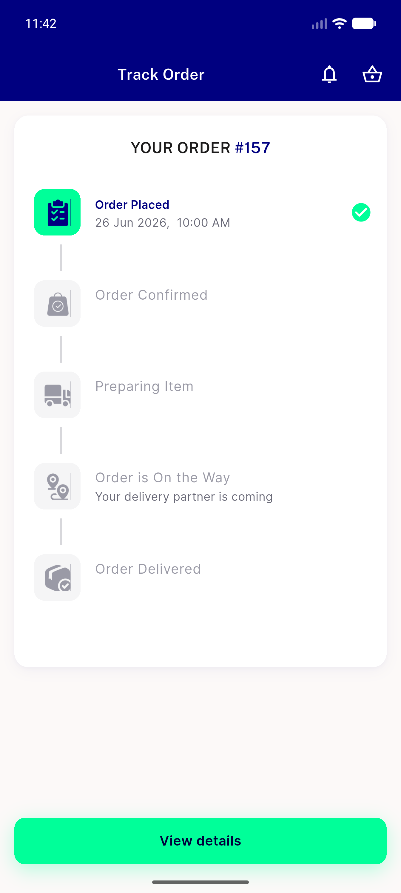

# QA Evidence — NEARS-465

**delta re-QA PASS (fix_cycle 1) — AC-1 #156 non-scheduled no-crash/no-subtitle, AC-2 #157 scheduled time displayed**

**10 screenshot(s).** Click any thumbnail for full resolution.

<table>
<tr>
<td align="center" width="33%"> guest home</td>
<td align="center" width="33%"> guest track input filled</td>
<td align="center" width="33%"> guest track emptystate</td>
</tr>
<tr>
<td align="center" width="33%"> guest track seeded order1 result</td>
<td align="center" width="33%"> login filled</td>
<td align="center" width="33%"> authed order details</td>
</tr>
<tr>
<td align="center" width="33%"> ac1 156 input filled</td>
<td align="center" width="33%"> ac1 156 stepper no crash</td>
<td align="center" width="33%"> ac2 157 input filled</td>
</tr>
<tr>
<td align="center" width="33%"> ac2 157 stepper scheduled time</td>
</tr>
</table>

### Other artifacts
- [`progress.md`](progress.md)

---
*From `nears/docs/qa-evidence/NEARS-465/` · public-repo scrub policy (no live secrets; verified clean).*
