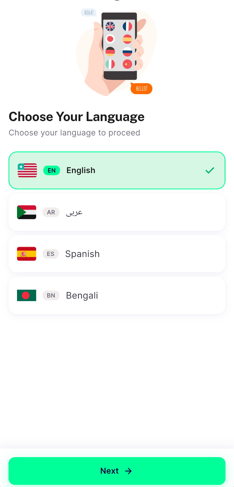
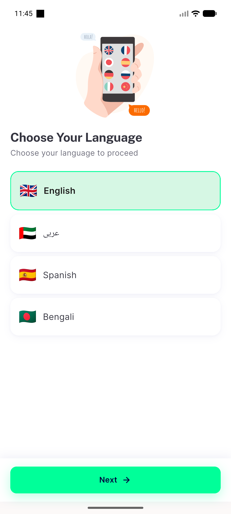
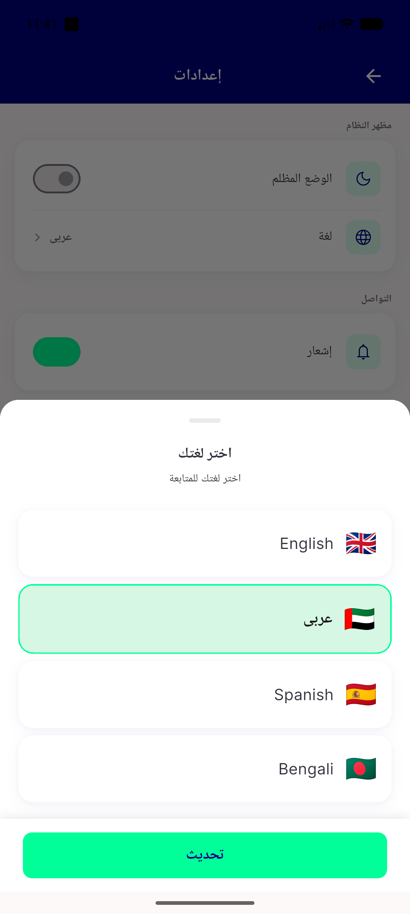
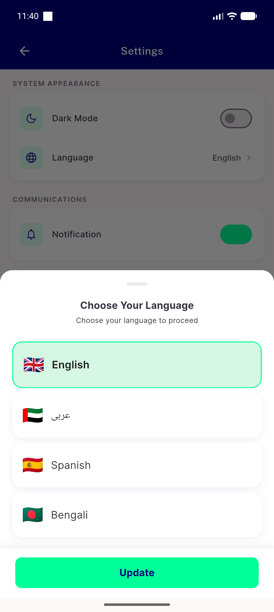

# QA Evidence — NEARS-468

**PASS — language-row polish: GB/AE/ES/BD flags, no code chip, no tick, RTL clean, both entry points (emulator-5556)**

**4 screenshot(s).** Click any thumbnail for full resolution.

<table>
<tr>
<td align="center" width="33%"> choose language screen</td>
<td align="center" width="33%"> entryA firstrun language screen</td>
<td align="center" width="33%"> entryB picker arabic rtl</td>
</tr>
<tr>
<td align="center" width="33%"> entryB picker english selected</td>
</tr>
</table>

### Other artifacts
- [`progress.md`](progress.md)

---
*From `nears/docs/qa-evidence/NEARS-468/` · public-repo scrub policy (no live secrets; verified clean).*
