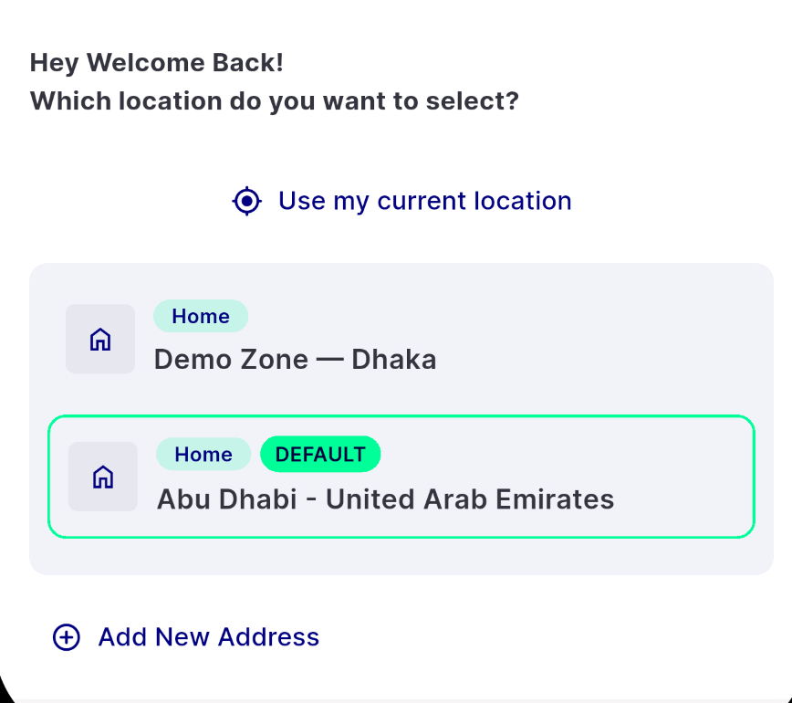
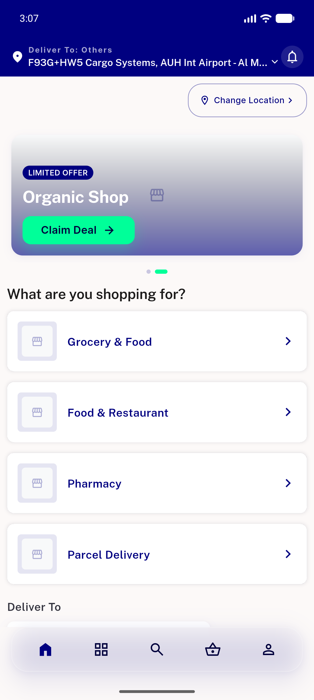
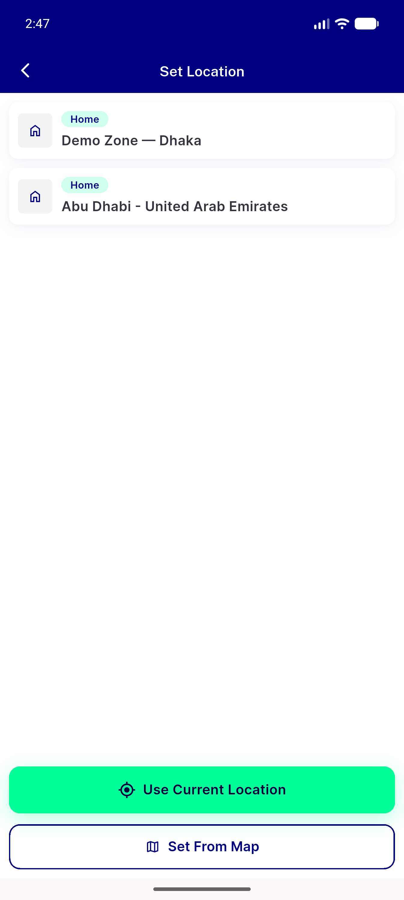
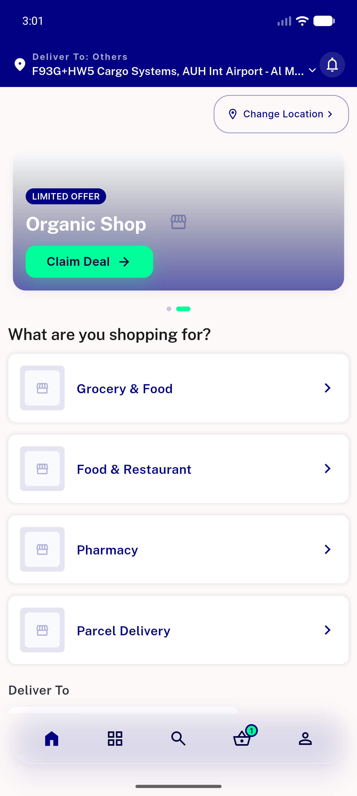
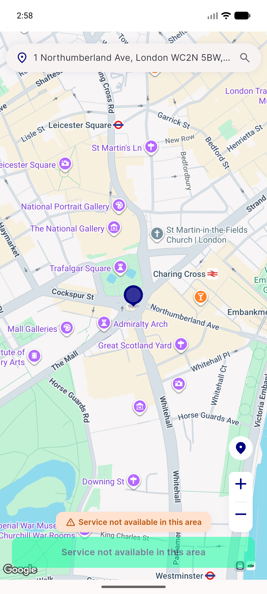
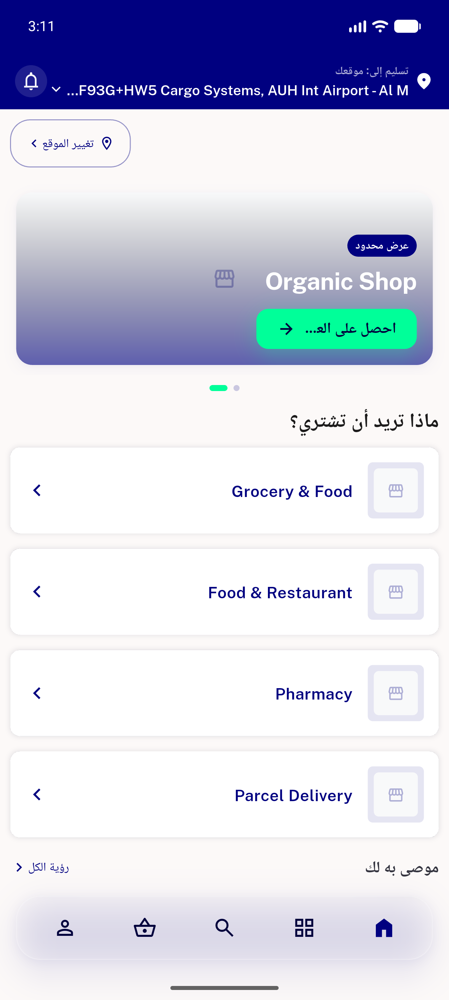

# QA Evidence — NEARS-469

**PASS — AC1-AC6 demonstrated live on emulator-5556 (UserApp e137b0e4); regression clean; 1519 tests green**

**9 screenshot(s).** Click any thumbnail for full resolution.

<table>
<tr>
<td align="center" width="33%"> location picker sheet</td>
<td align="center" width="33%"> ac1 remembered no sheet</td>
<td align="center" width="33%"> ac2 autoselect zone1</td>
</tr>
<tr>
<td align="center" width="33%"> ac3 malformed cache fallthrough</td>
<td align="center" width="33%"> ac4 picker opens</td>
<td align="center" width="33%"> ac5 location set home</td>
</tr>
<tr>
<td align="center" width="33%"> ac5 pick location no deadend</td>
<td align="center" width="33%"> ac6 zone2 stores</td>
<td align="center" width="33%"> regression arabic rtl home</td>
</tr>
</table>

### Other artifacts
- [`progress.md`](progress.md)

---
*From `nears/docs/qa-evidence/NEARS-469/` · public-repo scrub policy (no live secrets; verified clean).*
