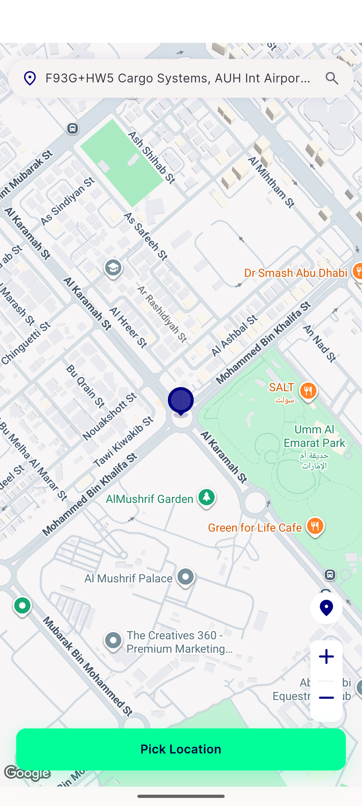
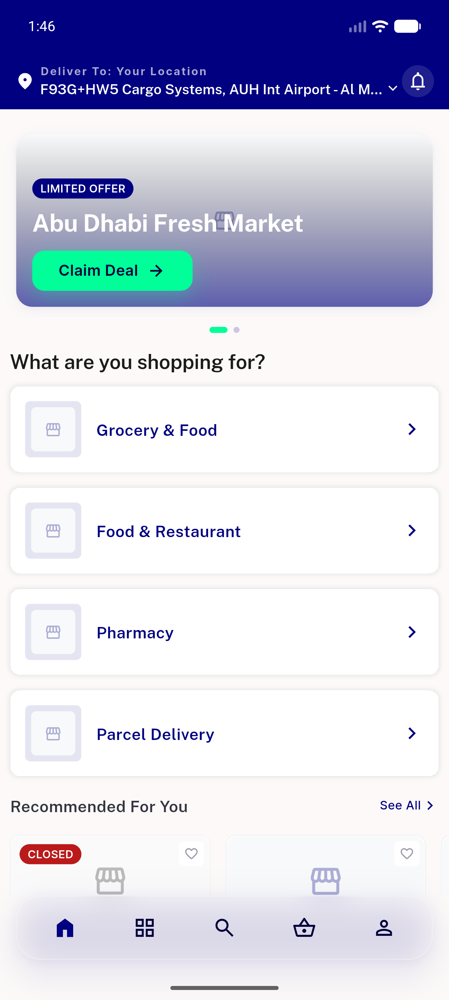
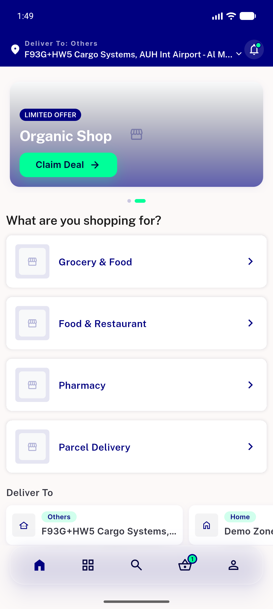
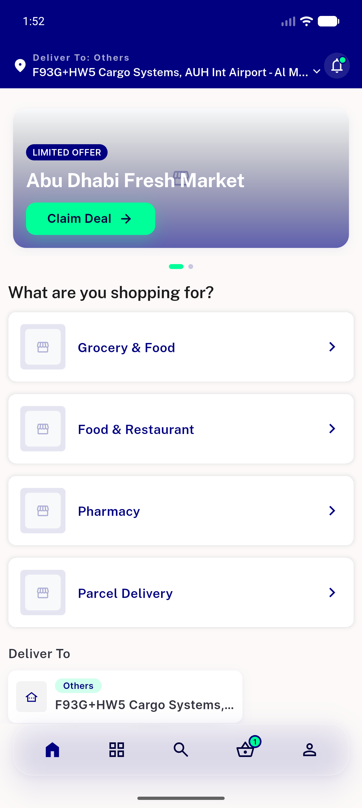
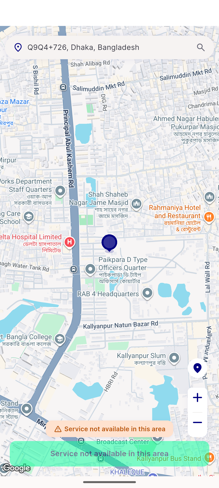
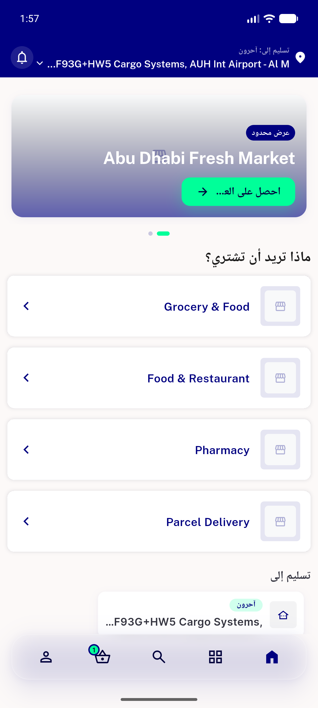

# QA Evidence — NEARS-470

**PASS — standalone Change Location pill removed from landing in all states; appbar selector + zero-near empty-state intact; 1519 tests green**

**8 screenshot(s).** Click any thumbnail for full resolution.

<table>
<tr>
<td align="center" width="33%"> redundant change location button</td>
<td align="center" width="33%"> ac1 ac4 picker opens</td>
<td align="center" width="33%"> ac2 guest landing</td>
</tr>
<tr>
<td align="center" width="33%"> ac2 loggedin with address</td>
<td align="center" width="33%"> ac2 loggedin without address</td>
<td align="center" width="33%"> ac4 loggedin picker</td>
</tr>
<tr>
<td align="center" width="33%"> picker service not available</td>
<td align="center" width="33%"> rtl arabic landing</td>
</tr>
</table>

---
*From `nears/docs/qa-evidence/NEARS-470/` · public-repo scrub policy (no live secrets; verified clean).*
