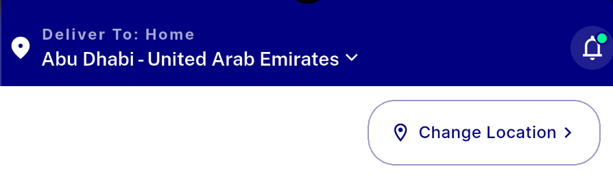
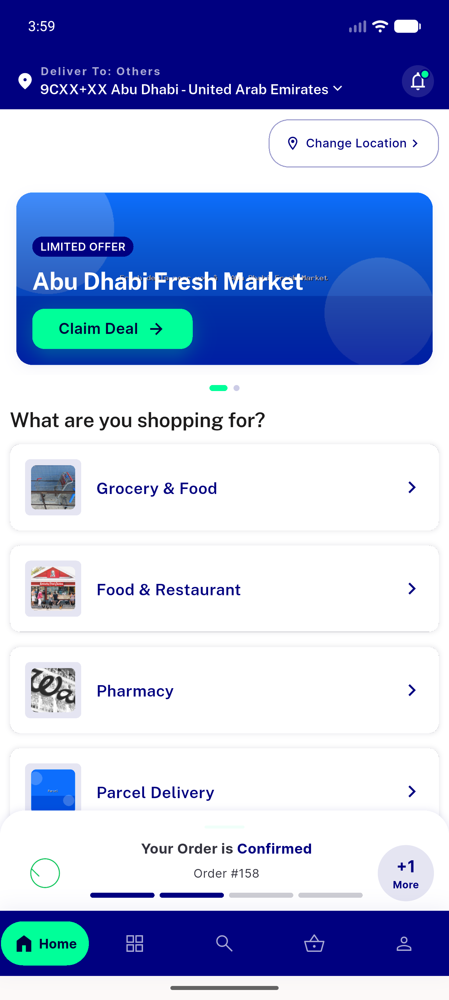
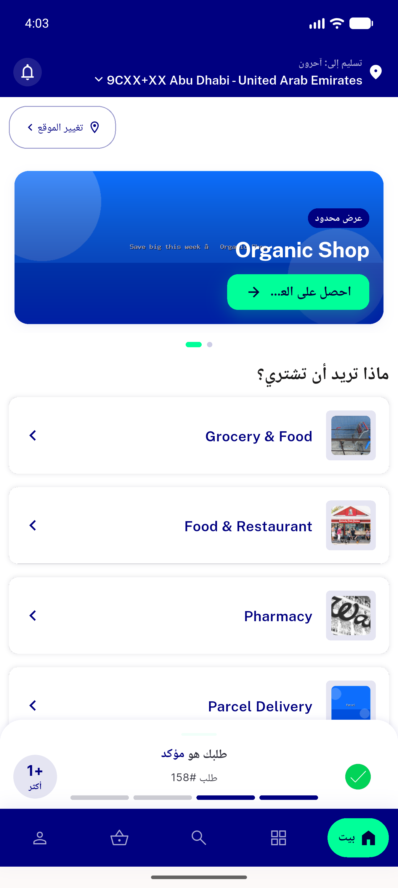
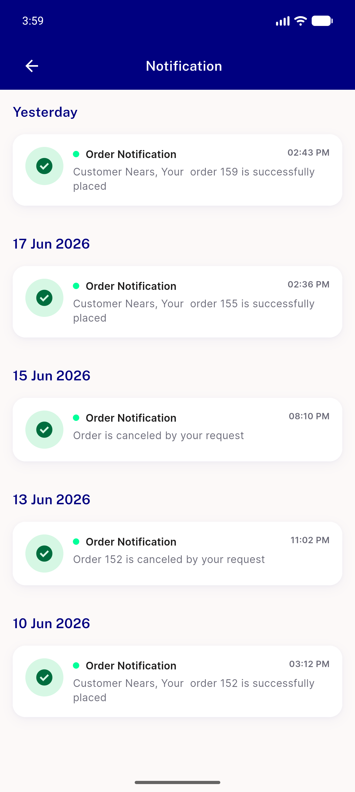

# QA Evidence — NEARS-471

**PASS — appbar symmetric 15px DLS inset; LTR+RTL verified on Pixel_10_Pro**

**4 screenshot(s).** Click any thumbnail for full resolution.

<table>
<tr>
<td align="center" width="33%"> engineer dev shot appbar edge padding</td>
<td align="center" width="33%"> ltr appbar address set</td>
<td align="center" width="33%"> rtl arabic appbar</td>
</tr>
<tr>
<td align="center" width="33%"> notifications screen opened</td>
</tr>
</table>

### Other artifacts
- [`progress.md`](progress.md)

---
*From `nears/docs/qa-evidence/NEARS-471/` · public-repo scrub policy (no live secrets; verified clean).*
