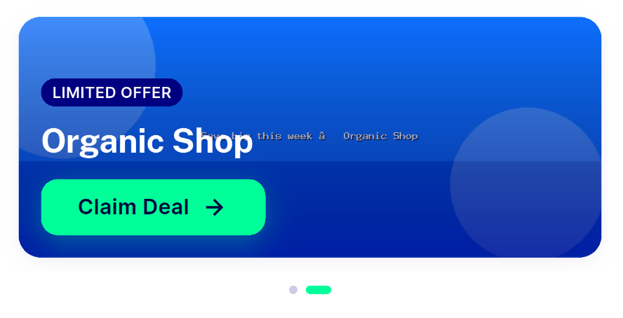
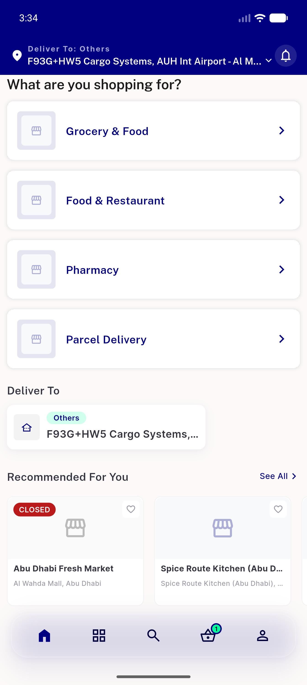
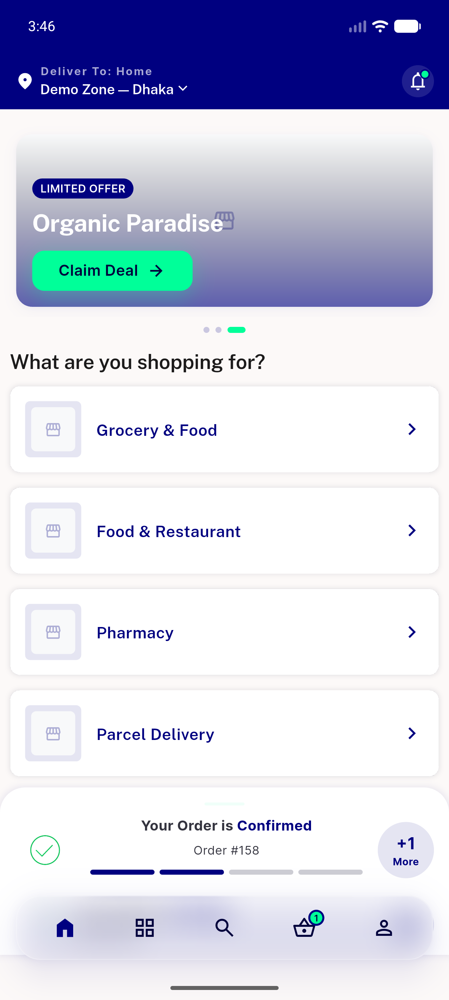
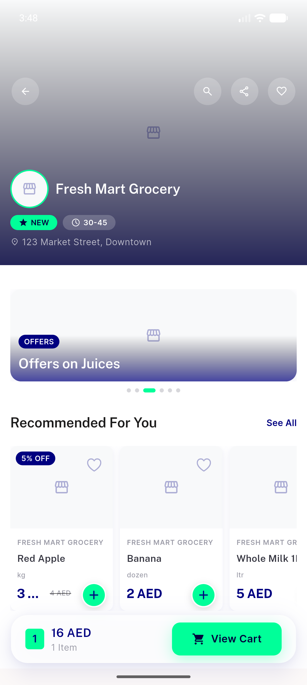
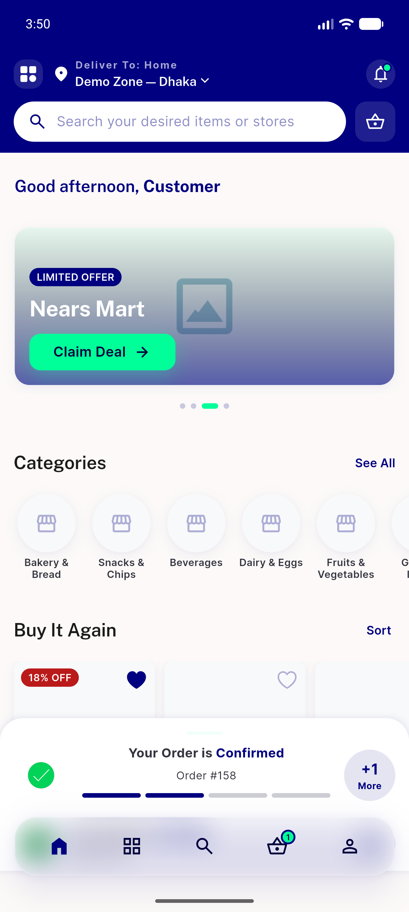
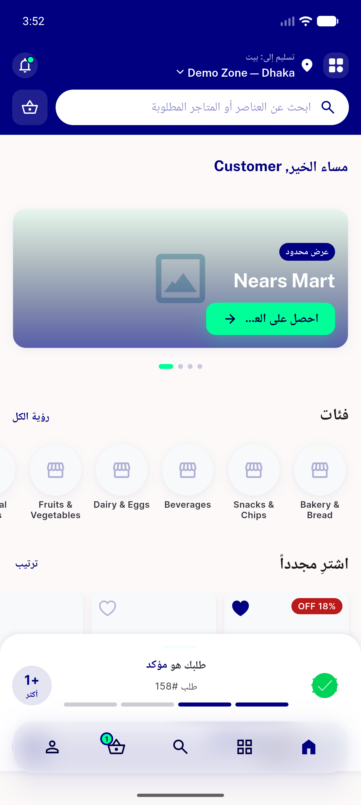

# QA Evidence — NEARS-473

**PASS — closed-store banner filter: AC1/AC2/AC5 live (zone2 collapse + zone1 3-dot render + deep-link), RTL clean, 24/24 tests**

**6 screenshot(s).** Click any thumbnail for full resolution.

<table>
<tr>
<td align="center" width="33%"> closed store banner</td>
<td align="center" width="33%"> zone2 landing featured collapsed</td>
<td align="center" width="33%"> zone1 3banners rendered</td>
</tr>
<tr>
<td align="center" width="33%"> zone1 banner deeplink store</td>
<td align="center" width="33%"> zone1 grocery main carousel</td>
<td align="center" width="33%"> zone1 rtl arabic home</td>
</tr>
</table>

---
*From `nears/docs/qa-evidence/NEARS-473/` · public-repo scrub policy (no live secrets; verified clean).*
