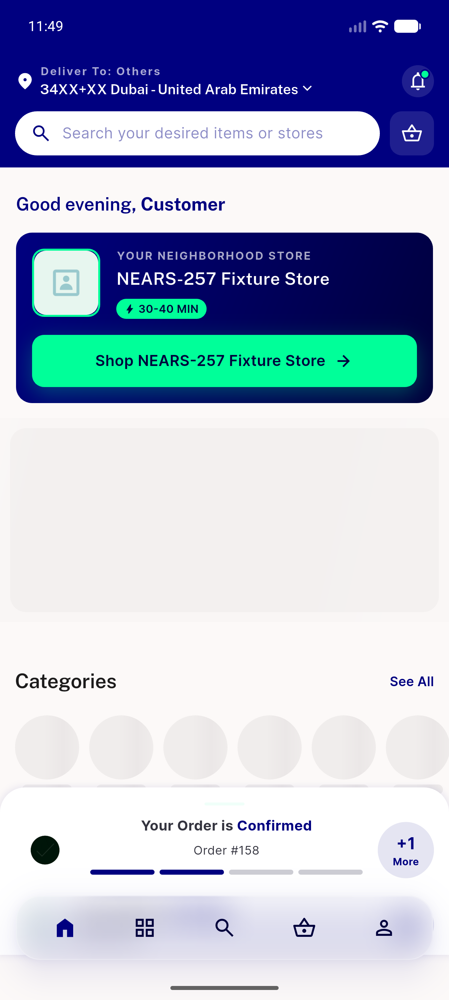

# QA Evidence — NEARS-474

**PASS — module selector 2-col grid: AC1/2/3/6 + narrow-overflow fix verified live on emulator-5556 (light mode); AC4 dark deferred**

**5 screenshot(s).** Click any thumbnail for full resolution.

<table>
<tr>
<td align="center" width="33%"> module selector</td>
<td align="center" width="33%"> ac1 grid 2col en</td>
<td align="center" width="33%"> ac3 grid rtl arabic</td>
</tr>
<tr>
<td align="center" width="33%"> ac6 single module autoselect nogrid</td>
<td align="center" width="33%"> acNEW narrow 320dp no overflow</td>
</tr>
</table>

### Other artifacts
- [`progress.md`](progress.md)

---
*From `nears/docs/qa-evidence/NEARS-474/` · public-repo scrub policy (no live secrets; verified clean).*
