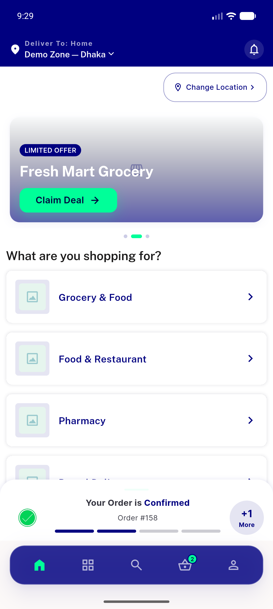
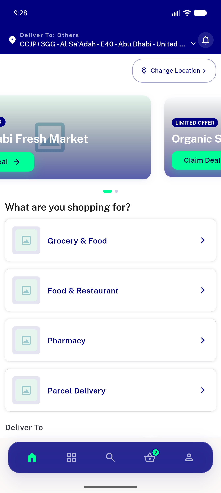
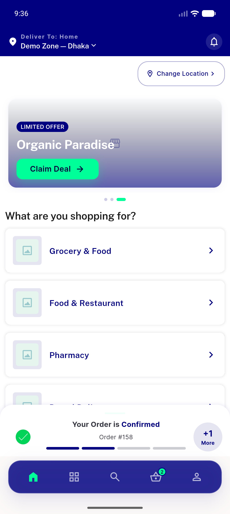
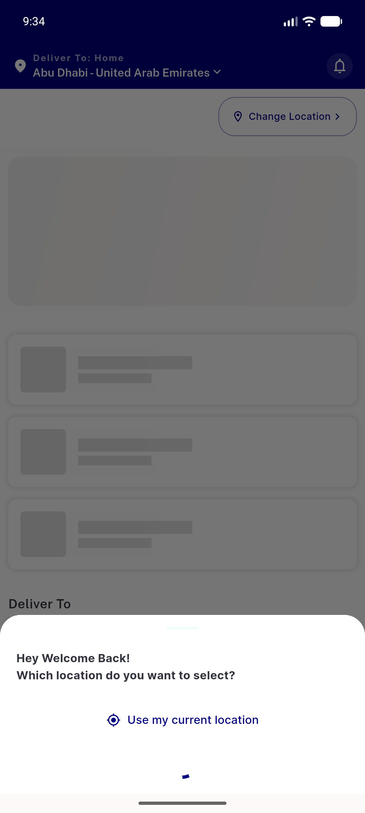
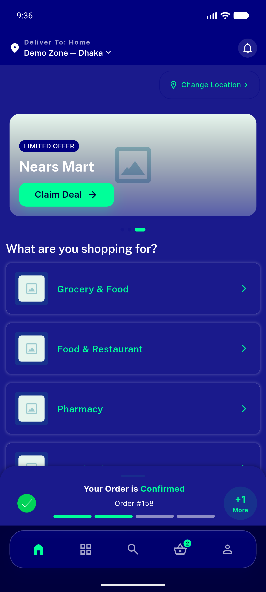
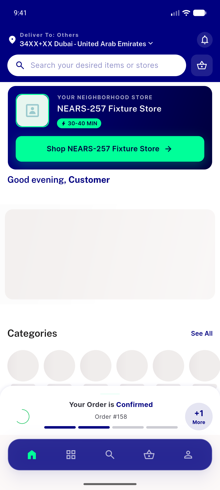
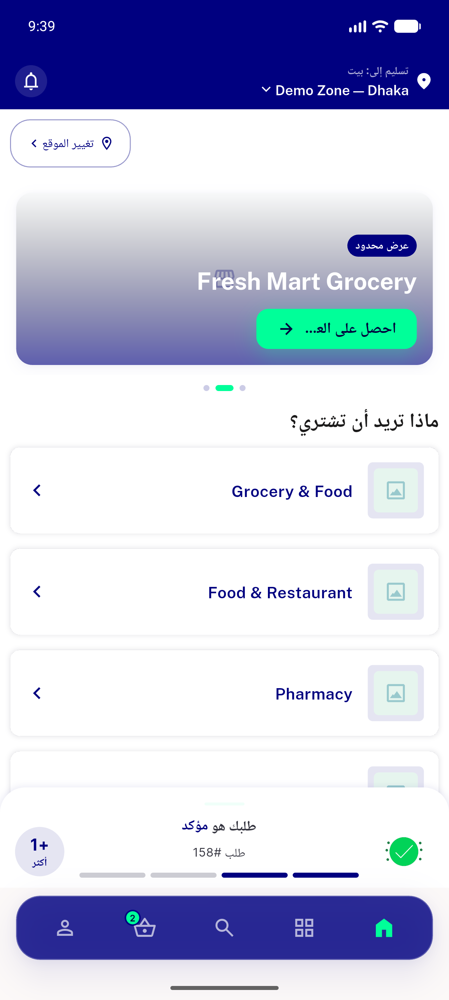
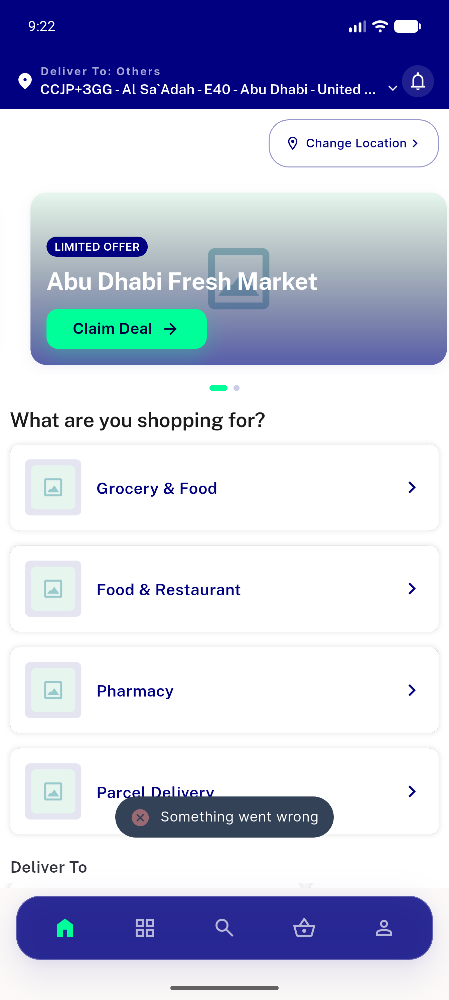

# QA Evidence — NEARS-475

**PASS — module selector hides zero-serviceable modules (module 6 hidden in zone 1, shown nowhere); parcel + single-store-hero intact; 9/9 phpunit + 1220/1220 flutter**

**8 screenshot(s).** Click any thumbnail for full resolution.

<table>
<tr>
<td align="center" width="33%"> ac1 ac2 zone1 module6 hidden</td>
<td align="center" width="33%"> ac3 zone2 modules loggedin</td>
<td align="center" width="33%"> ac5 modules loaded zone1</td>
</tr>
<tr>
<td align="center" width="33%"> ac5 moduleshimmer</td>
<td align="center" width="33%"> regression darkmode zone1 modules</td>
<td align="center" width="33%"> regression nears257 singlestore hero zone3</td>
</tr>
<tr>
<td align="center" width="33%"> regression rtl arabic zone1 modules</td>
<td align="center" width="33%"> zone2 home modulegrid</td>
</tr>
</table>

### Other artifacts
- [`api-verification.log`](api-verification.log)
- [`progress.md`](progress.md)

---
*From `nears/docs/qa-evidence/NEARS-475/` · public-repo scrub policy (no live secrets; verified clean).*
