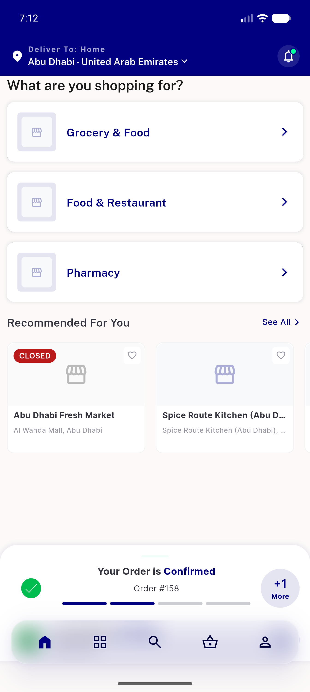
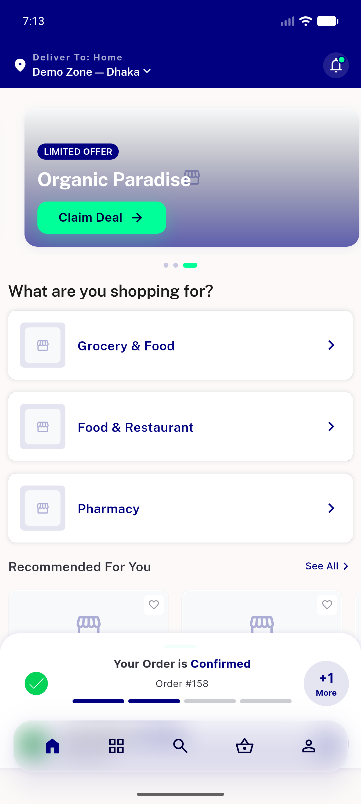
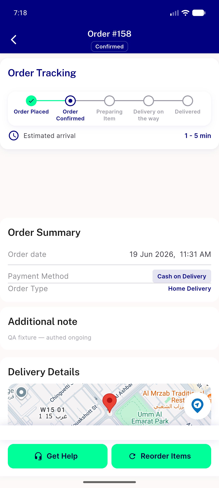
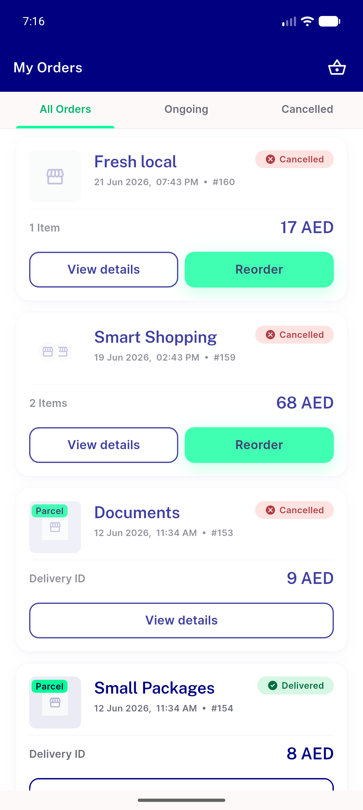
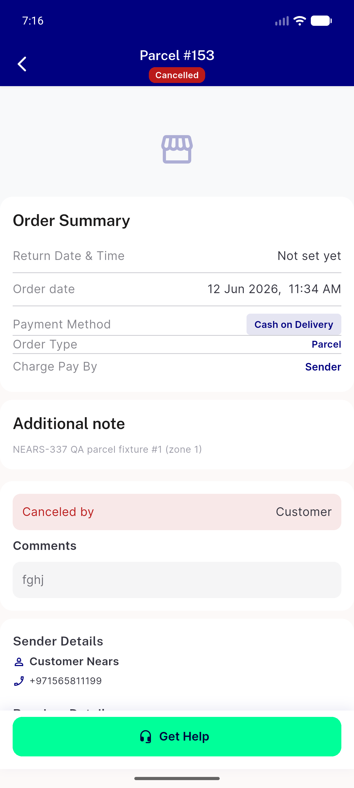
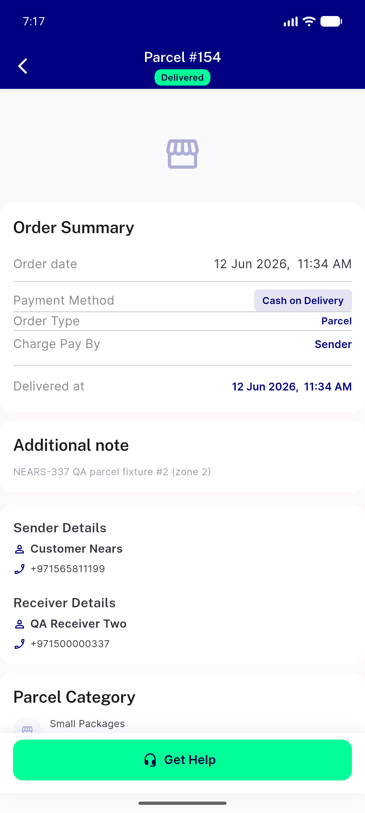
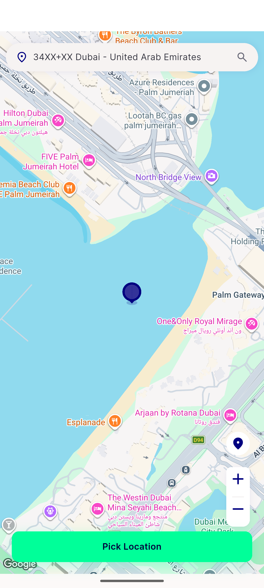
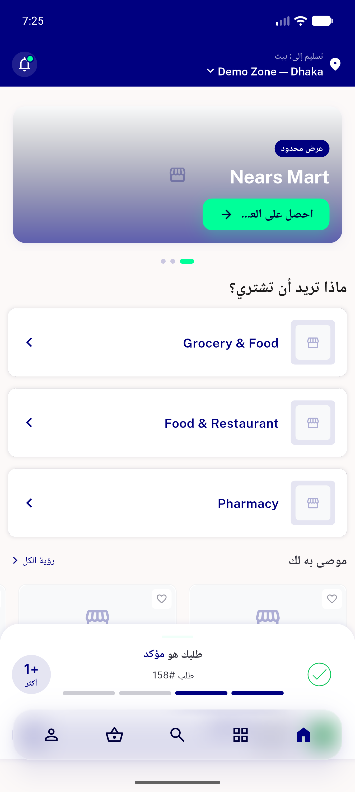

# QA Evidence — NEARS-476

**NEARS-476 QA PASS — parcel creation removed (Option A); both zones no parcel tile, historical parcel orders render, 1521/1521 tests**

**9 screenshot(s).** Click any thumbnail for full resolution.

<table>
<tr>
<td align="center" width="33%"> module selector</td>
<td align="center" width="33%"> ac1 ac4 home grid zone2 abudhabi</td>
<td align="center" width="33%"> ac1 home grid zone1 demo</td>
</tr>
<tr>
<td align="center" width="33%"> ac3 grocery 158 details tracking</td>
<td align="center" width="33%"> ac3 orders list with parcels</td>
<td align="center" width="33%"> ac3 parcel 153 details cancelled</td>
</tr>
<tr>
<td align="center" width="33%"> ac3 parcel 154 details delivered</td>
<td align="center" width="33%"> regression pickmap renders</td>
<td align="center" width="33%"> regression rtl arabic home grid</td>
</tr>
</table>

### Other artifacts
- [`progress.md`](progress.md)

---
*From `nears/docs/qa-evidence/NEARS-476/` · public-repo scrub policy (no live secrets; verified clean).*
