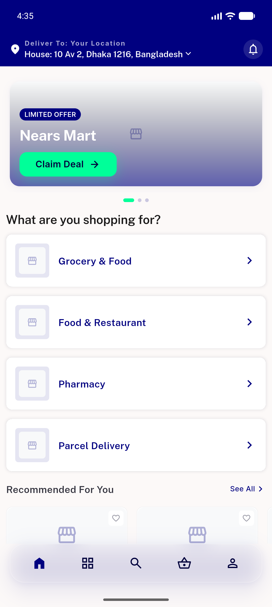
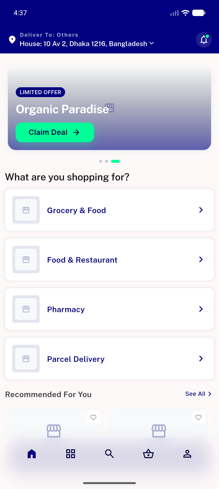
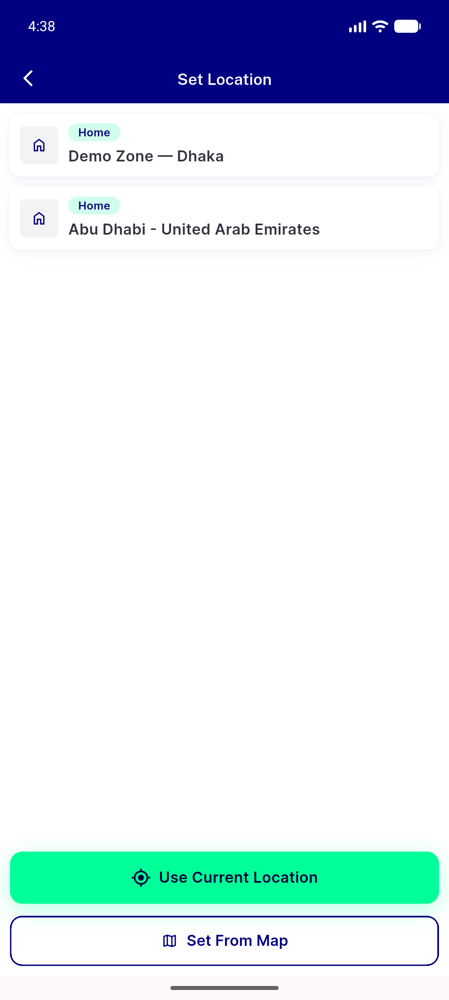
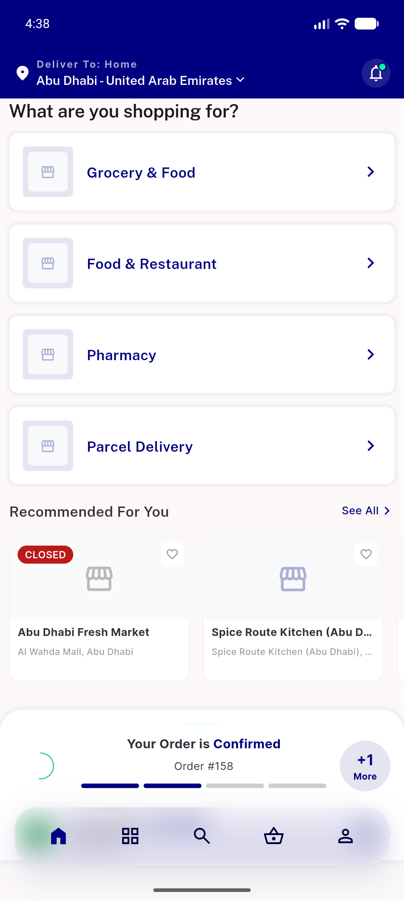
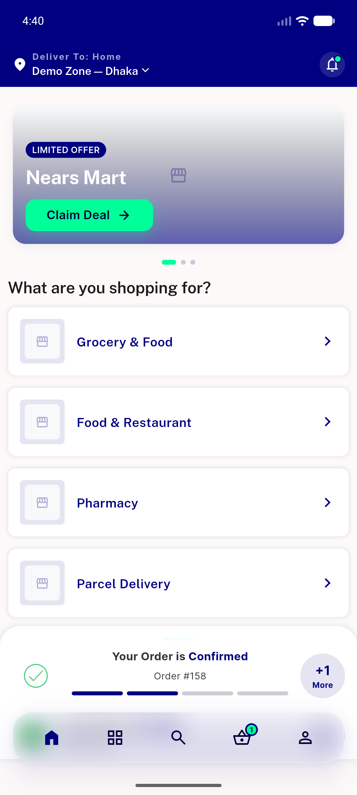
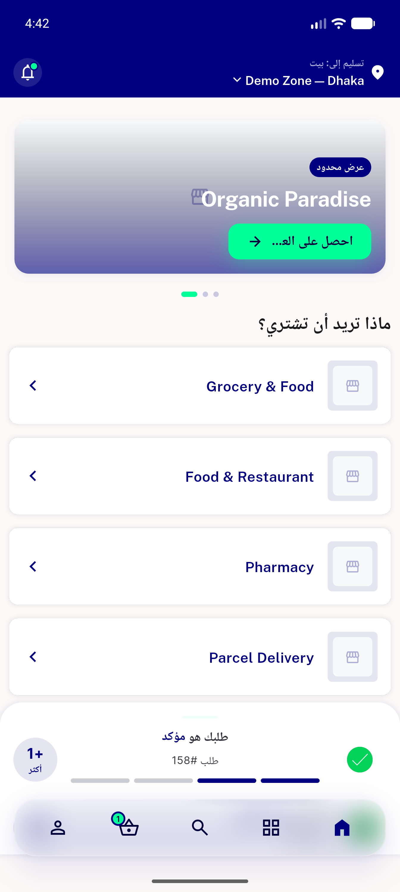

# QA Evidence — NEARS-478

**PASS — Deliver To body address-row removed; appbar selector + picker intact; no regressions (emulator-5556, light mode)**

**6 screenshot(s).** Click any thumbnail for full resolution.

<table>
<tr>
<td align="center" width="33%"> guest home baseline</td>
<td align="center" width="33%"> loggedin home no address row</td>
<td align="center" width="33%"> address picker sheet</td>
</tr>
<tr>
<td align="center" width="33%"> zone2 home after switch</td>
<td align="center" width="33%"> zone1 home banner present</td>
<td align="center" width="33%"> arabic rtl home</td>
</tr>
</table>

### Other artifacts
- [`progress.md`](progress.md)

---
*From `nears/docs/qa-evidence/NEARS-478/` · public-repo scrub policy (no live secrets; verified clean).*
