# QA Evidence — NEARS-480

**PASS — NEARS-480 UserApp Home reorder: greeting hoisted to top (all modules, logged-in), tower rails merged to single 'Nearest Stores'; live light-mode + RTL verified, tower-card ACs test-backed (all-closed tower live)**

**12 screenshot(s).** Click any thumbnail for full resolution.

<table>
<tr>
<td align="center" width="33%"><a href="01-category-landing.png">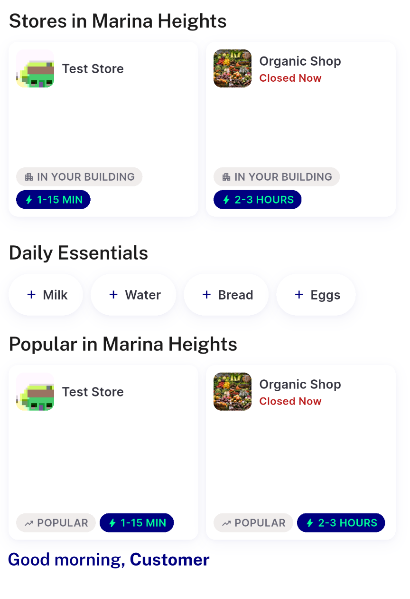</a> category landing</td>
<td align="center" width="33%"><a href="01-grocery-home-top.png">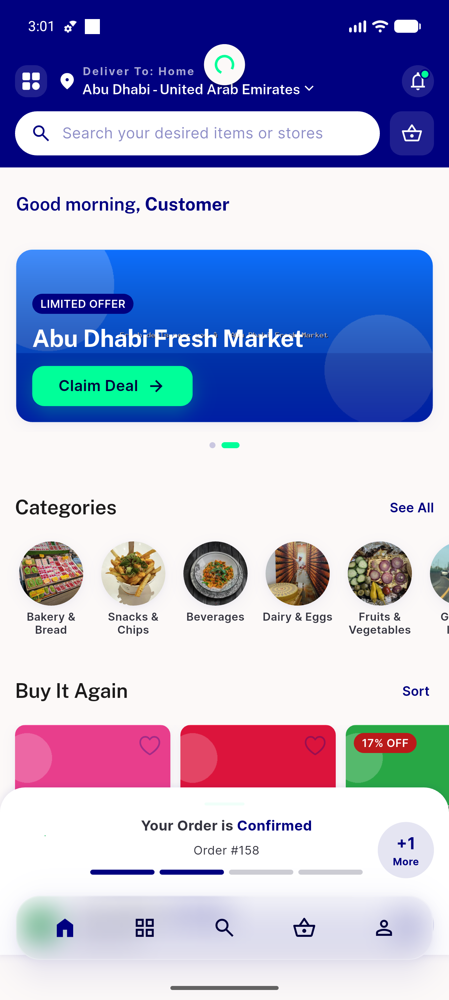</a> grocery home top</td>
<td align="center" width="33%"><a href="02-pharmacy-home-top.png">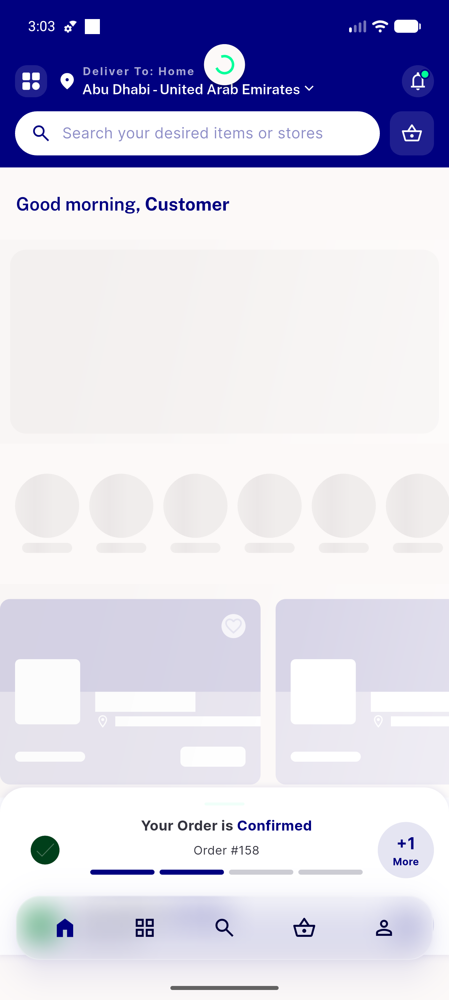</a> pharmacy home top</td>
</tr>
<tr>
<td align="center" width="33%"><a href="03-food-home-top.png">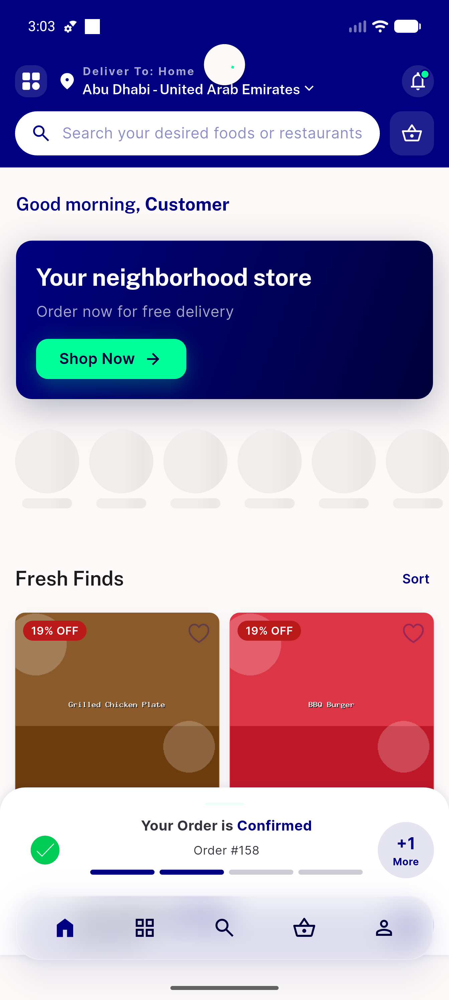</a> food home top</td>
<td align="center" width="33%"><a href="04-module-picker.png">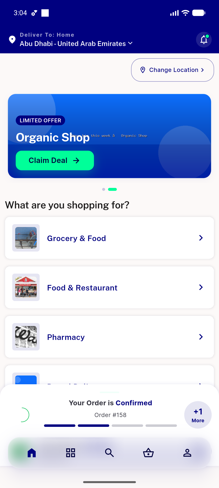</a> module picker</td>
<td align="center" width="33%"><a href="05-loggedout-grocery-home.png">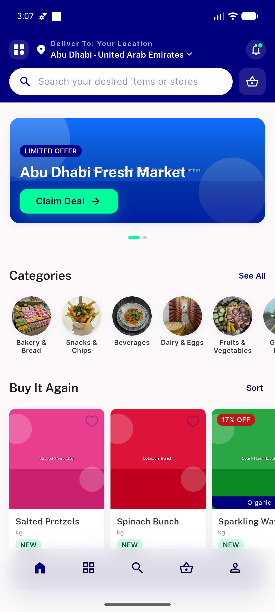</a> loggedout grocery home</td>
</tr>
<tr>
<td align="center" width="33%"><a href="05-loggedout-grocery.png">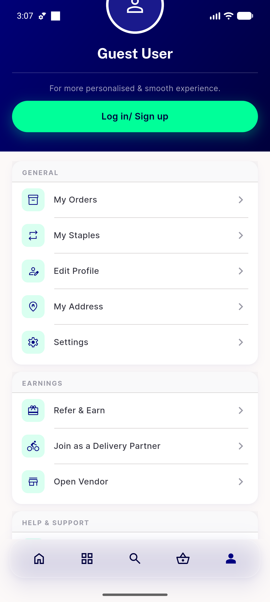</a> loggedout grocery</td>
<td align="center" width="33%"><a href="06-nontower-grocery.png">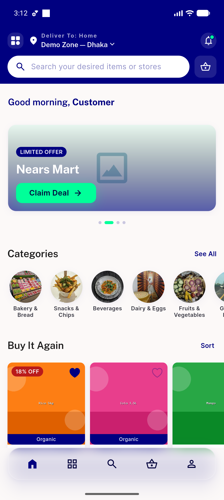</a> nontower grocery</td>
<td align="center" width="33%"><a href="07-rtl-arabic-grocery.png">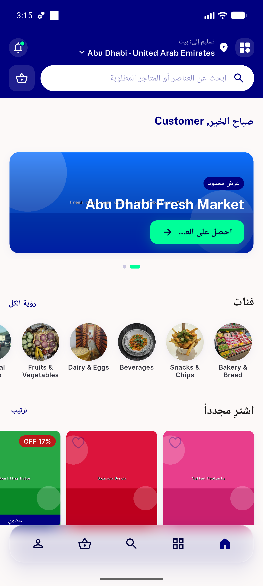</a> rtl arabic grocery</td>
</tr>
<tr>
<td align="center" width="33%"><a href="08-owner-signoff-greeting-top.png">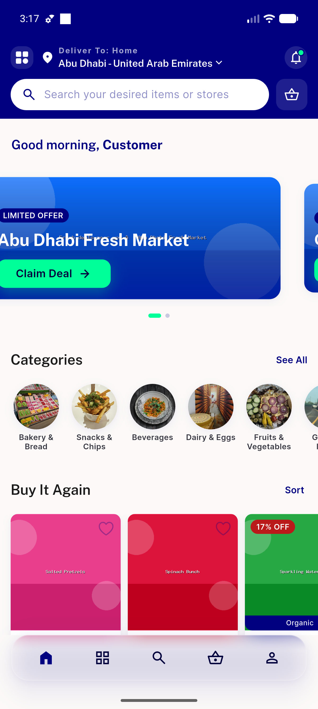</a> owner signoff greeting top</td>
<td align="center" width="33%"><a href="09-bottomnav-clearance.png">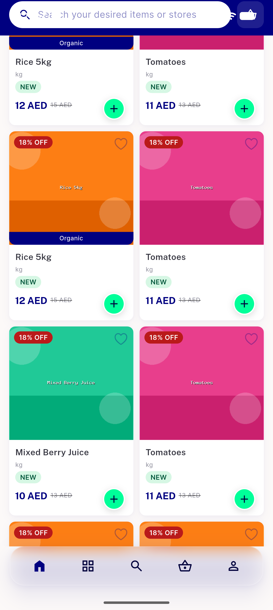</a> bottomnav clearance</td>
<td align="center" width="33%"><a href="flash-sale-section.png">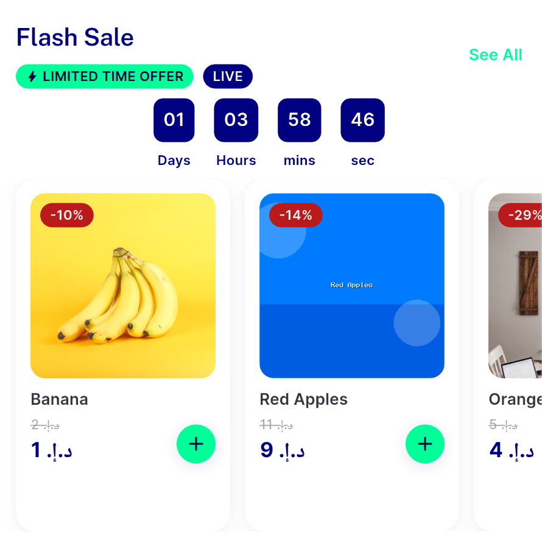</a> flash sale section</td>
</tr>
</table>

---
*From `nears/docs/qa-evidence/NEARS-480/` · public-repo scrub policy (no live secrets; verified clean).*
