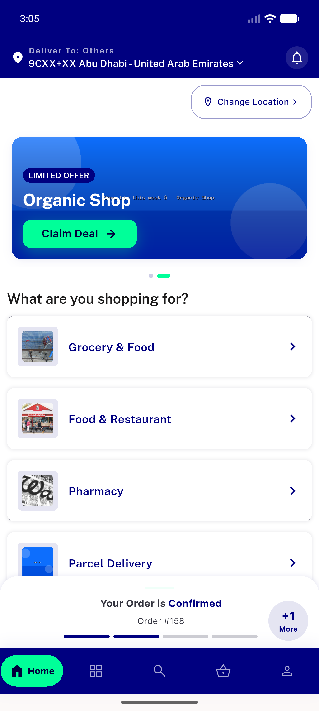
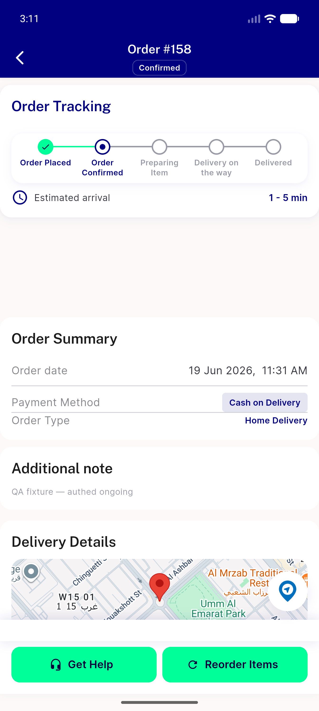
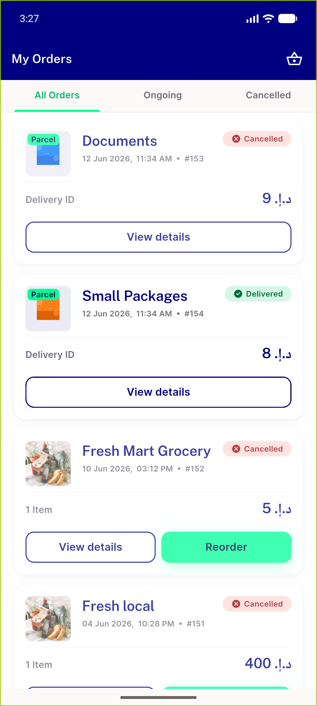
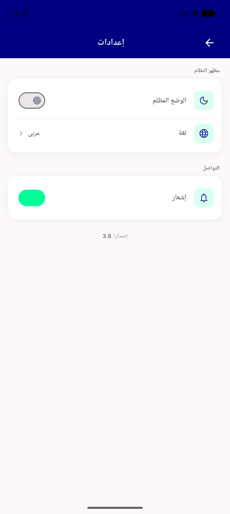
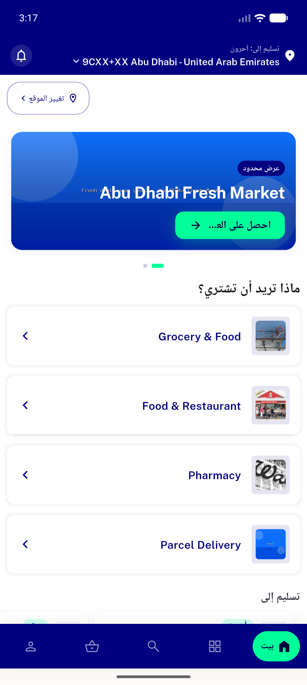
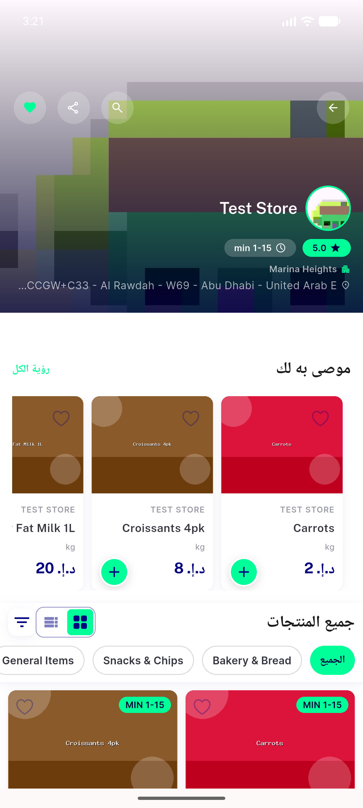
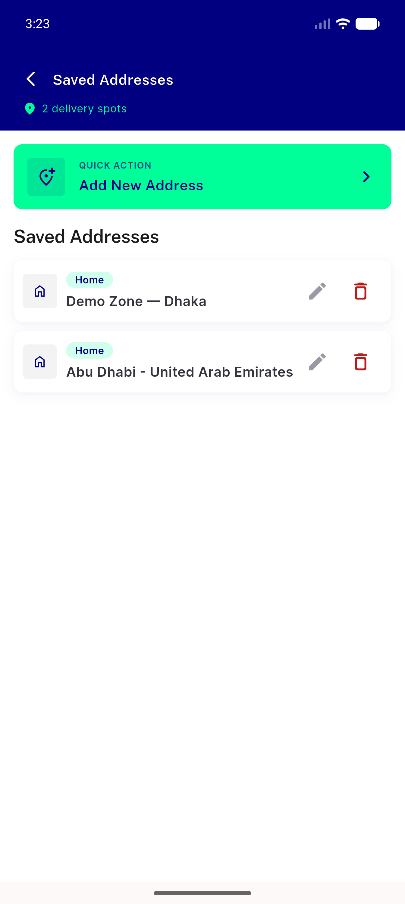
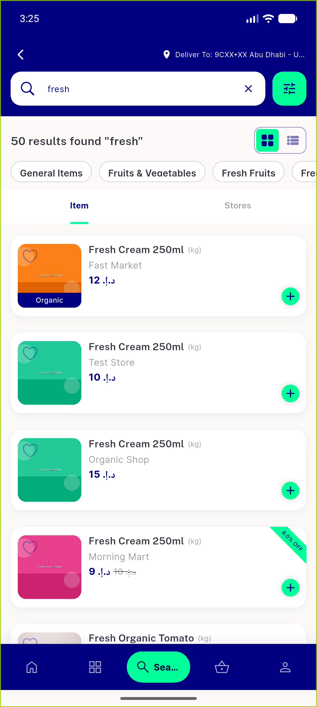
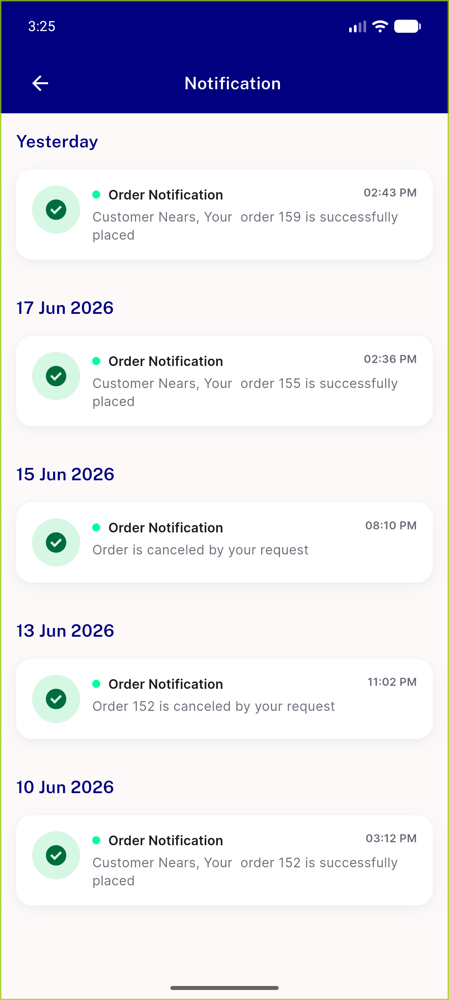
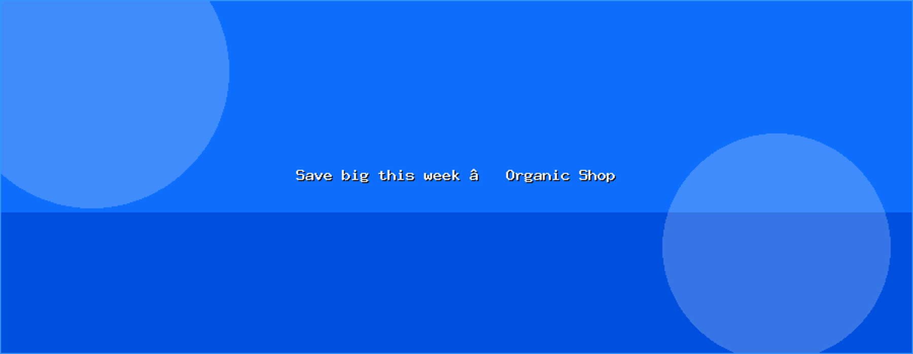

# QA Evidence — NEARS-482

**PASS — NEARS-482 UTF-8 decode fix verified live (EN+AR); app-rendered non-ASCII clean, no regressions; 1 out-of-scope baked-in banner-image mojibake filed**

**11 screenshot(s).** Click any thumbnail for full resolution.

<table>
<tr>
<td align="center" width="33%"> home banner en</td>
<td align="center" width="33%"> home banner title closeup</td>
<td align="center" width="33%"> order details en</td>
</tr>
<tr>
<td align="center" width="33%"> my orders en</td>
<td align="center" width="33%"> settings arabic</td>
<td align="center" width="33%"> home banner arabic</td>
</tr>
<tr>
<td align="center" width="33%"> store page arabic</td>
<td align="center" width="33%"> addresses en</td>
<td align="center" width="33%"> search results en</td>
</tr>
<tr>
<td align="center" width="33%"> notifications en</td>
<td align="center" width="33%"> bug banner image baked mojibake</td>
</tr>
</table>

### Other artifacts
- [`bug-banner-image-baked-mojibake.log`](bug-banner-image-baked-mojibake.log)
- [`progress.md`](progress.md)

---
*From `nears/docs/qa-evidence/NEARS-482/` · public-repo scrub policy (no live secrets; verified clean).*
