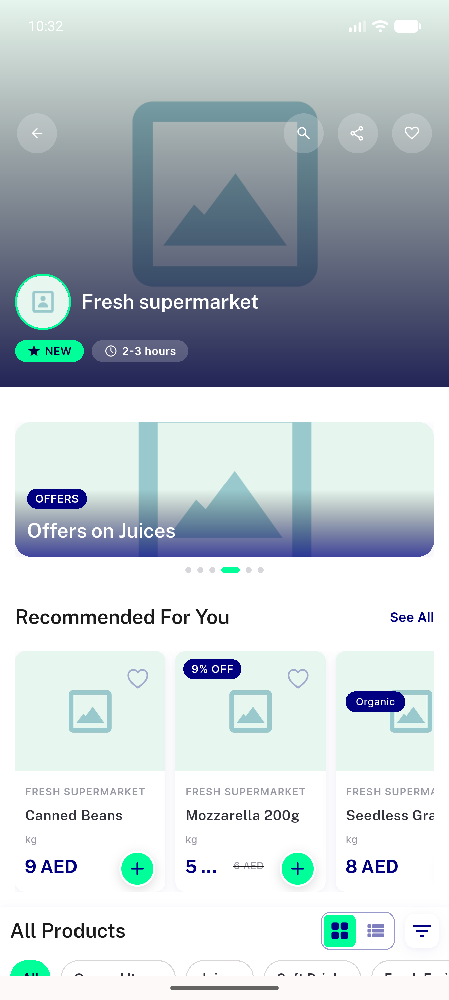
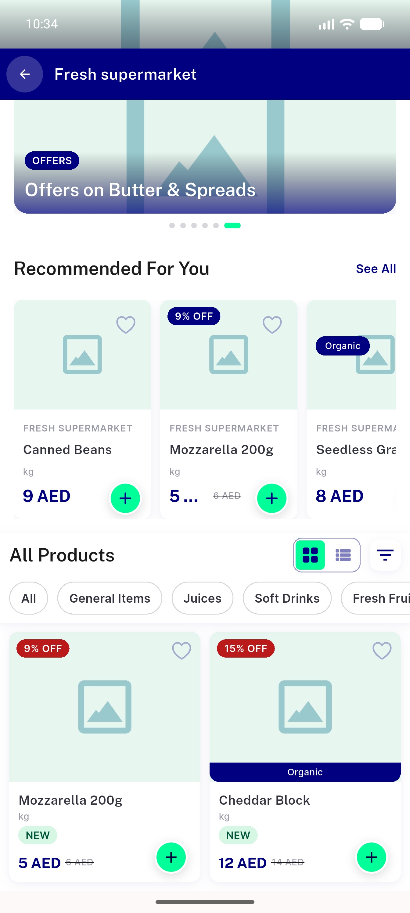
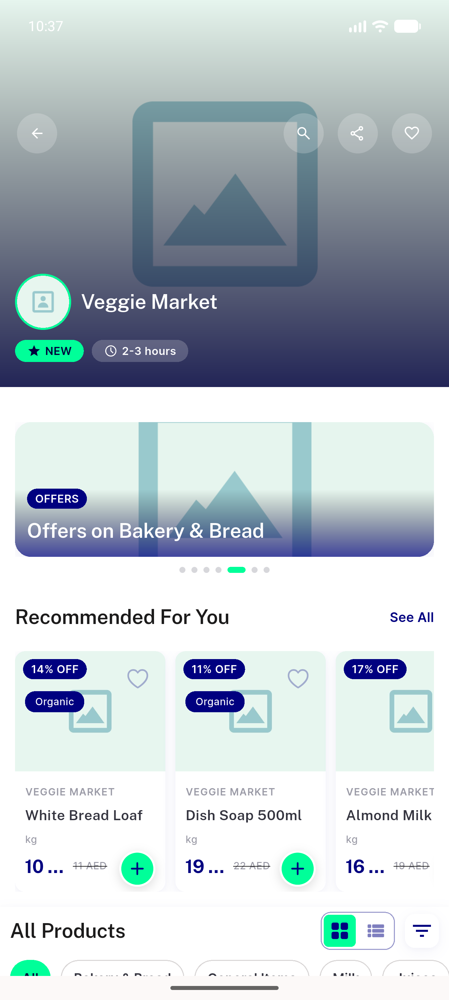
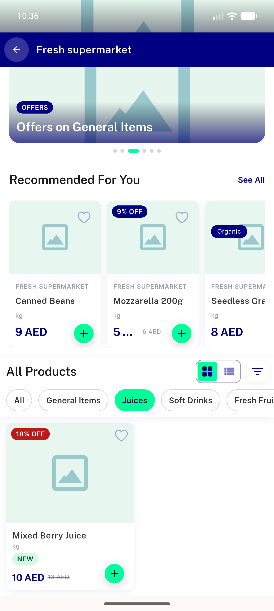
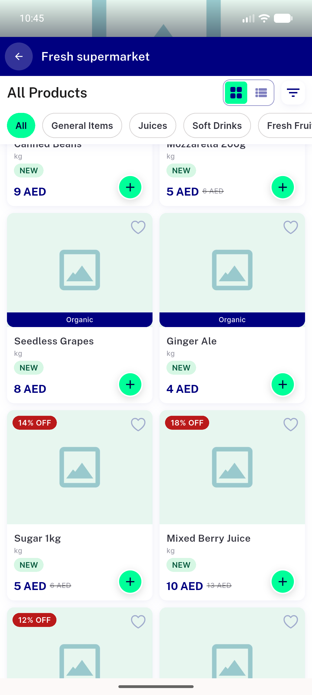
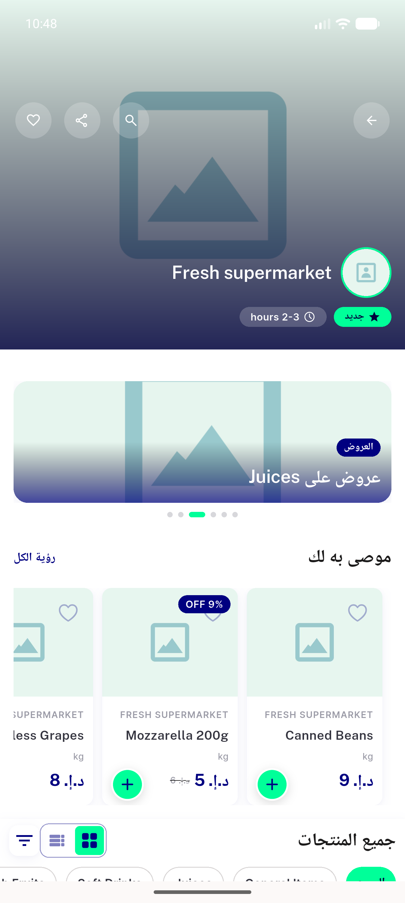

# QA Evidence — NEARS-483

**PASS — store-page offers banner pivot verified live on store 13/18 (zone 2), emulator-5556, worktree backend**

**6 screenshot(s).** Click any thumbnail for full resolution.

<table>
<tr>
<td align="center" width="33%"> ac1 store13 offer cards</td>
<td align="center" width="33%"> ac2 cat8 discounted only grid</td>
<td align="center" width="33%"> ac4 store18 offer cards</td>
</tr>
<tr>
<td align="center" width="33%"> r4 filter cleared juices full</td>
<td align="center" width="33%"> regression store browse full catalog</td>
<td align="center" width="33%"> rtl arabic banner</td>
</tr>
</table>

### Other artifacts
- [`ac3-offers-fetch-failure-logged.log`](ac3-offers-fetch-failure-logged.log)

---
*From `nears/docs/qa-evidence/NEARS-483/` · public-repo scrub policy (no live secrets; verified clean).*
