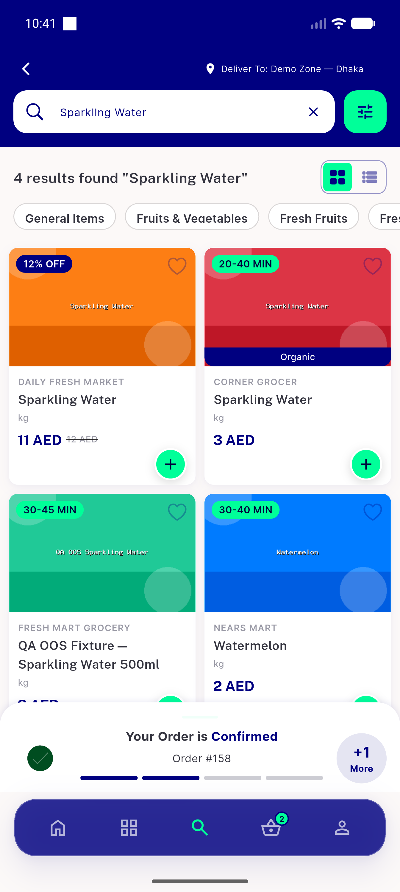
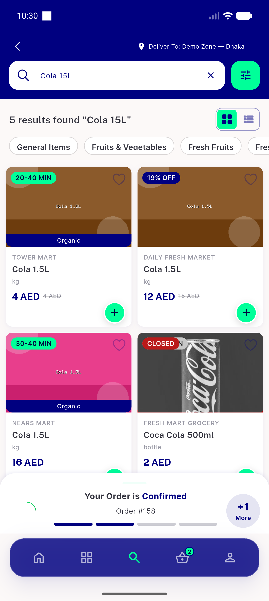
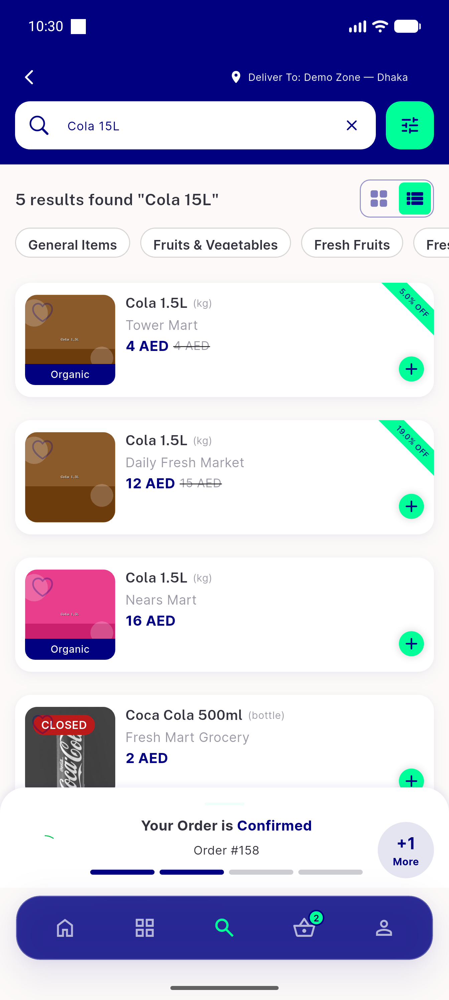
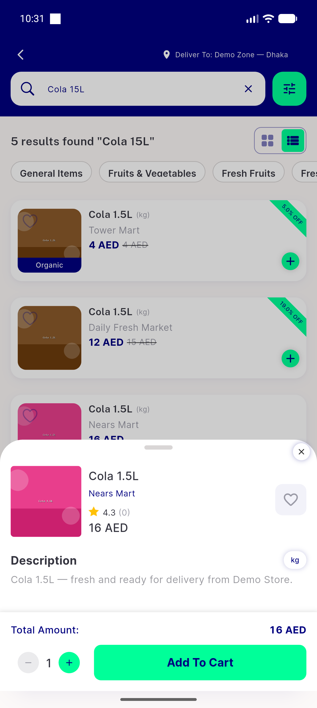
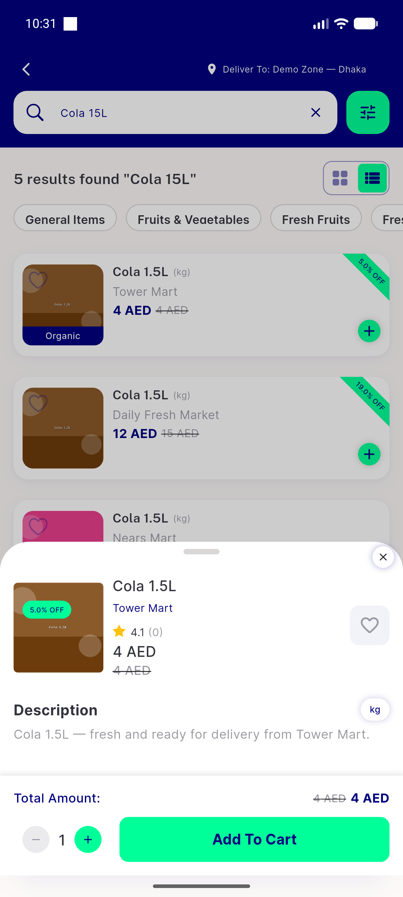
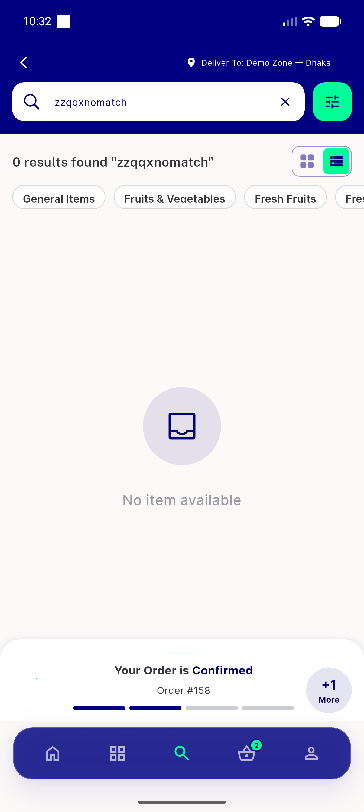
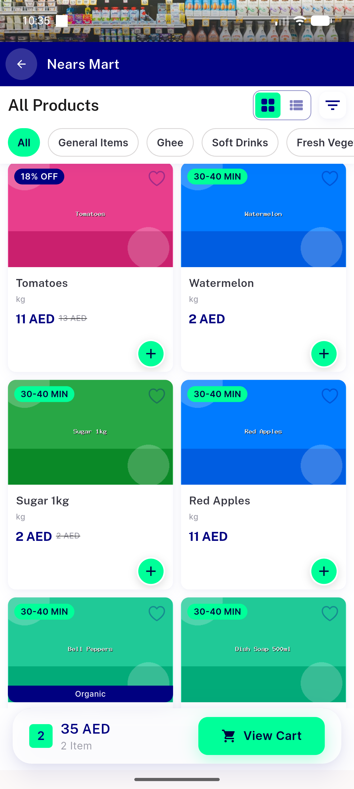
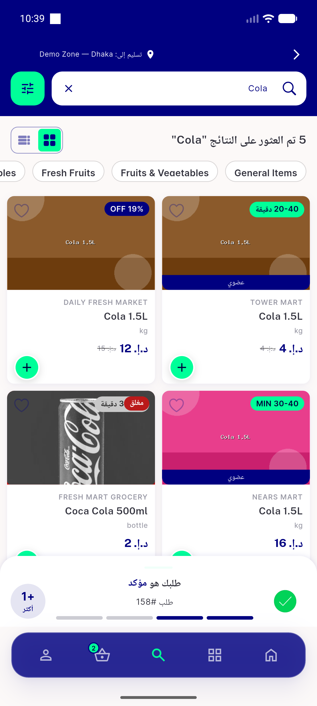
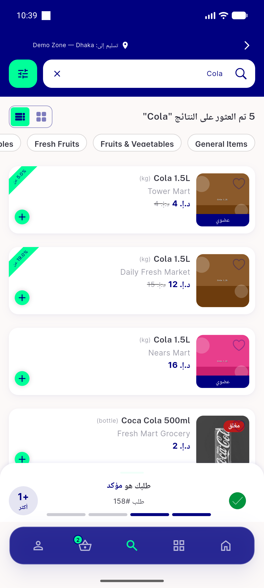

# QA Evidence — NEARS-485

**PASS — cross-store search + post-result analytics (result_count/store_count_returned), AC1-4 + regression sweep green on emulator-5556 light mode**

**11 screenshot(s).** Click any thumbnail for full resolution.

<table>
<tr>
<td align="center" width="33%"> ac1 ac2 cross store results grid</td>
<td align="center" width="33%"> ac1 cross store results english</td>
<td align="center" width="33%"> ac2 grid mode store names</td>
</tr>
<tr>
<td align="center" width="33%"> ac2 list mode store names</td>
<td align="center" width="33%"> ac3 nearsmart cola detail sheet</td>
<td align="center" width="33%"> ac3 tap towermart cola sheet</td>
</tr>
<tr>
<td align="center" width="33%"> ac3 towermart cola detail sheet</td>
<td align="center" width="33%"> ac4 zero match nodatascreen</td>
<td align="center" width="33%"> reg instore no attribution</td>
</tr>
<tr>
<td align="center" width="33%"> reg rtl arabic grid</td>
<td align="center" width="33%"> reg rtl arabic list</td>
</tr>
</table>

### Other artifacts
- [`analytics-search-event.log`](analytics-search-event.log)
- [`progress.md`](progress.md)

---
*From `nears/docs/qa-evidence/NEARS-485/` · public-repo scrub policy (no live secrets; verified clean).*
