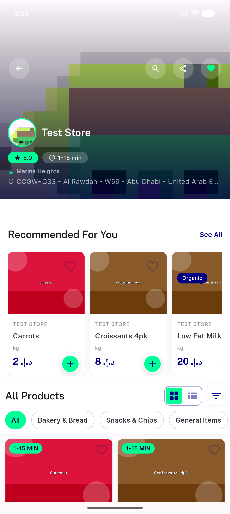
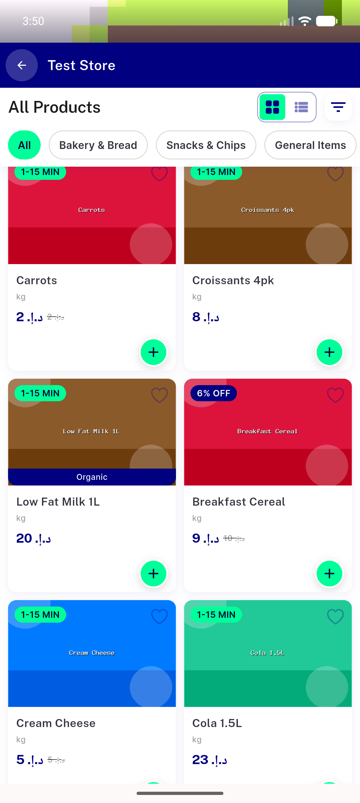
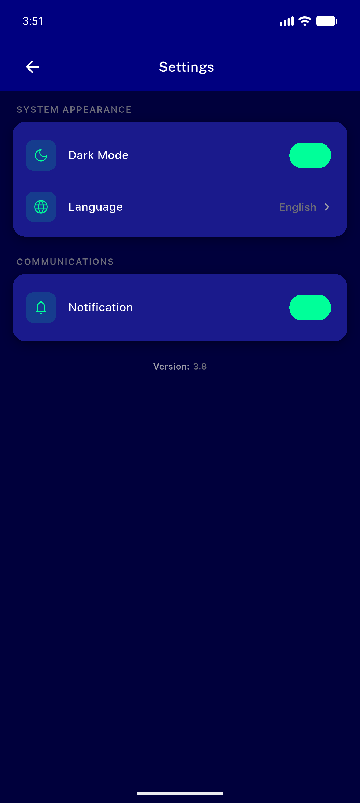
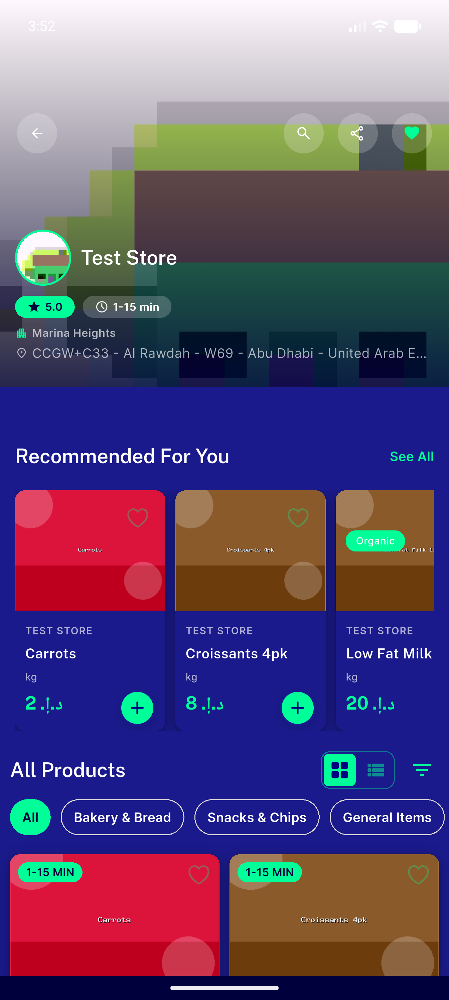
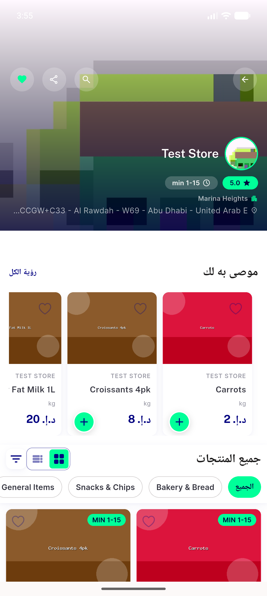
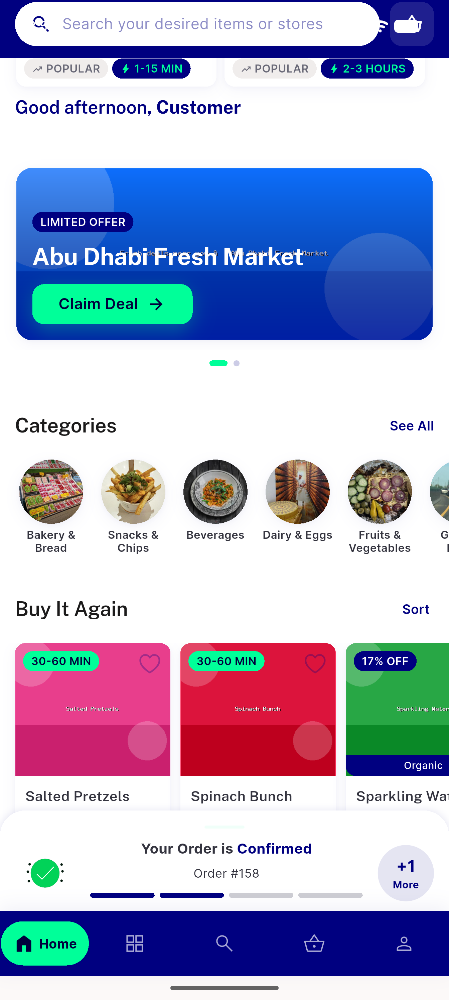

# QA Evidence — NEARS-488

**PASS — NearsSectionHeader action link navy on white (light, AAA) / mint on navy (dark, readable); mint collateral (chips/FAB/pills) unchanged; EN+AR/RTL verified on emulator-5554**

**6 screenshot(s).** Click any thumbnail for full resolution.

<table>
<tr>
<td align="center" width="33%"> store see all LIGHT EN</td>
<td align="center" width="33%"> store all products sort LIGHT EN</td>
<td align="center" width="33%"> settings dark toggled</td>
</tr>
<tr>
<td align="center" width="33%"> store see all DARK EN</td>
<td align="center" width="33%"> store see all LIGHT AR RTL</td>
<td align="center" width="33%"> home see all AC3 collateral LIGHT</td>
</tr>
</table>

### Other artifacts
- [`progress.md`](progress.md)

---
*From `nears/docs/qa-evidence/NEARS-488/` · public-repo scrub policy (no live secrets; verified clean).*
