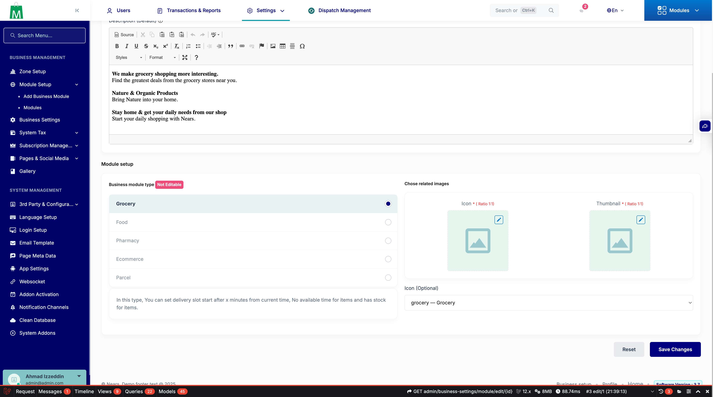
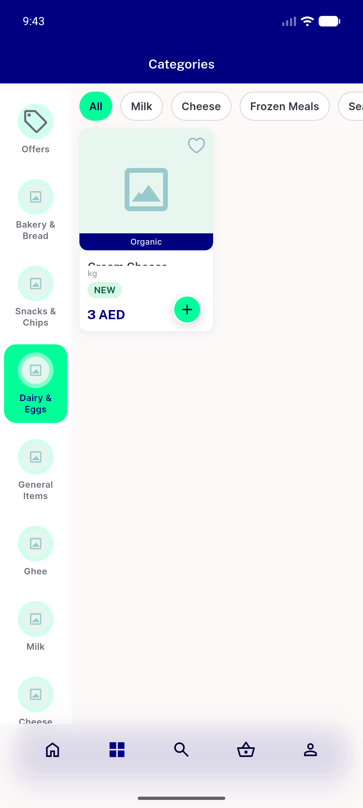
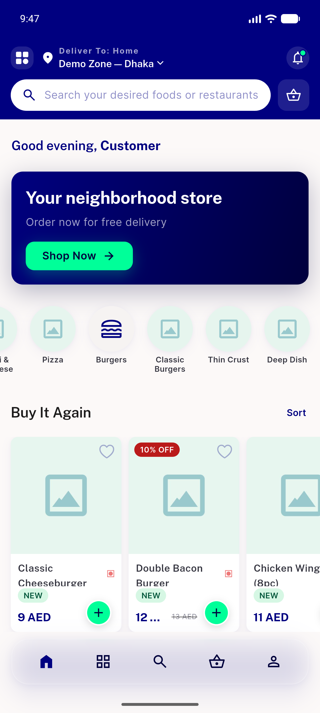
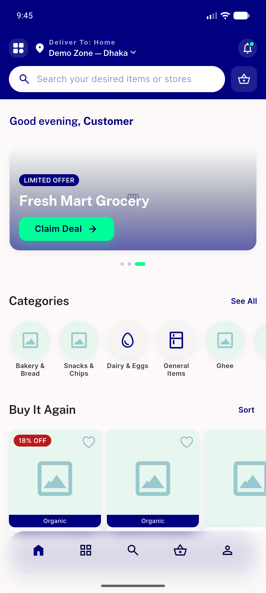
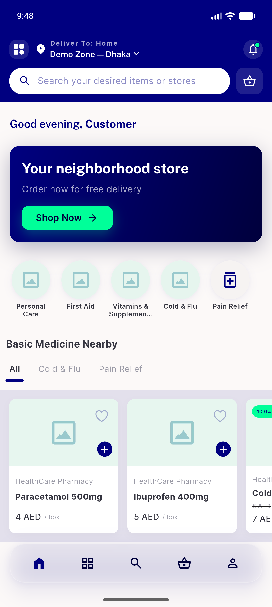
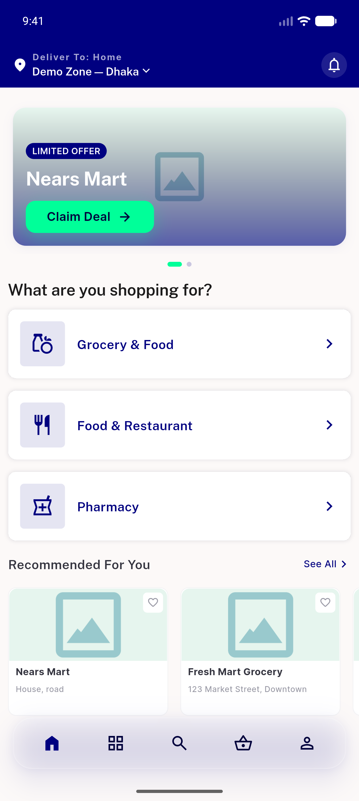
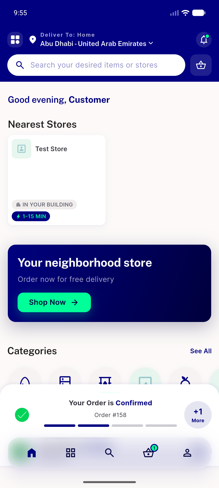
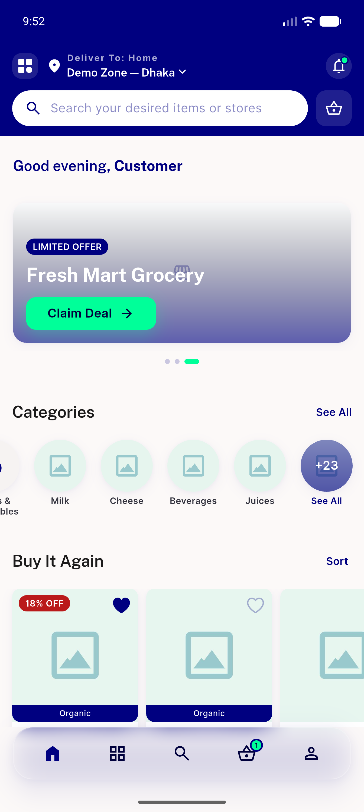
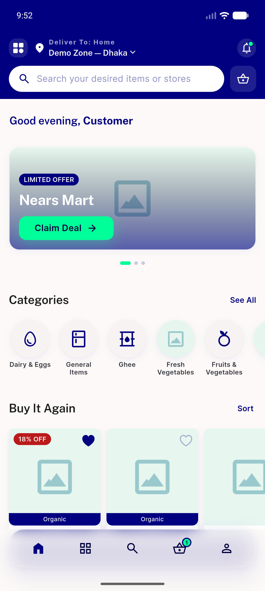
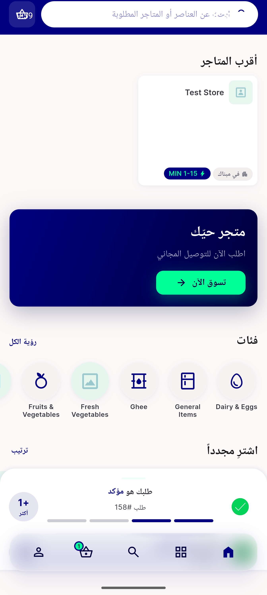

# QA Evidence — NEARS-489

**PASS — Category+Module icon system: Admin picker -> icon_key -> UserApp NearsIcon glyph end-to-end (zone1+zone2, RTL no-mirror)**

**10 screenshot(s).** Click any thumbnail for full resolution.

<table>
<tr>
<td align="center" width="33%"> ac1 module edit picker</td>
<td align="center" width="33%"> ac4 categories tab</td>
<td align="center" width="33%"> ac4 food burgers lunchdining</td>
</tr>
<tr>
<td align="center" width="33%"> ac4 grocery category strip</td>
<td align="center" width="33%"> ac4 pharmacy painrelief medication</td>
<td align="center" width="33%"> ac4 zone1 home modules</td>
</tr>
<tr>
<td align="center" width="33%"> ac4 zone2 home modules</td>
<td align="center" width="33%"> ac4b ghee oilbarrel cheese unknownkey</td>
<td align="center" width="33%"> ac4b ghee oilbarrel</td>
</tr>
<tr>
<td align="center" width="33%"> regression rtl arabic glyphs no mirror</td>
</tr>
</table>

### Other artifacts
- [`ac2-categories.txt`](ac2-categories.txt)
- [`ac2-module.txt`](ac2-module.txt)

---
*From `nears/docs/qa-evidence/NEARS-489/` · public-repo scrub policy (no live secrets; verified clean).*
