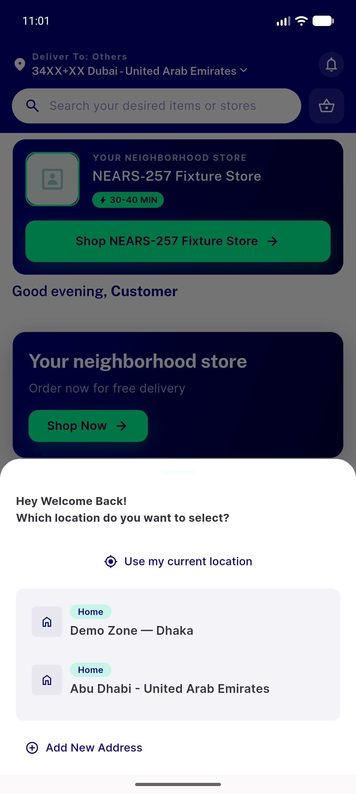
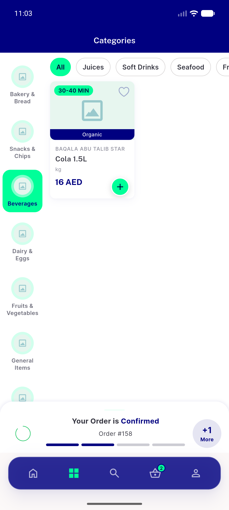
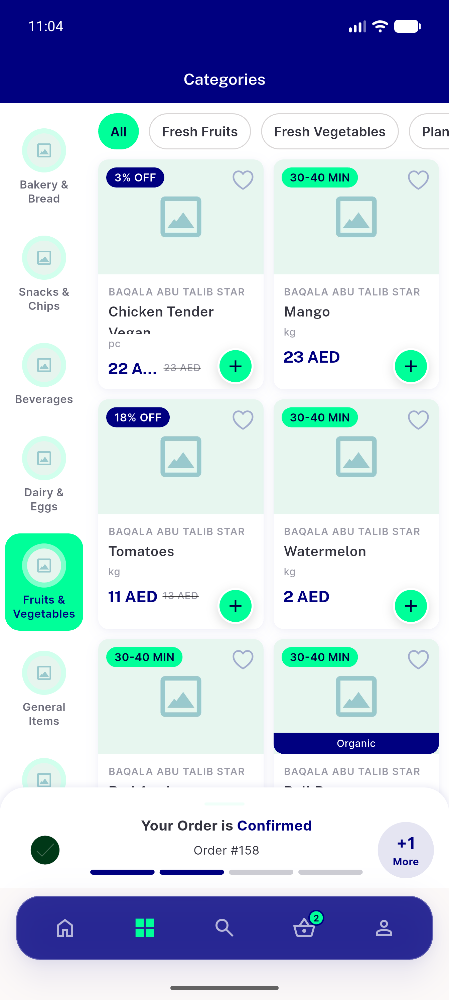
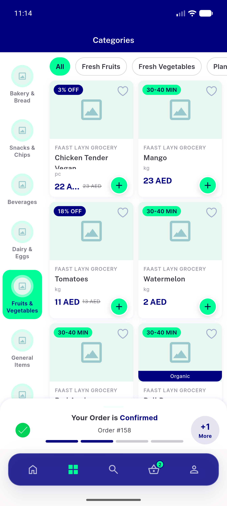
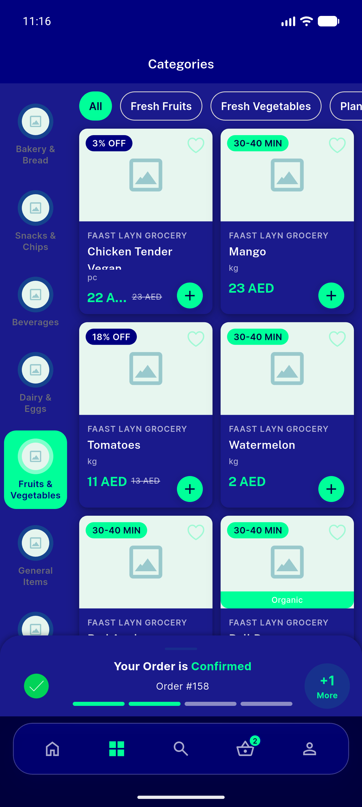
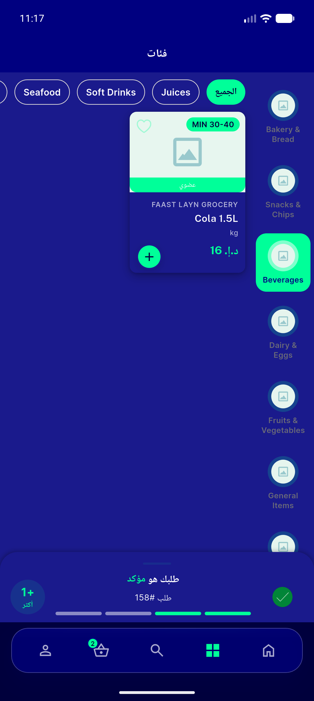

# QA Evidence — NEARS-490

**PASS — Categories browse page scoped to single nearest/selected store (zone-2 multi-store verified live); AC1-AC5 met; phpunit 8/8+9/9, flutter 1233/1233**

**8 screenshot(s).** Click any thumbnail for full resolution.

<table>
<tr>
<td align="center" width="33%"> location select</td>
<td align="center" width="33%"> categories page store12</td>
<td align="center" width="33%"> fruits veg grid</td>
</tr>
<tr>
<td align="center" width="33%"> rail store3354</td>
<td align="center" width="33%"> empty category</td>
<td align="center" width="33%"> fruitsveg addr home</td>
</tr>
<tr>
<td align="center" width="33%"> categories dark mode</td>
<td align="center" width="33%"> categories arabic rtl</td>
</tr>
</table>

### Other artifacts
- [`bug-geolocator-native-crash.log`](bug-geolocator-native-crash.log)
- [`bug-rail-grid-count-divergence.log`](bug-rail-grid-count-divergence.log)
- [`bug-setlocation-anr.log`](bug-setlocation-anr.log)
- [`progress.md`](progress.md)

---
*From `nears/docs/qa-evidence/NEARS-490/` · public-repo scrub policy (no live secrets; verified clean).*
