# QA Evidence — NEARS-491

**verify**

**22 screenshot(s).** Click any thumbnail for full resolution.

<table>
<tr>
<td align="center" width="33%"><a href="01-grocery-seeall-categories-tab.png">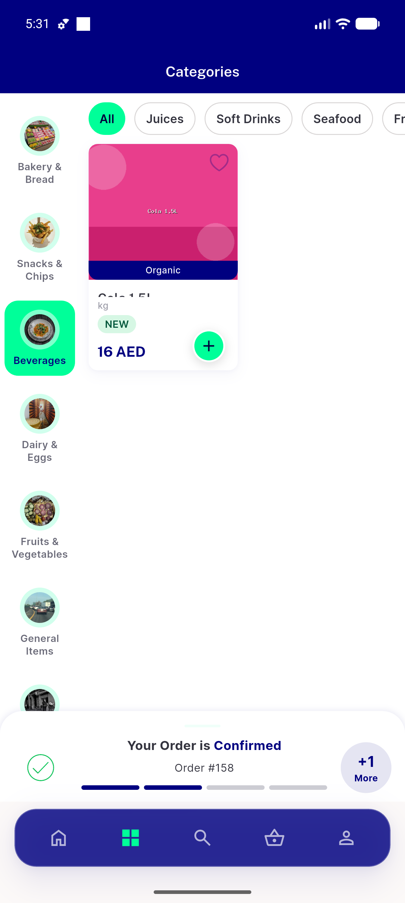</a> grocery seeall categories tab</td>
<td align="center" width="33%"><a href="01a-grocery-module-home.png">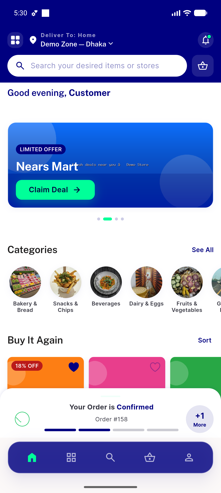</a> 01a grocery module home</td>
<td align="center" width="33%"><a href="02-grocery-chip-preselect.png">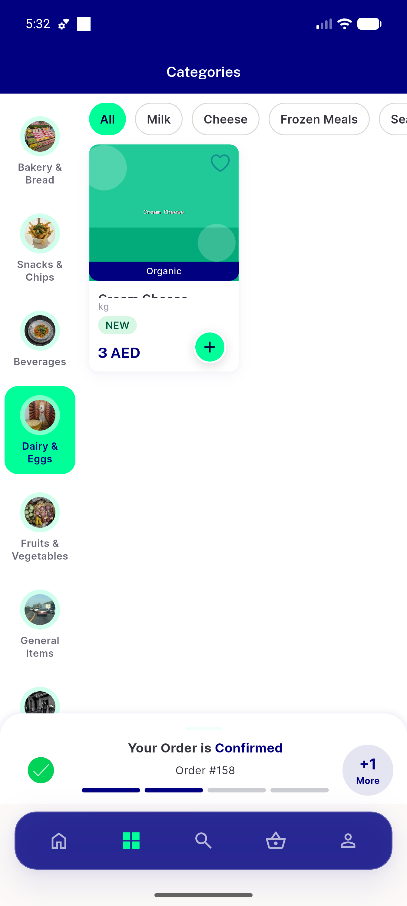</a> grocery chip preselect</td>
</tr>
<tr>
<td align="center" width="33%"><a href="03b-rapid-doubletap.png">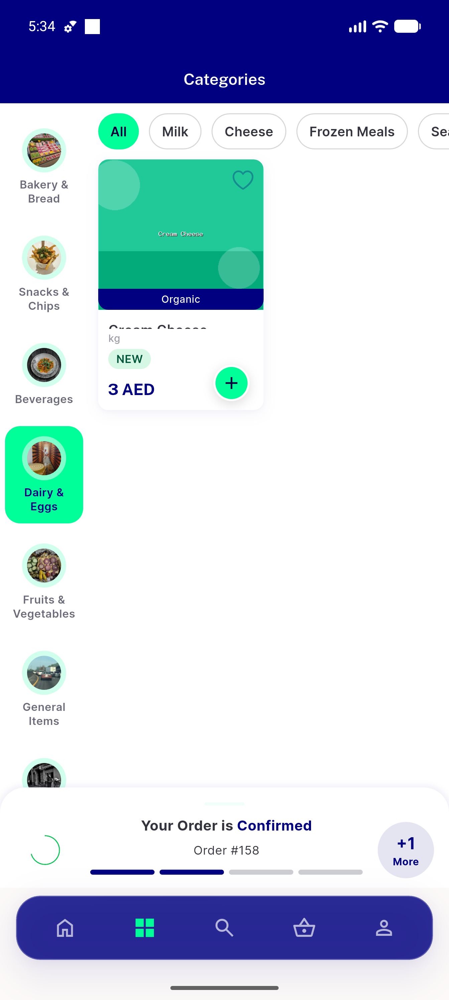</a> 03b rapid doubletap</td>
<td align="center" width="33%"><a href="04-pharmacy-category-circle-tab.png">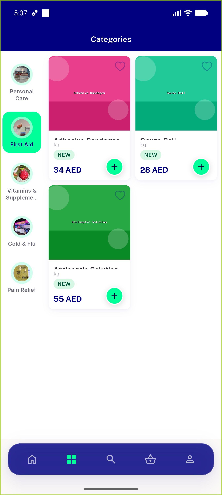</a> pharmacy category circle tab</td>
<td align="center" width="33%"><a href="05-food-category-circle-tab.png">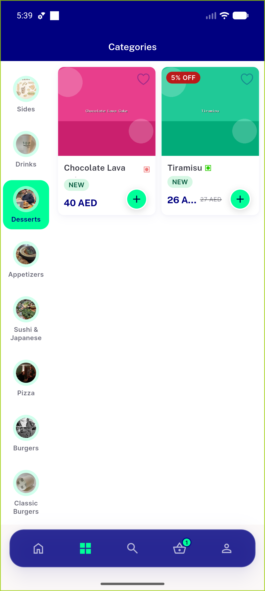</a> food category circle tab</td>
</tr>
<tr>
<td align="center" width="33%"><a href="06-tab-search.png">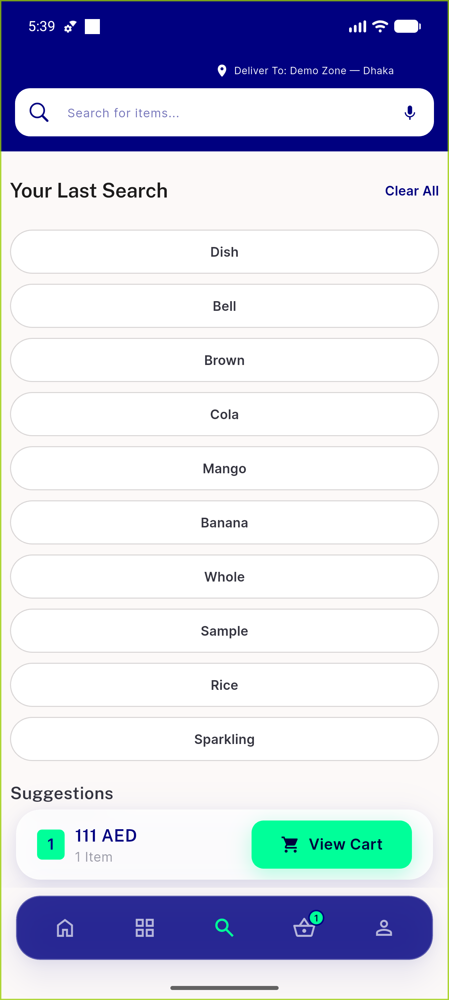</a> tab search</td>
<td align="center" width="33%"><a href="07-tab-basket.png">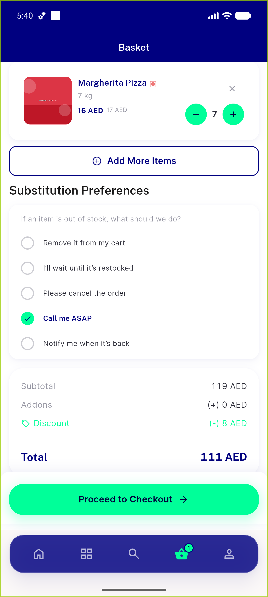</a> tab basket</td>
<td align="center" width="33%"><a href="08-tab-profile.png">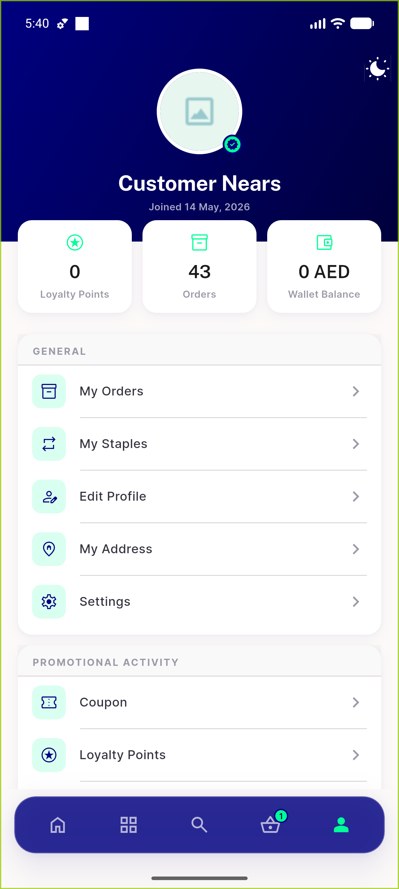</a> tab profile</td>
</tr>
<tr>
<td align="center" width="33%"><a href="09-tab-home.png">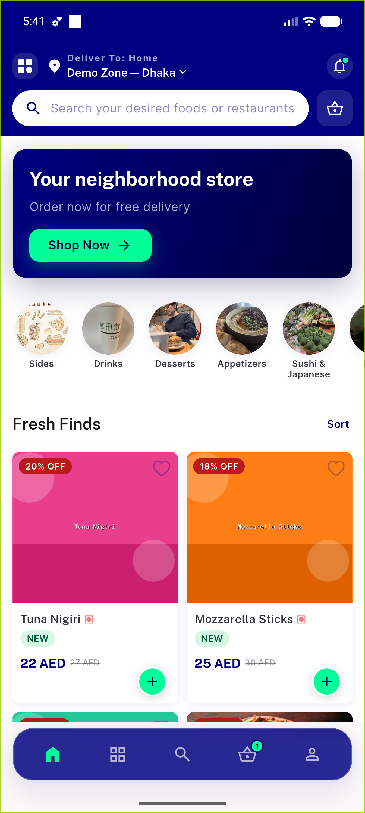</a> tab home</td>
<td align="center" width="33%"> basket badge on categories</td>
<td align="center" width="33%"><a href="11-deeplink-standalone-categories.png">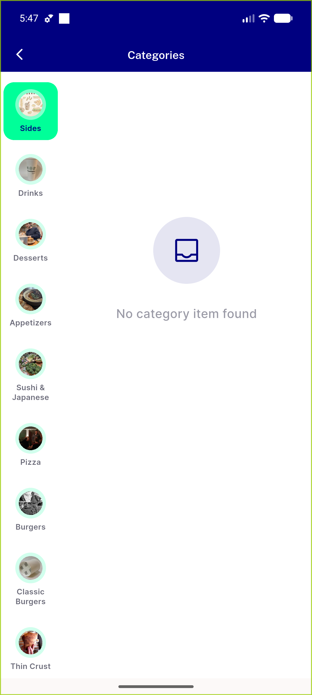</a> deeplink standalone categories</td>
</tr>
<tr>
<td align="center" width="33%"><a href="11b-after-back-pop.png">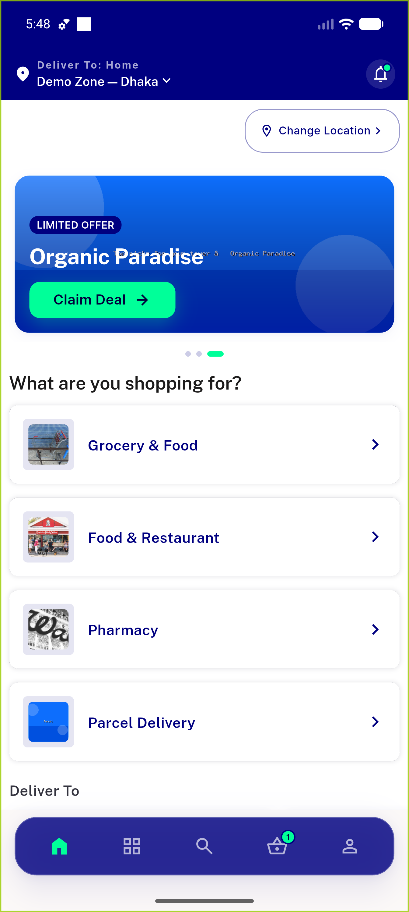</a> 11b after back pop</td>
<td align="center" width="33%"><a href="12-backstack-to-home.png">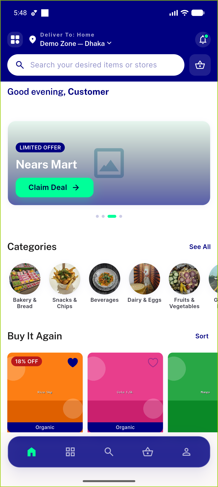</a> backstack to home</td>
<td align="center" width="33%"><a href="13-running-order-banner-categories.png">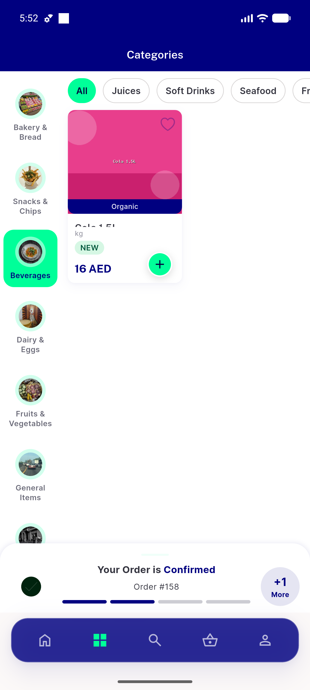</a> running order banner categories</td>
</tr>
<tr>
<td align="center" width="33%"><a href="14-categories-rtl.png">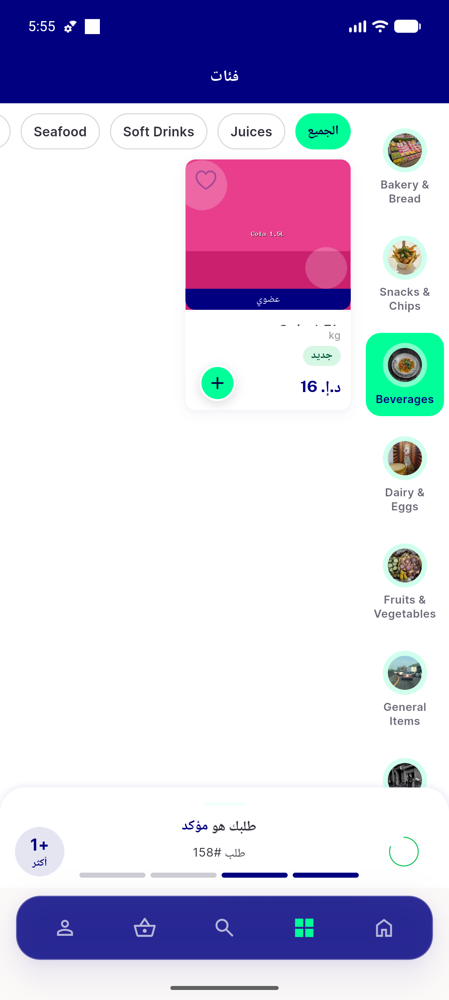</a> categories rtl</td>
<td align="center" width="33%"> 14b home rtl</td>
<td align="center" width="33%"><a href="15-shimmer-attempt2.png">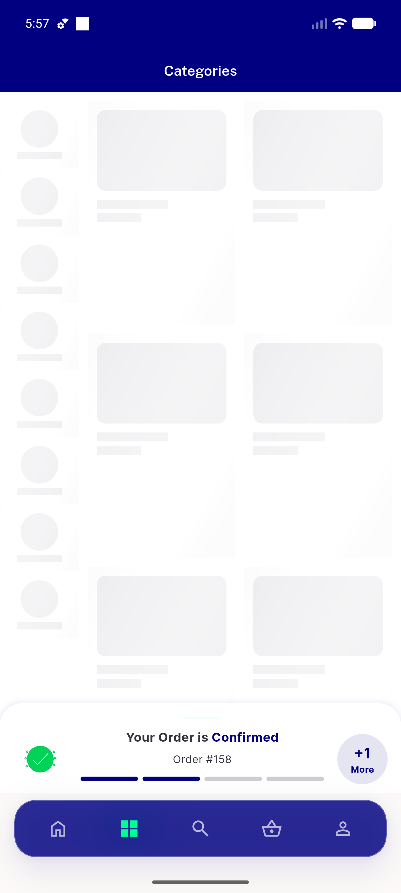</a> shimmer attempt2</td>
</tr>
<tr>
<td align="center" width="33%"><a href="16-empty-state-on-tab.png">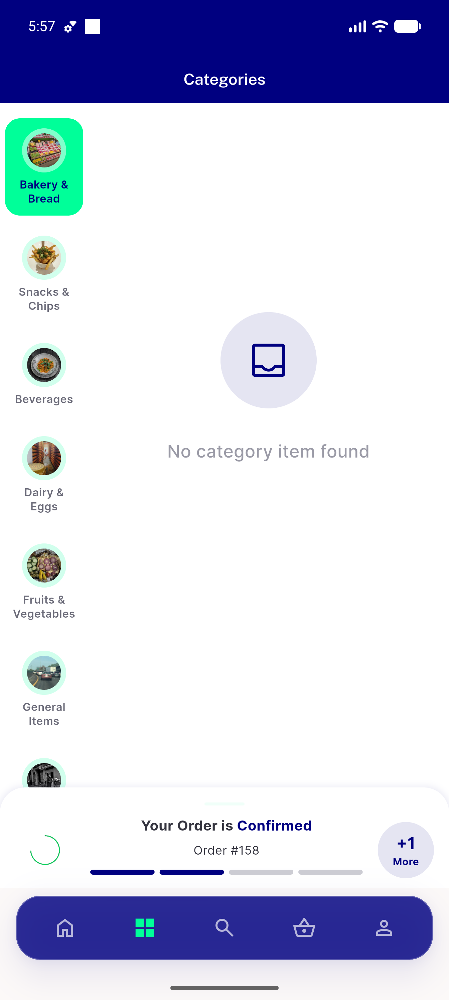</a> empty state on tab</td>
<td align="center" width="33%"><a href="17a-desktop-launch.png">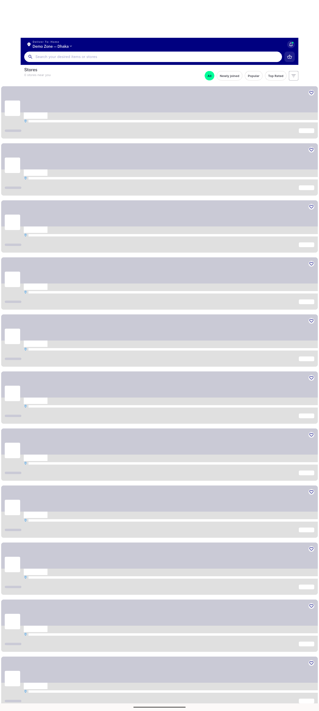</a> 17a desktop launch</td>
<td align="center" width="33%"><a href="18-regression-notification.png">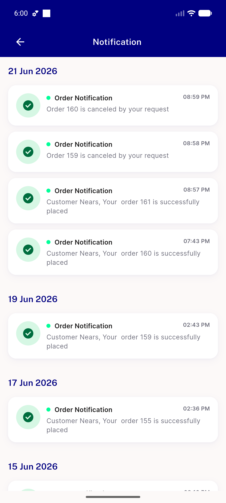</a> regression notification</td>
</tr>
<tr>
<td align="center" width="33%"><a href="19-regression-search-tab.png">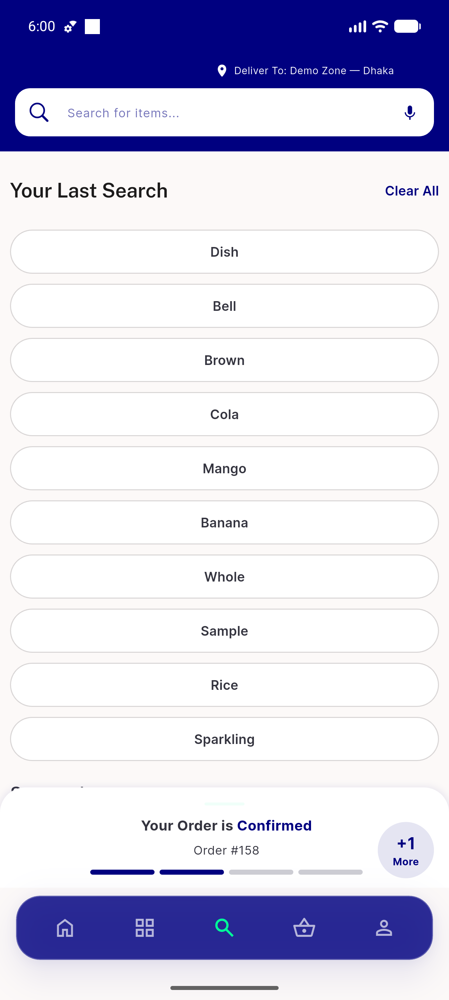</a> regression search tab</td>
</tr>
</table>

### Other artifacts
- [`progress.md`](progress.md)

---
*From `nears/docs/qa-evidence/NEARS-491/` · public-repo scrub policy (no live secrets; verified clean).*
