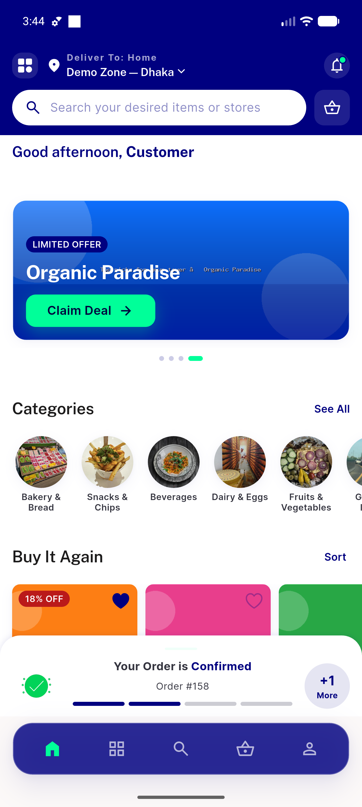
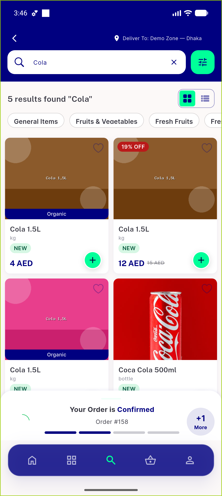
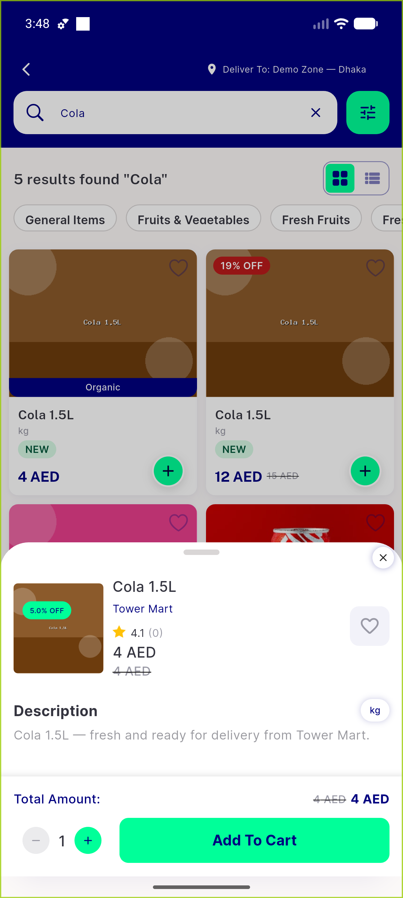
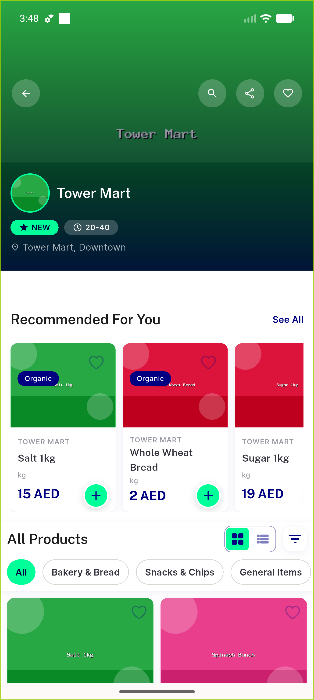
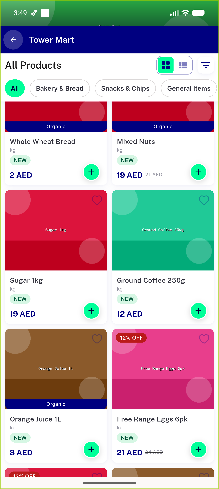
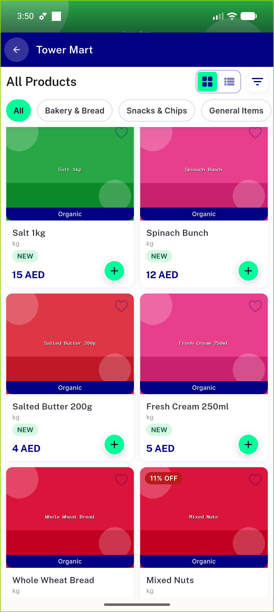
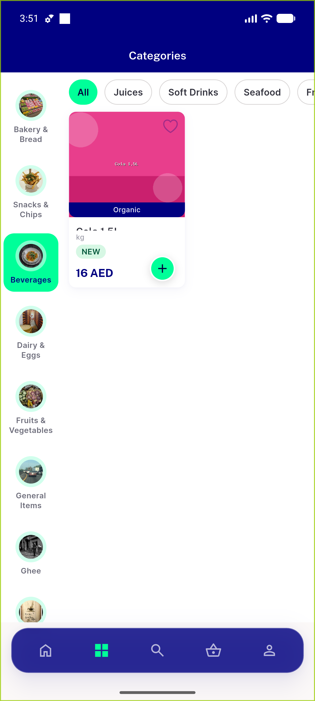
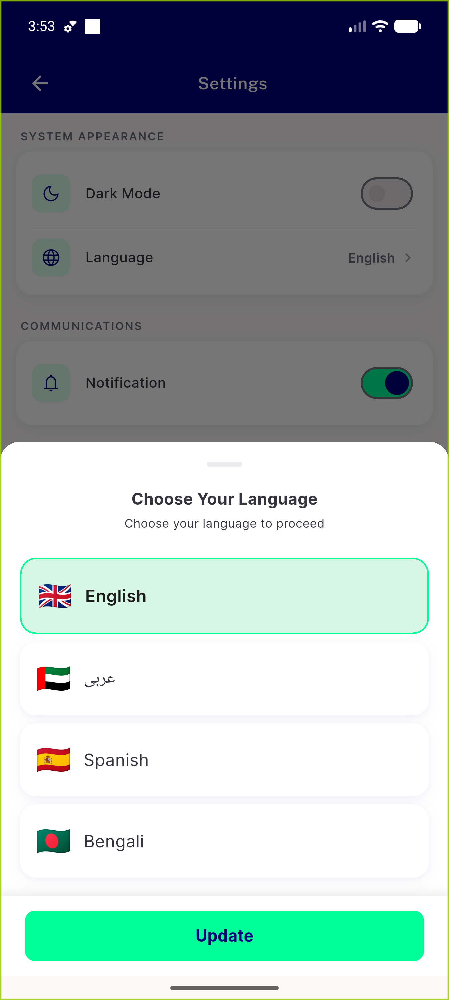
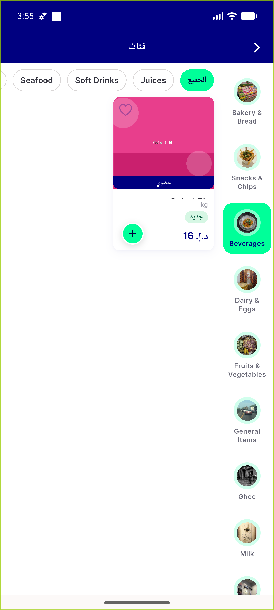

# QA Evidence — NEARS-492

**PASS — adaptive item card on emulator-5556 (build 10728531); 7/7 AC met, 112/112 tests, light mode**

**10 screenshot(s).** Click any thumbnail for full resolution.

<table>
<tr>
<td align="center" width="33%"> grocery home grid</td>
<td align="center" width="33%"> item card</td>
<td align="center" width="33%"> search results grid</td>
</tr>
<tr>
<td align="center" width="33%"> item detail</td>
<td align="center" width="33%"> store screen grid</td>
<td align="center" width="33%"> store all products grid</td>
</tr>
<tr>
<td align="center" width="33%"> store list wide</td>
<td align="center" width="33%"> category item grid</td>
<td align="center" width="33%"> language selector</td>
</tr>
<tr>
<td align="center" width="33%"> rtl arabic grid</td>
</tr>
</table>

### Other artifacts
- [`progress.md`](progress.md)

---
*From `nears/docs/qa-evidence/NEARS-492/` · public-repo scrub policy (no live secrets; verified clean).*
