# QA Evidence — NEARS-493

**PASS — locale-aware currency: EN '5.00 AED' suffix + AR glyph unchanged, demonstrated live (EN+AR) + config currency_code:AED + 1204 UserApp tests pass**

**13 screenshot(s).** Click any thumbnail for full resolution.

<table>
<tr>
<td align="center" width="33%"><a href="01-home-en-fallback.png">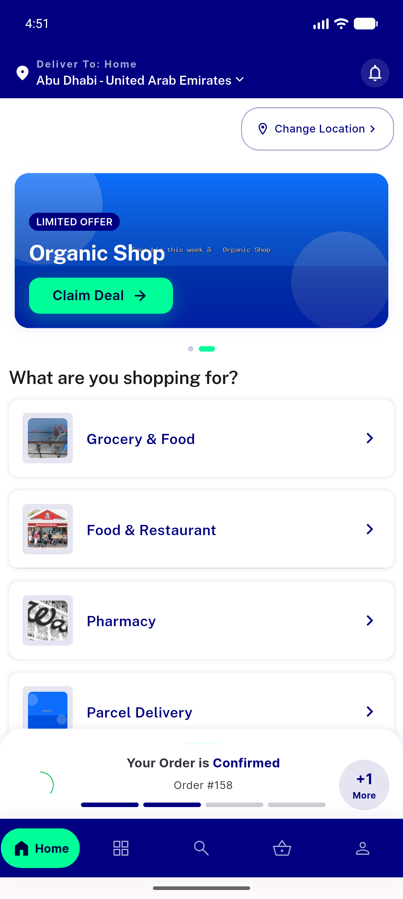</a> home en fallback</td>
<td align="center" width="33%"><a href="01-item-card.png">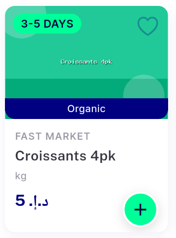</a> item card</td>
<td align="center" width="33%"><a href="02-store-en-fallback-glyph.png">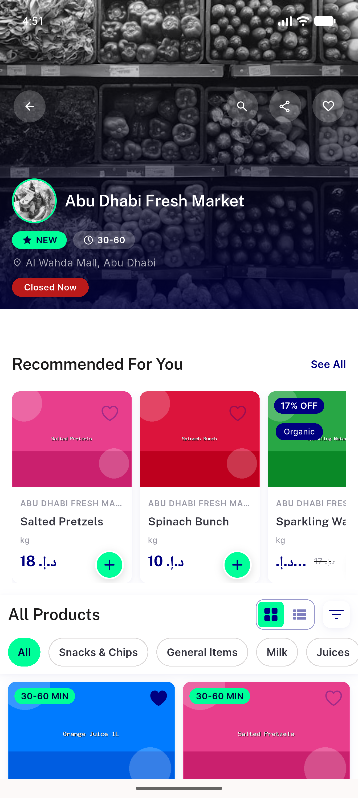</a> store en fallback glyph</td>
</tr>
<tr>
<td align="center" width="33%"><a href="03-store-en-AED-suffix.png">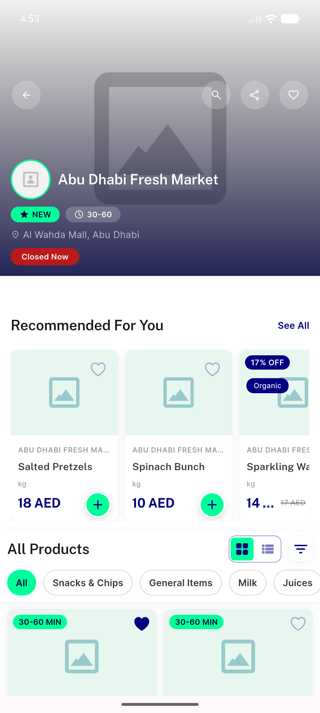</a> store en AED suffix</td>
<td align="center" width="33%"><a href="04-item-detail-en-AED.png">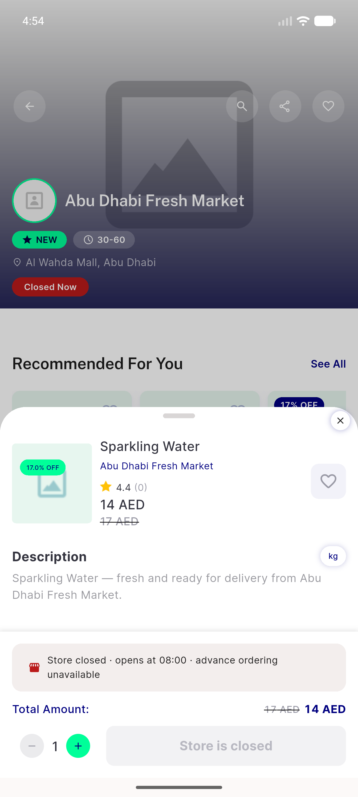</a> item detail en AED</td>
<td align="center" width="33%"><a href="05-cart-en-AED.png">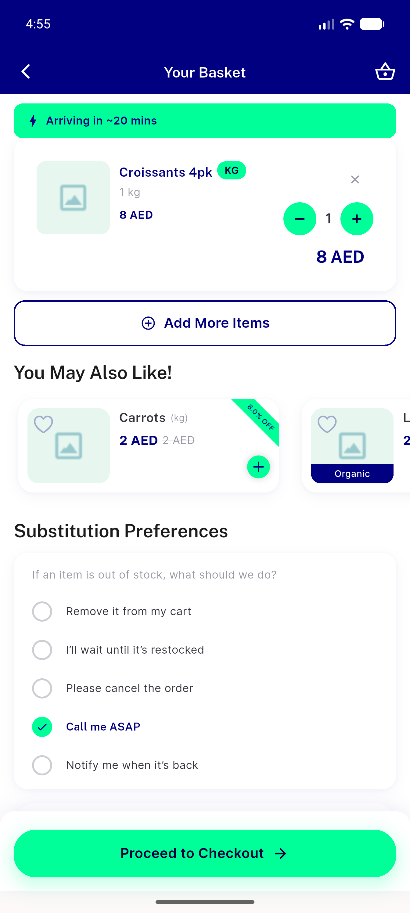</a> cart en AED</td>
</tr>
<tr>
<td align="center" width="33%"> checkout summary en AED</td>
<td align="center" width="33%"><a href="07-payment-method-en-AED.png">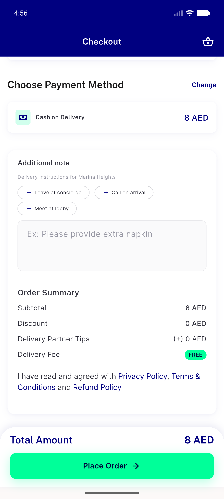</a> payment method en AED</td>
<td align="center" width="33%"><a href="08-order-details-en-AED.png">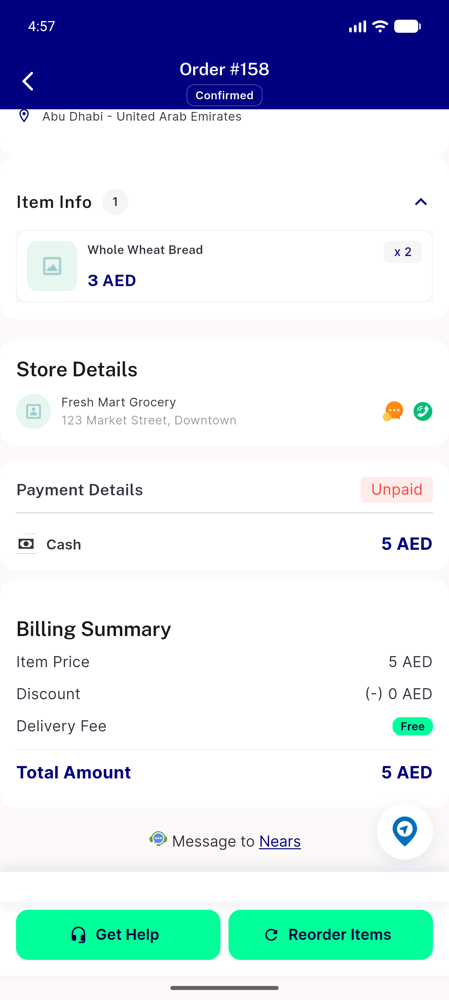</a> order details en AED</td>
</tr>
<tr>
<td align="center" width="33%"><a href="09-wallet-en-AED.png">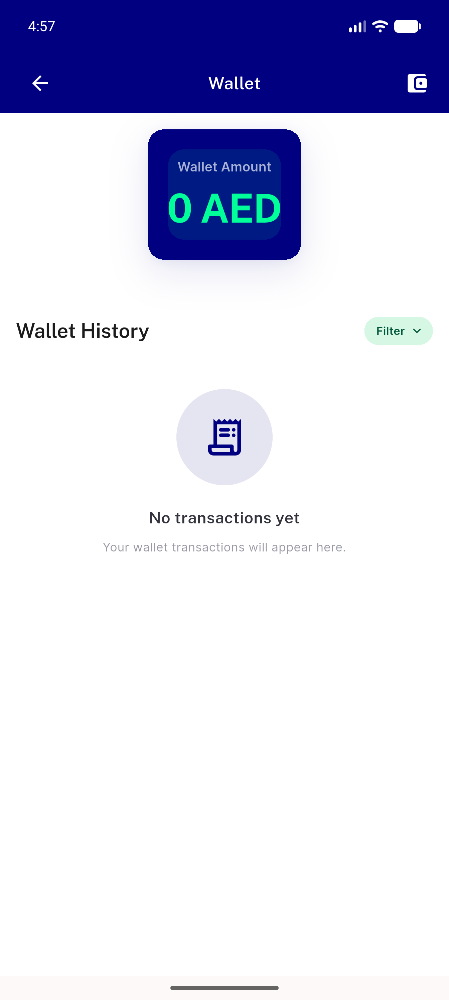</a> wallet en AED</td>
<td align="center" width="33%"><a href="10-store-arabic-glyph-unchanged.png">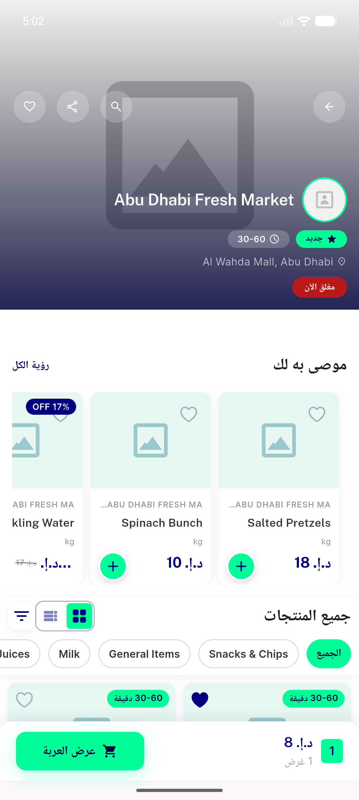</a> store arabic glyph unchanged</td>
<td align="center" width="33%"><a href="11-search-arabic-glyph.png">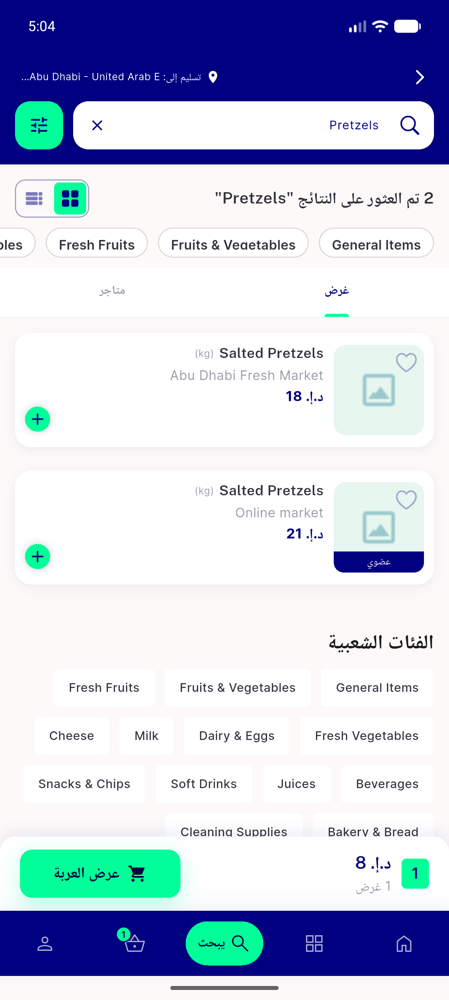</a> search arabic glyph</td>
</tr>
<tr>
<td align="center" width="33%"><a href="12-search-en-AED.png">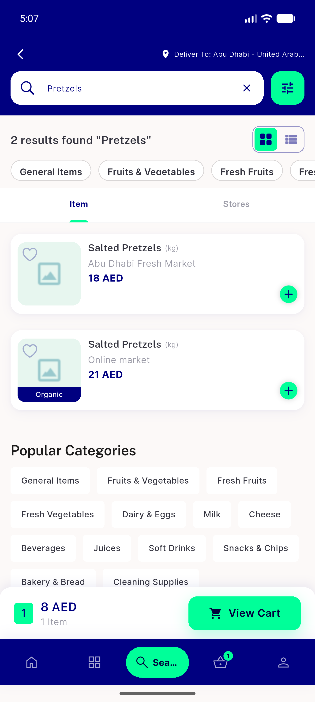</a> search en AED</td>
</tr>
</table>

### Other artifacts
- [`bug-duplicate-currency-business-setting.log`](bug-duplicate-currency-business-setting.log)
- [`progress.md`](progress.md)

---
*From `nears/docs/qa-evidence/NEARS-493/` · public-repo scrub policy (no live secrets; verified clean).*
